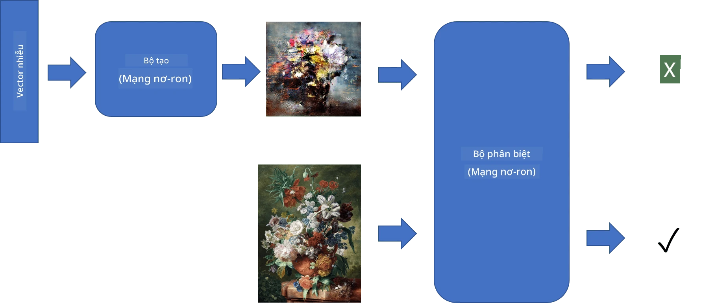
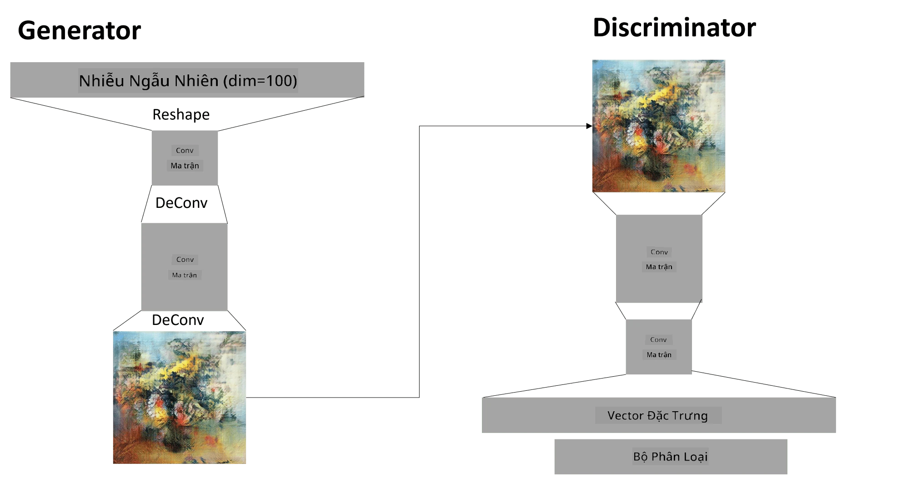

# Mạng Generative Adversarial (GAN)

Trong phần trước, chúng ta đã tìm hiểu về **mô hình sinh**: các mô hình có thể tạo ra hình ảnh mới tương tự như những hình ảnh trong tập dữ liệu huấn luyện. VAE là một ví dụ điển hình của mô hình sinh.

## [Câu hỏi trước bài giảng](https://ff-quizzes.netlify.app/en/ai/quiz/19)

Tuy nhiên, nếu chúng ta cố gắng tạo ra thứ gì đó thực sự ý nghĩa, như một bức tranh với độ phân giải hợp lý, bằng VAE, chúng ta sẽ thấy rằng việc huấn luyện không hội tụ tốt. Đối với trường hợp này, chúng ta nên tìm hiểu về một kiến trúc khác được thiết kế đặc biệt cho các mô hình sinh - **Mạng Generative Adversarial**, hay GAN.

Ý tưởng chính của GAN là có hai mạng nơ-ron được huấn luyện đối kháng lẫn nhau:

> Hình ảnh bởi [Dmitry Soshnikov](http://soshnikov.com)

> ✅ Một chút từ vựng:
> * **Generator** là một mạng nhận một vector ngẫu nhiên và tạo ra hình ảnh như kết quả
> * **Discriminator** là một mạng nhận một hình ảnh và phải xác định xem đó là hình ảnh thật (từ tập dữ liệu huấn luyện) hay là hình ảnh được tạo bởi generator. Nó về cơ bản là một bộ phân loại hình ảnh.

### Discriminator

Kiến trúc của discriminator không khác gì so với một mạng phân loại hình ảnh thông thường. Trong trường hợp đơn giản nhất, nó có thể là một bộ phân loại fully-connected, nhưng thường sẽ là một [mạng tích chập](../07-ConvNets/README.md).

> ✅ Một GAN dựa trên mạng tích chập được gọi là [DCGAN](https://arxiv.org/pdf/1511.06434.pdf)

Một CNN discriminator bao gồm các lớp sau: một số lớp tích chập+kết hợp (với kích thước không gian giảm dần) và một hoặc nhiều lớp fully-connected để tạo "vector đặc trưng", cuối cùng là bộ phân loại nhị phân.

> ✅ 'Pooling' trong ngữ cảnh này là một kỹ thuật giảm kích thước hình ảnh. "Các lớp pooling giảm kích thước dữ liệu bằng cách kết hợp đầu ra của các cụm neuron tại một lớp thành một neuron duy nhất ở lớp tiếp theo." - [nguồn](https://wikipedia.org/wiki/Convolutional_neural_network#Pooling_layers)

### Generator

Generator hơi phức tạp hơn một chút. Bạn có thể coi nó như là một discriminator đảo ngược. Bắt đầu từ một vector tiềm ẩn (thay vì vector đặc trưng), nó có một lớp fully-connected để chuyển đổi thành kích thước/hình dạng yêu cầu, sau đó là các lớp deconvolution+kết hợp. Điều này tương tự như phần *decoder* của [autoencoder](../09-Autoencoders/README.md).

> ✅ Vì lớp tích chập được triển khai như một bộ lọc tuyến tính quét qua hình ảnh, deconvolution về cơ bản tương tự như tích chập và có thể được triển khai bằng cùng logic lớp.

> Hình ảnh bởi [Dmitry Soshnikov](http://soshnikov.com)

### Huấn luyện GAN

GAN được gọi là **đối kháng** vì có sự cạnh tranh liên tục giữa generator và discriminator. Trong quá trình cạnh tranh này, cả generator và discriminator đều cải thiện, do đó mạng học cách tạo ra hình ảnh ngày càng tốt hơn.

Quá trình huấn luyện diễn ra trong hai giai đoạn:

* **Huấn luyện discriminator**. Nhiệm vụ này khá đơn giản: chúng ta tạo một batch hình ảnh bằng generator, gán nhãn 0, tức là hình ảnh giả, và lấy một batch hình ảnh từ tập dữ liệu đầu vào (với nhãn 1, hình ảnh thật). Chúng ta thu được một *discriminator loss* và thực hiện backprop.
* **Huấn luyện generator**. Điều này hơi phức tạp hơn một chút, vì chúng ta không biết đầu ra mong đợi cho generator trực tiếp. Chúng ta lấy toàn bộ mạng GAN bao gồm generator nối tiếp với discriminator, cung cấp cho nó một số vector ngẫu nhiên và mong đợi kết quả là 1 (tương ứng với hình ảnh thật). Sau đó, chúng ta đóng băng các tham số của discriminator (không muốn nó được huấn luyện ở bước này) và thực hiện backprop.

Trong quá trình này, cả generator và discriminator loss đều không giảm đáng kể. Trong tình huống lý tưởng, chúng nên dao động, tương ứng với việc cả hai mạng cải thiện hiệu suất của mình.

## ✍️ Bài tập: GANs

* [Notebook GAN trong TensorFlow/Keras](GANTF.ipynb)
* [Notebook GAN trong PyTorch](GANPyTorch.ipynb)

### Các vấn đề khi huấn luyện GAN

GAN được biết đến là đặc biệt khó huấn luyện. Dưới đây là một số vấn đề:

* **Mode Collapse**. Thuật ngữ này ám chỉ việc generator học cách tạo ra một hình ảnh thành công duy nhất để đánh lừa discriminator, thay vì tạo ra nhiều hình ảnh khác nhau.
* **Nhạy cảm với siêu tham số**. Thường bạn có thể thấy rằng GAN không hội tụ chút nào, và sau đó đột ngột giảm tốc độ học dẫn đến hội tụ.
* Giữ **cân bằng** giữa generator và discriminator. Trong nhiều trường hợp, discriminator loss có thể giảm xuống 0 tương đối nhanh, dẫn đến generator không thể tiếp tục huấn luyện. Để khắc phục điều này, chúng ta có thể thử đặt các tốc độ học khác nhau cho generator và discriminator, hoặc bỏ qua việc huấn luyện discriminator nếu loss đã quá thấp.
* Huấn luyện cho **độ phân giải cao**. Phản ánh cùng vấn đề như với autoencoders, vấn đề này xảy ra vì việc tái tạo quá nhiều lớp của mạng tích chập dẫn đến các lỗi. Vấn đề này thường được giải quyết bằng cách **phát triển dần**, khi đầu tiên một vài lớp được huấn luyện trên hình ảnh độ phân giải thấp, sau đó các lớp được "mở khóa" hoặc thêm vào. Một giải pháp khác là thêm các kết nối bổ sung giữa các lớp và huấn luyện nhiều độ phân giải cùng lúc - xem bài báo [Multi-Scale Gradient GANs](https://arxiv.org/abs/1903.06048) để biết chi tiết.

## Style Transfer

GAN là một cách tuyệt vời để tạo ra hình ảnh nghệ thuật. Một kỹ thuật thú vị khác là **style transfer**, kỹ thuật này lấy một **hình ảnh nội dung** và vẽ lại nó theo một phong cách khác, áp dụng các bộ lọc từ **hình ảnh phong cách**.

Cách hoạt động như sau:
* Chúng ta bắt đầu với một hình ảnh nhiễu ngẫu nhiên (hoặc với hình ảnh nội dung, nhưng để dễ hiểu hơn thì bắt đầu từ nhiễu ngẫu nhiên)
* Mục tiêu của chúng ta là tạo ra một hình ảnh gần với cả hình ảnh nội dung và hình ảnh phong cách. Điều này được xác định bởi hai hàm loss:
   - **Content loss** được tính dựa trên các đặc trưng được trích xuất bởi CNN tại một số lớp từ hình ảnh hiện tại và hình ảnh nội dung
   - **Style loss** được tính giữa hình ảnh hiện tại và hình ảnh phong cách theo cách thông minh sử dụng ma trận Gram (chi tiết hơn trong [notebook ví dụ](StyleTransfer.ipynb))
* Để làm hình ảnh mượt hơn và loại bỏ nhiễu, chúng ta cũng giới thiệu **Variation loss**, tính khoảng cách trung bình giữa các pixel lân cận
* Vòng lặp tối ưu chính điều chỉnh hình ảnh hiện tại bằng cách sử dụng gradient descent (hoặc một thuật toán tối ưu khác) để giảm thiểu tổng loss, là tổng có trọng số của cả ba loại loss.

## ✍️ Ví dụ: [Style Transfer](StyleTransfer.ipynb)

## [Câu hỏi sau bài giảng](https://ff-quizzes.netlify.app/en/ai/quiz/20)

## Kết luận

Trong bài học này, bạn đã tìm hiểu về GANs và cách huấn luyện chúng. Bạn cũng đã tìm hiểu về những thách thức đặc biệt mà loại mạng nơ-ron này có thể gặp phải và một số chiến lược để vượt qua chúng.

## 🚀 Thử thách

Chạy qua [notebook Style Transfer](StyleTransfer.ipynb) sử dụng hình ảnh của riêng bạn.

## Ôn tập & Tự học

Để tham khảo, hãy đọc thêm về GANs trong các tài liệu sau:

* Marco Pasini, [10 Bài học tôi học được khi huấn luyện GANs trong một năm](https://towardsdatascience.com/10-lessons-i-learned-training-generative-adversarial-networks-gans-for-a-year-c9071159628)
* [StyleGAN](https://en.wikipedia.org/wiki/StyleGAN), một kiến trúc GAN *de facto* đáng xem xét
* [Tạo nghệ thuật sinh bằng GANs trên Azure ML](https://soshnikov.com/scienceart/creating-generative-art-using-gan-on-azureml/)

## Bài tập

Xem lại một trong hai notebook liên quan đến bài học này và huấn luyện lại GAN với hình ảnh của riêng bạn. Bạn có thể tạo ra gì?

---

