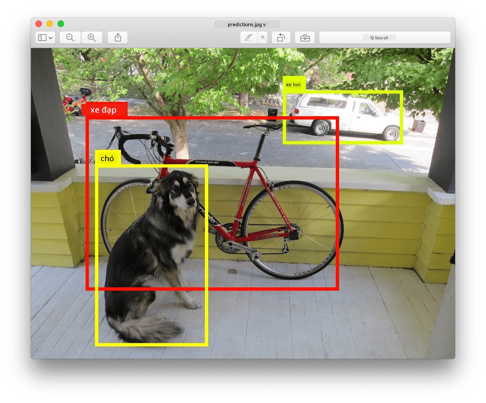
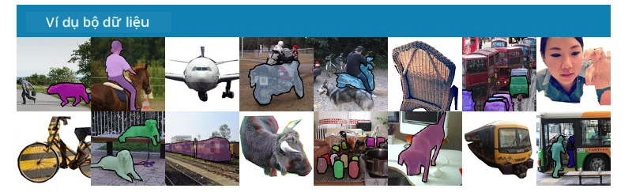
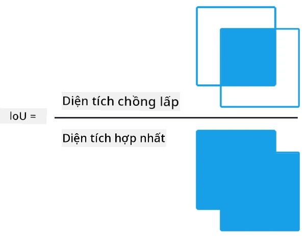
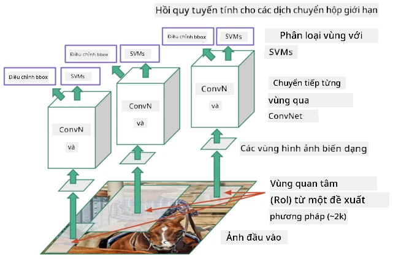
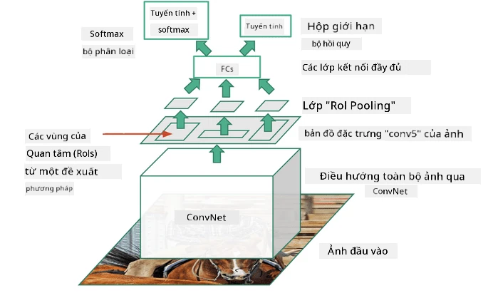
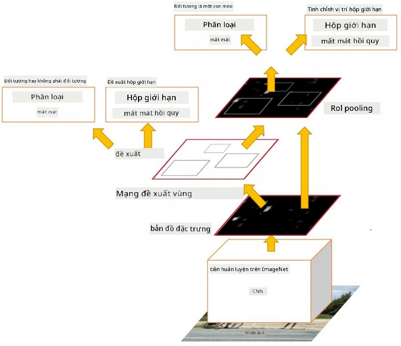
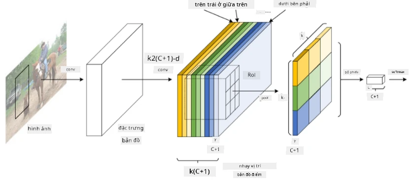
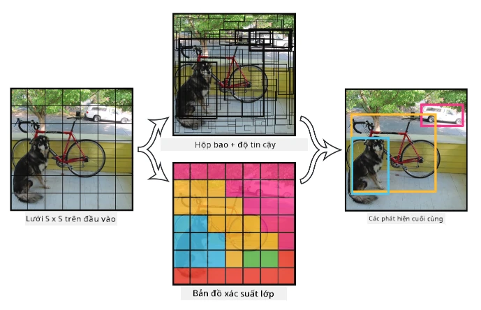

# Phát Hiện Đối Tượng

Các mô hình phân loại hình ảnh mà chúng ta đã làm việc trước đây nhận một hình ảnh và đưa ra kết quả phân loại, chẳng hạn như lớp 'số' trong bài toán MNIST. Tuy nhiên, trong nhiều trường hợp, chúng ta không chỉ muốn biết rằng một bức ảnh có chứa các đối tượng - mà còn muốn xác định vị trí chính xác của chúng. Đây chính là mục đích của **phát hiện đối tượng**.

## [Câu hỏi trước bài giảng](https://ff-quizzes.netlify.app/en/ai/quiz/21)

> Hình ảnh từ [trang web YOLO v2](https://pjreddie.com/darknet/yolov2/)

## Một Cách Tiếp Cận Đơn Giản Để Phát Hiện Đối Tượng

Giả sử chúng ta muốn tìm một con mèo trong một bức ảnh, một cách tiếp cận rất đơn giản để phát hiện đối tượng sẽ là:

1. Chia bức ảnh thành nhiều ô nhỏ.
2. Chạy phân loại hình ảnh trên từng ô.
3. Những ô có kết quả kích hoạt đủ cao có thể được coi là chứa đối tượng cần tìm.

> *Hình ảnh từ [Notebook Bài Tập](ObjectDetection-TF.ipynb)*

Tuy nhiên, cách tiếp cận này còn xa mới đạt được lý tưởng, vì nó chỉ cho phép thuật toán xác định hộp bao đối tượng một cách rất không chính xác. Để có vị trí chính xác hơn, chúng ta cần chạy một loại **hồi quy** để dự đoán tọa độ của các hộp bao - và để làm điều đó, chúng ta cần các tập dữ liệu cụ thể.

## Hồi Quy Cho Phát Hiện Đối Tượng

[Bài viết blog này](https://towardsdatascience.com/object-detection-with-neural-networks-a4e2c46b4491) cung cấp một giới thiệu nhẹ nhàng về việc phát hiện hình dạng.

## Tập Dữ Liệu Cho Phát Hiện Đối Tượng

Bạn có thể gặp các tập dữ liệu sau cho nhiệm vụ này:

* [PASCAL VOC](http://host.robots.ox.ac.uk/pascal/VOC/) - 20 lớp
* [COCO](http://cocodataset.org/#home) - Các Đối Tượng Thông Thường Trong Ngữ Cảnh. 80 lớp, hộp bao và mặt nạ phân đoạn

## Các Chỉ Số Đánh Giá Phát Hiện Đối Tượng

### Intersection over Union

Trong khi đối với phân loại hình ảnh, việc đo lường hiệu suất của thuật toán khá dễ dàng, thì đối với phát hiện đối tượng, chúng ta cần đo lường cả độ chính xác của lớp, cũng như độ chính xác của vị trí hộp bao được suy ra. Đối với yếu tố sau, chúng ta sử dụng chỉ số **Intersection over Union** (IoU), đo lường mức độ chồng lấp giữa hai hộp (hoặc hai khu vực bất kỳ).

> *Hình 2 từ [bài viết blog xuất sắc về IoU này](https://pyimagesearch.com/2016/11/07/intersection-over-union-iou-for-object-detection/)*

Ý tưởng rất đơn giản - chúng ta chia diện tích giao nhau giữa hai hình cho diện tích hợp của chúng. Đối với hai khu vực giống hệt nhau, IoU sẽ là 1, trong khi đối với các khu vực hoàn toàn không giao nhau, nó sẽ là 0. Trong các trường hợp khác, nó sẽ dao động từ 0 đến 1. Chúng ta thường chỉ xem xét các hộp bao có IoU vượt qua một giá trị nhất định.

### Độ Chính Xác Trung Bình

Giả sử chúng ta muốn đo lường mức độ nhận diện tốt của một lớp đối tượng $C$ nào đó. Để đo lường điều này, chúng ta sử dụng chỉ số **Độ Chính Xác Trung Bình** (Average Precision - AP), được tính như sau:

1. Xem xét đường cong Precision-Recall thể hiện độ chính xác phụ thuộc vào giá trị ngưỡng phát hiện (từ 0 đến 1).
2. Tùy thuộc vào ngưỡng, chúng ta sẽ phát hiện được nhiều hoặc ít đối tượng trong hình ảnh, và các giá trị precision và recall khác nhau.
3. Đường cong sẽ trông như thế này:

> *Hình ảnh từ [NeuroWorkshop](http://github.com/shwars/NeuroWorkshop)*

Độ Chính Xác Trung Bình cho một lớp $C$ là diện tích dưới đường cong này. Cụ thể hơn, trục Recall thường được chia thành 10 phần, và Precision được tính trung bình trên tất cả các điểm đó:

$$
AP = {1\over11}\sum_{i=0}^{10}\mbox{Precision}(\mbox{Recall}={i\over10})
$$

### AP và IoU

Chúng ta chỉ xem xét các phát hiện mà IoU vượt qua một giá trị nhất định. Ví dụ, trong tập dữ liệu PASCAL VOC, thường giả định $\mbox{IoU Threshold} = 0.5$, trong khi trong COCO, AP được đo lường cho các giá trị khác nhau của $\mbox{IoU Threshold}$.

> *Hình ảnh từ [NeuroWorkshop](http://github.com/shwars/NeuroWorkshop)*

### Độ Chính Xác Trung Bình Tổng Hợp - mAP

Chỉ số chính cho Phát Hiện Đối Tượng được gọi là **Độ Chính Xác Trung Bình Tổng Hợp** (Mean Average Precision - mAP). Đây là giá trị của Độ Chính Xác Trung Bình, được tính trung bình trên tất cả các lớp đối tượng, và đôi khi cũng trên cả $\mbox{IoU Threshold}$. Quá trình tính toán **mAP** được mô tả chi tiết hơn
[trong bài viết blog này](https://medium.com/@timothycarlen/understanding-the-map-evaluation-metric-for-object-detection-a07fe6962cf3)), và cũng [ở đây với các ví dụ mã](https://gist.github.com/tarlen5/008809c3decf19313de216b9208f3734).

## Các Phương Pháp Phát Hiện Đối Tượng Khác Nhau

Có hai loại thuật toán phát hiện đối tượng chính:

* **Mạng Đề Xuất Vùng** (R-CNN, Fast R-CNN, Faster R-CNN). Ý tưởng chính là tạo ra các **Vùng Quan Tâm** (ROI) và chạy CNN trên chúng, tìm kiếm kích hoạt tối đa. Điều này hơi giống với cách tiếp cận đơn giản, ngoại trừ việc các ROI được tạo ra một cách thông minh hơn. Một trong những nhược điểm lớn của các phương pháp này là chúng chậm, vì cần nhiều lần chạy bộ phân loại CNN trên hình ảnh.
* Các phương pháp **Một Lần Duy Nhất** (YOLO, SSD, RetinaNet). Trong các kiến trúc này, chúng ta thiết kế mạng để dự đoán cả lớp và ROI trong một lần chạy.

### R-CNN: CNN Dựa Trên Vùng

[R-CNN](http://islab.ulsan.ac.kr/files/announcement/513/rcnn_pami.pdf) sử dụng [Selective Search](http://www.huppelen.nl/publications/selectiveSearchDraft.pdf) để tạo ra cấu trúc phân cấp của các vùng ROI, sau đó được đưa qua các bộ trích xuất đặc trưng CNN và các bộ phân loại SVM để xác định lớp đối tượng, và hồi quy tuyến tính để xác định tọa độ *hộp bao*. [Bài báo chính thức](https://arxiv.org/pdf/1506.01497v1.pdf)

> *Hình ảnh từ van de Sande et al. ICCV’11*

> *Hình ảnh từ [bài blog này](https://towardsdatascience.com/r-cnn-fast-r-cnn-faster-r-cnn-yolo-object-detection-algorithms-36d53571365e)*

### F-RCNN - Fast R-CNN

Phương pháp này tương tự như R-CNN, nhưng các vùng được xác định sau khi các lớp tích chập đã được áp dụng.

> Hình ảnh từ [Bài báo chính thức](https://www.cv-foundation.org/openaccess/content_iccv_2015/papers/Girshick_Fast_R-CNN_ICCV_2015_paper.pdf), [arXiv](https://arxiv.org/pdf/1504.08083.pdf), 2015

### Faster R-CNN

Ý tưởng chính của phương pháp này là sử dụng mạng nơ-ron để dự đoán các ROI - được gọi là *Mạng Đề Xuất Vùng* (Region Proposal Network). [Bài báo](https://arxiv.org/pdf/1506.01497.pdf), 2016

> Hình ảnh từ [bài báo chính thức](https://arxiv.org/pdf/1506.01497.pdf)

### R-FCN: Mạng Tích Chập Hoàn Toàn Dựa Trên Vùng

Thuật toán này thậm chí còn nhanh hơn Faster R-CNN. Ý tưởng chính là:

1. Chúng ta trích xuất đặc trưng bằng ResNet-101.
2. Các đặc trưng được xử lý bởi **Bản Đồ Điểm Nhạy Cảm Vị Trí**. Mỗi đối tượng từ $C$ lớp được chia thành các vùng $k\times k$, và chúng ta huấn luyện để dự đoán các phần của đối tượng.
3. Đối với mỗi phần từ các vùng $k\times k$, tất cả các mạng bỏ phiếu cho các lớp đối tượng, và lớp đối tượng có số phiếu cao nhất được chọn.

> Hình ảnh từ [bài báo chính thức](https://arxiv.org/abs/1605.06409)

### YOLO - You Only Look Once

YOLO là một thuật toán một lần duy nhất thời gian thực. Ý tưởng chính là:

 * Hình ảnh được chia thành các vùng $S\times S$.
 * Đối với mỗi vùng, **CNN** dự đoán $n$ đối tượng có thể, tọa độ *hộp bao* và *độ tin cậy* = *xác suất* * IoU.

 

> Hình ảnh từ [bài báo chính thức](https://arxiv.org/abs/1506.02640)

### Các Thuật Toán Khác

* RetinaNet: [bài báo chính thức](https://arxiv.org/abs/1708.02002)
   - [Triển khai PyTorch trong Torchvision](https://pytorch.org/vision/stable/_modules/torchvision/models/detection/retinanet.html)
   - [Triển khai Keras](https://github.com/fizyr/keras-retinanet)
   - [Phát hiện đối tượng với RetinaNet](https://keras.io/examples/vision/retinanet/) trong Keras Samples
* SSD (Single Shot Detector): [bài báo chính thức](https://arxiv.org/abs/1512.02325)

## ✍️ Bài Tập: Phát Hiện Đối Tượng

Tiếp tục học trong notebook sau:

[ObjectDetection.ipynb](ObjectDetection.ipynb)

## Kết Luận

Trong bài học này, bạn đã có một cái nhìn tổng quan nhanh về tất cả các cách khác nhau mà phát hiện đối tượng có thể được thực hiện!

## 🚀 Thử Thách

Đọc qua các bài viết và notebook về YOLO và thử nghiệm chúng:

* [Bài blog hay](https://www.analyticsvidhya.com/blog/2018/12/practical-guide-object-detection-yolo-framewor-python/) mô tả YOLO
 * [Trang web chính thức](https://pjreddie.com/darknet/yolo/)
 * Yolo: [Triển khai Keras](https://github.com/experiencor/keras-yolo2), [notebook từng bước](https://github.com/experiencor/basic-yolo-keras/blob/master/Yolo%20Step-by-Step.ipynb)
 * Yolo v2: [Triển khai Keras](https://github.com/experiencor/keras-yolo2), [notebook từng bước](https://github.com/experiencor/keras-yolo2/blob/master/Yolo%20Step-by-Step.ipynb)

## [Câu hỏi sau bài giảng](https://ff-quizzes.netlify.app/en/ai/quiz/22)

## Ôn Tập & Tự Học

* [Phát Hiện Đối Tượng](https://tjmachinelearning.com/lectures/1718/obj/) của Nikhil Sardana
* [So sánh tốt về các thuật toán phát hiện đối tượng](https://lilianweng.github.io/lil-log/2018/12/27/object-detection-part-4.html)
* [Đánh giá các thuật toán học sâu cho phát hiện đối tượng](https://medium.com/comet-app/review-of-deep-learning-algorithms-for-object-detection-c1f3d437b852)
* [Giới thiệu từng bước về các thuật toán phát hiện đối tượng cơ bản](https://www.analyticsvidhya.com/blog/2018/10/a-step-by-step-introduction-to-the-basic-object-detection-algorithms-part-1/)
* [Triển khai Faster R-CNN trong Python cho phát hiện đối tượng](https://www.analyticsvidhya.com/blog/2018/11/implementation-faster-r-cnn-python-object-detection/)

## [Bài tập: Phát Hiện Đối Tượng](lab/README.md)

---

