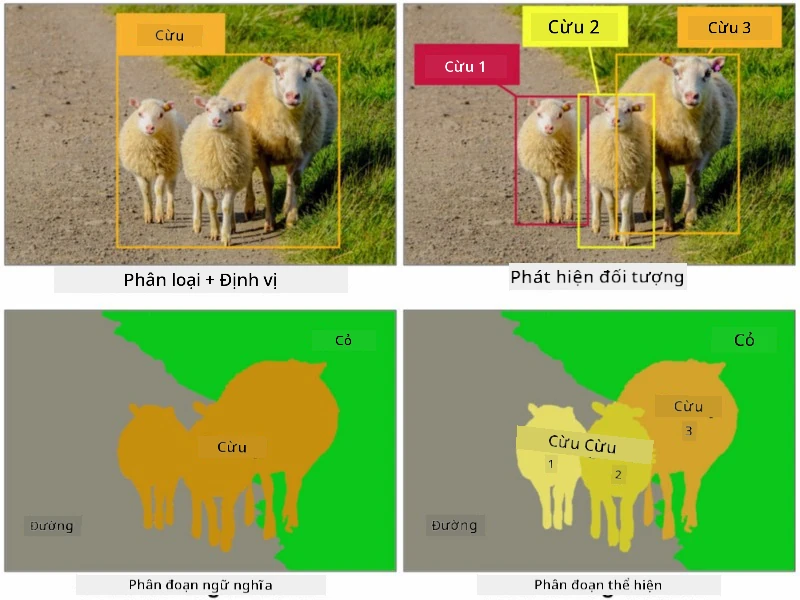
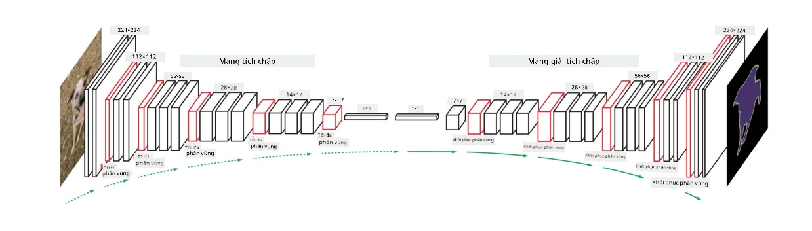

# Phân đoạn

Chúng ta đã học về Phát hiện Đối tượng, cho phép xác định vị trí các đối tượng trong hình ảnh bằng cách dự đoán *hộp giới hạn* của chúng. Tuy nhiên, đối với một số nhiệm vụ, chúng ta không chỉ cần hộp giới hạn mà còn cần định vị đối tượng chính xác hơn. Nhiệm vụ này được gọi là **phân đoạn**.

## [Câu hỏi trước bài giảng](https://ff-quizzes.netlify.app/en/ai/quiz/23)

Phân đoạn có thể được xem như **phân loại điểm ảnh**, trong đó đối với **mỗi** điểm ảnh của hình ảnh, chúng ta phải dự đoán lớp của nó (*nền* là một trong các lớp). Có hai thuật toán phân đoạn chính:

* **Phân đoạn ngữ nghĩa** chỉ cho biết lớp của điểm ảnh mà không phân biệt giữa các đối tượng khác nhau thuộc cùng một lớp.
* **Phân đoạn theo đối tượng** chia các lớp thành các đối tượng khác nhau.

Ví dụ, trong phân đoạn theo đối tượng, những con cừu này là các đối tượng khác nhau, nhưng trong phân đoạn ngữ nghĩa, tất cả các con cừu đều được biểu diễn bởi một lớp duy nhất.

> Hình ảnh từ [bài viết này](https://nirmalamurali.medium.com/image-classification-vs-semantic-segmentation-vs-instance-segmentation-625c33a08d50)

Có nhiều kiến trúc mạng thần kinh khác nhau cho phân đoạn, nhưng tất cả đều có cùng cấu trúc. Theo một cách nào đó, nó tương tự như autoencoder mà bạn đã học trước đây, nhưng thay vì tái tạo hình ảnh gốc, mục tiêu của chúng ta là tái tạo một **mặt nạ**. Do đó, một mạng phân đoạn có các phần sau:

* **Encoder** trích xuất các đặc trưng từ hình ảnh đầu vào.
* **Decoder** chuyển đổi các đặc trưng đó thành **hình ảnh mặt nạ**, với kích thước và số lượng kênh tương ứng với số lượng lớp.

> Hình ảnh từ [ấn phẩm này](https://arxiv.org/pdf/2001.05566.pdf)

Đặc biệt, chúng ta cần đề cập đến hàm mất mát được sử dụng cho phân đoạn. Khi sử dụng autoencoder cổ điển, chúng ta cần đo lường sự tương đồng giữa hai hình ảnh và có thể sử dụng lỗi bình phương trung bình (MSE) để làm điều đó. Trong phân đoạn, mỗi điểm ảnh trong hình ảnh mặt nạ mục tiêu đại diện cho số lớp (được mã hóa one-hot theo chiều thứ ba), vì vậy chúng ta cần sử dụng các hàm mất mát cụ thể cho phân loại - hàm mất mát cross-entropy, được tính trung bình trên tất cả các điểm ảnh. Nếu mặt nạ là nhị phân - **hàm mất mát binary cross-entropy** (BCE) được sử dụng.

> ✅ Mã hóa one-hot là một cách để mã hóa nhãn lớp thành một vector có độ dài bằng số lượng lớp. Hãy xem [bài viết này](https://datagy.io/sklearn-one-hot-encode/) để tìm hiểu thêm về kỹ thuật này.

## Phân đoạn trong hình ảnh y tế

Trong bài học này, chúng ta sẽ thấy phân đoạn hoạt động bằng cách huấn luyện mạng để nhận diện các nốt ruồi (còn gọi là nevi) của con người trên hình ảnh y tế. Chúng ta sẽ sử dụng <a href="https://www.fc.up.pt/addi/ph2%20database.html">Cơ sở dữ liệu PH2</a> của hình ảnh soi da làm nguồn hình ảnh. Bộ dữ liệu này chứa 200 hình ảnh thuộc ba lớp: nốt ruồi điển hình, nốt ruồi không điển hình, và u hắc tố. Tất cả các hình ảnh cũng chứa một **mặt nạ** tương ứng để xác định vùng nốt ruồi.

> ✅ Kỹ thuật này đặc biệt phù hợp với loại hình ảnh y tế này, nhưng bạn có thể hình dung những ứng dụng thực tế nào khác?

> Hình ảnh từ Cơ sở dữ liệu PH2

Chúng ta sẽ huấn luyện một mô hình để phân đoạn bất kỳ nốt ruồi nào khỏi nền của nó.

## ✍️ Bài tập: Phân đoạn ngữ nghĩa

Mở các notebook dưới đây để tìm hiểu thêm về các kiến trúc phân đoạn ngữ nghĩa khác nhau, thực hành làm việc với chúng và xem chúng hoạt động.

* [Phân đoạn ngữ nghĩa Pytorch](SemanticSegmentationPytorch.ipynb)
* [Phân đoạn ngữ nghĩa TensorFlow](SemanticSegmentationTF.ipynb)

## [Câu hỏi sau bài giảng](https://ff-quizzes.netlify.app/en/ai/quiz/24)

## Kết luận

Phân đoạn là một kỹ thuật rất mạnh mẽ trong phân loại hình ảnh, vượt ra ngoài hộp giới hạn để phân loại ở cấp độ điểm ảnh. Đây là một kỹ thuật được sử dụng trong hình ảnh y tế, cùng với nhiều ứng dụng khác.

## 🚀 Thử thách

Phân đoạn cơ thể chỉ là một trong những nhiệm vụ phổ biến mà chúng ta có thể thực hiện với hình ảnh của con người. Các nhiệm vụ quan trọng khác bao gồm **phát hiện khung xương** và **phát hiện tư thế**. Hãy thử thư viện [OpenPose](https://github.com/CMU-Perceptual-Computing-Lab/openpose) để xem cách phát hiện tư thế có thể được sử dụng.

## Ôn tập & Tự học

Bài viết [Wikipedia này](https://wikipedia.org/wiki/Image_segmentation) cung cấp một cái nhìn tổng quan tốt về các ứng dụng khác nhau của kỹ thuật này. Tìm hiểu thêm về các phân ngành của Phân đoạn theo đối tượng và Phân đoạn toàn cảnh trong lĩnh vực này.

## [Bài tập](lab/README.md)

Trong bài thực hành này, hãy thử **phân đoạn cơ thể con người** bằng cách sử dụng [Bộ dữ liệu Phân đoạn Toàn thân MADS](https://www.kaggle.com/datasets/tapakah68/segmentation-full-body-mads-dataset) từ Kaggle.

---

