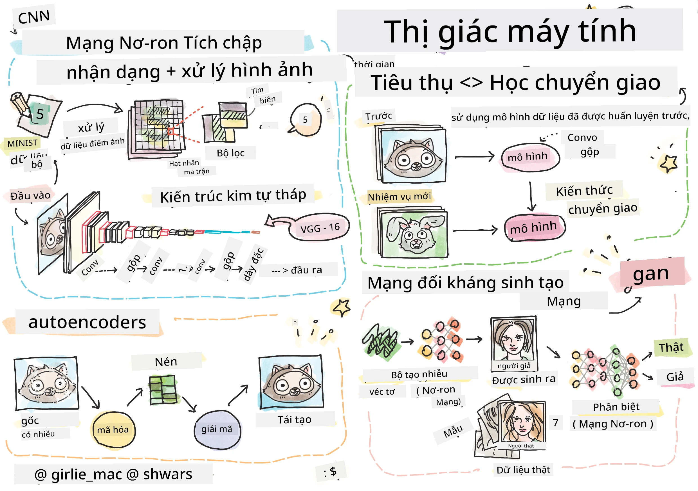

# Thị giác Máy tính

Trong phần này, chúng ta sẽ tìm hiểu về:

* [Giới thiệu về Thị giác Máy tính và OpenCV](06-IntroCV/README.md)
* [Mạng Nơ-ron Tích chập](07-ConvNets/README.md)
* [Mạng được Huấn luyện sẵn và Học Chuyển giao](08-TransferLearning/README.md) 
* [Bộ mã hóa tự động](09-Autoencoders/README.md)
* [Mạng Đối kháng Tạo sinh](10-GANs/README.md)
* [Phát hiện Đối tượng](11-ObjectDetection/README.md)
* [Phân đoạn Ngữ nghĩa](12-Segmentation/README.md)

---

**Tuyên bố miễn trừ trách nhiệm**:  
Tài liệu này đã được dịch bằng dịch vụ dịch thuật AI [Co-op Translator](https://github.com/Azure/co-op-translator). Mặc dù chúng tôi cố gắng đảm bảo độ chính xác, xin lưu ý rằng các bản dịch tự động có thể chứa lỗi hoặc không chính xác. Tài liệu gốc bằng ngôn ngữ bản địa nên được coi là nguồn tham khảo chính thức. Đối với các thông tin quan trọng, nên sử dụng dịch vụ dịch thuật chuyên nghiệp từ con người. Chúng tôi không chịu trách nhiệm cho bất kỳ sự hiểu lầm hoặc diễn giải sai nào phát sinh từ việc sử dụng bản dịch này.