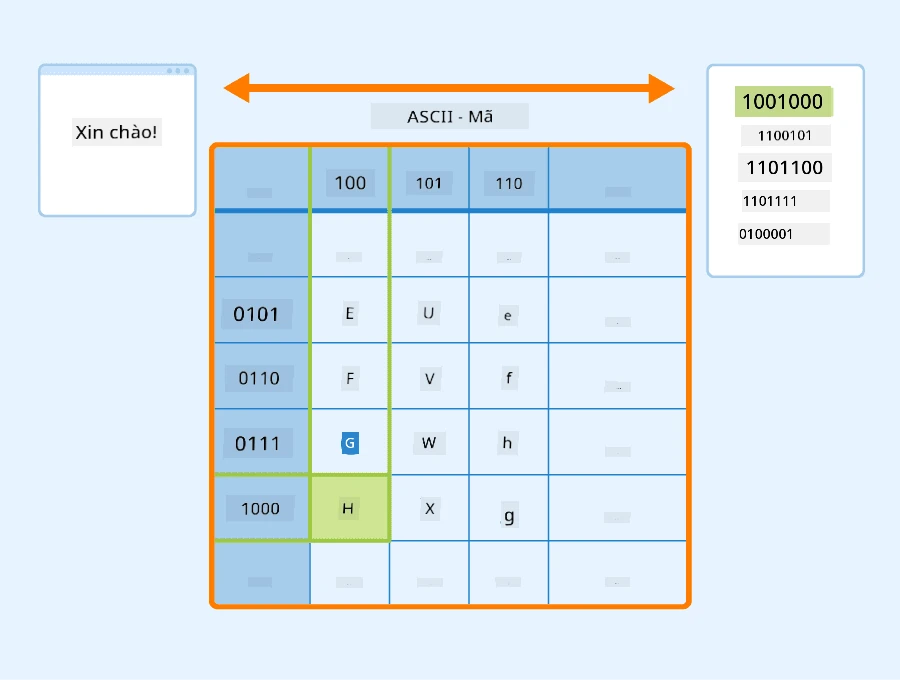
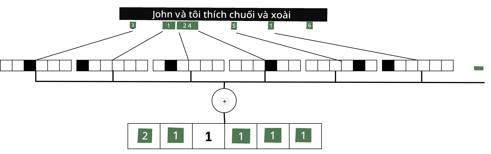

# Đại diện Văn bản dưới dạng Tensors

## [Câu hỏi trước bài giảng](https://ff-quizzes.netlify.app/en/ai/quiz/25)

## Phân loại văn bản

Trong phần đầu tiên của mục này, chúng ta sẽ tập trung vào nhiệm vụ **phân loại văn bản**. Chúng ta sẽ sử dụng Bộ dữ liệu [AG News](https://www.kaggle.com/amananandrai/ag-news-classification-dataset), chứa các bài báo như sau:

* Danh mục: Khoa học/Công nghệ  
* Tiêu đề: Công ty Ky. Nhận được tài trợ để nghiên cứu Peptides (AP)  
* Nội dung: AP - Một công ty được thành lập bởi một nhà nghiên cứu hóa học tại Đại học Louisville đã nhận được tài trợ để phát triển...

Mục tiêu của chúng ta là phân loại bài báo vào một trong các danh mục dựa trên văn bản.

## Đại diện văn bản

Nếu chúng ta muốn giải quyết các nhiệm vụ Xử lý Ngôn ngữ Tự nhiên (NLP) bằng mạng nơ-ron, chúng ta cần một cách để đại diện văn bản dưới dạng tensors. Máy tính đã đại diện các ký tự văn bản dưới dạng số, ánh xạ đến các phông chữ trên màn hình của bạn bằng các mã hóa như ASCII hoặc UTF-8.

> [Nguồn hình ảnh](https://www.seobility.net/en/wiki/ASCII)

Là con người, chúng ta hiểu mỗi chữ cái **đại diện** cho điều gì, và cách tất cả các ký tự kết hợp lại để tạo thành các từ trong một câu. Tuy nhiên, máy tính tự nó không có sự hiểu biết như vậy, và mạng nơ-ron phải học ý nghĩa trong quá trình huấn luyện.

Do đó, chúng ta có thể sử dụng các cách tiếp cận khác nhau khi đại diện văn bản:

* **Đại diện cấp ký tự**, khi chúng ta đại diện văn bản bằng cách coi mỗi ký tự là một số. Với *C* ký tự khác nhau trong tập văn bản của chúng ta, từ *Hello* sẽ được đại diện bằng tensor 5x*C*. Mỗi chữ cái sẽ tương ứng với một cột tensor trong mã hóa one-hot.  
* **Đại diện cấp từ**, trong đó chúng ta tạo một **từ vựng** của tất cả các từ trong văn bản, và sau đó đại diện các từ bằng mã hóa one-hot. Cách tiếp cận này tốt hơn phần nào, vì mỗi chữ cái tự nó không mang nhiều ý nghĩa, và do đó bằng cách sử dụng các khái niệm ngữ nghĩa cấp cao hơn - từ - chúng ta đơn giản hóa nhiệm vụ cho mạng nơ-ron. Tuy nhiên, với kích thước từ điển lớn, chúng ta cần xử lý các tensors thưa thớt có độ chiều cao.

Dù sử dụng cách đại diện nào, trước tiên chúng ta cần chuyển đổi văn bản thành một chuỗi **token**, mỗi token là một ký tự, một từ, hoặc đôi khi là một phần của từ. Sau đó, chúng ta chuyển đổi token thành một số, thường sử dụng **từ vựng**, và số này có thể được đưa vào mạng nơ-ron bằng mã hóa one-hot.

## N-Grams

Trong ngôn ngữ tự nhiên, ý nghĩa chính xác của từ chỉ có thể được xác định trong ngữ cảnh. Ví dụ, ý nghĩa của *mạng nơ-ron* và *mạng đánh cá* hoàn toàn khác nhau. Một trong những cách để tính đến điều này là xây dựng mô hình của chúng ta dựa trên các cặp từ, và coi các cặp từ là các token từ vựng riêng biệt. Theo cách này, câu *I like to go fishing* sẽ được đại diện bằng chuỗi token sau: *I like*, *like to*, *to go*, *go fishing*. Vấn đề với cách tiếp cận này là kích thước từ điển tăng lên đáng kể, và các tổ hợp như *go fishing* và *go shopping* được biểu diễn bằng các token khác nhau, không chia sẻ bất kỳ sự tương đồng ngữ nghĩa nào mặc dù cùng động từ.

Trong một số trường hợp, chúng ta có thể xem xét sử dụng tri-grams -- tổ hợp ba từ -- nữa. Do đó, cách tiếp cận này thường được gọi là **n-grams**. Ngoài ra, nó cũng hợp lý khi sử dụng n-grams với đại diện cấp ký tự, trong trường hợp này n-grams sẽ tương ứng với các âm tiết khác nhau.

## Bag-of-Words và TF/IDF

Khi giải quyết các nhiệm vụ như phân loại văn bản, chúng ta cần có khả năng đại diện văn bản bằng một vector kích thước cố định, mà chúng ta sẽ sử dụng làm đầu vào cho bộ phân loại cuối cùng. Một trong những cách đơn giản nhất để làm điều đó là kết hợp tất cả các đại diện từ riêng lẻ, ví dụ bằng cách cộng chúng lại. Nếu chúng ta cộng các mã hóa one-hot của mỗi từ, chúng ta sẽ có một vector tần suất, cho thấy mỗi từ xuất hiện bao nhiêu lần trong văn bản. Cách đại diện văn bản này được gọi là **bag of words** (BoW).

> Hình ảnh của tác giả

BoW về cơ bản đại diện cho các từ xuất hiện trong văn bản và số lượng của chúng, điều này thực sự có thể là một chỉ báo tốt về nội dung văn bản. Ví dụ, bài báo về chính trị có khả năng chứa các từ như *president* và *country*, trong khi bài viết khoa học có thể có các từ như *collider*, *discovered*, v.v. Do đó, tần suất từ trong nhiều trường hợp có thể là một chỉ báo tốt về nội dung văn bản.

Vấn đề với BoW là một số từ phổ biến, như *and*, *is*, v.v. xuất hiện trong hầu hết các văn bản, và chúng có tần suất cao nhất, che khuất các từ thực sự quan trọng. Chúng ta có thể giảm tầm quan trọng của những từ này bằng cách tính đến tần suất mà các từ xuất hiện trong toàn bộ tập hợp tài liệu. Đây là ý tưởng chính đằng sau cách tiếp cận TF/IDF, được trình bày chi tiết hơn trong các notebook đính kèm bài học này.

Tuy nhiên, không cách tiếp cận nào trong số này có thể hoàn toàn tính đến **ngữ nghĩa** của văn bản. Chúng ta cần các mô hình mạng nơ-ron mạnh mẽ hơn để làm điều này, điều mà chúng ta sẽ thảo luận sau trong phần này.

## ✍️ Bài tập: Đại diện Văn bản

Tiếp tục học trong các notebook sau:

* [Đại diện Văn bản với PyTorch](TextRepresentationPyTorch.ipynb)  
* [Đại diện Văn bản với TensorFlow](TextRepresentationTF.ipynb)  

## Kết luận

Cho đến nay, chúng ta đã nghiên cứu các kỹ thuật có thể thêm trọng số tần suất vào các từ khác nhau. Tuy nhiên, chúng không thể đại diện ý nghĩa hoặc thứ tự. Như nhà ngôn ngữ học nổi tiếng J. R. Firth đã nói vào năm 1935, "Ý nghĩa đầy đủ của một từ luôn mang tính ngữ cảnh, và không nghiên cứu ý nghĩa nào ngoài ngữ cảnh có thể được coi là nghiêm túc." Chúng ta sẽ học sau trong khóa học cách nắm bắt thông tin ngữ cảnh từ văn bản bằng cách sử dụng mô hình ngôn ngữ.

## 🚀 Thử thách

Thử một số bài tập khác sử dụng bag-of-words và các mô hình dữ liệu khác nhau. Bạn có thể lấy cảm hứng từ [cuộc thi này trên Kaggle](https://www.kaggle.com/competitions/word2vec-nlp-tutorial/overview/part-1-for-beginners-bag-of-words)

## [Câu hỏi sau bài giảng](https://ff-quizzes.netlify.app/en/ai/quiz/26)

## Ôn tập & Tự học

Luyện tập kỹ năng của bạn với các kỹ thuật nhúng văn bản và bag-of-words trên [Microsoft Learn](https://docs.microsoft.com/learn/modules/intro-natural-language-processing-pytorch/?WT.mc_id=academic-77998-cacaste)

## [Bài tập: Notebook](assignment.md)

---

