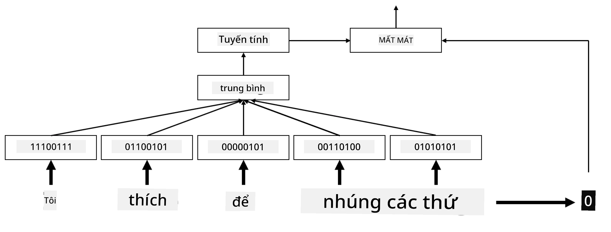

# Nhúng

## [Câu hỏi trước bài giảng](https://ff-quizzes.netlify.app/en/ai/quiz/27)

Khi huấn luyện các bộ phân loại dựa trên BoW hoặc TF/IDF, chúng ta đã làm việc với các vector túi từ có chiều cao với độ dài `vocab_size`, và chúng ta đã chuyển đổi rõ ràng từ các vector biểu diễn vị trí có chiều thấp sang biểu diễn thưa thớt một-hot. Tuy nhiên, biểu diễn một-hot này không hiệu quả về mặt bộ nhớ. Ngoài ra, mỗi từ được xử lý độc lập với nhau, tức là các vector mã hóa một-hot không thể hiện bất kỳ sự tương đồng ngữ nghĩa nào giữa các từ.

Ý tưởng của **nhúng** là biểu diễn các từ bằng các vector dày đặc có chiều thấp hơn, phản ánh phần nào ý nghĩa ngữ nghĩa của một từ. Chúng ta sẽ thảo luận sau về cách xây dựng các nhúng từ có ý nghĩa, nhưng hiện tại hãy chỉ nghĩ về nhúng như một cách để giảm chiều của vector từ.

Vì vậy, lớp nhúng sẽ nhận một từ làm đầu vào và tạo ra một vector đầu ra với kích thước `embedding_size` được chỉ định. Theo một cách nào đó, nó rất giống với lớp `Linear`, nhưng thay vì nhận một vector mã hóa một-hot, nó sẽ có thể nhận một số từ làm đầu vào, cho phép chúng ta tránh tạo ra các vector mã hóa một-hot lớn.

Bằng cách sử dụng lớp nhúng làm lớp đầu tiên trong mạng phân loại của chúng ta, chúng ta có thể chuyển từ mô hình túi từ sang mô hình **túi nhúng**, nơi chúng ta đầu tiên chuyển đổi mỗi từ trong văn bản của mình thành nhúng tương ứng, và sau đó tính toán một số hàm tổng hợp trên tất cả các nhúng đó, chẳng hạn như `sum`, `average` hoặc `max`.

> Hình ảnh của tác giả

## ✍️ Bài tập: Nhúng

Tiếp tục học trong các notebook sau:
* [Nhúng với PyTorch](EmbeddingsPyTorch.ipynb)
* [Nhúng TensorFlow](EmbeddingsTF.ipynb)

## Nhúng ngữ nghĩa: Word2Vec

Mặc dù lớp nhúng đã học cách ánh xạ các từ sang biểu diễn vector, nhưng biểu diễn này không nhất thiết phải có nhiều ý nghĩa ngữ nghĩa. Sẽ rất tốt nếu học được một biểu diễn vector sao cho các từ tương tự hoặc từ đồng nghĩa tương ứng với các vector gần nhau theo một số khoảng cách vector (ví dụ: khoảng cách Euclid).

Để làm điều đó, chúng ta cần tiền huấn luyện mô hình nhúng của mình trên một tập hợp lớn văn bản theo một cách cụ thể. Một cách để huấn luyện nhúng ngữ nghĩa được gọi là [Word2Vec](https://en.wikipedia.org/wiki/Word2vec). Nó dựa trên hai kiến trúc chính được sử dụng để tạo ra biểu diễn phân tán của các từ:

 - **Túi từ liên tục** (CBoW) — trong kiến trúc này, chúng ta huấn luyện mô hình để dự đoán một từ từ ngữ cảnh xung quanh. Với ngram $(W_{-2},W_{-1},W_0,W_1,W_2)$, mục tiêu của mô hình là dự đoán $W_0$ từ $(W_{-2},W_{-1},W_1,W_2)$.
 - **Skip-gram liên tục** thì ngược lại với CBoW. Mô hình sử dụng cửa sổ ngữ cảnh xung quanh để dự đoán từ hiện tại.

CBoW nhanh hơn, trong khi skip-gram chậm hơn nhưng làm tốt hơn trong việc biểu diễn các từ ít xuất hiện.

> Hình ảnh từ [bài báo này](https://arxiv.org/pdf/1301.3781.pdf)

Các nhúng Word2Vec đã tiền huấn luyện (cũng như các mô hình tương tự khác như GloVe) cũng có thể được sử dụng thay cho lớp nhúng trong mạng nơ-ron. Tuy nhiên, chúng ta cần xử lý các từ vựng, vì từ vựng được sử dụng để tiền huấn luyện Word2Vec/GloVe có khả năng khác với từ vựng trong tập văn bản của chúng ta. Hãy xem các Notebook ở trên để biết cách giải quyết vấn đề này.

## Nhúng theo ngữ cảnh

Một hạn chế chính của các biểu diễn nhúng tiền huấn luyện truyền thống như Word2Vec là vấn đề phân biệt nghĩa của từ. Mặc dù các nhúng tiền huấn luyện có thể nắm bắt một phần ý nghĩa của từ trong ngữ cảnh, nhưng mọi nghĩa có thể có của một từ đều được mã hóa vào cùng một nhúng. Điều này có thể gây ra vấn đề trong các mô hình hạ nguồn, vì nhiều từ như từ 'play' có các nghĩa khác nhau tùy thuộc vào ngữ cảnh mà chúng được sử dụng.

Ví dụ, từ 'play' trong hai câu sau có ý nghĩa khá khác nhau:

- Tôi đã đi xem một **vở kịch** tại nhà hát.
- John muốn **chơi** với bạn bè của mình.

Các nhúng tiền huấn luyện ở trên biểu diễn cả hai nghĩa của từ 'play' trong cùng một nhúng. Để vượt qua hạn chế này, chúng ta cần xây dựng các nhúng dựa trên **mô hình ngôn ngữ**, được huấn luyện trên một tập hợp lớn văn bản và *hiểu* cách các từ có thể được ghép lại với nhau trong các ngữ cảnh khác nhau. Việc thảo luận về nhúng theo ngữ cảnh nằm ngoài phạm vi của bài hướng dẫn này, nhưng chúng ta sẽ quay lại chúng khi nói về các mô hình ngôn ngữ sau trong khóa học.

## Kết luận

Trong bài học này, bạn đã khám phá cách xây dựng và sử dụng các lớp nhúng trong TensorFlow và Pytorch để phản ánh tốt hơn ý nghĩa ngữ nghĩa của các từ.

## 🚀 Thử thách

Word2Vec đã được sử dụng cho một số ứng dụng thú vị, bao gồm tạo lời bài hát và thơ. Hãy xem [bài viết này](https://www.politetype.com/blog/word2vec-color-poems) để tìm hiểu cách tác giả sử dụng Word2Vec để tạo thơ. Xem [video này của Dan Shiffmann](https://www.youtube.com/watch?v=LSS_bos_TPI&ab_channel=TheCodingTrain) để khám phá một cách giải thích khác về kỹ thuật này. Sau đó, thử áp dụng các kỹ thuật này vào tập văn bản của riêng bạn, có thể lấy từ Kaggle.

## [Câu hỏi sau bài giảng](https://ff-quizzes.netlify.app/en/ai/quiz/28)

## Ôn tập & Tự học

Đọc bài báo này về Word2Vec: [Efficient Estimation of Word Representations in Vector Space](https://arxiv.org/pdf/1301.3781.pdf)

## [Bài tập: Notebook](assignment.md)

---

