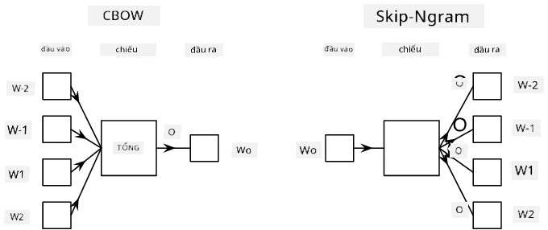

# Mô hình Ngôn ngữ

Các biểu diễn ngữ nghĩa, như Word2Vec và GloVe, thực chất là bước đầu tiên hướng tới **mô hình ngôn ngữ** - tạo ra các mô hình có thể *hiểu* (hoặc *biểu diễn*) bản chất của ngôn ngữ.

## [Câu hỏi trước bài giảng](https://ff-quizzes.netlify.app/en/ai/quiz/29)

Ý tưởng chính đằng sau mô hình ngôn ngữ là huấn luyện chúng trên các tập dữ liệu không gán nhãn theo cách không giám sát. Điều này quan trọng vì chúng ta có một lượng lớn văn bản không gán nhãn, trong khi lượng văn bản có gán nhãn luôn bị giới hạn bởi công sức mà chúng ta có thể bỏ ra để gán nhãn. Thông thường, chúng ta có thể xây dựng các mô hình ngôn ngữ có khả năng **dự đoán từ bị thiếu** trong văn bản, bởi vì việc che giấu một từ ngẫu nhiên trong văn bản và sử dụng nó làm mẫu huấn luyện là rất dễ dàng.

## Huấn luyện Biểu diễn

Trong các ví dụ trước, chúng ta đã sử dụng các biểu diễn ngữ nghĩa được huấn luyện sẵn, nhưng sẽ rất thú vị khi xem cách các biểu diễn này được huấn luyện. Có một số ý tưởng có thể được sử dụng:

* **Mô hình ngôn ngữ N-Gram**, khi chúng ta dự đoán một token bằng cách nhìn vào N token trước đó (N-gram).
* **Continuous Bag-of-Words** (CBoW), khi chúng ta dự đoán token ở giữa $W_0$ trong một chuỗi token $W_{-N}$, ..., $W_N$.
* **Skip-gram**, nơi chúng ta dự đoán một tập hợp các token lân cận {$W_{-N},\dots, W_{-1}, W_1,\dots, W_N$} từ token ở giữa $W_0$.

> Hình ảnh từ [bài báo này](https://arxiv.org/pdf/1301.3781.pdf)

## ✍️ Ví dụ Notebook: Huấn luyện mô hình CBoW

Tiếp tục học tập qua các notebook sau:

* [Huấn luyện CBoW Word2Vec với TensorFlow](CBoW-TF.ipynb)
* [Huấn luyện CBoW Word2Vec với PyTorch](CBoW-PyTorch.ipynb)

## Kết luận

Trong bài học trước, chúng ta đã thấy rằng các biểu diễn từ hoạt động như một phép màu! Giờ đây, chúng ta biết rằng việc huấn luyện các biểu diễn từ không phải là một nhiệm vụ quá phức tạp, và chúng ta có thể tự huấn luyện các biểu diễn từ cho văn bản chuyên ngành nếu cần.

## [Câu hỏi sau bài giảng](https://ff-quizzes.netlify.app/en/ai/quiz/30)

## Ôn tập & Tự học

* [Hướng dẫn chính thức của PyTorch về Mô hình Ngôn ngữ](https://pytorch.org/tutorials/beginner/nlp/word_embeddings_tutorial.html).
* [Hướng dẫn chính thức của TensorFlow về huấn luyện mô hình Word2Vec](https://www.TensorFlow.org/tutorials/text/word2vec).
* Sử dụng framework **gensim** để huấn luyện các biểu diễn phổ biến nhất chỉ trong vài dòng mã được mô tả [trong tài liệu này](https://pytorch.org/tutorials/beginner/nlp/word_embeddings_tutorial.html).

## 🚀 [Bài tập: Huấn luyện Mô hình Skip-Gram](lab/README.md)

Trong phòng thí nghiệm, chúng tôi thách thức bạn chỉnh sửa mã từ bài học này để huấn luyện mô hình skip-gram thay vì CBoW. [Đọc chi tiết](lab/README.md)

---

