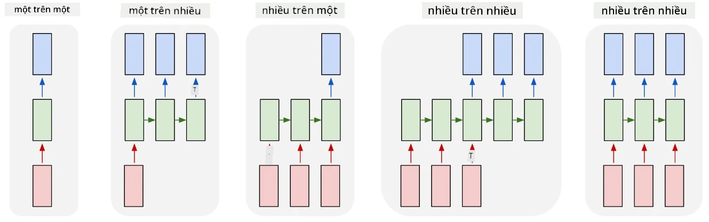

# Mạng tạo sinh

## [Câu hỏi trước bài giảng](https://ff-quizzes.netlify.app/en/ai/quiz/33)

Mạng nơ-ron hồi quy (RNN) và các biến thể tế bào có cổng của nó như Tế bào Bộ nhớ Ngắn Dài (LSTM) và Đơn vị Hồi quy Có cổng (GRU) cung cấp một cơ chế để mô hình hóa ngôn ngữ, vì chúng có thể học cách sắp xếp từ và đưa ra dự đoán cho từ tiếp theo trong một chuỗi. Điều này cho phép chúng ta sử dụng RNN cho các **nhiệm vụ tạo sinh**, chẳng hạn như tạo văn bản thông thường, dịch máy, và thậm chí là chú thích hình ảnh.

> ✅ Hãy nghĩ về tất cả những lần bạn đã hưởng lợi từ các nhiệm vụ tạo sinh như hoàn thành văn bản khi bạn gõ. Tìm hiểu về các ứng dụng yêu thích của bạn để xem liệu chúng có sử dụng RNN hay không.

Trong kiến trúc RNN mà chúng ta đã thảo luận trong bài trước, mỗi đơn vị RNN tạo ra trạng thái ẩn tiếp theo như một đầu ra. Tuy nhiên, chúng ta cũng có thể thêm một đầu ra khác vào mỗi đơn vị hồi quy, điều này cho phép chúng ta xuất ra một **chuỗi** (có độ dài bằng với chuỗi ban đầu). Hơn nữa, chúng ta có thể sử dụng các đơn vị RNN không nhận đầu vào ở mỗi bước, chỉ cần một vector trạng thái ban đầu, và sau đó tạo ra một chuỗi đầu ra.

Điều này cho phép các kiến trúc nơ-ron khác nhau như được hiển thị trong hình dưới đây:



> Hình ảnh từ bài viết blog [Unreasonable Effectiveness of Recurrent Neural Networks](http://karpathy.github.io/2015/05/21/rnn-effectiveness/) của [Andrej Karpaty](http://karpathy.github.io/)

* **Một-đến-một** là mạng nơ-ron truyền thống với một đầu vào và một đầu ra
* **Một-đến-nhiều** là một kiến trúc tạo sinh nhận một giá trị đầu vào và tạo ra một chuỗi giá trị đầu ra. Ví dụ, nếu chúng ta muốn huấn luyện một mạng **chú thích hình ảnh** để tạo ra mô tả văn bản cho một bức ảnh, chúng ta có thể đưa bức ảnh làm đầu vào, truyền qua CNN để lấy trạng thái ẩn của nó, và sau đó có một chuỗi hồi quy tạo chú thích từng từ một.
* **Nhiều-đến-một** tương ứng với các kiến trúc RNN mà chúng ta đã mô tả trong bài trước, chẳng hạn như phân loại văn bản.
* **Nhiều-đến-nhiều**, hoặc **chuỗi-đến-chuỗi** tương ứng với các nhiệm vụ như **dịch máy**, nơi chúng ta có RNN đầu tiên thu thập tất cả thông tin từ chuỗi đầu vào vào trạng thái ẩn, và một chuỗi RNN khác giải mã trạng thái này thành chuỗi đầu ra.

Trong bài này, chúng ta sẽ tập trung vào các mô hình tạo sinh đơn giản giúp chúng ta tạo văn bản. Để đơn giản, chúng ta sẽ sử dụng mã hóa cấp ký tự.

Chúng ta sẽ huấn luyện RNN này để tạo văn bản từng bước. Ở mỗi bước, chúng ta sẽ lấy một chuỗi ký tự có độ dài `nchars`, và yêu cầu mạng tạo ra ký tự đầu ra tiếp theo cho mỗi ký tự đầu vào:


Khi tạo văn bản (trong quá trình suy luận), chúng ta bắt đầu với một **gợi ý**, được truyền qua các tế bào RNN để tạo trạng thái trung gian của nó, và sau đó từ trạng thái này bắt đầu quá trình tạo. Chúng ta tạo từng ký tự một, và truyền trạng thái cùng ký tự vừa tạo vào một tế bào RNN khác để tạo ký tự tiếp theo, cho đến khi tạo đủ số ký tự.


> Hình ảnh của tác giả

## ✍️ Bài tập: Mạng tạo sinh

Tiếp tục học trong các notebook sau:

* [Mạng tạo sinh với PyTorch](GenerativePyTorch.ipynb)
* [Mạng tạo sinh với TensorFlow](GenerativeTF.ipynb)

## Tạo văn bản mềm và nhiệt độ

Đầu ra của mỗi tế bào RNN là một phân phối xác suất của các ký tự. Nếu chúng ta luôn chọn ký tự có xác suất cao nhất làm ký tự tiếp theo trong văn bản được tạo, văn bản thường có thể trở nên "lặp lại" giữa các chuỗi ký tự giống nhau, như trong ví dụ này:

```
today of the second the company and a second the company ...
```

Tuy nhiên, nếu chúng ta nhìn vào phân phối xác suất cho ký tự tiếp theo, có thể sự khác biệt giữa một vài xác suất cao nhất không lớn, ví dụ một ký tự có xác suất 0.2, ký tự khác - 0.19, v.v. Chẳng hạn, khi tìm ký tự tiếp theo trong chuỗi '*play*', ký tự tiếp theo có thể là khoảng trắng hoặc **e** (như trong từ *player*).

Điều này dẫn đến kết luận rằng không phải lúc nào cũng "công bằng" để chọn ký tự có xác suất cao nhất, vì chọn ký tự có xác suất cao thứ hai vẫn có thể dẫn đến văn bản có ý nghĩa. Sẽ khôn ngoan hơn nếu **lấy mẫu** ký tự từ phân phối xác suất do mạng xuất ra. Chúng ta cũng có thể sử dụng một tham số, **nhiệt độ**, để làm phẳng phân phối xác suất, trong trường hợp chúng ta muốn thêm sự ngẫu nhiên, hoặc làm nó dốc hơn, nếu chúng ta muốn bám sát các ký tự có xác suất cao nhất.

Khám phá cách tạo văn bản mềm được triển khai trong các notebook được liên kết ở trên.

## Kết luận

Mặc dù việc tạo văn bản có thể hữu ích tự thân, lợi ích lớn hơn đến từ khả năng tạo văn bản bằng RNN từ một vector đặc trưng ban đầu. Ví dụ, tạo văn bản được sử dụng như một phần của dịch máy (chuỗi-đến-chuỗi, trong trường hợp này vector trạng thái từ *encoder* được sử dụng để tạo hoặc *giải mã* thông điệp đã dịch), hoặc tạo mô tả văn bản cho một hình ảnh (trong trường hợp này vector đặc trưng sẽ đến từ bộ trích xuất CNN).

## 🚀 Thử thách

Học một số bài học trên Microsoft Learn về chủ đề này

* Tạo văn bản với [PyTorch](https://docs.microsoft.com/learn/modules/intro-natural-language-processing-pytorch/6-generative-networks/?WT.mc_id=academic-77998-cacaste)/[TensorFlow](https://docs.microsoft.com/learn/modules/intro-natural-language-processing-tensorflow/5-generative-networks/?WT.mc_id=academic-77998-cacaste)

## [Câu hỏi sau bài giảng](https://ff-quizzes.netlify.app/en/ai/quiz/34)

## Ôn tập & Tự học

Dưới đây là một số bài viết để mở rộng kiến thức của bạn

* Các cách tiếp cận khác nhau để tạo văn bản với Markov Chain, LSTM và GPT-2: [bài viết blog](https://towardsdatascience.com/text-generation-gpt-2-lstm-markov-chain-9ea371820e1e)
* Ví dụ tạo văn bản trong [tài liệu Keras](https://keras.io/examples/generative/lstm_character_level_text_generation/)

## [Bài tập](lab/README.md)

Chúng ta đã thấy cách tạo văn bản từng ký tự một. Trong bài thực hành, bạn sẽ khám phá việc tạo văn bản ở cấp độ từ.

---

