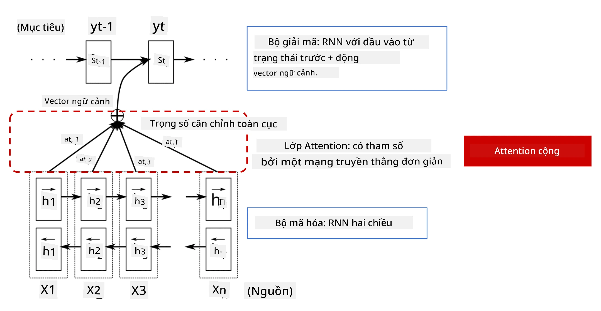
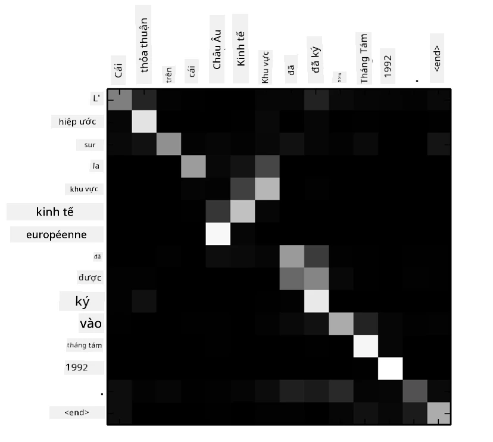
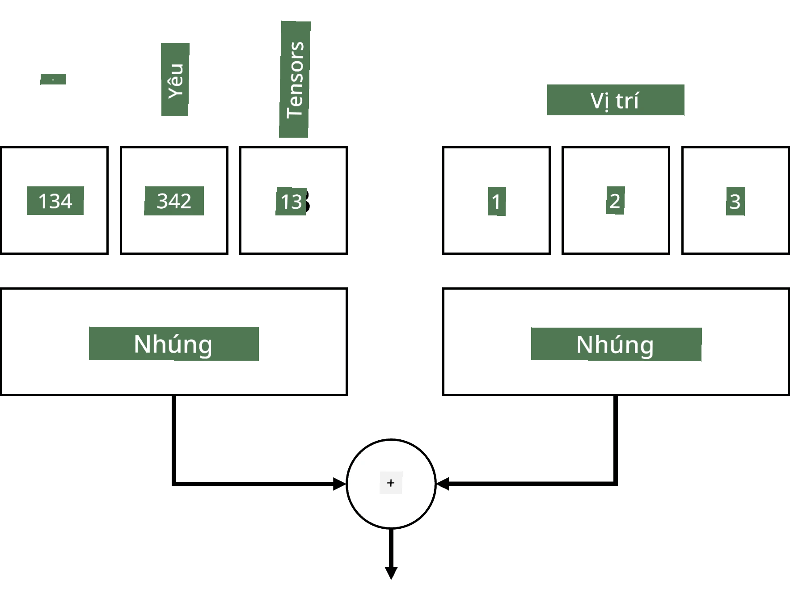
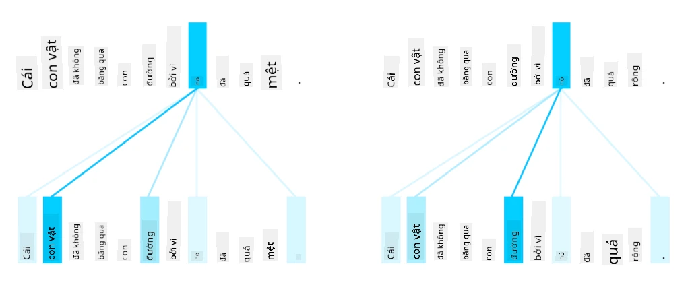
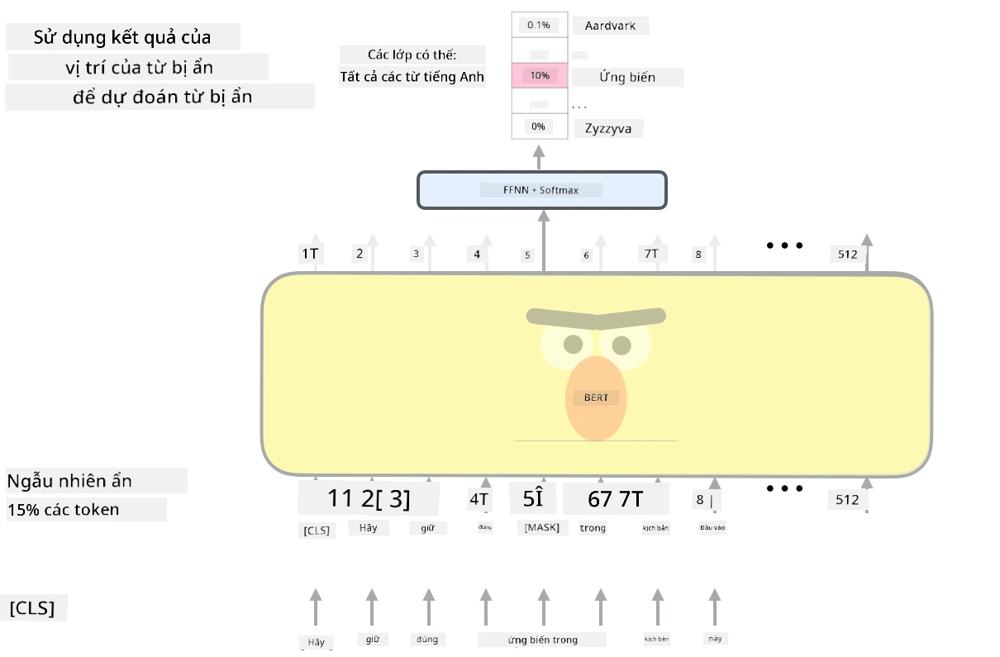

# Cơ chế Attention và Transformers

## [Câu hỏi trước bài giảng](https://ff-quizzes.netlify.app/en/ai/quiz/35)

Một trong những vấn đề quan trọng nhất trong lĩnh vực NLP là **dịch máy**, một nhiệm vụ thiết yếu làm nền tảng cho các công cụ như Google Translate. Trong phần này, chúng ta sẽ tập trung vào dịch máy, hoặc nói chung hơn, vào bất kỳ nhiệm vụ *sequence-to-sequence* nào (còn được gọi là **chuyển đổi câu**).

Với RNNs, sequence-to-sequence được thực hiện bởi hai mạng hồi quy, trong đó một mạng, **encoder**, nén một chuỗi đầu vào thành trạng thái ẩn, trong khi mạng khác, **decoder**, mở rộng trạng thái ẩn này thành kết quả đã dịch. Có một số vấn đề với cách tiếp cận này:

* Trạng thái cuối cùng của mạng encoder gặp khó khăn trong việc nhớ phần đầu của câu, dẫn đến chất lượng mô hình kém đối với các câu dài.
* Tất cả các từ trong một chuỗi đều có tác động như nhau đến kết quả. Tuy nhiên, trong thực tế, các từ cụ thể trong chuỗi đầu vào thường có tác động lớn hơn đến các đầu ra tuần tự so với các từ khác.

**Cơ chế Attention** cung cấp một cách để cân nhắc tác động ngữ cảnh của từng vector đầu vào lên từng dự đoán đầu ra của RNN. Cách nó được thực hiện là tạo các đường tắt giữa các trạng thái trung gian của RNN đầu vào và RNN đầu ra. Theo cách này, khi tạo ra ký hiệu đầu ra yt, chúng ta sẽ xem xét tất cả các trạng thái ẩn đầu vào hi, với các hệ số trọng số khác nhau &alpha;t,i.

> Mô hình encoder-decoder với cơ chế attention cộng trong [Bahdanau et al., 2015](https://arxiv.org/pdf/1409.0473.pdf), trích dẫn từ [bài viết blog này](https://lilianweng.github.io/lil-log/2018/06/24/attention-attention.html)

Ma trận attention {&alpha;i,j} sẽ biểu thị mức độ mà các từ đầu vào nhất định ảnh hưởng đến việc tạo ra một từ cụ thể trong chuỗi đầu ra. Dưới đây là một ví dụ về ma trận như vậy:

> Hình từ [Bahdanau et al., 2015](https://arxiv.org/pdf/1409.0473.pdf) (Hình 3)

Cơ chế attention chịu trách nhiệm cho phần lớn trạng thái hiện tại hoặc gần trạng thái hiện tại trong NLP. Tuy nhiên, việc thêm attention làm tăng đáng kể số lượng tham số mô hình, dẫn đến các vấn đề về khả năng mở rộng với RNNs. Một hạn chế chính của việc mở rộng RNNs là tính chất hồi quy của các mô hình khiến việc xử lý theo lô và song song hóa huấn luyện trở nên khó khăn. Trong RNN, mỗi phần tử của một chuỗi cần được xử lý theo thứ tự tuần tự, điều này có nghĩa là nó không thể dễ dàng song song hóa.

> Hình từ [Blog của Google](https://research.googleblog.com/2016/09/a-neural-network-for-machine.html)

Việc áp dụng cơ chế attention kết hợp với hạn chế này đã dẫn đến sự ra đời của các mô hình Transformer hiện nay, như BERT và Open-GPT3.

## Mô hình Transformer

Một trong những ý tưởng chính đằng sau transformers là tránh tính chất tuần tự của RNNs và tạo ra một mô hình có thể song song hóa trong quá trình huấn luyện. Điều này được thực hiện bằng cách triển khai hai ý tưởng:

* mã hóa vị trí
* sử dụng cơ chế self-attention để nắm bắt các mẫu thay vì RNNs (hoặc CNNs) (đó là lý do tại sao bài báo giới thiệu transformers được gọi là *[Attention is all you need](https://arxiv.org/abs/1706.03762)*)

### Mã hóa/nhúng vị trí

Ý tưởng của mã hóa vị trí như sau. 
1. Khi sử dụng RNNs, vị trí tương đối của các token được biểu thị bằng số bước, do đó không cần phải biểu thị rõ ràng. 
2. Tuy nhiên, khi chuyển sang attention, chúng ta cần biết vị trí tương đối của các token trong một chuỗi. 
3. Để có mã hóa vị trí, chúng ta bổ sung chuỗi token của mình bằng một chuỗi vị trí của token trong chuỗi (tức là một chuỗi số 0,1,...).
4. Sau đó, chúng ta trộn vị trí của token với vector nhúng của token. Để chuyển đổi vị trí (số nguyên) thành vector, chúng ta có thể sử dụng các phương pháp khác nhau:

* Nhúng có thể huấn luyện, tương tự như nhúng token. Đây là cách tiếp cận chúng ta xem xét ở đây. Chúng ta áp dụng các lớp nhúng lên cả token và vị trí của chúng, tạo ra các vector nhúng có cùng kích thước, sau đó cộng chúng lại với nhau.
* Hàm mã hóa vị trí cố định, như được đề xuất trong bài báo gốc.

> Hình ảnh của tác giả

Kết quả mà chúng ta nhận được với nhúng vị trí là nhúng cả token gốc và vị trí của nó trong một chuỗi.

### Multi-Head Self-Attention

Tiếp theo, chúng ta cần nắm bắt một số mẫu trong chuỗi của mình. Để làm điều này, transformers sử dụng cơ chế **self-attention**, về cơ bản là attention được áp dụng cho cùng một chuỗi làm đầu vào và đầu ra. Việc áp dụng self-attention cho phép chúng ta xem xét **ngữ cảnh** trong câu và xem các từ nào có liên quan đến nhau. Ví dụ, nó cho phép chúng ta thấy các từ nào được tham chiếu bởi các đại từ như *it*, và cũng xem xét ngữ cảnh:

> Hình ảnh từ [Blog của Google](https://research.googleblog.com/2017/08/transformer-novel-neural-network.html)

Trong transformers, chúng ta sử dụng **Multi-Head Attention** để cung cấp cho mạng khả năng nắm bắt nhiều loại phụ thuộc khác nhau, ví dụ: mối quan hệ từ ngữ dài hạn so với ngắn hạn, đồng tham chiếu so với một thứ khác, v.v.

[Notebook TensorFlow](TransformersTF.ipynb) chứa thêm chi tiết về việc triển khai các lớp transformer.

### Attention Encoder-Decoder

Trong transformers, attention được sử dụng ở hai nơi:

* Để nắm bắt các mẫu trong văn bản đầu vào bằng self-attention
* Để thực hiện dịch chuỗi - đó là lớp attention giữa encoder và decoder.

Attention encoder-decoder rất giống với cơ chế attention được sử dụng trong RNNs, như đã mô tả ở phần đầu của phần này. Biểu đồ động này giải thích vai trò của attention encoder-decoder.

Vì mỗi vị trí đầu vào được ánh xạ độc lập đến mỗi vị trí đầu ra, transformers có thể song song hóa tốt hơn RNNs, điều này cho phép các mô hình ngôn ngữ lớn hơn và biểu đạt hơn. Mỗi attention head có thể được sử dụng để học các mối quan hệ khác nhau giữa các từ, cải thiện các nhiệm vụ xử lý ngôn ngữ tự nhiên.

## BERT

**BERT** (Bidirectional Encoder Representations from Transformers) là một mạng transformer nhiều lớp rất lớn với 12 lớp cho *BERT-base*, và 24 lớp cho *BERT-large*. Mô hình này được huấn luyện trước trên một tập dữ liệu văn bản lớn (WikiPedia + sách) bằng cách huấn luyện không giám sát (dự đoán các từ bị che trong câu). Trong quá trình huấn luyện trước, mô hình hấp thụ mức độ hiểu biết ngôn ngữ đáng kể, sau đó có thể được tận dụng với các tập dữ liệu khác bằng cách tinh chỉnh. Quá trình này được gọi là **học chuyển giao**.

> Hình ảnh [nguồn](http://jalammar.github.io/illustrated-bert/)

## ✍️ Bài tập: Transformers

Tiếp tục học trong các notebook sau:

* [Transformers trong PyTorch](TransformersPyTorch.ipynb)
* [Transformers trong TensorFlow](TransformersTF.ipynb)

## Kết luận

Trong bài học này, bạn đã tìm hiểu về Transformers và cơ chế Attention, tất cả đều là công cụ thiết yếu trong bộ công cụ NLP. Có nhiều biến thể của kiến trúc Transformer bao gồm BERT, DistilBERT, BigBird, OpenGPT3 và nhiều hơn nữa có thể được tinh chỉnh. Gói [HuggingFace](https://github.com/huggingface/) cung cấp kho lưu trữ để huấn luyện nhiều kiến trúc này với cả PyTorch và TensorFlow.

## 🚀 Thử thách

## [Câu hỏi sau bài giảng](https://ff-quizzes.netlify.app/en/ai/quiz/36)

## Ôn tập & Tự học

* [Bài viết blog](https://mchromiak.github.io/articles/2017/Sep/12/Transformer-Attention-is-all-you-need/), giải thích bài báo cổ điển [Attention is all you need](https://arxiv.org/abs/1706.03762) về transformers.
* [Một loạt bài viết blog](https://towardsdatascience.com/transformers-explained-visually-part-1-overview-of-functionality-95a6dd460452) về transformers, giải thích chi tiết kiến trúc.

## [Bài tập](assignment.md)

---

