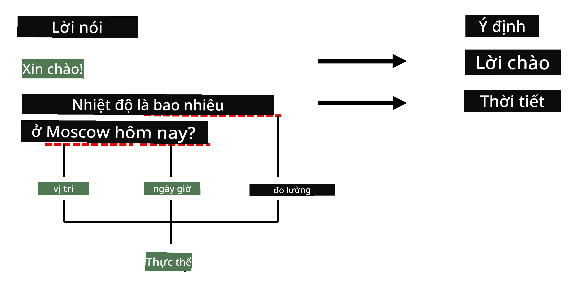

# Nhận diện Thực thể Được đặt tên

Cho đến nay, chúng ta chủ yếu tập trung vào một nhiệm vụ NLP - phân loại. Tuy nhiên, còn có nhiều nhiệm vụ NLP khác có thể được thực hiện bằng mạng nơ-ron. Một trong những nhiệm vụ đó là **[Nhận diện Thực thể Được đặt tên](https://wikipedia.org/wiki/Named-entity_recognition)** (NER), nhiệm vụ này liên quan đến việc nhận diện các thực thể cụ thể trong văn bản, chẳng hạn như địa điểm, tên người, khoảng thời gian, công thức hóa học, và nhiều hơn nữa.

## [Câu hỏi trước bài giảng](https://ff-quizzes.netlify.app/en/ai/quiz/37)

## Ví dụ về việc sử dụng NER

Giả sử bạn muốn phát triển một chatbot ngôn ngữ tự nhiên, tương tự như Amazon Alexa hoặc Google Assistant. Cách các chatbot thông minh hoạt động là *hiểu* người dùng muốn gì bằng cách thực hiện phân loại văn bản trên câu đầu vào. Kết quả của việc phân loại này là cái gọi là **ý định**, xác định chatbot nên làm gì.

> Hình ảnh của tác giả

Tuy nhiên, người dùng có thể cung cấp một số tham số như một phần của câu nói. Ví dụ, khi hỏi về thời tiết, họ có thể chỉ định địa điểm hoặc ngày. Một chatbot cần có khả năng hiểu các thực thể đó và điền vào các ô tham số tương ứng trước khi thực hiện hành động. Đây chính là nơi NER phát huy tác dụng.

> ✅ Một ví dụ khác là [phân tích các bài báo khoa học y tế](https://soshnikov.com/science/analyzing-medical-papers-with-azure-and-text-analytics-for-health/). Một trong những điều chính cần tìm kiếm là các thuật ngữ y tế cụ thể, chẳng hạn như bệnh và các chất y tế. Trong khi một số lượng nhỏ các bệnh có thể được trích xuất bằng cách tìm kiếm chuỗi con, các thực thể phức tạp hơn như hợp chất hóa học và tên thuốc cần một phương pháp phức tạp hơn.

## NER dưới dạng Phân loại Token

Các mô hình NER về cơ bản là **mô hình phân loại token**, bởi vì đối với mỗi token đầu vào, chúng ta cần quyết định liệu nó có thuộc về một thực thể hay không, và nếu có - thuộc về lớp thực thể nào.

Hãy xem xét tiêu đề bài báo sau:

**Tricuspid valve regurgitation** và **lithium carbonate** **toxicity** ở trẻ sơ sinh.

Các thực thể ở đây là:

* Tricuspid valve regurgitation là một bệnh (`DIS`)
* Lithium carbonate là một chất hóa học (`CHEM`)
* Toxicity cũng là một bệnh (`DIS`)

Lưu ý rằng một thực thể có thể bao gồm nhiều token. Và, như trong trường hợp này, chúng ta cần phân biệt giữa hai thực thể liên tiếp. Do đó, thường sử dụng hai lớp cho mỗi thực thể - một lớp chỉ định token đầu tiên của thực thể (thường sử dụng tiền tố `B-`, cho **b**ắt đầu), và lớp khác - phần tiếp theo của thực thể (`I-`, cho **i**nner token). Chúng ta cũng sử dụng `O` làm lớp để đại diện cho tất cả các token **k**hác. Việc gắn thẻ token như vậy được gọi là [gắn thẻ BIO](https://en.wikipedia.org/wiki/Inside%E2%80%93outside%E2%80%93beginning_(tagging)) (hoặc IOB). Khi được gắn thẻ, tiêu đề của chúng ta sẽ trông như sau:

Token | Tag
------|-----
Tricuspid | B-DIS
valve | I-DIS
regurgitation | I-DIS
and | O
lithium | B-CHEM
carbonate | I-CHEM
toxicity | B-DIS
in | O
a | O
newborn | O
infant | O
. | O

Vì chúng ta cần xây dựng một sự tương ứng một-một giữa các token và các lớp, chúng ta có thể huấn luyện một mô hình mạng nơ-ron **nhiều-đến-nhiều** từ hình ảnh này:

> *Hình ảnh từ [bài viết blog này](http://karpathy.github.io/2015/05/21/rnn-effectiveness/) của [Andrej Karpathy](http://karpathy.github.io/). Các mô hình phân loại token NER tương ứng với kiến trúc mạng ở phía bên phải của hình ảnh này.*

## Huấn luyện các mô hình NER

Vì một mô hình NER về cơ bản là một mô hình phân loại token, chúng ta có thể sử dụng RNN mà chúng ta đã quen thuộc để thực hiện nhiệm vụ này. Trong trường hợp này, mỗi khối của mạng hồi quy sẽ trả về ID token. Notebook ví dụ sau đây cho thấy cách huấn luyện LSTM để phân loại token.

## ✍️ Notebook Ví dụ: NER

Tiếp tục học tập của bạn trong notebook sau:

* [NER với TensorFlow](NER-TF.ipynb)

## Kết luận

Một mô hình NER là một **mô hình phân loại token**, nghĩa là nó có thể được sử dụng để thực hiện phân loại token. Đây là một nhiệm vụ rất phổ biến trong NLP, giúp nhận diện các thực thể cụ thể trong văn bản bao gồm địa điểm, tên, ngày tháng, và nhiều hơn nữa.

## 🚀 Thử thách

Hoàn thành bài tập được liên kết dưới đây để huấn luyện một mô hình nhận diện thực thể được đặt tên cho các thuật ngữ y tế, sau đó thử nghiệm nó trên một tập dữ liệu khác.

## [Câu hỏi sau bài giảng](https://ff-quizzes.netlify.app/en/ai/quiz/38)

## Ôn tập & Tự học

Đọc qua blog [Hiệu quả phi thường của Mạng Nơ-ron Hồi quy](http://karpathy.github.io/2015/05/21/rnn-effectiveness/) và theo dõi phần Đọc thêm trong bài viết đó để nâng cao kiến thức của bạn.

## [Bài tập](lab/README.md)

Trong bài tập của bài học này, bạn sẽ phải huấn luyện một mô hình nhận diện thực thể y tế. Bạn có thể bắt đầu bằng cách huấn luyện mô hình LSTM như đã mô tả trong bài học này, và tiếp tục sử dụng mô hình BERT transformer. Đọc [hướng dẫn](lab/README.md) để biết tất cả chi tiết.

---

