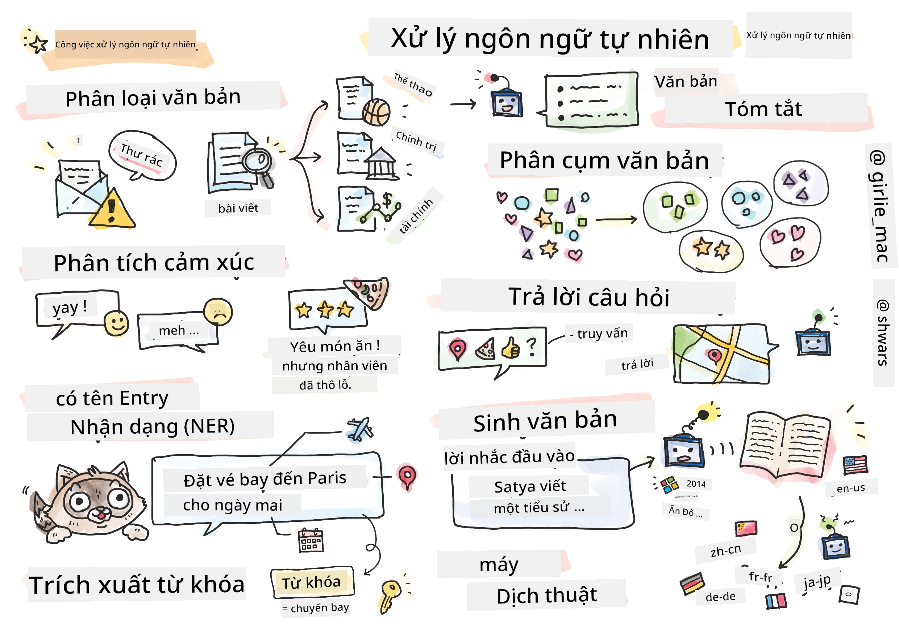

# Xử lý Ngôn ngữ Tự nhiên



Trong phần này, chúng ta sẽ tập trung vào việc sử dụng Mạng Nơ-ron để xử lý các nhiệm vụ liên quan đến **Xử lý Ngôn ngữ Tự nhiên (NLP)**. Có rất nhiều vấn đề NLP mà chúng ta muốn máy tính có thể giải quyết:

* **Phân loại văn bản** là một vấn đề phân loại điển hình liên quan đến các chuỗi văn bản. Ví dụ bao gồm phân loại email thành spam và không spam, hoặc phân loại bài viết thành các chủ đề như thể thao, kinh doanh, chính trị, v.v. Ngoài ra, khi phát triển chatbot, chúng ta thường cần hiểu người dùng muốn nói gì -- trong trường hợp này, chúng ta đang xử lý **phân loại ý định**. Thường thì, trong phân loại ý định, chúng ta cần xử lý nhiều danh mục khác nhau.
* **Phân tích cảm xúc** là một vấn đề hồi quy điển hình, nơi chúng ta cần gán một con số (cảm xúc) tương ứng với mức độ tích cực/tiêu cực của ý nghĩa câu. Một phiên bản nâng cao hơn của phân tích cảm xúc là **phân tích cảm xúc theo khía cạnh** (ABSA), nơi chúng ta gán cảm xúc không phải cho toàn bộ câu, mà cho các phần khác nhau của nó (các khía cạnh), ví dụ: *Ở nhà hàng này, tôi thích món ăn, nhưng không khí thì thật tệ*.
* **Nhận diện thực thể có tên** (NER) đề cập đến vấn đề trích xuất các thực thể nhất định từ văn bản. Ví dụ, chúng ta cần hiểu rằng trong câu *Tôi cần bay đến Paris vào ngày mai* từ *ngày mai* là DATE, và *Paris* là LOCATION.  
* **Trích xuất từ khóa** tương tự như NER, nhưng chúng ta cần tự động trích xuất các từ quan trọng đối với ý nghĩa của câu mà không cần huấn luyện trước cho các loại thực thể cụ thể.
* **Phân cụm văn bản** có thể hữu ích khi chúng ta muốn nhóm các câu tương tự lại với nhau, ví dụ, các yêu cầu tương tự trong các cuộc trò chuyện hỗ trợ kỹ thuật.
* **Trả lời câu hỏi** đề cập đến khả năng của mô hình trả lời một câu hỏi cụ thể. Mô hình nhận một đoạn văn bản và một câu hỏi làm đầu vào, và nó cần cung cấp vị trí trong văn bản nơi chứa câu trả lời cho câu hỏi (hoặc đôi khi, tạo ra văn bản câu trả lời).
* **Tạo văn bản** là khả năng của mô hình tạo ra văn bản mới. Nó có thể được xem như một nhiệm vụ phân loại dự đoán chữ/từ tiếp theo dựa trên một *gợi ý văn bản*. Các mô hình tạo văn bản tiên tiến, như GPT-3, có thể giải quyết các nhiệm vụ NLP khác như phân loại bằng cách sử dụng kỹ thuật gọi là [lập trình gợi ý](https://towardsdatascience.com/software-3-0-how-prompting-will-change-the-rules-of-the-game-a982fbfe1e0) hoặc [kỹ thuật gợi ý](https://medium.com/swlh/openai-gpt-3-and-prompt-engineering-dcdc2c5fcd29).
* **Tóm tắt văn bản** là một kỹ thuật khi chúng ta muốn máy tính "đọc" văn bản dài và tóm tắt nó trong vài câu.
* **Dịch máy** có thể được xem như sự kết hợp giữa việc hiểu văn bản ở một ngôn ngữ và tạo văn bản ở ngôn ngữ khác.

Ban đầu, hầu hết các nhiệm vụ NLP được giải quyết bằng các phương pháp truyền thống như ngữ pháp. Ví dụ, trong dịch máy, các bộ phân tích cú pháp được sử dụng để chuyển đổi câu ban đầu thành cây cú pháp, sau đó các cấu trúc ngữ nghĩa cấp cao hơn được trích xuất để đại diện cho ý nghĩa của câu, và dựa trên ý nghĩa này và ngữ pháp của ngôn ngữ đích, kết quả được tạo ra. Ngày nay, nhiều nhiệm vụ NLP được giải quyết hiệu quả hơn bằng cách sử dụng mạng nơ-ron.

> Nhiều phương pháp NLP cổ điển được triển khai trong thư viện Python [Natural Language Processing Toolkit (NLTK)](https://www.nltk.org). Có một [Sách NLTK](https://www.nltk.org/book/) tuyệt vời có sẵn trực tuyến, cung cấp cách giải quyết các nhiệm vụ NLP khác nhau bằng NLTK.

Trong khóa học của chúng ta, chúng ta sẽ chủ yếu tập trung vào việc sử dụng Mạng Nơ-ron cho NLP, và sẽ sử dụng NLTK khi cần thiết.

Chúng ta đã học về việc sử dụng mạng nơ-ron để xử lý dữ liệu dạng bảng và hình ảnh. Sự khác biệt chính giữa các loại dữ liệu đó và văn bản là văn bản là một chuỗi có độ dài thay đổi, trong khi kích thước đầu vào trong trường hợp hình ảnh được biết trước. Mặc dù mạng tích chập có thể trích xuất các mẫu từ dữ liệu đầu vào, các mẫu trong văn bản phức tạp hơn. Ví dụ, chúng ta có thể có sự phủ định được tách khỏi chủ ngữ bởi nhiều từ (ví dụ: *Tôi không thích cam*, so với *Tôi không thích những quả cam lớn, đầy màu sắc, ngon*), và điều đó vẫn cần được hiểu là một mẫu. Do đó, để xử lý ngôn ngữ, chúng ta cần giới thiệu các loại mạng nơ-ron mới, như *mạng hồi quy* và *transformers*.

## Cài đặt Thư viện

Nếu bạn đang sử dụng cài đặt Python cục bộ để chạy khóa học này, bạn có thể cần cài đặt tất cả các thư viện cần thiết cho NLP bằng các lệnh sau:

**Đối với PyTorch**
```bash
pip install -r requirements-torch.txt
```
**Đối với TensorFlow**
```bash
pip install -r requirements-tf.txt
```

> Bạn có thể thử NLP với TensorFlow trên [Microsoft Learn](https://docs.microsoft.com/learn/modules/intro-natural-language-processing-tensorflow/?WT.mc_id=academic-77998-cacaste)

## Cảnh báo GPU

Trong phần này, trong một số ví dụ, chúng ta sẽ huấn luyện các mô hình khá lớn.
* **Sử dụng Máy tính Có GPU**: Nên chạy các notebook của bạn trên một máy tính có GPU để giảm thời gian chờ khi làm việc với các mô hình lớn.
* **Hạn chế Bộ nhớ GPU**: Chạy trên GPU có thể dẫn đến tình trạng hết bộ nhớ GPU, đặc biệt khi huấn luyện các mô hình lớn.
* **Tiêu thụ Bộ nhớ GPU**: Lượng bộ nhớ GPU tiêu thụ trong quá trình huấn luyện phụ thuộc vào nhiều yếu tố, bao gồm kích thước minibatch.
* **Giảm Kích thước Minibatch**: Nếu bạn gặp vấn đề về bộ nhớ GPU, hãy cân nhắc giảm kích thước minibatch trong mã của bạn như một giải pháp tiềm năng.
* **Giải phóng Bộ nhớ GPU của TensorFlow**: Các phiên bản cũ của TensorFlow có thể không giải phóng bộ nhớ GPU đúng cách khi huấn luyện nhiều mô hình trong một kernel Python. Để quản lý việc sử dụng bộ nhớ GPU hiệu quả, bạn có thể cấu hình TensorFlow để chỉ phân bổ bộ nhớ GPU khi cần thiết.
* **Bao gồm Mã**: Để thiết lập TensorFlow chỉ phân bổ bộ nhớ GPU khi cần, hãy thêm mã sau vào các notebook của bạn:

```python
physical_devices = tf.config.list_physical_devices('GPU') 
if len(physical_devices)>0:
    tf.config.experimental.set_memory_growth(physical_devices[0], True) 
```

Nếu bạn quan tâm đến việc học về NLP từ góc độ ML cổ điển, hãy truy cập [bộ bài học này](https://github.com/microsoft/ML-For-Beginners/tree/main/6-NLP).

## Trong Phần này
Trong phần này, chúng ta sẽ học về:

* [Biểu diễn văn bản dưới dạng tensor](13-TextRep/README.md)
* [Word Embeddings](14-Emdeddings/README.md)
* [Mô hình ngôn ngữ](15-LanguageModeling/README.md)
* [Mạng Nơ-ron Hồi quy](16-RNN/README.md)
* [Mạng Tạo sinh](17-GenerativeNetworks/README.md)
* [Transformers](18-Transformers/README.md)

---

**Tuyên bố miễn trừ trách nhiệm**:  
Tài liệu này đã được dịch bằng dịch vụ dịch thuật AI [Co-op Translator](https://github.com/Azure/co-op-translator). Mặc dù chúng tôi cố gắng đảm bảo độ chính xác, xin lưu ý rằng các bản dịch tự động có thể chứa lỗi hoặc không chính xác. Tài liệu gốc bằng ngôn ngữ bản địa nên được coi là nguồn thông tin chính thức. Đối với các thông tin quan trọng, khuyến nghị sử dụng dịch vụ dịch thuật chuyên nghiệp từ con người. Chúng tôi không chịu trách nhiệm cho bất kỳ sự hiểu lầm hoặc diễn giải sai nào phát sinh từ việc sử dụng bản dịch này.