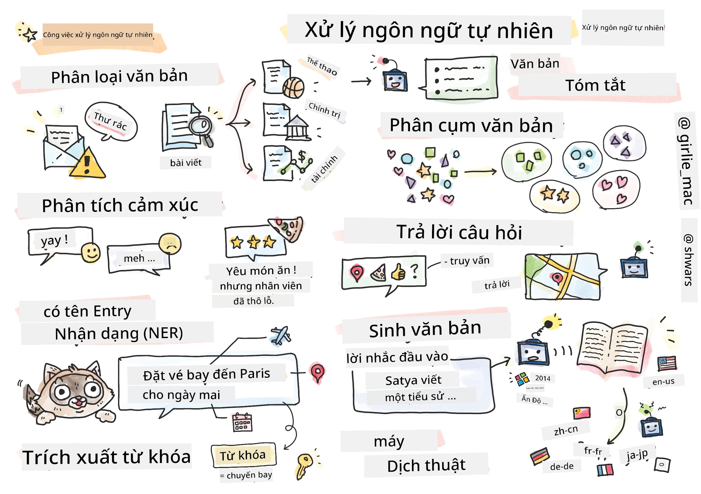

# Xử lý Ngôn ngữ Tự nhiên



Trong phần này, chúng ta sẽ tập trung vào việc sử dụng Mạng Nơ-ron để xử lý các nhiệm vụ liên quan đến **Xử lý Ngôn ngữ Tự nhiên (NLP)**. Có nhiều vấn đề NLP mà chúng ta muốn máy tính có thể giải quyết:

* **Phân loại văn bản** là một bài toán phân loại điển hình liên quan đến các chuỗi văn bản. Ví dụ bao gồm phân loại email thành spam hoặc không spam, hoặc phân loại các bài viết thành thể thao, kinh doanh, chính trị, v.v. Ngoài ra, khi phát triển chatbot, chúng ta thường cần hiểu người dùng muốn nói gì — trong trường hợp này chúng ta xử lý **phân loại ý định**. Thường thì, trong phân loại ý định chúng ta cần xử lý nhiều loại khác nhau.
* **Phân tích đánh giá cảm xúc** là một bài toán hồi quy điển hình, trong đó chúng ta cần gán một số (một điểm cảm xúc) tương ứng với mức độ tích cực/tiêu cực của ý nghĩa câu. Phiên bản nâng cao hơn của phân tích cảm xúc là **phân tích cảm xúc dựa trên khía cạnh** (ABSA), trong đó chúng ta gán cảm xúc không phải cho toàn bộ câu mà cho các phần khác nhau của nó (các khía cạnh), ví dụ *Ở nhà hàng này, tôi thích ẩm thực, nhưng không khí lại tồi tệ*.
* **Nhận diện Thực thể Có tên** (NER) đề cập đến bài toán trích xuất các thực thể nhất định từ văn bản. Ví dụ, chúng ta có thể cần hiểu rằng trong câu *Tôi cần bay đến Paris vào ngày mai* thì từ *ngày mai* đề cập đến NGÀY THÁNG, và *Paris* là một ĐỊA ĐIỂM.  
* **Trích xuất từ khóa** tương tự như NER, nhưng chúng ta cần trích xuất tự động các từ quan trọng với ý nghĩa của câu, không sử dụng đào tạo trước cho các loại thực thể cụ thể.
* **Phân cụm văn bản** có thể hữu ích khi chúng ta muốn nhóm các câu tương tự lại với nhau, ví dụ như các yêu cầu giống nhau trong cuộc trò chuyện hỗ trợ kỹ thuật.
* **Trả lời câu hỏi** đề cập đến khả năng của mô hình trả lời một câu hỏi cụ thể. Mô hình nhận đầu vào là đoạn văn bản và câu hỏi, và cần cung cấp vị trí trong văn bản chứa câu trả lời cho câu hỏi (hoặc, đôi khi, tạo ra văn bản câu trả lời).
* **Tạo văn bản** là khả năng của mô hình tạo ra văn bản mới. Nó có thể được coi là bài toán phân loại dự đoán ký tự/từ tiếp theo dựa trên một *đoạn kích thích văn bản*. Các mô hình tạo văn bản tiên tiến, như GPT-3, có thể giải các nhiệm vụ NLP khác như phân loại bằng kỹ thuật gọi là [lập trình kích thích](https://towardsdatascience.com/software-3-0-how-prompting-will-change-the-rules-of-the-game-a982fbfe1e0) hoặc [kỹ thuật kích thích](https://medium.com/swlh/openai-gpt-3-and-prompt-engineering-dcdc2c5fcd29)
* **Tóm tắt văn bản** là kỹ thuật khi bạn muốn máy tính "đọc" văn bản dài và tóm tắt nó trong vài câu.
* **Dịch máy** có thể được xem như sự kết hợp của việc hiểu văn bản trong một ngôn ngữ, và tạo văn bản trong một ngôn ngữ khác.

Ban đầu, hầu hết các nhiệm vụ NLP được giải quyết bằng các phương pháp truyền thống như ngữ pháp. Ví dụ, trong dịch máy người ta dùng bộ phân tích cú pháp để chuyển câu ban đầu thành cây cú pháp, rồi trích xuất các cấu trúc ngữ nghĩa cấp cao hơn để biểu diễn ý nghĩa câu, và dựa trên ý nghĩa này và ngữ pháp ngôn ngữ đích kết quả được tạo ra. Ngày nay, nhiều nhiệm vụ NLP được giải quyết hiệu quả hơn bằng cách sử dụng mạng nơ-ron.

> Nhiều phương pháp NLP cổ điển được cài đặt trong thư viện Python [Natural Language Processing Toolkit (NLTK)](https://www.nltk.org). Có một cuốn [Sách NLTK](https://www.nltk.org/book/) tuyệt vời trực tuyến hướng dẫn cách giải quyết các nhiệm vụ NLP khác nhau bằng NLTK.

Trong khóa học này, chúng ta sẽ chủ yếu tập trung vào việc sử dụng Mạng Nơ-ron cho NLP, và sử dụng NLTK khi cần.

Chúng ta đã học về việc sử dụng mạng nơ-ron để xử lý dữ liệu bảng và hình ảnh. Sự khác biệt chính giữa các loại dữ liệu đó và văn bản là văn bản là một chuỗi có độ dài thay đổi, trong khi kích thước đầu vào trong trường hợp hình ảnh đã biết trước. Trong khi mạng tích chập có thể trích xuất mẫu từ dữ liệu đầu vào, các mẫu trong văn bản phức tạp hơn. Ví dụ, chúng ta có thể có sự phủ định tách rời ra khỏi chủ ngữ với khoảng cách bất kỳ bao nhiêu từ (ví dụ *Tôi không thích cam*, vs. *Tôi không thích những quả cam to nhiều màu sắc và ngon*), và điều đó vẫn phải được hiểu là một mẫu duy nhất. Do đó, để xử lý ngôn ngữ chúng ta cần giới thiệu các loại mạng nơ-ron mới, như *mạng hồi tiếp* và *transformers*.

## Cài đặt Thư viện

Nếu bạn sử dụng cài đặt Python cục bộ để chạy khóa học này, bạn có thể cần cài đặt tất cả các thư viện cần thiết cho NLP bằng các lệnh sau:

**Dành cho PyTorch**
```bash
pip install -r requirements-pytorch.txt
```
**Dành cho TensorFlow**
```bash
pip install -r requirements-tf.txt
```

> Bạn có thể thử NLP với TensorFlow trên [Microsoft Learn](https://docs.microsoft.com/learn/modules/intro-natural-language-processing-tensorflow/?WT.mc_id=academic-77998-cacaste)

## Cảnh báo GPU

Trong phần này, trong một số ví dụ chúng ta sẽ huấn luyện các mô hình khá lớn.
* **Sử dụng máy tính có GPU**: Nên chạy notebook của bạn trên máy tính có GPU để giảm thời gian chờ khi làm việc với các mô hình lớn.
* **Hạn chế bộ nhớ GPU**: Chạy trên GPU có thể dẫn đến tình trạng hết bộ nhớ GPU, đặc biệt khi huấn luyện các mô hình lớn.
* **Tiêu thụ bộ nhớ GPU**: Lượng bộ nhớ GPU sử dụng trong quá trình huấn luyện phụ thuộc vào nhiều yếu tố, bao gồm kích thước minibatch.
* **Giảm kích thước Minibatch**: Nếu gặp vấn đề về bộ nhớ GPU, hãy cân nhắc giảm kích thước minibatch trong code của bạn như một giải pháp tiềm năng.
* **Giải phóng bộ nhớ GPU của TensorFlow**: Các phiên bản TensorFlow cũ có thể không giải phóng bộ nhớ GPU đúng cách khi huấn luyện nhiều mô hình trong một kernel Python. Để quản lý hiệu quả bộ nhớ GPU, bạn có thể cấu hình TensorFlow để cấp phát bộ nhớ GPU chỉ khi cần.
* **Bao gồm mã code**: Để đặt TensorFlow chỉ tăng bộ nhớ GPU khi cần, hãy bao gồm đoạn mã sau trong notebook của bạn:

```python
physical_devices = tf.config.list_physical_devices('GPU') 
if len(physical_devices)>0:
    tf.config.experimental.set_memory_growth(physical_devices[0], True) 
```

Nếu bạn quan tâm đến việc học NLP từ góc nhìn ML cổ điển, hãy truy cập [bộ bài học này](https://github.com/microsoft/ML-For-Beginners/tree/main/6-NLP)

## Trong Phần này
Trong phần này chúng ta sẽ học về:

* [Biểu diễn văn bản dưới dạng tensor](13-TextRep/README.md)
* [Word Embeddings](14-Embeddings/README.md)
* [Mô hình Ngôn ngữ](15-LanguageModeling/README.md)
* [Mạng Nơ-ron Hồi tiếp](16-RNN/README.md)
* [Mạng Sinh tạo](17-GenerativeNetworks/README.md)
* [Transformers](18-Transformers/README.md)

---

<!-- CO-OP TRANSLATOR DISCLAIMER START -->
**Tuyên bố miễn trừ trách nhiệm**:
Tài liệu này đã được dịch bằng dịch vụ dịch thuật AI [Co-op Translator](https://github.com/Azure/co-op-translator). Mặc dù chúng tôi cố gắng đảm bảo độ chính xác, xin lưu ý rằng bản dịch tự động có thể chứa lỗi hoặc sai sót. Tài liệu gốc bằng ngôn ngữ gốc nên được coi là nguồn tin chính thức. Đối với thông tin quan trọng, nên sử dụng dịch vụ dịch thuật chuyên nghiệp bởi con người. Chúng tôi không chịu trách nhiệm về bất kỳ hiểu lầm hoặc giải thích sai nào phát sinh từ việc sử dụng bản dịch này.
<!-- CO-OP TRANSLATOR DISCLAIMER END -->