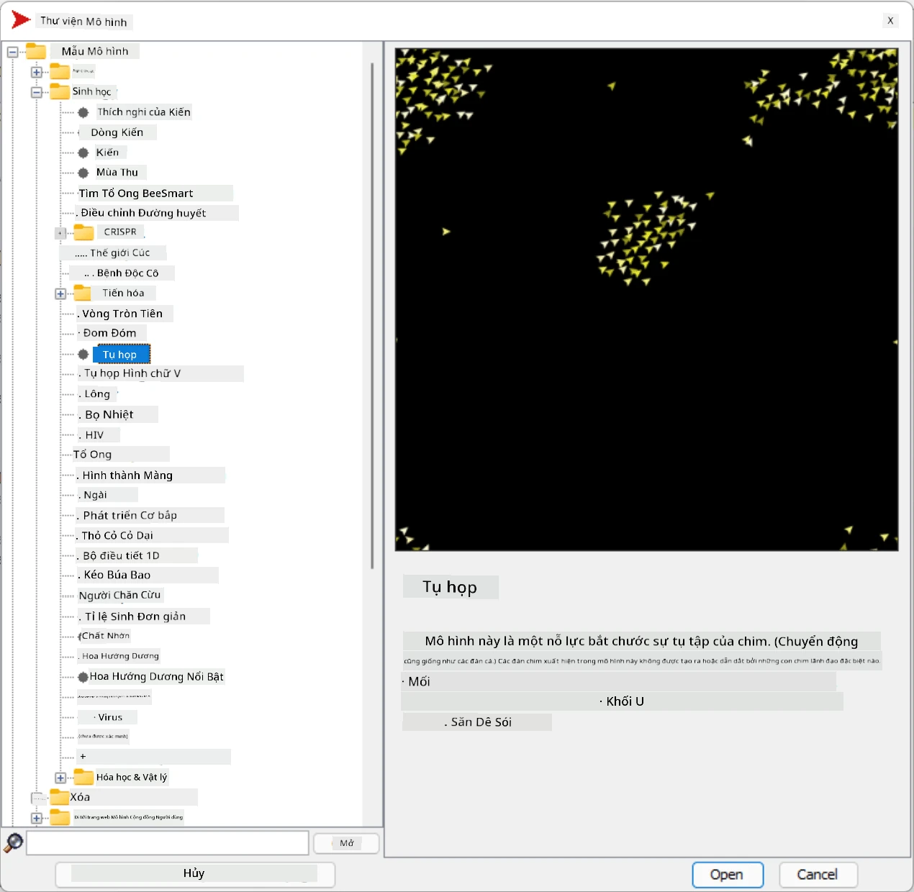
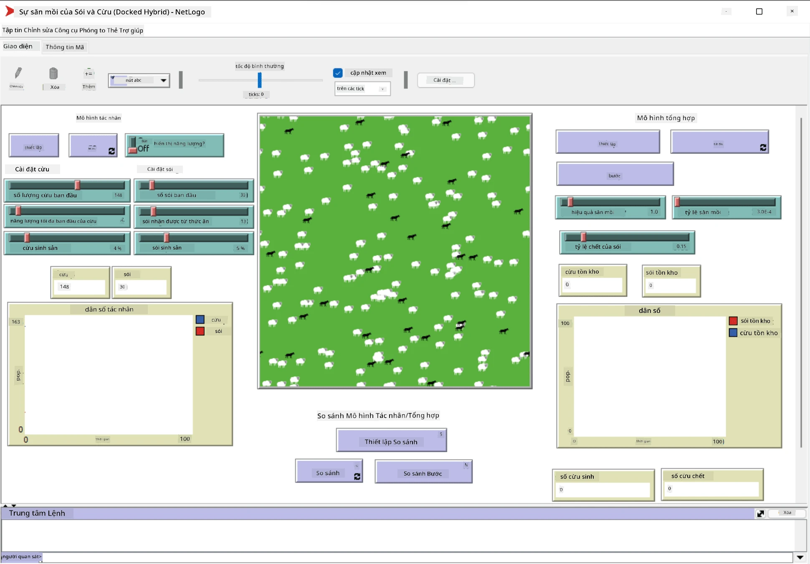

# Hệ Thống Đa Tác Nhân

Một trong những cách để đạt được trí tuệ là phương pháp **nổi bật** (hoặc **tương hỗ**), dựa trên thực tế rằng hành vi kết hợp của nhiều tác nhân tương đối đơn giản có thể dẫn đến hành vi tổng thể phức tạp hơn (hoặc thông minh hơn) của hệ thống nói chung. Về lý thuyết, điều này dựa trên các nguyên tắc của [Trí tuệ Tập thể](https://en.wikipedia.org/wiki/Collective_intelligence), [Thuyết Nổi bật](https://en.wikipedia.org/wiki/Global_brain) và [Điều khiển học Tiến hóa](https://en.wikipedia.org/wiki/Global_brain), cho rằng các hệ thống cấp cao hơn đạt được một giá trị gia tăng nào đó khi được kết hợp đúng cách từ các hệ thống cấp thấp hơn (còn gọi là *nguyên tắc chuyển đổi siêu hệ thống*).

## [Câu hỏi trước bài giảng](https://ff-quizzes.netlify.app/en/ai/quiz/45)

Hướng đi của **Hệ Thống Đa Tác Nhân** đã xuất hiện trong AI vào những năm 1990 như một phản ứng trước sự phát triển của Internet và các hệ thống phân tán. Một trong những sách giáo khoa AI kinh điển, [Artificial Intelligence: A Modern Approach](https://en.wikipedia.org/wiki/Artificial_Intelligence:_A_Modern_Approach), tập trung vào góc nhìn của AI cổ điển từ quan điểm của các hệ thống đa tác nhân.

Trung tâm của cách tiếp cận đa tác nhân là khái niệm **Tác Nhân** - một thực thể sống trong một **môi trường**, mà nó có thể nhận thức và tác động lên. Đây là một định nghĩa rất rộng, và có thể có nhiều loại và phân loại tác nhân khác nhau:

* Theo khả năng suy luận:
   - **Tác nhân phản ứng** thường có hành vi kiểu yêu cầu-phản hồi đơn giản
   - **Tác nhân suy nghĩ** sử dụng một số loại suy luận logic và/hoặc khả năng lập kế hoạch
* Theo nơi tác nhân thực thi mã của nó:
   - **Tác nhân tĩnh** hoạt động trên một nút mạng chuyên dụng
   - **Tác nhân di động** có thể di chuyển mã của mình giữa các nút mạng
* Theo hành vi của chúng:
   - **Tác nhân thụ động** không có mục tiêu cụ thể. Những tác nhân này có thể phản ứng với các kích thích bên ngoài, nhưng sẽ không tự khởi xướng bất kỳ hành động nào.
   - **Tác nhân chủ động** có một số mục tiêu mà chúng theo đuổi
   - **Tác nhân nhận thức** liên quan đến lập kế hoạch và suy luận phức tạp

Hiện nay, các hệ thống đa tác nhân được sử dụng trong nhiều ứng dụng:

* Trong trò chơi, nhiều nhân vật không phải người chơi sử dụng một số loại AI và có thể được coi là các tác nhân thông minh
* Trong sản xuất video, việc dựng các cảnh 3D phức tạp có đám đông thường được thực hiện bằng cách mô phỏng đa tác nhân
* Trong mô hình hóa hệ thống, cách tiếp cận đa tác nhân được sử dụng để mô phỏng hành vi của một mô hình phức tạp. Ví dụ, cách tiếp cận đa tác nhân đã được sử dụng thành công để dự đoán sự lây lan của bệnh COVID-19 trên toàn thế giới. Cách tiếp cận tương tự có thể được sử dụng để mô hình hóa giao thông trong thành phố và xem nó phản ứng như thế nào với các thay đổi trong quy tắc giao thông.
* Trong các hệ thống tự động hóa phức tạp, mỗi thiết bị có thể hoạt động như một tác nhân độc lập, điều này làm cho toàn bộ hệ thống ít đơn lẻ hơn và mạnh mẽ hơn.

Chúng ta sẽ không dành nhiều thời gian để đi sâu vào các hệ thống đa tác nhân, nhưng hãy xem xét một ví dụ về **Mô Hình Đa Tác Nhân**.

## NetLogo

[NetLogo](https://ccl.northwestern.edu/netlogo/) là một môi trường mô hình hóa đa tác nhân dựa trên phiên bản sửa đổi của ngôn ngữ lập trình [Logo](https://en.wikipedia.org/wiki/Logo_(programming_language)). Ngôn ngữ này được phát triển để dạy các khái niệm lập trình cho trẻ em, và nó cho phép bạn điều khiển một tác nhân gọi là **rùa**, có thể di chuyển và để lại dấu vết phía sau. Điều này cho phép tạo ra các hình học phức tạp, là một cách rất trực quan để hiểu hành vi của một tác nhân.

Trong NetLogo, chúng ta có thể tạo nhiều rùa bằng cách sử dụng lệnh `create-turtles`. Sau đó, chúng ta có thể ra lệnh cho tất cả các rùa thực hiện một số hành động (trong ví dụ dưới đây - di chuyển 10 điểm về phía trước):

```
create-turtles 10
ask turtles [
  forward 10
]
```

Tất nhiên, sẽ không thú vị nếu tất cả các rùa làm cùng một việc, vì vậy chúng ta có thể `ask` các nhóm rùa, ví dụ như những con ở gần một điểm nhất định. Chúng ta cũng có thể tạo các rùa thuộc các *giống* khác nhau bằng cách sử dụng lệnh `breed [cats cat]`. Ở đây `cat` là tên của một giống, và chúng ta cần chỉ định cả từ số ít và số nhiều, vì các lệnh khác nhau sử dụng các dạng khác nhau để rõ ràng.

> ✅ Chúng ta sẽ không đi sâu vào việc học ngôn ngữ NetLogo - bạn có thể truy cập tài nguyên tuyệt vời [Beginner's Interactive NetLogo Dictionary](https://ccl.northwestern.edu/netlogo/bind/) nếu bạn muốn tìm hiểu thêm.

Bạn có thể [tải xuống](https://ccl.northwestern.edu/netlogo/download.shtml) và cài đặt NetLogo để thử nghiệm.

### Thư viện Mô Hình

Một điều tuyệt vời về NetLogo là nó chứa một thư viện các mô hình hoạt động mà bạn có thể thử. Đi tới **File &rightarrow; Models Library**, và bạn có nhiều danh mục mô hình để lựa chọn.



> Ảnh chụp màn hình thư viện mô hình của Dmitry Soshnikov

Bạn có thể mở một trong các mô hình, ví dụ **Biology &rightarrow; Flocking**.

### Nguyên tắc chính

Sau khi mở mô hình, bạn sẽ được đưa đến màn hình chính của NetLogo. Đây là một mô hình mẫu mô tả dân số của sói và cừu, với các tài nguyên hữu hạn (cỏ).



> Ảnh chụp màn hình của Dmitry Soshnikov

Trên màn hình này, bạn có thể thấy:

* Phần **Interface** chứa:
  - Trường chính, nơi tất cả các tác nhân sống
  - Các điều khiển khác nhau: nút, thanh trượt, v.v.
  - Các biểu đồ mà bạn có thể sử dụng để hiển thị các tham số của mô phỏng
* Tab **Code** chứa trình chỉnh sửa, nơi bạn có thể nhập chương trình NetLogo

Trong hầu hết các trường hợp, giao diện sẽ có nút **Setup**, nút này khởi tạo trạng thái mô phỏng, và nút **Go** bắt đầu thực thi. Những nút này được xử lý bởi các trình xử lý tương ứng trong mã như sau:

```
to go [
...
]
```

Thế giới của NetLogo bao gồm các đối tượng sau:

* **Tác nhân** (rùa) có thể di chuyển trên trường và làm điều gì đó. Bạn ra lệnh cho các tác nhân bằng cách sử dụng cú pháp `ask turtles [...]`, và mã trong dấu ngoặc được thực thi bởi tất cả các tác nhân trong *chế độ rùa*.
* **Miếng vá** là các khu vực vuông của trường, nơi các tác nhân sống. Bạn có thể tham chiếu đến tất cả các tác nhân trên cùng một miếng vá, hoặc bạn có thể thay đổi màu sắc và một số thuộc tính khác của miếng vá. Bạn cũng có thể `ask patches` để làm điều gì đó.
* **Người quan sát** là một tác nhân duy nhất kiểm soát thế giới. Tất cả các trình xử lý nút được thực thi trong *chế độ người quan sát*.

> ✅ Vẻ đẹp của môi trường đa tác nhân là mã chạy trong chế độ rùa hoặc chế độ miếng vá được thực thi đồng thời bởi tất cả các tác nhân. Do đó, bằng cách viết một chút mã và lập trình hành vi của từng tác nhân, bạn có thể tạo ra hành vi phức tạp của hệ thống mô phỏng nói chung.

### Flocking

Là một ví dụ về hành vi đa tác nhân, hãy xem xét **[Flocking](https://en.wikipedia.org/wiki/Flocking_(behavior))**. Flocking là một mẫu phức tạp rất giống với cách các đàn chim bay. Khi quan sát chúng bay, bạn có thể nghĩ rằng chúng tuân theo một loại thuật toán tập thể nào đó, hoặc rằng chúng sở hữu một dạng *trí tuệ tập thể*. Tuy nhiên, hành vi phức tạp này xuất hiện khi mỗi tác nhân cá nhân (trong trường hợp này, một *con chim*) chỉ quan sát một số tác nhân khác trong khoảng cách ngắn từ nó, và tuân theo ba quy tắc đơn giản:

* **Căn chỉnh** - nó điều chỉnh hướng về phía trung bình của các tác nhân lân cận
* **Kết hợp** - nó cố gắng điều chỉnh hướng về vị trí trung bình của các tác nhân lân cận (*hấp dẫn tầm xa*)
* **Tách biệt** - khi đến quá gần các con chim khác, nó cố gắng di chuyển ra xa (*đẩy lùi tầm ngắn*)

Bạn có thể chạy ví dụ flocking và quan sát hành vi. Bạn cũng có thể điều chỉnh các tham số, chẳng hạn như *mức độ tách biệt*, hoặc *phạm vi quan sát*, xác định khoảng cách mà mỗi con chim có thể nhìn thấy. Lưu ý rằng nếu bạn giảm phạm vi quan sát xuống 0, tất cả các con chim trở nên mù và flocking dừng lại. Nếu bạn giảm tách biệt xuống 0, tất cả các con chim tụ tập thành một đường thẳng.

> ✅ Chuyển sang tab **Code** và xem nơi ba quy tắc của flocking (căn chỉnh, kết hợp và tách biệt) được triển khai trong mã. Lưu ý cách chúng ta chỉ tham chiếu đến các tác nhân trong tầm nhìn.

### Các mô hình khác để xem

Có một vài mô hình thú vị khác mà bạn có thể thử nghiệm:

* **Art &rightarrow; Fireworks** cho thấy cách một pháo hoa có thể được coi là hành vi tập thể của các luồng lửa cá nhân
* **Social Science &rightarrow; Traffic Basic** và **Social Science &rightarrow; Traffic Grid** hiển thị mô hình giao thông thành phố trong lưới 1D và 2D với hoặc không có đèn giao thông. Mỗi chiếc xe trong mô phỏng tuân theo các quy tắc sau:
   - Nếu không gian phía trước trống - tăng tốc (đến một tốc độ tối đa nhất định)
   - Nếu nó thấy chướng ngại vật phía trước - phanh (và bạn có thể điều chỉnh khoảng cách mà người lái xe có thể nhìn thấy)
* **Social Science &rightarrow; Party** cho thấy cách mọi người tụ tập trong một bữa tiệc cocktail. Bạn có thể tìm thấy sự kết hợp các tham số dẫn đến sự gia tăng hạnh phúc nhanh nhất của nhóm.

Như bạn có thể thấy từ các ví dụ này, mô phỏng đa tác nhân có thể là một cách hữu ích để hiểu hành vi của một hệ thống phức tạp bao gồm các cá nhân tuân theo cùng hoặc logic tương tự. Nó cũng có thể được sử dụng để điều khiển các tác nhân ảo, chẳng hạn như [NPCs](https://en.wikipedia.org/wiki/NPC) trong trò chơi máy tính, hoặc các tác nhân trong thế giới 3D được hoạt hình.

## Tác Nhân Suy Nghĩ

Các tác nhân được mô tả ở trên rất đơn giản, phản ứng với các thay đổi trong môi trường bằng cách sử dụng một số loại thuật toán. Vì vậy, chúng là **tác nhân phản ứng**. Tuy nhiên, đôi khi các tác nhân có thể suy luận và lập kế hoạch hành động của mình, trong trường hợp đó chúng được gọi là **tác nhân suy nghĩ**.

Một ví dụ điển hình sẽ là một tác nhân cá nhân nhận được hướng dẫn từ con người để đặt một chuyến du lịch nghỉ dưỡng. Giả sử rằng có nhiều tác nhân sống trên internet, có thể giúp nó. Nó sẽ cần liên hệ với các tác nhân khác để xem các chuyến bay nào có sẵn, giá khách sạn cho các ngày khác nhau, và cố gắng thương lượng giá tốt nhất. Khi kế hoạch nghỉ dưỡng hoàn tất và được chủ sở hữu xác nhận, nó có thể tiến hành đặt chỗ.

Để làm được điều đó, các tác nhân cần phải **giao tiếp**. Để giao tiếp thành công, chúng cần:

* Một số **ngôn ngữ tiêu chuẩn để trao đổi kiến thức**, chẳng hạn như [Knowledge Interchange Format](https://en.wikipedia.org/wiki/Knowledge_Interchange_Format) (KIF) và [Knowledge Query and Manipulation Language](https://en.wikipedia.org/wiki/Knowledge_Query_and_Manipulation_Language) (KQML). Những ngôn ngữ này được thiết kế dựa trên [Lý thuyết Hành động Ngôn ngữ](https://en.wikipedia.org/wiki/Speech_act).
* Những ngôn ngữ này cũng nên bao gồm một số **giao thức để thương lượng**, dựa trên các loại **đấu giá** khác nhau.
* Một **ontology chung** để sử dụng, để chúng tham chiếu đến các khái niệm giống nhau và hiểu ý nghĩa của chúng
* Một cách để **phát hiện** những gì các tác nhân khác có thể làm, cũng dựa trên một loại ontology nào đó

Tác nhân suy nghĩ phức tạp hơn nhiều so với tác nhân phản ứng, vì chúng không chỉ phản ứng với các thay đổi trong môi trường, mà còn phải có khả năng *khởi xướng* hành động. Một trong những kiến trúc được đề xuất cho các tác nhân suy nghĩ là tác nhân Niềm Tin-Mong Muốn-Ý Định (BDI):

* **Niềm tin** tạo thành một tập hợp kiến thức về môi trường của tác nhân. Nó có thể được cấu trúc như một cơ sở kiến thức hoặc tập hợp các quy tắc mà tác nhân có thể áp dụng cho một tình huống cụ thể trong môi trường.
* **Mong muốn** xác định những gì tác nhân muốn làm, tức là mục tiêu của nó. Ví dụ, mục tiêu của tác nhân trợ lý cá nhân ở trên là đặt một chuyến du lịch, và mục tiêu của tác nhân khách sạn là tối đa hóa lợi nhuận.
* **Ý định** là các hành động cụ thể mà tác nhân lập kế hoạch để đạt được mục tiêu của mình. Các hành động thường thay đổi môi trường và gây ra giao tiếp với các tác nhân khác.

Có một số nền tảng có sẵn để xây dựng hệ thống đa tác nhân, chẳng hạn như [JADE](https://jade.tilab.com/). [Bài báo này](https://arxiv.org/ftp/arxiv/papers/2007/2007.08961.pdf) chứa một đánh giá về các nền tảng đa tác nhân, cùng với lịch sử ngắn gọn về các hệ thống đa tác nhân và các kịch bản sử dụng khác nhau của chúng.

## Kết luận

Hệ thống đa tác nhân có thể có nhiều hình thức khác nhau và được sử dụng trong nhiều ứng dụng khác nhau. 
Chúng đều tập trung vào hành vi đơn giản của từng tác nhân, và đạt được hành vi phức tạp hơn của hệ thống tổng thể nhờ **hiệu ứng tương hỗ**.

## 🚀 Thử thách

Đưa bài học này vào thực tế và thử hình dung một hệ thống đa tác nhân có thể giải quyết một vấn đề. Ví dụ, hệ thống đa tác nhân cần làm gì để tối ưu hóa tuyến đường xe buýt trường học? Nó có thể hoạt động như thế nào trong một tiệm bánh?

## [Câu hỏi sau bài giảng](https://ff-quizzes.netlify.app/en/ai/quiz/46)

## Ôn tập & Tự học

Ôn tập việc sử dụng loại hệ thống này trong ngành công nghiệp. Chọn một lĩnh vực như sản xuất hoặc ngành công nghiệp trò chơi điện tử và khám phá cách các hệ thống đa tác nhân có thể được sử dụng để giải quyết các vấn đề độc đáo.

## [Bài tập NetLogo](assignment.md)

---

