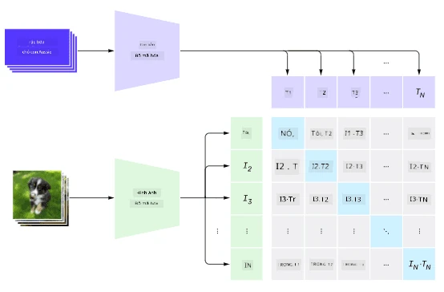
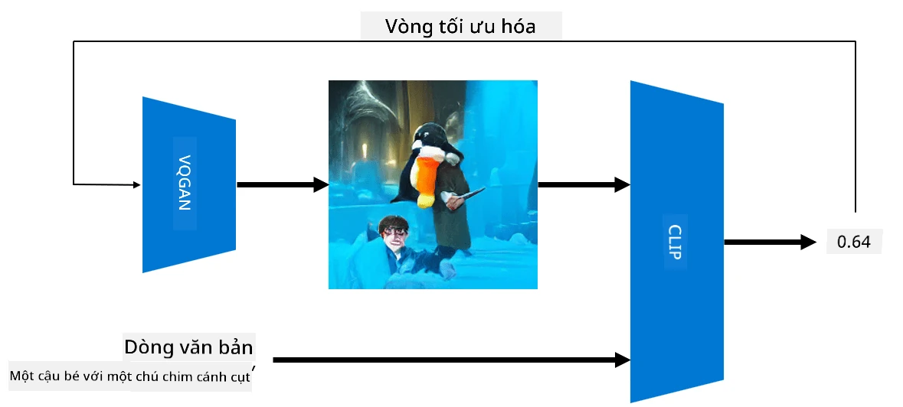

# Mạng Đa Phương Thức

Sau thành công của các mô hình transformer trong việc giải quyết các nhiệm vụ NLP, các kiến trúc tương tự đã được áp dụng cho các nhiệm vụ thị giác máy tính. Ngày càng có nhiều sự quan tâm đến việc xây dựng các mô hình có thể *kết hợp* khả năng xử lý hình ảnh và ngôn ngữ tự nhiên. Một trong những nỗ lực đó được thực hiện bởi OpenAI, được gọi là CLIP và DALL.E.

## Huấn luyện Hình ảnh Đối lập (CLIP)

Ý tưởng chính của CLIP là có thể so sánh các gợi ý văn bản với một hình ảnh và xác định mức độ phù hợp của hình ảnh với gợi ý đó.

> *Hình ảnh từ [bài viết blog này](https://openai.com/blog/clip/)*

Mô hình được huấn luyện trên các hình ảnh thu thập từ Internet và các chú thích của chúng. Với mỗi batch, chúng ta lấy N cặp (hình ảnh, văn bản) và chuyển đổi chúng thành các biểu diễn vector I, ..., T. Những biểu diễn này sau đó được ghép nối với nhau. Hàm mất mát được định nghĩa để tối đa hóa độ tương đồng cosine giữa các vector tương ứng với một cặp (ví dụ: I và T), và giảm thiểu độ tương đồng cosine giữa tất cả các cặp khác. Đây là lý do tại sao phương pháp này được gọi là **đối lập**.

Thư viện/mô hình CLIP có sẵn tại [GitHub của OpenAI](https://github.com/openai/CLIP). Phương pháp này được mô tả trong [bài viết blog này](https://openai.com/blog/clip/) và chi tiết hơn trong [bài báo này](https://arxiv.org/pdf/2103.00020.pdf).

Khi mô hình này đã được huấn luyện trước, chúng ta có thể cung cấp cho nó một batch hình ảnh và một batch gợi ý văn bản, và nó sẽ trả về tensor với các xác suất. CLIP có thể được sử dụng cho một số nhiệm vụ:

**Phân loại Hình ảnh**

Giả sử chúng ta cần phân loại hình ảnh giữa, ví dụ, mèo, chó và con người. Trong trường hợp này, chúng ta có thể cung cấp cho mô hình một hình ảnh và một loạt các gợi ý văn bản: "*một bức ảnh của một con mèo*", "*một bức ảnh của một con chó*", "*một bức ảnh của một con người*". Trong vector kết quả gồm 3 xác suất, chúng ta chỉ cần chọn chỉ số có giá trị cao nhất.

> *Hình ảnh từ [bài viết blog này](https://openai.com/blog/clip/)*

**Tìm kiếm Hình ảnh Dựa trên Văn Bản**

Chúng ta cũng có thể làm ngược lại. Nếu chúng ta có một tập hợp hình ảnh, chúng ta có thể đưa tập hợp này vào mô hình và một gợi ý văn bản - điều này sẽ trả về hình ảnh giống nhất với gợi ý đã cho.

## ✍️ Ví dụ: [Sử dụng CLIP cho Phân loại Hình ảnh và Tìm kiếm Hình ảnh](Clip.ipynb)

Mở notebook [Clip.ipynb](Clip.ipynb) để xem CLIP hoạt động.

## Tạo Hình ảnh với VQGAN+CLIP

CLIP cũng có thể được sử dụng để **tạo hình ảnh** từ một gợi ý văn bản. Để làm điều này, chúng ta cần một **mô hình tạo hình ảnh** có khả năng tạo ra hình ảnh dựa trên một vector đầu vào. Một trong những mô hình như vậy được gọi là [VQGAN](https://compvis.github.io/taming-transformers/) (Vector-Quantized GAN).

Những ý tưởng chính của VQGAN khác biệt so với [GAN](../../4-ComputerVision/10-GANs/README.md) thông thường bao gồm:
* Sử dụng kiến trúc transformer tự hồi quy để tạo ra một chuỗi các phần hình ảnh giàu ngữ cảnh tạo thành hình ảnh. Những phần hình ảnh này được học bởi [CNN](../../4-ComputerVision/07-ConvNets/README.md).
* Sử dụng bộ phân biệt hình ảnh con để phát hiện liệu các phần của hình ảnh là "thật" hay "giả" (khác với cách tiếp cận "tất cả hoặc không có gì" trong GAN truyền thống).

Tìm hiểu thêm về VQGAN tại trang web [Taming Transformers](https://compvis.github.io/taming-transformers/).

Một trong những khác biệt quan trọng giữa VQGAN và GAN truyền thống là GAN truyền thống có thể tạo ra một hình ảnh khá tốt từ bất kỳ vector đầu vào nào, trong khi VQGAN có thể tạo ra một hình ảnh không nhất quán. Do đó, chúng ta cần hướng dẫn thêm quá trình tạo hình ảnh, và điều này có thể được thực hiện bằng cách sử dụng CLIP.

Để tạo ra một hình ảnh tương ứng với một gợi ý văn bản, chúng ta bắt đầu với một vector mã hóa ngẫu nhiên được đưa qua VQGAN để tạo ra một hình ảnh. Sau đó, CLIP được sử dụng để tạo ra một hàm mất mát cho biết mức độ phù hợp của hình ảnh với gợi ý văn bản. Mục tiêu sau đó là giảm thiểu hàm mất mát này, sử dụng lan truyền ngược để điều chỉnh các tham số vector đầu vào.

Một thư viện tuyệt vời triển khai VQGAN+CLIP là [Pixray](http://github.com/pixray/pixray)

 |   | 
----|----|----
Hình ảnh được tạo từ gợi ý *một bức chân dung cận cảnh bằng màu nước của một giáo viên văn học trẻ tuổi với một cuốn sách* | Hình ảnh được tạo từ gợi ý *một bức chân dung cận cảnh bằng sơn dầu của một giáo viên khoa học máy tính trẻ tuổi với một chiếc máy tính* | Hình ảnh được tạo từ gợi ý *một bức chân dung cận cảnh bằng sơn dầu của một giáo viên toán học lớn tuổi trước bảng đen*

> Hình ảnh từ bộ sưu tập **Giáo viên Nhân tạo** của [Dmitry Soshnikov](http://soshnikov.com)

## DALL-E
### [DALL-E 1](https://openai.com/research/dall-e)
DALL-E là một phiên bản của GPT-3 được huấn luyện để tạo hình ảnh từ các gợi ý. Nó được huấn luyện với 12 tỷ tham số.

Không giống như CLIP, DALL-E nhận cả văn bản và hình ảnh dưới dạng một chuỗi token duy nhất cho cả hình ảnh và văn bản. Do đó, từ nhiều gợi ý, bạn có thể tạo ra hình ảnh dựa trên văn bản.

### [DALL-E 2](https://openai.com/dall-e-2)
Sự khác biệt chính giữa DALL.E 1 và 2 là DALL.E 2 tạo ra các hình ảnh và tác phẩm nghệ thuật chân thực hơn.

Ví dụ về hình ảnh được tạo bởi DALL-E:
 |   | 
----|----|----
Hình ảnh được tạo từ gợi ý *một bức chân dung cận cảnh bằng màu nước của một giáo viên văn học trẻ tuổi với một cuốn sách* | Hình ảnh được tạo từ gợi ý *một bức chân dung cận cảnh bằng sơn dầu của một giáo viên khoa học máy tính trẻ tuổi với một chiếc máy tính* | Hình ảnh được tạo từ gợi ý *một bức chân dung cận cảnh bằng sơn dầu của một giáo viên toán học lớn tuổi trước bảng đen*

## Tài liệu tham khảo

* Bài báo VQGAN: [Taming Transformers for High-Resolution Image Synthesis](https://compvis.github.io/taming-transformers/paper/paper.pdf)
* Bài báo CLIP: [Learning Transferable Visual Models From Natural Language Supervision](https://arxiv.org/pdf/2103.00020.pdf)

---

**Tuyên bố miễn trừ trách nhiệm**:  
Tài liệu này đã được dịch bằng dịch vụ dịch thuật AI [Co-op Translator](https://github.com/Azure/co-op-translator). Mặc dù chúng tôi cố gắng đảm bảo độ chính xác, xin lưu ý rằng các bản dịch tự động có thể chứa lỗi hoặc không chính xác. Tài liệu gốc bằng ngôn ngữ bản địa nên được coi là nguồn tham khảo chính thức. Đối với các thông tin quan trọng, nên sử dụng dịch vụ dịch thuật chuyên nghiệp từ con người. Chúng tôi không chịu trách nhiệm cho bất kỳ sự hiểu lầm hoặc diễn giải sai nào phát sinh từ việc sử dụng bản dịch này.