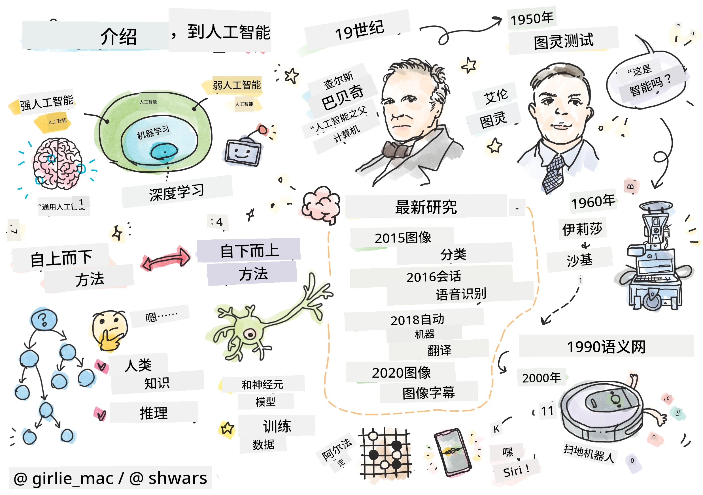

# 人工智能简介

> 涂鸦作者：[Tomomi Imura](https://twitter.com/girlie_mac)

## [课前测验](https://ff-quizzes.netlify.app/en/ai/quiz/1)

**人工智能**是一门令人兴奋的科学学科，研究如何让计算机表现出智能行为，例如完成那些人类擅长的事情。

最初，计算机是由[查尔斯·巴贝奇](https://en.wikipedia.org/wiki/Charles_Babbage)发明的，用于按照明确的程序（算法）对数字进行操作。尽管现代计算机比19世纪提出的原始模型先进得多，但它们仍然遵循受控计算的基本理念。因此，如果我们知道实现目标所需的确切步骤序列，就可以编程让计算机完成某项任务。

> 照片由 [Vickie Soshnikova](http://twitter.com/vickievalerie) 提供

> ✅ 从一张照片中判断一个人的年龄是无法通过明确编程实现的，因为我们并不知道在脑海中得出这个数字的具体过程。

---

然而，有些任务我们并不知道如何明确解决。比如，从一张照片中判断一个人的年龄。我们之所以能做到，是因为我们见过许多不同年龄段的人的例子，但我们无法明确解释自己是如何做到的，也无法编程让计算机完成这项任务。这正是**人工智能**（简称AI）感兴趣的任务类型。

✅ 想一想有哪些任务可以交给计算机完成，并且可以从AI中受益。考虑金融、医疗和艺术领域——这些领域今天是如何从AI中受益的？

## 弱人工智能与强人工智能

弱人工智能 | 强人工智能
---------------------------------------|-------------------------------------
弱人工智能指的是为特定任务或一组狭窄任务设计和训练的AI系统。|强人工智能，或称通用人工智能（AGI），指的是具有与人类相当的智能和理解能力的AI系统。
这些AI系统并不具备普遍的智能；它们擅长执行预定义的任务，但缺乏真正的理解或意识。|这些AI系统能够执行人类可以完成的任何智力任务，适应不同领域，并具备某种形式的意识或自我意识。
弱人工智能的例子包括像Siri或Alexa这样的虚拟助手、流媒体服务使用的推荐算法，以及为特定客户服务任务设计的聊天机器人。|实现强人工智能是AI研究的长期目标，需要开发能够在广泛任务和情境中推理、学习、理解和适应的AI系统。
弱人工智能高度专业化，不具备超出其狭窄领域的人类认知能力或通用问题解决能力。|强人工智能目前是一个理论概念，还没有AI系统达到这种通用智能的水平。

有关更多信息，请参考**[通用人工智能](https://en.wikipedia.org/wiki/Artificial_general_intelligence)** (AGI)。

## 智能的定义与图灵测试

在讨论**[智能](https://en.wikipedia.org/wiki/Intelligence)**这个术语时，一个问题是我们并没有对其明确的定义。有人认为智能与**抽象思维**或**自我意识**相关，但我们无法准确定义它。

> [照片](https://unsplash.com/photos/75715CVEJhI)由 [Amber Kipp](https://unsplash.com/@sadmax) 提供，来自Unsplash

为了说明“智能”这个术语的模糊性，试着回答一个问题：“猫是智能的吗？”不同的人往往会给出不同的答案，因为没有普遍接受的测试可以证明这一说法的真伪。如果你认为有——试着让你的猫参加智商测试……

✅ 花一分钟思考你如何定义智能。一只能够解决迷宫并获取食物的乌鸦是智能的吗？一个孩子是智能的吗？

---

在讨论AGI时，我们需要某种方法来判断是否创造了一个真正智能的系统。[艾伦·图灵](https://en.wikipedia.org/wiki/Alan_Turing)提出了一种方法，称为**[图灵测试](https://en.wikipedia.org/wiki/Turing_test)**，这也可以看作是智能的定义。该测试将一个给定系统与某种本质上智能的东西——一个真实的人类进行比较。由于任何自动化比较都可能被计算机程序绕过，我们使用人类审问者。如果一个人类无法在基于文本的对话中区分真实的人和计算机系统，那么该系统就被认为是智能的。

> 一个名为 [Eugene Goostman](https://en.wikipedia.org/wiki/Eugene_Goostman) 的聊天机器人于2014年在圣彼得堡开发，利用了一个巧妙的个性技巧，接近通过图灵测试。它一开始就声明自己是一个13岁的乌克兰男孩，这可以解释知识的缺乏和文本中的一些不一致之处。该机器人在5分钟的对话中说服了30%的评委相信它是人类，这是图灵认为机器到2000年能够通过的指标。然而，我们应该明白，这并不意味着我们已经创造了一个智能系统，或者计算机系统欺骗了人类审问者——实际上是机器人开发者欺骗了人类！

✅ 你是否曾被聊天机器人欺骗，以为自己在与人类对话？它是如何让你相信的？

## 人工智能的不同方法

如果我们希望计算机像人类一样行为，我们需要在计算机中某种程度上模拟人类的思维方式。因此，我们需要尝试理解是什么让人类具有智能。

> 为了能够将智能编程到机器中，我们需要理解我们自身的决策过程是如何运作的。如果你稍加自我反思，你会意识到有些过程是潜意识发生的——例如，我们可以在不思考的情况下区分猫和狗——而另一些过程则涉及推理。

解决这个问题有两种可能的方法：

自上而下方法（符号推理） | 自下而上方法（神经网络）
---------------------------------------|-------------------------------------
自上而下的方法模拟人类解决问题的推理方式。它涉及从人类中提取**知识**，并以计算机可读的形式表示出来。我们还需要开发一种方法在计算机中建模**推理**。| 自下而上的方法模拟人类大脑的结构，由大量简单单元组成，称为**神经元**。每个神经元的作用类似于其输入的加权平均值，我们可以通过提供**训练数据**来训练神经网络解决有用的问题。

此外，还有一些其他可能的智能方法：

* **涌现式**、**协同式**或**多代理方法**基于这样一个事实：复杂的智能行为可以通过大量简单代理的交互获得。根据[进化控制论](https://en.wikipedia.org/wiki/Global_brain#Evolutionary_cybernetics)，智能可以在*元系统转变*的过程中从更简单的反应行为中*涌现*。

* **进化方法**或**遗传算法**是一种基于进化原理的优化过程。

我们将在课程后续部分讨论这些方法，但现在我们将重点关注两种主要方向：自上而下和自下而上。

### 自上而下方法

在**自上而下方法**中，我们尝试模拟我们的推理过程。因为我们可以在推理时跟随自己的思路，我们可以尝试将这一过程形式化并编程到计算机中。这被称为**符号推理**。

人们往往在头脑中有一些指导决策过程的规则。例如，当医生诊断病人时，他或她可能意识到病人发烧，因此可能存在某种炎症。通过将大量规则应用于特定问题，医生可能得出最终诊断。

这种方法高度依赖于**知识表示**和**推理**。从人类专家那里提取知识可能是最困难的部分，因为医生在许多情况下并不确切知道为什么会得出某个诊断。有时，解决方案只是突然出现在他的脑海中，而没有明确的思考。有些任务，例如从照片中判断一个人的年龄，根本无法简化为知识的操作。

### 自下而上方法

另一种方法是尝试模拟我们大脑中最简单的元素——神经元。我们可以在计算机中构建一个所谓的**人工神经网络**，然后通过提供示例来教它解决问题。这一过程类似于新生儿通过观察学习周围环境的方式。

✅ 研究一下婴儿是如何学习的。婴儿大脑的基本元素是什么？

> | 那机器学习呢？         |      |
> |--------------|-----------|
> | 人工智能的一部分是基于计算机通过一些数据学习解决问题的，这被称为**机器学习**。我们不会在本课程中讨论经典的机器学习——请参考单独的[机器学习初学者课程](http://aka.ms/ml-beginners)。 |       |

## 人工智能简史

人工智能作为一个领域始于20世纪中期。最初，符号推理是一种流行的方法，并取得了一些重要的成功，例如专家系统——能够在某些有限问题领域中充当专家的计算机程序。然而，很快就发现这种方法并不具有良好的扩展性。从专家那里提取知识、在计算机中表示这些知识并保持知识库的准确性，结果证明是一项非常复杂且在许多情况下成本过高的任务。这导致了20世纪70年代所谓的[人工智能寒冬](https://en.wikipedia.org/wiki/AI_winter)。

> 图片由 [Dmitry Soshnikov](http://soshnikov.com) 提供

随着时间的推移，计算资源变得更便宜，数据也变得更加丰富，因此神经网络方法在许多领域（如计算机视觉或语音理解）中开始表现出色。在过去十年中，“人工智能”一词大多被用作神经网络的同义词，因为我们听到的大多数AI成功案例都基于它们。

我们可以观察到方法的变化，例如在创建国际象棋程序时：

* 早期的国际象棋程序基于搜索——程序明确尝试估计对手在给定的几个下一步中的可能走法，并根据几步内可以达到的最佳位置选择最佳走法。这导致了所谓的[α-β剪枝](https://en.wikipedia.org/wiki/Alpha%E2%80%93beta_pruning)搜索算法的发展。
* 搜索策略在游戏后期效果很好，因为搜索空间被少量可能的走法限制。然而，在游戏开始时，搜索空间非常大，算法可以通过学习人类玩家之间的现有比赛来改进。后续实验采用了所谓的[基于案例的推理](https://en.wikipedia.org/wiki/Case-based_reasoning)，程序在知识库中寻找与当前棋局非常相似的案例。
* 能够战胜人类玩家的现代程序基于神经网络和[强化学习](https://en.wikipedia.org/wiki/Reinforcement_learning)，程序通过长时间与自己对弈并从自己的错误中学习来学会下棋——这与人类学习下棋的方式非常相似。然而，计算机程序可以在更短的时间内进行更多的对弈，因此可以学习得更快。

✅ 研究一下其他由AI参与的游戏。

同样，我们可以看到创建“会说话的程序”（可能通过图灵测试）的方法的变化：

* 早期此类程序（如[Eliza](https://en.wikipedia.org/wiki/ELIZA)）基于非常简单的语法规则和将输入句子重新表述为问题。
* 现代助手，如Cortana、Siri或Google Assistant，都是混合系统，使用神经网络将语音转换为文本并识别我们的意图，然后采用一些推理或明确的算法来执行所需的操作。
* 未来，我们可能会期待一个完全基于神经网络的模型能够自行处理对话。最近的GPT和[Turing-NLG](https://www.microsoft.com/research/blog/turing-nlg-a-17-billion-parameter-language-model-by-microsoft)系列神经网络在这方面表现出色。

> 图片由 Dmitry Soshnikov 提供，[照片](https://unsplash.com/photos/r8LmVbUKgns)由 [Marina Abrosimova](https://unsplash.com/@abrosimova_marina_foto) 提供，来源于 Unsplash

## 最近的人工智能研究

神经网络研究的巨大增长始于2010年左右，当时大型公共数据集开始变得可用。一组名为 [ImageNet](https://en.wikipedia.org/wiki/ImageNet) 的庞大图像集合，其中包含约1400万张带注释的图像，催生了 [ImageNet 大规模视觉识别挑战赛](https://image-net.org/challenges/LSVRC/)。

> 图片由 [Dmitry Soshnikov](http://soshnikov.com) 提供

2012年，[卷积神经网络](../4-ComputerVision/07-ConvNets/README.md)首次用于图像分类，导致分类错误率显著下降（从接近30%降至16.4%）。2015年，微软研究院的 ResNet 架构[达到了人类级别的准确率](https://doi.org/10.1109/ICCV.2015.123)。

从那时起，神经网络在许多任务中表现出了非常成功的效果：

---

年份 | 达到人类水平
-----|--------
2015 | [图像分类](https://doi.org/10.1109/ICCV.2015.123)
2016 | [对话语音识别](https://arxiv.org/abs/1610.05256)
2018 | [自动机器翻译](https://arxiv.org/abs/1803.05567)（中译英）
2020 | [图像描述生成](https://arxiv.org/abs/2009.13682)

在过去几年中，我们见证了大型语言模型的巨大成功，例如 BERT 和 GPT-3。这主要是因为有大量的通用文本数据可用，使我们能够训练模型以捕捉文本的结构和意义，在通用文本集合上进行预训练，然后将这些模型专门化用于更具体的任务。我们将在本课程后续部分中学习更多关于[自然语言处理](../5-NLP/README.md)的内容。

## 🚀 挑战

在互联网上进行探索，找出你认为人工智能最有效的应用领域。是地图应用程序、语音转文字服务还是视频游戏？研究该系统是如何构建的。

## [课后测验](https://ff-quizzes.netlify.app/en/ai/quiz/2)

## 复习与自学

通过阅读[这节课](https://github.com/microsoft/ML-For-Beginners/tree/main/1-Introduction/2-history-of-ML)来复习人工智能和机器学习的历史。从该课程顶部的手绘笔记或本课程中选取一个元素，深入研究以了解其演变背后的文化背景。

**作业**：[游戏开发挑战](assignment.md)

---

<!-- CO-OP TRANSLATOR DISCLAIMER START -->
**免责声明**：  
本文档使用AI翻译服务[Co-op Translator](https://github.com/Azure/co-op-translator)进行翻译。尽管我们努力确保翻译的准确性，但请注意，自动翻译可能包含错误或不准确之处。原始语言的文档应被视为权威来源。对于重要信息，建议使用专业人工翻译。我们对因使用此翻译而产生的任何误解或误读不承担责任。
<!-- CO-OP TRANSLATOR DISCLAIMER END -->