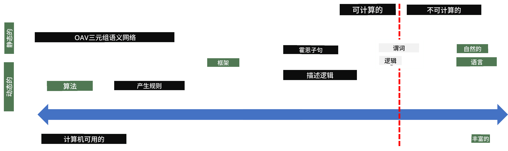
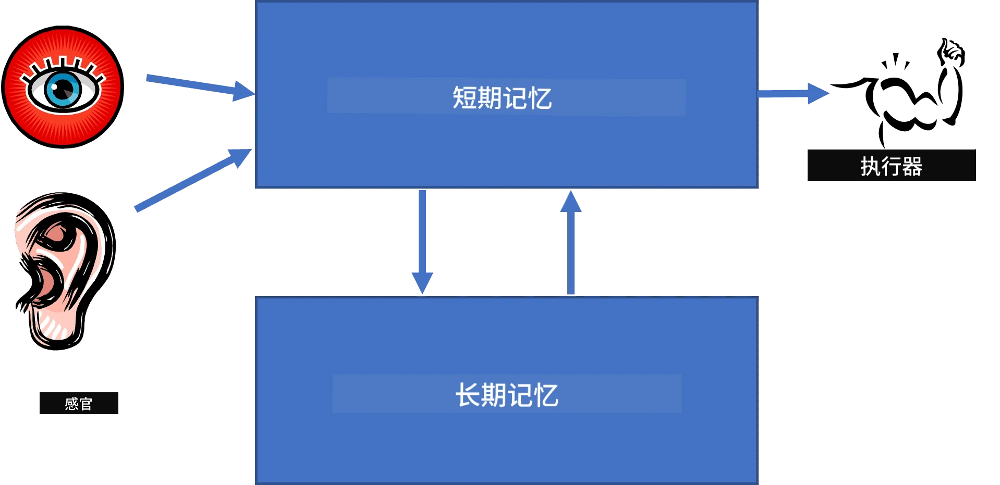
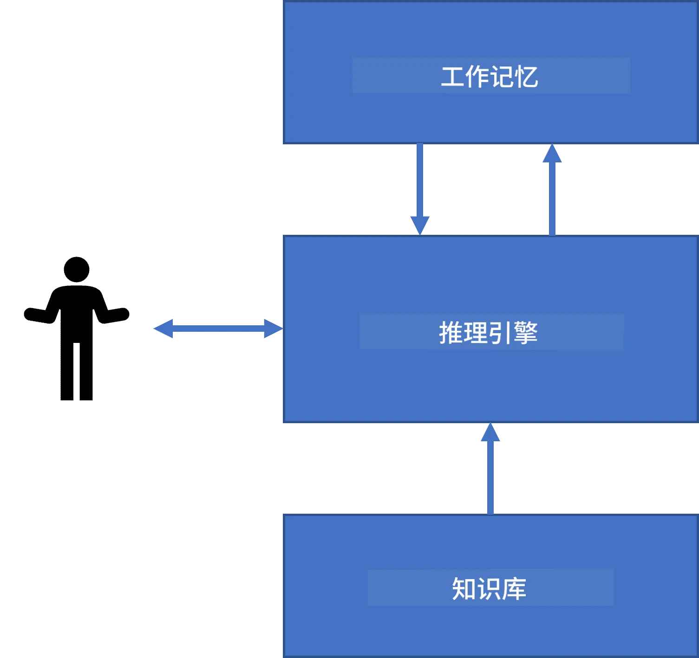
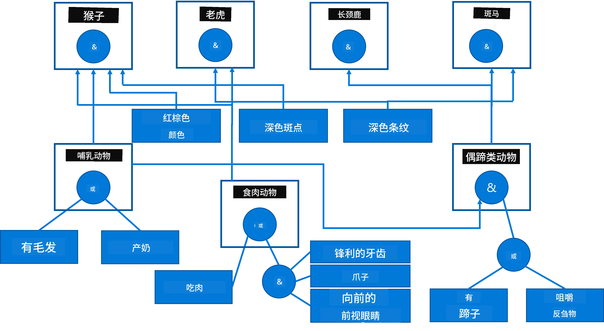
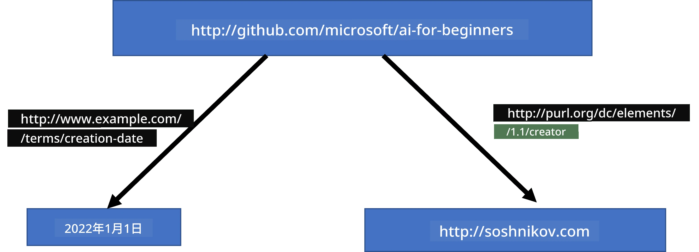
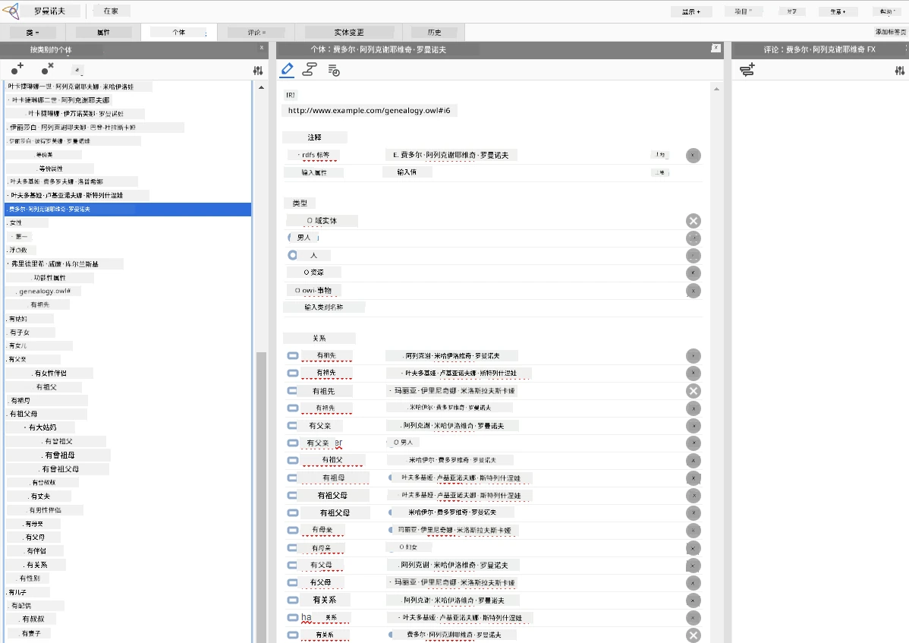

# 知识表示与专家系统


> 草图由 [Tomomi Imura](https://twitter.com/girlie_mac) 绘制

人工智能的追求是基于对知识的探索，以类似人类的方式理解世界。但你该如何实现这一点呢？

## [课前测验](https://ff-quizzes.netlify.app/en/ai/quiz/3)

在人工智能的早期阶段，自顶向下创建智能系统的方法（在上一课中讨论）很流行。其想法是从人类身上提取知识，转换成机器可读的形式，然后用它来自动解决问题。这种方法基于两个重要理念：

* 知识表示
* 推理

## 知识表示

符号人工智能中的一个重要概念是**知识**。必须区分知识与*信息*或*数据*。例如，可以说书中包含知识，因为学习书籍可以成为专家。然而，书中实际上包含的是*数据*，通过阅读书籍并将这些数据整合进我们的世界模型，我们把数据转化为知识。

> ✅ **知识**是我们头脑中包含的东西，代表我们对世界的理解。它是通过主动的**学习**过程获得的，将我们接收到的信息片段整合进我们的活动世界模型。

通常，我们不会严格定义知识，而是通过[DIKW金字塔](https://en.wikipedia.org/wiki/DIKW_pyramid)将其与其他相关概念对齐。它包含以下概念：

* **数据**是以物理媒介表示的事物，如书面文字或口语。数据独立于人类存在，可以在人与人之间传递。
* **信息**是我们头脑中对数据的解释。例如，当我们听到“计算机”这个词时，我们对它有一定理解。
* **知识**是信息被整合进我们的世界模型。例如，一旦我们了解计算机是什么，我们便开始对它的工作原理、价格及用途有一些想法。这些相互关联的概念网络构成了我们的知识。
* **智慧**是我们对世界理解的更高层次，代表*元知识*，例如关于知识何时及如何使用的某种认知。


*图片来自[维基百科](https://commons.wikimedia.org/w/index.php?curid=37705247)，作者Longlivetheux，CC BY-SA 4.0*

因此，**知识表示**的问题是找到一种有效方式，将知识以数据形式表示于计算机内部，使其能被自动使用。这可以看作一个光谱：



> 图片来自 [Dmitry Soshnikov](http://soshnikov.com)

* 在左侧，是计算机能够有效使用的非常简单的知识表示类型。最简单的是算法式，知识由计算机程序表示。然而，这不是最佳的知识表示方式，因为它不够灵活。我们头脑中的知识往往是非算法的。
* 在右侧，是自然文本这类表示手段。它最强大，但无法用于自动推理。

> ✅ 花一分钟思考你是如何在头脑中表示知识并转化为笔记的。有哪种格式对你来说特别有效，有助于记忆？

## 计算机知识表示分类

我们可以将不同的计算机知识表示方法分为以下几类：

* **网络表示**基于我们头脑中存在一个相互关联的概念网络。我们可以尝试在计算机中以图的形式重现同样的网络——所谓的**语义网络**。

1. **对象-属性-值三元组**或**属性-值对**。由于图可以被表示为计算机中的节点和边列表，我们可以用一个三元组列表表示语义网络，三元组包含对象、属性和值。例如，我们构建以下关于编程语言的三元组：

对象 | 属性 | 值
-------|-----------|------
Python | is | Untyped-Language
Python | invented-by | Guido van Rossum
Python | block-syntax | indentation
Untyped-Language | doesn't have | type definitions

> ✅ 思考三元组如何用来表示其他类型的知识。

2. **层次表示**强调我们头脑中常常构建一个对象层次。例如，我们知道金丝雀是鸟，而所有鸟都有翅膀。我们还对金丝雀通常的颜色和飞行速度有所了解。

   - **框架表示**基于将每个对象或对象类表示为包含**槽位**的**框架**。槽位有可能的默认值、值的限制或可以调用的存储过程以获得槽位的值。所有框架形成一个类似面向对象编程语言中的对象层次。
   - **场景**是一种特殊的框架，表示可以随时间展开的复杂情境。

**Python**

槽位 | 值 | 默认值 | 范围 |
-----|-------|---------------|----------|
名称 | Python | | |
类别 | Untyped-Language | | |
变量大小写 | | CamelCase | |
程序长度 | | | 5-5000 行 |
块语法 | 缩进 | | |

3. **过程表示**基于通过一系列条件发生时可执行的动作列表来表示知识。
   - 产生规则是允许我们得出结论的 if-then 语句。例如，医生可能有规则说**如果**病人有高烧**或**血液检测中C-反应蛋白含量高**，那么病人有炎症。一旦遇到其中一个条件，我们就可以得出炎症结论，并在进一步推理中使用。
   - 算法可以被认为是过程表示的另一种形式，尽管它们几乎从不直接用于基于知识的系统。

4. **逻辑**最初由亚里士多德提出，作为表示普遍人类知识的方法。
   - 谓词逻辑作为数学理论过于丰富，无法计算，因此通常使用其某个子集，如在Prolog中使用的Horn子句。
   - 描述逻辑是一族逻辑系统，用于表示和推理对象层次及分布式知识表示，如*语义网*。

## 专家系统

符号人工智能的早期成功之一是所谓的**专家系统**——设计用来在有限问题领域充当专家的计算机系统。它们基于从一个或多个专家处提取的**知识库**，并包含一个在其上执行推理的**推理引擎**。

 | 
---------------------------------------------|------------------------------------------------
人类神经系统简化结构 | 基于知识的系统架构

专家系统构建类似人类推理系统，包含**短期记忆**和**长期记忆**。类似地，在基于知识的系统中我们区分以下组成部分：

* **问题记忆**：包含当前正在解决问题的知识，即患者的体温或血压、是否有炎症等。这也称为**静态知识**，因为它包含我们当前对问题的快照——所谓的*问题状态*。
* **知识库**：代表问题领域的长期知识。它从人类专家手动提取，在每次咨询间不变。由于它允许我们从一个问题状态导航到另一个状态，也称为**动态知识**。
* **推理引擎**：协调整个在问题状态空间的搜索过程，必要时向用户提问。它还负责找到适用于每个状态的规则。

例如，考虑一个基于动物物理特征决定动物种类的专家系统：



> 图片来自 [Dmitry Soshnikov](http://soshnikov.com)

该图称为**与-或树**，是产生规则集合的图形表示。绘制树在提取专家知识初期十分有用。为了在计算机内表示知识，更方便用规则表示：

```
IF the animal eats meat
OR (animal has sharp teeth
    AND animal has claws
    AND animal has forward-looking eyes
) 
THEN the animal is a carnivore
```

你可以注意到，规则左侧的每一个条件和动作本质上是对象-属性-值（OAV）三元组。**工作内存**包含与当前解决问题相关的OAV三元组集合。**规则引擎**寻找满足条件的规则并应用它们，向工作内存添加新的三元组。

> ✅ 自己绘制一个你喜欢主题的与-或树吧！

### 前向推理与后向推理

上述过程称为**前向推理**。它从工作内存中关于问题的初始数据开始，然后执行以下推理循环：

1. 如果目标属性已在工作内存中——停止并给出结果
2. 找出所有条件当前满足的规则——获得**冲突集**规则
3. 执行**冲突解决**——选出本步将执行的一条规则。冲突解决有不同策略：
   - 选择知识库中第一个适用规则
   - 随机选择规则
   - 选择*更具体*规则，即“左侧”（LHS）条件满足最多的规则
4. 应用选中规则，向问题状态插入新知识
5. 从步骤1重复

但在某些情况下，我们可能希望以对问题一无所知开始，提出帮助得出结论的问题。例如，在医学诊断中，一般不会先做完所有检查再诊断患者，而是在需要决策时做检查。

该过程可用**后向推理**建模。它由**目标**驱动——我们想找到的属性值：

1. 选择所有能给出目标值的规则（即目标在右侧，RHS）——冲突集
2. 如果该属性无规则或有规则指出需向用户询问值——则询问，否则：
3. 使用冲突解决策略选择一条将用作*假设*的规则——尝试证明该规则
4. 递归地对规则左侧所有属性重复该过程，尝试将它们视为目标证明
5. 如果任何步骤失败——回到步骤3选用另一规则

> ✅ 何种情形下前向推理更合适？后向推理呢？

### 实现专家系统

专家系统可使用不同工具实现：

* 直接用某高级编程语言编写。通常不是最佳选择，因为知识库系统的主要优势是知识和推理分离，领域专家理应能编写规则而不必懂推理细节。
* 使用**专家系统壳**，即专门设计用于通过某些知识表示语言填充知识的系统。

## ✍️ 练习：动物推理

参见 [Animals.ipynb](https://github.com/microsoft/AI-For-Beginners/blob/main/lessons/2-Symbolic/Animals.ipynb) ，示例实现了前向和后向推理专家系统。

> **备注**：本例较为简单，仅展示专家系统基本样貌。只有当规则数量达到一定量（约200条以上）时，系统才会表现出某种*智能*行为。规则过多时，难以一一记住，此时你可能开始怀疑系统为何做出某些决策。但基于知识系统的关键特点是你总能*解释*任何决策是如何作出的。

## 本体论与语义网

20世纪末，曾有一项倡议利用知识表示对互联网资源进行注释，以便能够找到符合非常具体查询的资源。该倡议称为**语义网**，依赖以下几个概念：

- 基于**[描述逻辑](https://en.wikipedia.org/wiki/Description_logic)**（DL）的一种特殊知识表示。它类似框架知识表示，因为它建立含属性对象的层次，但具有形式逻辑语义和推理。存在一整个DL家族，在表达能力与推理算法复杂度之间进行平衡。
- 分布式知识表示，其中所有概念由全局URI标识符表示，能够创建跨互联网的知识层次。
- 一个基于 XML 的知识描述语言家族：RDF（资源描述框架）、RDFS（RDF 词汇表）、OWL（本体网络语言）。

语义网的核心概念之一是**本体**。它指的是使用某种形式化知识表示对问题领域的明确说明。最简单的本体可以只是问题领域中对象的层次结构，但更复杂的本体会包含可用于推理的规则。

在语义网中，所有表示均基于三元组。每个对象和每个关系都由 URI 唯一标识。例如，如果我们想陈述这个 AI 课程是由 Dmitry Soshnikov 于 2022 年 1 月 1 日开发的事实——我们可以使用以下三元组：



```
http://github.com/microsoft/ai-for-beginners http://www.example.com/terms/creation-date “Jan 1, 2022”
http://github.com/microsoft/ai-for-beginners http://purl.org/dc/elements/1.1/creator http://soshnikov.com
```

> ✅ 这里 `http://www.example.com/terms/creation-date` 和 `http://purl.org/dc/elements/1.1/creator` 是表达*创建者*和*创建日期*概念的一些广为人知且被普遍接受的 URI。

在更复杂的情况下，如果我们想定义一个创建者列表，可以使用 RDF 中定义的一些数据结构。


> 上图由 [Dmitry Soshnikov](http://soshnikov.com) 绘制

语义网建设的进展在某种程度上被搜索引擎和自然语言处理技术的发展减缓了，这些技术可以从文本中提取结构化数据。然而，在某些领域，仍然有大量工作致力于维护本体和知识库。一些值得关注的项目：

* [WikiData](https://wikidata.org/) 是一个与维基百科关联的机器可读知识库集合。大部分数据来自维基百科的 *信息框*，即维基百科页面内的结构化内容。你可以用专门为语义网设计的查询语言 SPARQL 来[查询](https://query.wikidata.org/) wikidata。这里是一个示例查询，显示人类中最常见的眼睛颜色：

```sparql
#defaultView:BubbleChart
SELECT ?eyeColorLabel (COUNT(?human) AS ?count)
WHERE
{
  ?human wdt:P31 wd:Q5.       # human instance-of homo sapiens
  ?human wdt:P1340 ?eyeColor. # human eye-color ?eyeColor
  SERVICE wikibase:label { bd:serviceParam wikibase:language "en". }
}
GROUP BY ?eyeColorLabel
```

* [DBpedia](https://www.dbpedia.org/) 是另一个类似 WikiData 的项目。

> ✅ 如果你想试验构建自己的本体，或者打开已有本体，有一个很棒的图形化本体编辑器叫做 [Protégé](https://protege.stanford.edu/)。下载它，或者在线使用。



*Web Protégé 编辑器打开了罗曼诺夫家族的本体。截屏来自 Dmitry Soshnikov*

## ✍️ 练习：家族本体


参见 [FamilyOntology.ipynb](https://github.com/Ezana135/AI-For-Beginners/blob/main/lessons/2-Symbolic/FamilyOntology.ipynb)，该示例演示了如何使用语义网技术对家庭关系进行推理。我们将使用常见的 GEDCOM 格式表示的家谱和家族关系本体，构建给定个体集合的所有家族关系图。

## 微软概念图

大多数情况下，本体都是精心手工创建的。然而，也可以从非结构化数据中**挖掘**本体，例如来自自然语言文本。

微软研究院曾做过这样的尝试，产出了[微软概念图](https://blogs.microsoft.com/ai/microsoft-researchers-release-graph-that-helps-machines-conceptualize/?WT.mc_id=academic-77998-cacaste)。

它是一个以 `is-a` 继承关系分组的大型实体集合。它可以回答诸如“微软是什么？”的问题——答案类似于“微软是一家公司，概率为 0.87，同时也是一个品牌，概率为 0.75”。

该图谱既可通过 REST API 访问，也可以作为一个大型可下载文本文件列出所有实体对。

## ✍️ 练习：概念图

尝试 [MSConceptGraph.ipynb](https://github.com/microsoft/AI-For-Beginners/blob/main/lessons/2-Symbolic/MSConceptGraph.ipynb) 笔记本，看看我们如何使用微软概念图将新闻文章分到几个类别中。

## 结论

如今，人工智能常被认为是*机器学习*或*神经网络*的同义词。然而，人类也表现出明确的推理能力，而这正是当前神经网络尚未处理的内容。在实际项目中，明确推理仍然用于执行需要解释或能控制修改系统行为的任务。

## 🚀 挑战

本节课对应的家族本体笔记本中，提供了试验其他家族关系的机会。尝试发现家谱中人们之间的新联系。

## [课后测验](https://ff-quizzes.netlify.app/en/ai/quiz/4)

## 复习与自学

在网上做些研究，了解人类尝试量化和编码知识的领域。看看布鲁姆的认知分类法，回顾人类历史上如何试图理解他们的世界。探索林奈创建生物分类法的工作，观察门捷列夫如何创建化学元素的描述和分类方法。你还能发现哪些有趣的例子？

**作业**: [构建本体](assignment.md)

---

<!-- CO-OP TRANSLATOR DISCLAIMER START -->
**免责声明**：  
本文件已使用AI翻译服务[Co-op Translator](https://github.com/Azure/co-op-translator)进行翻译。虽然我们努力保证准确性，但请注意自动翻译可能存在错误或不准确之处。原始文件的母语版本应被视为权威来源。对于重要信息，建议采用专业人工翻译。我们不对因使用本翻译而产生的任何误解或误释承担责任。
<!-- CO-OP TRANSLATOR DISCLAIMER END -->