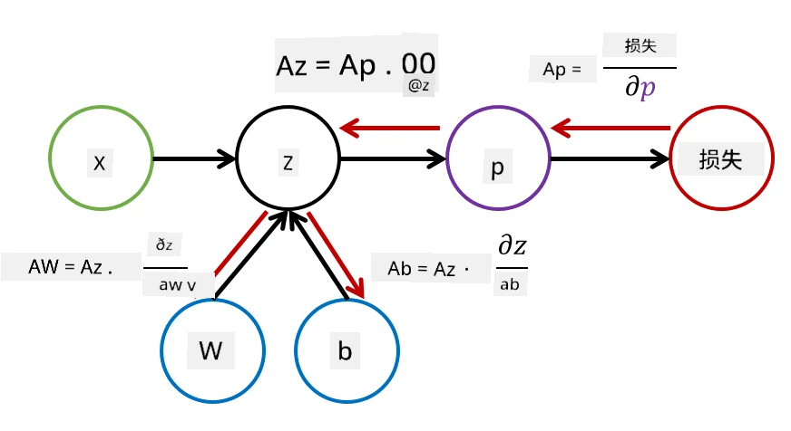

# 神经网络简介：多层感知机

在上一节中，你学习了最简单的神经网络模型——单层感知机，这是一种线性二分类模型。

在本节中，我们将扩展这一模型，构建一个更灵活的框架，使我们能够：

* 除了二分类，还能进行**多分类**
* 除了分类问题，还能解决**回归问题**
* 区分那些**非线性可分**的类别

我们还将开发一个基于 Python 的模块化框架，用于构建不同的神经网络架构。

## [课前测验](https://ff-quizzes.netlify.app/en/ai/quiz/7)

## 机器学习的形式化定义

让我们从形式化定义机器学习问题开始。假设我们有一个训练数据集 **X** 和对应的标签 **Y**，我们需要构建一个模型 *f*，以实现最准确的预测。预测的质量通过**损失函数** &lagran; 来衡量。以下是常用的损失函数：

* 对于回归问题（需要预测一个数值），可以使用**绝对误差** &sum;i|f(x(i))-y(i)|，或**平方误差** &sum;i(f(x(i))-y(i))2
* 对于分类问题，可以使用**0-1损失**（本质上等同于模型的**准确率**），或**对数损失**。

对于单层感知机，函数 *f* 定义为线性函数 *f(x)=wx+b*（其中 *w* 是权重矩阵，*x* 是输入特征向量，*b* 是偏置向量）。对于不同的神经网络架构，这个函数可以具有更复杂的形式。

> 在分类问题中，通常希望网络输出的是类别的概率。为了将任意数值转换为概率（例如对输出进行归一化），我们通常使用**softmax** 函数 &sigma;，此时函数 *f* 变为 *f(x)=&sigma;(wx+b)*。

在上述 *f* 的定义中，*w* 和 *b* 被称为**参数** &theta;=⟨*w,b*⟩。给定数据集 ⟨**X**,**Y**⟩，我们可以将整个数据集上的总误差表示为参数 &theta; 的函数。

> ✅ **神经网络训练的目标是通过调整参数 &theta; 来最小化误差**

## 梯度下降优化

梯度下降是一种著名的函数优化方法。其核心思想是，我们可以计算损失函数相对于参数的导数（在多维情况下称为**梯度**），并调整参数以减少误差。其形式化过程如下：

* 用一些随机值初始化参数 w(0), b(0)
* 重复以下步骤多次：
    - w(i+1) = w(i)-&eta;&part;&lagran;/&part;w
    - b(i+1) = b(i)-&eta;&part;&lagran;/&part;b

在训练过程中，优化步骤通常是基于整个数据集计算的（记住，损失是通过所有训练样本的总和计算的）。然而，在实际操作中，我们会取数据集的小部分，称为**小批量（minibatches）**，并基于数据的子集计算梯度。由于每次随机选取子集，这种方法被称为**随机梯度下降（SGD）**。

## 多层感知机与反向传播

如上所述，单层网络能够对线性可分的类别进行分类。为了构建更复杂的模型，我们可以将多个网络层组合起来。从数学上讲，这意味着函数 *f* 将具有更复杂的形式，并通过以下几个步骤计算：
* z1=w1x+b1
* z2=w2&alpha;(z1)+b2
* f = &sigma;(z2)

这里，&alpha; 是一个**非线性激活函数**，&sigma; 是 softmax 函数，参数为 &theta;=<*w1,b1,w2,b2*>。

梯度下降算法保持不变，但计算梯度会更加复杂。根据链式求导法则，我们可以计算导数如下：

* &part;&lagran;/&part;w2 = (&part;&lagran;/&part;&sigma;)(&part;&sigma;/&part;z2)(&part;z2/&part;w2)
* &part;&lagran;/&part;w1 = (&part;&lagran;/&part;&sigma;)(&part;&sigma;/&part;z2)(&part;z2/&part;&alpha;)(&part;&alpha;/&part;z1)(&part;z1/&part;w1)

> ✅ 链式求导法则用于计算损失函数相对于参数的导数。

注意，这些表达式的最左部分是相同的，因此我们可以从损失函数开始，沿着计算图“向后”计算导数。因此，多层感知机的训练方法被称为**反向传播（backpropagation）**，简称“反向传播”。

> TODO: 图片引用

> ✅ 我们将在随后的 notebook 示例中更详细地讲解反向传播。

## 总结

在本节课中，我们构建了自己的神经网络库，并将其用于一个简单的二维分类任务。

## 🚀 挑战

在配套的 notebook 中，你将实现自己的框架，用于构建和训练多层感知机。你将能够详细了解现代神经网络的运行方式。

请前往 [OwnFramework](OwnFramework.ipynb) notebook 并完成相关内容。

## [课后测验](https://ff-quizzes.netlify.app/en/ai/quiz/8)

## 复习与自学

反向传播是人工智能和机器学习中常用的算法，值得[深入学习](https://wikipedia.org/wiki/Backpropagation)。

## [作业](lab/README.md)

在本次实验中，你需要使用本节课中构建的框架来解决 MNIST 手写数字分类问题。

* [实验说明](lab/README.md)
* [Notebook](lab/MyFW_MNIST.ipynb)

---

