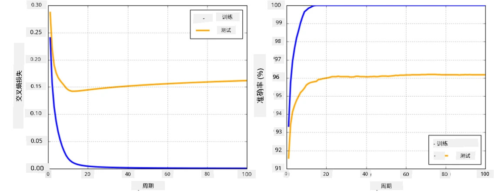

# 神经网络框架

正如我们已经学习到的，为了高效地训练神经网络，我们需要做到以下两点：

* 操作张量，例如进行乘法、加法，以及计算一些函数如 sigmoid 或 softmax。
* 计算所有表达式的梯度，以便执行梯度下降优化。

## [课前测验](https://ff-quizzes.netlify.app/en/ai/quiz/9)

虽然 `numpy` 库可以完成第一部分，但我们还需要某种机制来计算梯度。在[我们之前开发的框架](../04-OwnFramework/OwnFramework.ipynb)中，我们必须手动在 `backward` 方法中编写所有的导数函数来实现反向传播。理想情况下，一个框架应该能够让我们计算*任何表达式*的梯度。

另一个重要的事情是能够在 GPU 或其他专用计算单元（如 [TPU](https://en.wikipedia.org/wiki/Tensor_Processing_Unit)）上进行计算。深度神经网络的训练需要*大量*的计算，因此能够在 GPU 上并行化这些计算非常重要。

> ✅ “并行化”一词指的是将计算分配到多个设备上。

目前最流行的两个神经网络框架是：[TensorFlow](http://TensorFlow.org) 和 [PyTorch](https://pytorch.org/)。它们都提供了一个低级 API，用于在 CPU 和 GPU 上操作张量。在低级 API 之上，还有高级 API，分别是 [Keras](https://keras.io/) 和 [PyTorch Lightning](https://pytorchlightning.ai/)。

低级 API | [TensorFlow](http://TensorFlow.org) | [PyTorch](https://pytorch.org/)
---------|-------------------------------------|--------------------------------
高级 API | [Keras](https://keras.io/) | [PyTorch Lightning](https://pytorchlightning.ai/)

**低级 API** 允许你构建所谓的**计算图**。这个图定义了如何通过给定的输入参数计算输出（通常是损失函数），并且可以在 GPU 上运行计算（如果可用）。这些框架提供了对计算图进行微分以计算梯度的功能，这些梯度可以用于优化模型参数。

**高级 API** 将神经网络视为**层的序列**，使得构建大多数神经网络变得更加简单。训练模型通常只需要准备数据，然后调用一个 `fit` 函数即可完成。

高级 API 允许你快速构建典型的神经网络，而无需担心许多细节。同时，低级 API 提供了对训练过程的更多控制，因此在研究新型神经网络架构时经常使用。

需要注意的是，你可以同时使用这两种 API。例如，你可以使用低级 API 开发自己的网络层架构，然后将其嵌入到使用高级 API 构建和训练的更大网络中。或者，你可以使用高级 API 将网络定义为层的序列，然后使用自己的低级训练循环进行优化。这两种 API 使用相同的基本概念，并且设计为能够很好地协同工作。

## 学习

在本课程中，我们为 PyTorch 和 TensorFlow 提供了大部分内容。你可以选择自己喜欢的框架，只学习对应的笔记本。如果你不确定选择哪个框架，可以在网上查阅一些关于 **PyTorch vs. TensorFlow** 的讨论。你也可以同时了解这两个框架以获得更好的理解。

在可能的情况下，我们会为了简化使用高级 API。然而，我们认为从基础上理解神经网络的工作原理非常重要，因此在开始时我们会从低级 API 和张量操作入手。不过，如果你想快速入门，不想花太多时间学习这些细节，可以直接跳到高级 API 的笔记本。

## ✍️ 练习：框架

通过以下笔记本继续学习：

低级 API | [TensorFlow+Keras 笔记本](IntroKerasTF.ipynb) | [PyTorch](IntroPyTorch.ipynb)
---------|-------------------------------------|--------------------------------
高级 API | [Keras](IntroKeras.ipynb) | *PyTorch Lightning*

掌握这些框架后，我们将回顾过拟合的概念。

# 过拟合

过拟合是机器学习中一个极其重要的概念，理解它至关重要！

考虑以下拟合 5 个点的问题（图中的 `x` 表示点）：

 | 
-------------------------|--------------------------
**线性模型，2 个参数** | **非线性模型，7 个参数**
训练误差 = 5.3 | 训练误差 = 0
验证误差 = 5.1 | 验证误差 = 20

* 左图展示了一个良好的直线拟合。由于参数数量适当，模型正确捕捉了点的分布规律。
* 右图中，模型过于强大。由于只有 5 个点，而模型有 7 个参数，它可以调整到通过所有点，使得训练误差为 0。然而，这阻止了模型理解数据背后的正确模式，因此验证误差非常高。

在模型的复杂度（参数数量）和训练样本数量之间找到正确的平衡非常重要。

## 为什么会发生过拟合

  * 训练数据不足
  * 模型过于强大
  * 输入数据中噪声过多

## 如何检测过拟合

从上图可以看出，过拟合可以通过非常低的训练误差和非常高的验证误差来检测。通常在训练过程中，我们会看到训练误差和验证误差都开始下降，但在某个点之后，验证误差可能停止下降并开始上升。这是过拟合的信号，表明我们可能应该停止训练（或者至少保存模型的快照）。

## 如何防止过拟合

如果你发现发生了过拟合，可以采取以下措施：

 * 增加训练数据量
 * 降低模型的复杂度
 * 使用一些[正则化技术](../../4-ComputerVision/08-TransferLearning/TrainingTricks.md)，例如 [Dropout](../../4-ComputerVision/08-TransferLearning/TrainingTricks.md#Dropout)，我们将在后面讨论。

## 过拟合与偏差-方差权衡

过拟合实际上是统计学中一个更通用问题的特例，称为[偏差-方差权衡](https://en.wikipedia.org/wiki/Bias%E2%80%93variance_tradeoff)。如果我们考虑模型中可能的误差来源，可以看到两种类型的误差：

* **偏差误差** 是由于算法无法正确捕捉训练数据之间的关系而引起的。这可能是因为模型不够强大（**欠拟合**）。
* **方差误差** 是由于模型拟合了输入数据中的噪声而不是有意义的关系（**过拟合**）。

在训练过程中，偏差误差会减少（因为模型学会了拟合数据），而方差误差会增加。为了防止过拟合，重要的是在适当的时候停止训练——可以手动（当我们检测到过拟合时）或自动（通过引入正则化）。

## 总结

在本课中，你学习了两个最流行的 AI 框架 TensorFlow 和 PyTorch 的不同 API。此外，你还学习了一个非常重要的话题——过拟合。

## 🚀 挑战

在配套的笔记本中，你会发现底部有“任务”；完成这些笔记本并完成任务。

## [课后测验](https://ff-quizzes.netlify.app/en/ai/quiz/10)

## 复习与自学

研究以下主题：

- TensorFlow
- PyTorch
- 过拟合

问自己以下问题：

- TensorFlow 和 PyTorch 有什么区别？
- 过拟合和欠拟合有什么区别？

## [作业](lab/README.md)

在本实验中，你需要使用 PyTorch 或 TensorFlow 解决两个分类问题，分别使用单层和多层全连接网络。

* [说明](lab/README.md)
* [笔记本](lab/LabFrameworks.ipynb)

---

