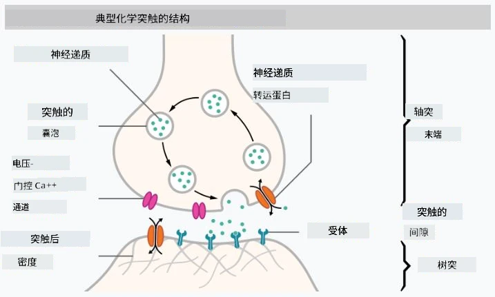

# 神经网络简介

正如我们在介绍中讨论的那样，实现智能的一种方法是训练一个**计算机模型**或一个**人工大脑**。自20世纪中期以来，研究人员尝试了各种数学模型，直到近年来，这一方向取得了巨大的成功。这些大脑的数学模型被称为**神经网络**。

> 有时神经网络被称为*人工神经网络*（Artificial Neural Networks，ANNs），以表明我们讨论的是模型，而不是真实的神经元网络。

## 机器学习

神经网络属于一个更大的学科，称为**机器学习**，其目标是利用数据训练计算机模型，使其能够解决问题。机器学习是人工智能的重要组成部分，但我们在本课程中不涉及经典的机器学习内容。

> 请访问我们的独立课程 **[机器学习入门](http://github.com/microsoft/ml-for-beginners)**，了解更多关于经典机器学习的内容。

在机器学习中，我们假设有一些示例数据集 **X** 和对应的输出值 **Y**。示例通常是由**特征**组成的N维向量，而输出被称为**标签**。

我们将讨论两种最常见的机器学习问题：

* **分类**：需要将输入对象分类到两个或多个类别中。
* **回归**：需要为每个输入样本预测一个数值。

> 当将输入和输出表示为张量时，输入数据集是一个大小为 M&times;N 的矩阵，其中 M 是样本数量，N 是特征数量。输出标签 Y 是一个大小为 M 的向量。

在本课程中，我们将仅关注神经网络模型。

## 神经元的模型

从生物学中我们知道，大脑由神经细胞（神经元）组成，每个神经元有多个“输入”（树突）和一个“输出”（轴突）。树突和轴突都可以传导电信号，它们之间的连接——称为突触——可以表现出不同程度的导电性，这种导电性由神经递质调节。

 | 
----|----
真实神经元 *（[图片](https://en.wikipedia.org/wiki/Synapse#/media/File:SynapseSchematic_lines.svg)来自维基百科）* | 人工神经元 *（作者提供图片）*

因此，神经元的最简单数学模型包含若干输入 X1, ..., XN 和一个输出 Y，以及一系列权重 W1, ..., WN。输出的计算公式为：

其中 f 是某种非线性的**激活函数**。

> 早期的神经元模型在 Warren McCullock 和 Walter Pitts 于1943年发表的经典论文 [《A logical calculus of the ideas immanent in nervous activity》](https://www.cs.cmu.edu/~./epxing/Class/10715/reading/McCulloch.and.Pitts.pdf) 中被描述。Donald Hebb 在他的书《[The Organization of Behavior: A Neuropsychological Theory](https://books.google.com/books?id=VNetYrB8EBoC)》中提出了训练这些网络的方法。

## 本节内容

在本节中，我们将学习以下内容：
* [感知器](03-Perceptron/README.md)：最早的用于二分类的神经网络模型之一
* [多层网络](04-OwnFramework/README.md)：以及配套的笔记本 [如何构建我们自己的框架](04-OwnFramework/OwnFramework.ipynb)
* [神经网络框架](05-Frameworks/README.md)：包括以下笔记本：[PyTorch](05-Frameworks/IntroPyTorch.ipynb) 和 [Keras/Tensorflow](05-Frameworks/IntroKerasTF.ipynb)
* [过拟合](../../../../lessons/3-NeuralNetworks/05-Frameworks)

---

**免责声明**：  
本文档使用AI翻译服务 [Co-op Translator](https://github.com/Azure/co-op-translator) 进行翻译。尽管我们努力确保翻译的准确性，但请注意，自动翻译可能包含错误或不准确之处。原始语言的文档应被视为权威来源。对于关键信息，建议使用专业人工翻译。我们不对因使用此翻译而产生的任何误解或误读承担责任。