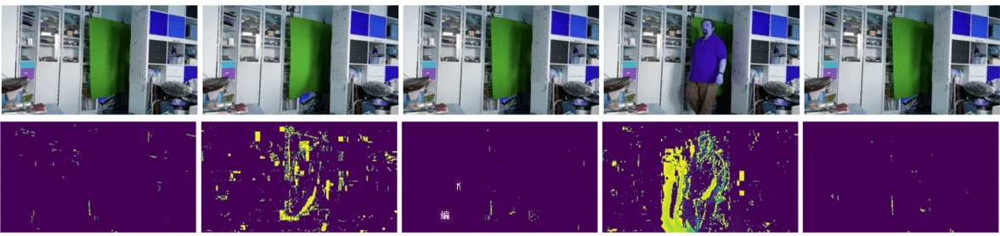

# 计算机视觉简介

[计算机视觉](https://wikipedia.org/wiki/Computer_vision) 是一个旨在让计算机能够对数字图像进行高层次理解的学科。这是一个非常广泛的定义，因为*理解*可以有很多不同的含义，包括在图片中找到一个物体（**目标检测**）、理解发生了什么（**事件检测**）、用文字描述图片，或者重建3D场景。此外，还有一些与人类图像相关的特殊任务：年龄和情绪估计、人脸检测与识别，以及3D姿态估计等。

## [课前测验](https://ff-quizzes.netlify.app/en/ai/quiz/11)

计算机视觉最简单的任务之一是**图像分类**。

计算机视觉通常被认为是人工智能的一个分支。如今，大多数计算机视觉任务都是通过神经网络解决的。我们将在本节中学习一种专门用于计算机视觉的神经网络类型，[卷积神经网络](../07-ConvNets/README.md)。

然而，在将图像传递给神经网络之前，许多情况下使用一些算法技术来增强图像是有意义的。

以下是一些可用于图像处理的Python库：

* **[imageio](https://imageio.readthedocs.io/en/stable/)** 可用于读取/写入不同的图像格式。它还支持ffmpeg，一个将视频帧转换为图像的有用工具。
* **[Pillow](https://pillow.readthedocs.io/en/stable/index.html)**（也称为PIL）功能更强大，还支持一些图像操作，如变形、调色板调整等。
* **[OpenCV](https://opencv.org/)** 是一个用C++编写的强大的图像处理库，已成为图像处理的*事实标准*。它有一个方便的Python接口。
* **[dlib](http://dlib.net/)** 是一个C++库，实施了许多机器学习算法，包括一些计算机视觉算法。它也有一个Python接口，可用于诸如人脸和面部标志检测等具有挑战性的任务。

## OpenCV

[OpenCV](https://opencv.org/) 被认为是图像处理的*事实标准*。它包含许多有用的算法，用C++实现。你也可以通过Python调用OpenCV。

学习OpenCV的一个好地方是[这个Learn OpenCV课程](https://learnopencv.com/getting-started-with-opencv/)。在我们的课程中，我们的目标不是学习OpenCV，而是向你展示一些使用它的例子，以及如何使用它。

### 加载图像

在Python中，图像可以方便地表示为NumPy数组。例如，大小为320x200像素的灰度图像将存储在一个200x320的数组中，而相同尺寸的彩色图像将具有200x320x3的形状（对应3个颜色通道）。要加载图像，可以使用以下代码：

```python
import cv2
import matplotlib.pyplot as plt

im = cv2.imread('image.jpeg')
plt.imshow(im)
```

传统上，OpenCV使用BGR（蓝-绿-红）编码来表示彩色图像，而Python中的其他工具则使用更传统的RGB（红-绿-蓝）。为了使图像显示正确，你需要将其转换为RGB颜色空间，可以通过交换NumPy数组中的维度或调用OpenCV函数来实现：

```python
im = cv2.cvtColor(im,cv2.COLOR_BGR2RGB)
```

同样的`cvtColor`函数也可以用于执行其他颜色空间转换，例如将图像转换为灰度或HSV（色调-饱和度-亮度）颜色空间。

你还可以使用OpenCV逐帧加载视频——在练习[OpenCV Notebook](OpenCV.ipynb)中有一个示例。

### 图像处理

在将图像传递给神经网络之前，你可能需要应用几个预处理步骤。OpenCV可以做很多事情，包括：

* 使用`im = cv2.resize(im, (320,200),interpolation=cv2.INTER_LANCZOS)`对图像进行**调整大小**。
* 使用`im = cv2.medianBlur(im,3)`或`im = cv2.GaussianBlur(im, (3,3), 0)`对图像进行**模糊处理**。
* 通过NumPy数组操作来改变图像的**亮度和对比度**，具体方法可参考[这个Stackoverflow帖子](https://stackoverflow.com/questions/39308030/how-do-i-increase-the-contrast-of-an-image-in-python-opencv)。
* 使用[阈值处理](https://docs.opencv.org/4.x/d7/d4d/tutorial_py_thresholding.html)，通过调用`cv2.threshold`或`cv2.adaptiveThreshold`函数，这通常比调整亮度或对比度更优。
* 对图像应用不同的[变换](https://docs.opencv.org/4.5.5/da/d6e/tutorial_py_geometric_transformations.html)：
    - **[仿射变换](https://docs.opencv.org/4.5.5/d4/d61/tutorial_warp_affine.html)** 如果你需要对图像进行旋转、调整大小和倾斜，并且知道图像中三个点的源位置和目标位置，仿射变换会保持平行线的平行性。
    - **[透视变换](https://medium.com/analytics-vidhya/opencv-perspective-transformation-9edffefb2143)** 如果你知道图像中四个点的源位置和目标位置，这会很有用。例如，如果你用智能手机从某个角度拍摄了一张矩形文档的照片，并希望将文档本身变成一个矩形图像。
* 使用**[光流](https://docs.opencv.org/4.5.5/d4/dee/tutorial_optical_flow.html)**来理解图像中的运动。

## 使用计算机视觉的示例

在我们的[OpenCV Notebook](OpenCV.ipynb)中，我们提供了一些使用计算机视觉执行特定任务的示例：

* **对盲文书籍的照片进行预处理**。我们重点介绍如何使用阈值处理、特征检测、透视变换和NumPy操作来分离单个盲文符号，以便神经网络进一步分类。

 |  | 
----|-----|-----

> 图片来源：[OpenCV.ipynb](OpenCV.ipynb)

* **使用帧差检测视频中的运动**。如果摄像机是固定的，那么摄像机画面中的帧应该彼此非常相似。由于帧被表示为数组，只需对两个连续帧的数组进行减法运算，就可以得到像素差异，对于静态帧来说差异应该很小，而当图像中有显著运动时差异会变大。



> 图片来源：[OpenCV.ipynb](OpenCV.ipynb)

* **使用光流检测运动**。[光流](https://docs.opencv.org/3.4/d4/dee/tutorial_optical_flow.html)允许我们理解视频帧中单个像素的运动方式。光流有两种类型：

   - **密集光流**计算每个像素的运动向量场。
   - **稀疏光流**基于图像中的一些显著特征（例如边缘），并从帧到帧构建它们的轨迹。


> 图片来源：[OpenCV.ipynb](OpenCV.ipynb)

## ✍️ 示例笔记本: OpenCV [尝试OpenCV实践](OpenCV.ipynb)

让我们通过探索[OpenCV Notebook](OpenCV.ipynb)来进行一些OpenCV实验。

## 结论

有时，像运动检测或指尖检测这样相对复杂的任务可以完全通过计算机视觉来解决。因此，了解计算机视觉的基本技术以及像OpenCV这样的库能做什么是非常有帮助的。

## 🚀 挑战

观看[这个视频](https://docs.microsoft.com/shows/ai-show/ai-show--2021-opencv-ai-competition--grand-prize-winners--cortic-tigers--episode-32?WT.mc_id=academic-77998-cacaste)，了解Cortic Tigers项目以及他们如何通过机器人构建一个基于模块的解决方案来普及计算机视觉任务。研究其他类似项目，这些项目帮助新学习者进入该领域。

## [课后测验](https://ff-quizzes.netlify.app/en/ai/quiz/12)

## 复习与自学

阅读更多关于光流的内容，[请参考这个优秀教程](https://learnopencv.com/optical-flow-in-opencv/)。

## [作业](lab/README.md)

在这个实验中，你将拍摄一个带有简单手势的视频，你的目标是使用光流提取上下左右的运动。


---

