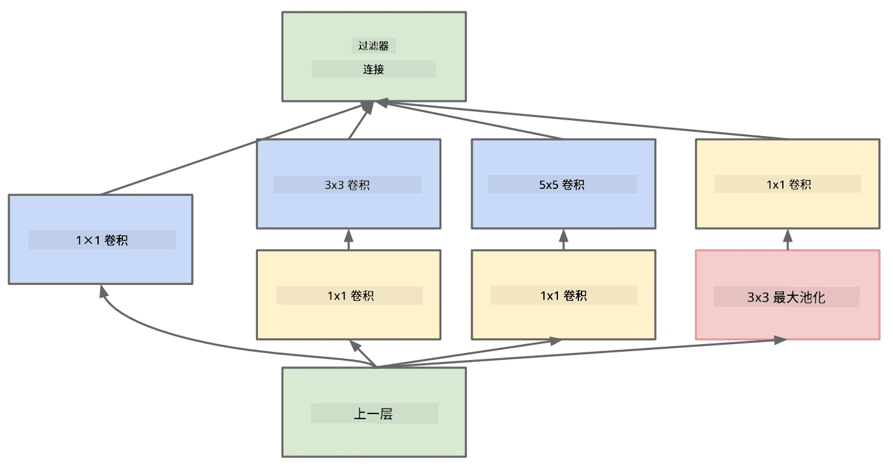

# 常见的CNN架构

### VGG-16

VGG-16是一种网络，在2014年的ImageNet top-5分类中达到了92.7%的准确率。它的层结构如下：

如图所示，VGG采用了传统的金字塔架构，即一系列卷积-池化层的组合。

> 图片来源：[Researchgate](https://www.researchgate.net/figure/Vgg16-model-structure-To-get-the-VGG-NIN-model-we-replace-the-2-nd-4-th-6-th-7-th_fig2_335194493)

### ResNet

ResNet是微软研究院在2015年提出的一系列模型。ResNet的核心思想是使用**残差块**：

> 图片来源：[这篇论文](https://arxiv.org/pdf/1512.03385.pdf)

使用恒等传递的原因是让我们的层预测**前一层结果与残差块输出之间的差值**，因此得名“残差”。这些块更容易训练，并且可以构建包含数百个残差块的网络（最常见的变体包括ResNet-52、ResNet-101和ResNet-152）。

你也可以将这个网络理解为能够根据数据集调整其复杂度。最初，在开始训练网络时，权重值较小，大部分信号通过恒等传递层。随着训练的进行，权重变大，网络参数的重要性增加，网络会调整以适应所需的表达能力，从而正确分类训练图像。

### Google Inception

Google Inception架构进一步发展了这一思想，将每一层网络构建为多个不同路径的组合：

> 图片来源：[Researchgate](https://www.researchgate.net/figure/Inception-module-with-dimension-reductions-left-and-schema-for-Inception-ResNet-v1_fig2_355547454)

这里需要强调1x1卷积的作用，因为一开始它似乎没有意义。为什么我们需要用1x1滤波器处理图像？然而，你需要记住，卷积滤波器也会处理多个深度通道（最初是RGB颜色，在后续层中是不同滤波器的通道），而1x1卷积用于通过不同的可训练权重将这些输入通道混合在一起。它也可以被视为在通道维度上的降采样（池化）。

这里有一篇关于这个主题的[优秀博客文章](https://medium.com/analytics-vidhya/talented-mr-1x1-comprehensive-look-at-1x1-convolution-in-deep-learning-f6b355825578)，以及[原始论文](https://arxiv.org/pdf/1312.4400.pdf)。

### MobileNet

MobileNet是一系列适合移动设备的模型，具有较小的尺寸。如果资源有限，并且可以牺牲一些准确性，可以使用它们。其核心思想是所谓的**深度可分离卷积**，它允许通过空间卷积和深度通道上的1x1卷积的组合来表示卷积滤波器。这显著减少了参数数量，使网络尺寸更小，同时也更容易用较少的数据进行训练。

这里有一篇关于MobileNet的[优秀博客文章](https://medium.com/analytics-vidhya/image-classification-with-mobilenet-cc6fbb2cd470)。

## 总结

在本单元中，你已经学习了计算机视觉神经网络的核心概念——卷积网络。现实中的架构，如图像分类、目标检测，甚至图像生成网络，都是基于CNN的，只是层数更多，并且加入了一些额外的训练技巧。

## 🚀 挑战

在配套的笔记本中，底部有关于如何获得更高准确率的笔记。尝试进行一些实验，看看是否可以实现更高的准确率。

## [课后测验](https://ff-quizzes.netlify.app/en/ai/quiz/14)

## 复习与自学

虽然CNN最常用于计算机视觉任务，但它们通常也适用于提取固定大小的模式。例如，如果我们处理声音，也可以使用CNN来寻找音频信号中的特定模式——在这种情况下，滤波器将是1维的（这种CNN称为1D-CNN）。此外，有时会使用3D-CNN来提取多维空间中的特征，例如视频中发生的某些事件——CNN可以捕捉特定的特征随时间变化的模式。请进行一些复习和自学，了解CNN可以完成的其他任务。

## [作业](lab/README.md)

在本实验中，你的任务是对不同的猫狗品种进行分类。这些图像比MNIST数据集更复杂，维度更高，并且类别超过10种。

---

