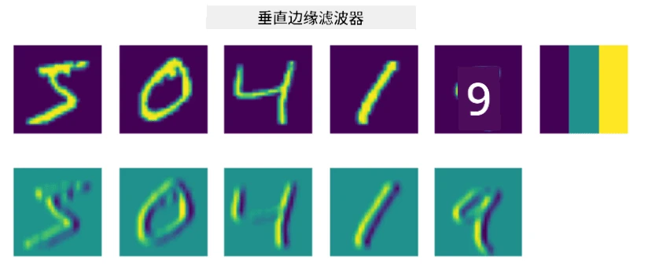

# 卷积神经网络

我们之前已经看到，神经网络在处理图像方面表现得非常出色，甚至单层感知机也能够以较高的准确率识别 MNIST 数据集中的手写数字。然而，MNIST 数据集非常特殊，所有数字都被居中放置在图像中，这使得任务变得更简单。

## [课前测验](https://ff-quizzes.netlify.app/en/ai/quiz/13)

在现实生活中，我们希望能够识别图像中的物体，而不受其具体位置的影响。计算机视觉与普通分类不同，因为当我们试图在图像中找到某个特定物体时，我们实际上是在扫描图像，寻找某些特定的**模式**及其组合。例如，当寻找一只猫时，我们可能首先寻找水平线，这些线可以形成猫的胡须，然后某种胡须的组合可以告诉我们这确实是一张猫的图片。某些模式的相对位置和存在是重要的，而不是它们在图像中的确切位置。

为了提取模式，我们将使用**卷积滤波器**的概念。正如你所知，图像可以用二维矩阵或带有颜色深度的三维张量来表示。应用滤波器意味着我们使用一个相对较小的**滤波核**矩阵，并对原始图像中的每个像素与其邻近点进行加权平均计算。我们可以将其视为一个小窗口在整个图像上滑动，并根据滤波核矩阵中的权重对所有像素进行平均。

 | 
----|----

> 图片来源：Dmitry Soshnikov

例如，如果我们对 MNIST 数字应用 3x3 的垂直边缘和水平边缘滤波器，我们可以在原始图像中存在垂直和水平边缘的地方获得高亮（例如高值）。因此，这两个滤波器可以用来“寻找”边缘。同样，我们可以设计不同的滤波器来寻找其他低级模式：

> 图片来源：[Leung-Malik 滤波器组](https://www.robots.ox.ac.uk/~vgg/research/texclass/filters.html)

然而，虽然我们可以手动设计滤波器来提取某些模式，我们也可以设计网络，使其能够自动学习这些模式。这是 CNN 背后的主要思想之一。

## CNN 的主要思想

CNN 的工作方式基于以下重要思想：

* 卷积滤波器可以提取模式
* 我们可以设计网络，使滤波器能够自动训练
* 我们可以使用相同的方法来发现高级特征中的模式，而不仅仅是原始图像中的模式。因此，CNN 的特征提取在特征的层次结构中工作，从低级像素组合开始，到更高级的图像部分组合。

> 图片来源：[Hislop-Lynch 的论文](https://www.semanticscholar.org/paper/Computer-vision-based-pedestrian-trajectory-Hislop-Lynch/26e6f74853fc9bbb7487b06dc2cf095d36c9021d)，基于[他们的研究](https://dl.acm.org/doi/abs/10.1145/1553374.1553453)

## ✍️ 练习：卷积神经网络

让我们继续探索卷积神经网络的工作原理，以及如何通过相关的笔记本实现可训练的滤波器：

* [卷积神经网络 - PyTorch](ConvNetsPyTorch.ipynb)
* [卷积神经网络 - TensorFlow](ConvNetsTF.ipynb)

## 金字塔架构

大多数用于图像处理的 CNN 都遵循所谓的金字塔架构。应用于原始图像的第一层卷积通常具有相对较少的滤波器（8-16），这些滤波器对应于不同的像素组合，例如水平/垂直线条或笔画。在下一层，我们减少网络的空间维度，并增加滤波器的数量，这对应于更多简单特征的可能组合。随着每一层的推进，空间维度逐渐减小，而滤波器的数量逐渐增加，最终到达分类器。

例如，让我们看看 VGG-16 的架构，这是一种在 2014 年 ImageNet 的 top-5 分类中实现了 92.7% 准确率的网络：

> 图片来源：[Researchgate](https://www.researchgate.net/figure/Vgg16-model-structure-To-get-the-VGG-NIN-model-we-replace-the-2-nd-4-th-6-th-7-th_fig2_335194493)

## 最著名的 CNN 架构

[继续学习最著名的 CNN 架构](CNN_Architectures.md)

---

