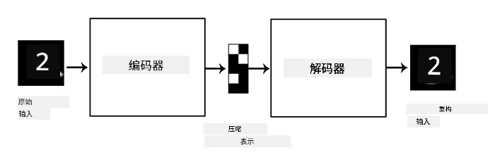
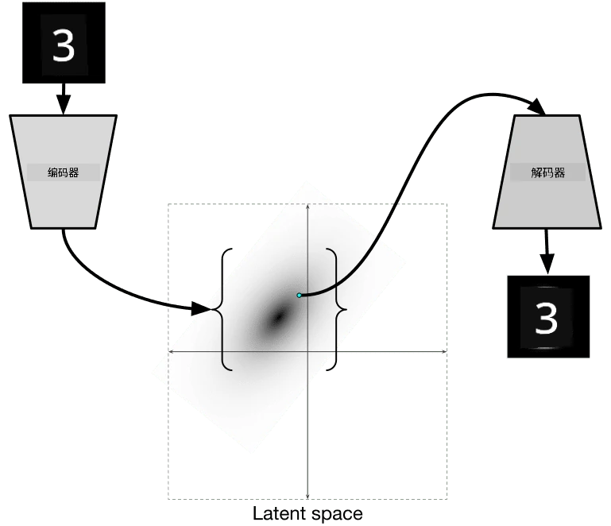

# 自动编码器

在训练 CNN 时，一个问题是我们需要大量的标注数据。在图像分类的情况下，我们需要将图像分成不同的类别，这通常需要手动完成。

## [课前测验](https://ff-quizzes.netlify.app/en/ai/quiz/17)

然而，我们可能希望使用原始（未标注）数据来训练 CNN 特征提取器，这被称为**自监督学习**。在这种情况下，我们将训练图像同时作为网络的输入和输出。**自动编码器**的核心思想是，我们会有一个**编码器网络**，将输入图像转换为某种**潜在空间**（通常是一个较小尺寸的向量），然后通过**解码器网络**来重建原始图像。

> ✅ [自动编码器](https://wikipedia.org/wiki/Autoencoder) 是“一种用于学习未标注数据高效编码的人工神经网络。”

由于我们训练自动编码器的目标是尽可能捕捉原始图像的信息以实现准确的重建，网络会尝试找到输入图像的最佳**嵌入**以捕捉其意义。

> 图片来源：[Keras 博客](https://blog.keras.io/building-autoencoders-in-keras.html)

## 自动编码器的应用场景

虽然重建原始图像本身似乎没有太大的实际用途，但在以下场景中，自动编码器特别有用：

* **降低图像维度以便可视化**或**训练图像嵌入**。通常，自动编码器比 PCA 效果更好，因为它考虑了图像的空间特性和层次化特征。
* **去噪**，即去除图像中的噪声。由于噪声包含了大量无用信息，自动编码器无法将所有噪声信息压缩到相对较小的潜在空间中，因此它只捕捉图像的重要部分。在训练去噪器时，我们以原始图像为目标，并使用人工添加噪声的图像作为自动编码器的输入。
* **超分辨率**，即提高图像分辨率。我们以高分辨率图像为目标，并使用低分辨率图像作为自动编码器的输入。
* **生成模型**。一旦我们训练了自动编码器，解码器部分可以用来从随机潜在向量生成新对象。

## 变分自动编码器 (VAE)

传统的自动编码器通过某种方式降低输入数据的维度，从而提取输入图像的重要特征。然而，潜在向量通常没有太多意义。换句话说，以 MNIST 数据集为例，确定哪些数字对应于不同的潜在向量并不容易，因为相近的潜在向量不一定对应于相同的数字。

另一方面，要训练**生成模型**，最好对潜在空间有一定的理解。这一想法引导我们进入**变分自动编码器** (VAE)。

VAE 是一种自动编码器，它学习预测潜在参数的**统计分布**，即所谓的**潜在分布**。例如，我们可能希望潜在向量呈正态分布，具有某个均值 zmean 和标准差 zsigma（均值和标准差都是某个维度 d 的向量）。VAE 的编码器学习预测这些参数，然后解码器从该分布中随机抽取一个向量以重建对象。

总结如下：

* 从输入向量预测 `z_mean` 和 `z_log_sigma`（我们预测的是标准差的对数而不是标准差本身）
* 从分布 N(zmean,exp(zlog\_sigma)) 中抽取一个向量 `sample`
* 解码器尝试使用 `sample` 作为输入向量解码原始图像

> 图片来源：[Isaak Dykeman 的博客文章](https://ijdykeman.github.io/ml/2016/12/21/cvae.html)

变分自动编码器使用一个复杂的损失函数，该损失函数由两部分组成：

* **重建损失**是一个损失函数，用于衡量重建图像与目标图像的接近程度（可以是均方误差，MSE）。它与普通自动编码器的损失函数相同。
* **KL 损失**确保潜在变量分布接近正态分布。它基于 [Kullback-Leibler 散度](https://www.countbayesie.com/blog/2017/5/9/kullback-leibler-divergence-explained) 的概念——一种估计两个统计分布相似程度的度量。

VAE 的一个重要优势是它可以相对轻松地生成新图像，因为我们知道从哪个分布中抽取潜在向量。例如，如果我们在 MNIST 数据集上用 2D 潜在向量训练 VAE，我们可以通过改变潜在向量的分量来获得不同的数字：

> 图片来源：[Dmitry Soshnikov](http://soshnikov.com)

观察图像如何相互融合，当我们从潜在参数空间的不同部分获取潜在向量时，图像开始逐渐变化。我们还可以将这个空间可视化为二维：

 

> 图片来源：[Dmitry Soshnikov](http://soshnikov.com)

## ✍️ 练习：自动编码器

通过以下笔记本了解更多关于自动编码器的内容：

* [TensorFlow 中的自动编码器](AutoencodersTF.ipynb)
* [PyTorch 中的自动编码器](AutoEncodersPyTorch.ipynb)

## 自动编码器的特性

* **数据特定性** - 它们只对训练时使用的图像类型效果良好。例如，如果我们在花卉图像上训练一个超分辨率网络，它在肖像图像上效果可能不佳。这是因为网络通过从训练数据集中学习的特征中提取细节来生成高分辨率图像。
* **有损性** - 重建的图像与原始图像并不完全相同。损失的性质由训练期间使用的**损失函数**定义。
* 适用于**未标注数据**

## [课后测验](https://ff-quizzes.netlify.app/en/ai/quiz/18)

## 总结

在本课中，您学习了 AI 科学家可用的各种类型的自动编码器。您学习了如何构建它们，以及如何使用它们重建图像。您还学习了 VAE 以及如何使用它生成新图像。

## 🚀 挑战

在本课中，您学习了如何将自动编码器用于图像。但它们也可以用于音乐！查看 Magenta 项目的 [MusicVAE](https://magenta.tensorflow.org/music-vae) 项目，该项目使用自动编码器学习重建音乐。使用该库进行一些[实验](https://colab.research.google.com/github/magenta/magenta-demos/blob/master/colab-notebooks/Multitrack_MusicVAE.ipynb)，看看您能创造出什么。

## [课后测验](https://ff-quizzes.netlify.app/en/ai/quiz/16)

## 复习与自学

参考以下资源，了解更多关于自动编码器的内容：

* [在 Keras 中构建自动编码器](https://blog.keras.io/building-autoencoders-in-keras.html)
* [NeuroHive 博客文章](https://neurohive.io/ru/osnovy-data-science/variacionnyj-avtojenkoder-vae/)
* [变分自动编码器详解](https://kvfrans.com/variational-autoencoders-explained/)
* [条件变分自动编码器](https://ijdykeman.github.io/ml/2016/12/21/cvae.html)

## 作业

在 [使用 TensorFlow 的自动编码器笔记本](AutoencodersTF.ipynb) 的末尾，您会发现一个“任务”——将其作为您的作业。

---

