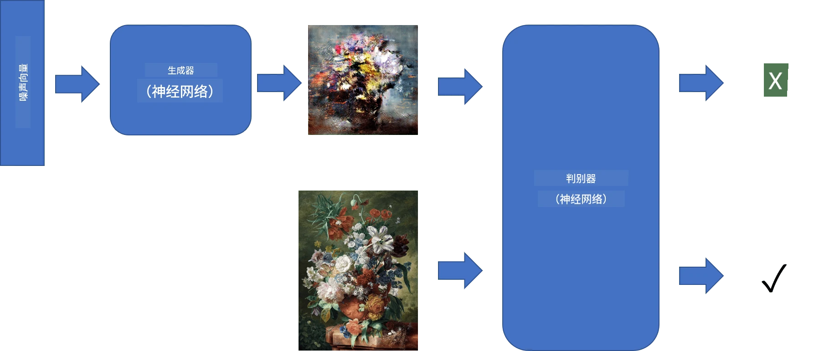
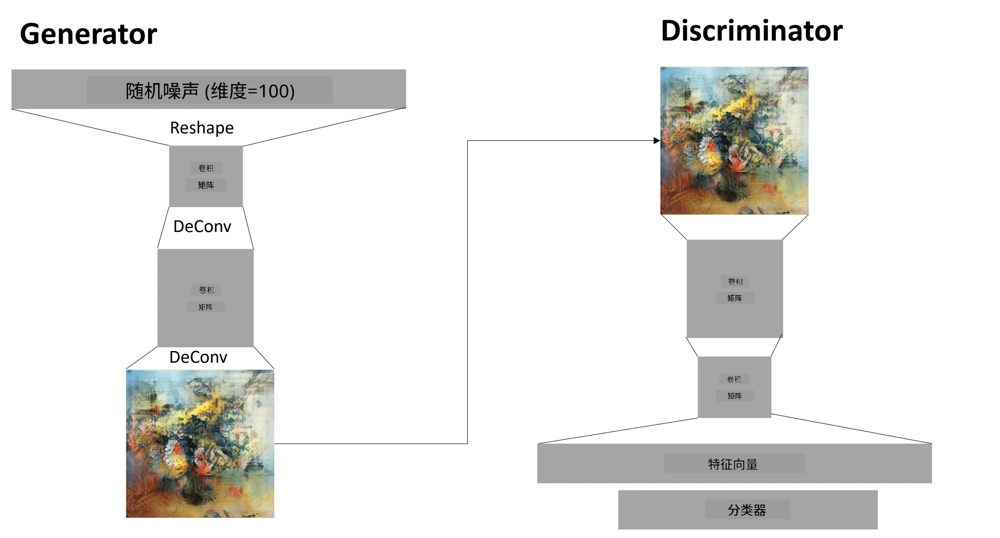

# 生成对抗网络

在上一节中，我们学习了**生成模型**：可以生成与训练数据集中的图像相似的新图像的模型。VAE是生成模型的一个很好的例子。

## [课前测验](https://ff-quizzes.netlify.app/en/ai/quiz/19)

然而，如果我们尝试生成一些真正有意义的内容，比如一幅分辨率合理的画作，使用VAE时会发现训练效果并不理想。针对这种情况，我们需要学习另一种专门用于生成模型的架构——**生成对抗网络**，简称GAN。

GAN的核心思想是使用两个神经网络相互对抗进行训练：

> 图片来源：[Dmitry Soshnikov](http://soshnikov.com)

> ✅ 一些术语：
> * **生成器**是一个网络，它接收一个随机向量，并生成图像作为输出。
> * **判别器**是一个网络，它接收一张图像，并判断该图像是来自训练数据集的真实图像，还是由生成器生成的虚假图像。它本质上是一个图像分类器。

### 判别器

判别器的架构与普通的图像分类网络没有区别。最简单的情况下，它可以是一个全连接分类器，但更常见的是一个[卷积网络](../07-ConvNets/README.md)。

> ✅ 基于卷积网络的GAN被称为[DCGAN](https://arxiv.org/pdf/1511.06434.pdf)

一个CNN判别器由以下层组成：几个卷积+池化层（空间尺寸逐渐减小），以及一个或多个全连接层以获得“特征向量”，最后是一个二分类器。

> ✅ “池化”是一种减少图像尺寸的技术。“池化层通过将一个层中神经元簇的输出合并为下一层中的单个神经元来减少数据的维度。” - [来源](https://wikipedia.org/wiki/Convolutional_neural_network#Pooling_layers)

### 生成器

生成器稍微复杂一些。可以将其视为一个反向的判别器。从一个潜在向量（代替特征向量）开始，它通过一个全连接层将其转换为所需的尺寸/形状，然后进行反卷积+上采样。这类似于[自动编码器](../09-Autoencoders/README.md)的*解码器*部分。

> ✅ 由于卷积层是通过线性滤波器遍历图像实现的，反卷积本质上与卷积类似，可以使用相同的层逻辑实现。

> 图片来源：[Dmitry Soshnikov](http://soshnikov.com)

### GAN的训练

GAN被称为**对抗性**网络，因为生成器和判别器之间存在持续的竞争。在这种竞争中，生成器和判别器都会不断改进，从而使网络能够生成越来越好的图像。

训练分为两个阶段：

* **训练判别器**。这个任务相对简单：我们通过生成器生成一批图像，将其标记为0（代表虚假图像），然后从输入数据集中取一批图像（标记为1，真实图像）。我们计算出判别器的*损失*，并进行反向传播。
* **训练生成器**。这稍微复杂一些，因为我们无法直接知道生成器的期望输出。我们将整个GAN网络（由生成器和判别器组成）输入一些随机向量，并期望输出为1（对应真实图像）。然后我们冻结判别器的参数（此步骤不对判别器进行训练），并进行反向传播。

在这个过程中，生成器和判别器的损失不会显著下降。在理想情况下，它们应该呈现振荡状态，表明两个网络都在不断提高性能。

## ✍️ 练习：GANs

* [TensorFlow/Keras中的GAN笔记本](GANTF.ipynb)
* [PyTorch中的GAN笔记本](GANPyTorch.ipynb)

### GAN训练中的问题

GAN训练尤其困难，以下是一些常见问题：

* **模式崩溃**。指生成器学会生成一种成功欺骗判别器的图像，而不是生成多样化的图像。
* **对超参数的敏感性**。经常会发现GAN完全无法收敛，但突然降低学习率后可能会收敛。
* **保持生成器和判别器之间的平衡**。在许多情况下，判别器的损失可能会迅速降到零，导致生成器无法继续训练。为了解决这个问题，可以尝试为生成器和判别器设置不同的学习率，或者在判别器损失已经很低时跳过判别器的训练。
* **高分辨率训练**。与自动编码器类似的问题，重建卷积网络的过多层会导致伪影。通常通过所谓的**渐进式增长**来解决这一问题，先用低分辨率图像训练几层，然后逐步“解锁”或添加层。另一种解决方案是增加层之间的额外连接，同时训练多个分辨率——详情请参阅这篇[多尺度梯度GAN论文](https://arxiv.org/abs/1903.06048)。

## 风格迁移

GAN是生成艺术图像的绝佳工具。另一种有趣的技术是所谓的**风格迁移**，它将一个**内容图像**重新绘制为另一种风格，应用来自**风格图像**的滤镜。

其工作原理如下：
* 我们从一个随机噪声图像开始（或者从内容图像开始，但为了便于理解，通常从随机噪声开始）。
* 我们的目标是生成一个图像，使其同时接近内容图像和风格图像。这通过两个损失函数来确定：
   - **内容损失**基于CNN在某些层从当前图像和内容图像中提取的特征计算。
   - **风格损失**通过一种巧妙的方法使用Gram矩阵在当前图像和风格图像之间计算（更多细节请参阅[示例笔记本](StyleTransfer.ipynb)）。
* 为了使图像更平滑并去除噪声，我们还引入了**变化损失**，它计算相邻像素之间的平均距离。
* 主要的优化循环通过梯度下降（或其他优化算法）调整当前图像，以最小化总损失，总损失是所有三种损失的加权和。

## ✍️ 示例：[风格迁移](StyleTransfer.ipynb)

## [课后测验](https://ff-quizzes.netlify.app/en/ai/quiz/20)

## 总结

在本课中，您学习了GAN及其训练方法。您还了解了这种类型的神经网络可能面临的特殊挑战，以及一些解决这些问题的策略。

## 🚀 挑战

运行[风格迁移笔记本](StyleTransfer.ipynb)，使用您自己的图像进行实验。

## 复习与自学

参考以下资源，了解更多关于GAN的信息：

* Marco Pasini，[我在训练GAN一年中学到的10个教训](https://towardsdatascience.com/10-lessons-i-learned-training-generative-adversarial-networks-gans-for-a-year-c9071159628)
* [StyleGAN](https://en.wikipedia.org/wiki/StyleGAN)，一个值得关注的GAN架构
* [在Azure ML上使用GAN创建生成艺术](https://soshnikov.com/scienceart/creating-generative-art-using-gan-on-azureml/)

## 作业

重新访问本课相关的两个笔记本之一，并使用您自己的图像重新训练GAN。您能创造出什么？

---

