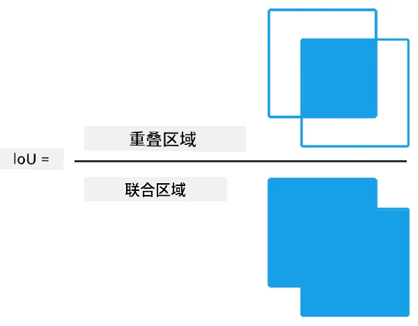

# 目标检测

我们之前处理的图像分类模型会接收一张图片并输出一个类别结果，例如在 MNIST 问题中输出类别“数字”。然而，在许多情况下，我们不仅仅想知道图片中有物体，还希望能够确定它们的具体位置。这正是**目标检测**的核心所在。

## [课前测验](https://ff-quizzes.netlify.app/en/ai/quiz/21)

> 图片来源：[YOLO v2 网站](https://pjreddie.com/darknet/yolov2/)

## 一种简单的目标检测方法

假设我们想在一张图片中找到一只猫，一种非常简单的目标检测方法如下：

1. 将图片分割成多个小块。
2. 对每个小块进行图像分类。
3. 对于分类结果激活值足够高的小块，可以认为其中包含目标物体。

> *图片来源：[练习笔记本](ObjectDetection-TF.ipynb)*

然而，这种方法远非理想，因为它只能非常粗略地定位物体的边界框。为了更精确地定位，我们需要进行某种**回归**来预测边界框的坐标——这需要特定的数据集。

## 用回归进行目标检测

[这篇博客文章](https://towardsdatascience.com/object-detection-with-neural-networks-a4e2c46b4491)对检测形状进行了很好的入门介绍。

## 目标检测数据集

在进行目标检测任务时，你可能会遇到以下数据集：

* [PASCAL VOC](http://host.robots.ox.ac.uk/pascal/VOC/) - 包含20个类别
* [COCO](http://cocodataset.org/#home) - 常见物体上下文数据集。包含80个类别、边界框和分割掩码

## 目标检测评估指标

### 交并比（Intersection over Union）

对于图像分类来说，评估算法性能相对简单；但对于目标检测，我们需要同时评估类别的正确性以及推断出的边界框位置的精确性。后者通常使用**交并比**（IoU）来衡量两个框（或任意两个区域）的重叠程度。

> *图片来源：[这篇关于IoU的优秀博客文章](https://pyimagesearch.com/2016/11/07/intersection-over-union-iou-for-object-detection/)*

其思想很简单——将两个图形的交集面积除以它们的并集面积。对于两个完全相同的区域，IoU值为1；对于完全不相交的区域，IoU值为0。其他情况下，IoU值介于0到1之间。我们通常只考虑IoU值超过某个阈值的边界框。

### 平均精度（Average Precision）

假设我们想评估某个类别$C$的识别效果。为此，我们使用**平均精度**（AP）指标，其计算方法如下：

1. 绘制精度-召回曲线，显示检测阈值（从0到1）变化时的准确性。
2. 根据阈值，我们会检测到图片中的更多或更少的物体，并得到不同的精度和召回值。
3. 曲线如下所示：

> *图片来源：[NeuroWorkshop](http://github.com/shwars/NeuroWorkshop)*

类别$C$的平均精度是该曲线下的面积。更具体地说，召回轴通常分为10个部分，精度在这些点上取平均值：

$$
AP = {1\over11}\sum_{i=0}^{10}\mbox{Precision}(\mbox{Recall}={i\over10})
$$

### AP与IoU

我们只考虑IoU超过某个阈值的检测结果。例如，在PASCAL VOC数据集中，通常假设$\mbox{IoU Threshold} = 0.5$，而在COCO数据集中，AP会针对不同的$\mbox{IoU Threshold}$值进行测量。

> *图片来源：[NeuroWorkshop](http://github.com/shwars/NeuroWorkshop)*

### 平均平均精度（Mean Average Precision - mAP）

目标检测的主要评估指标是**平均平均精度**（mAP）。它是所有类别的平均精度值，有时也会对$\mbox{IoU Threshold}$进行平均。更详细的mAP计算过程可以参考
[这篇博客文章](https://medium.com/@timothycarlen/understanding-the-map-evaluation-metric-for-object-detection-a07fe6962cf3)，以及[这里的代码示例](https://gist.github.com/tarlen5/008809c3decf19313de216b9208f3734)。

## 不同的目标检测方法

目标检测算法主要分为两大类：

* **区域提议网络**（R-CNN, Fast R-CNN, Faster R-CNN）。其核心思想是生成**兴趣区域**（ROI），并对其运行CNN以寻找最大激活值。这种方法与简单方法有些类似，但ROI的生成方式更为智能。这类方法的主要缺点是速度较慢，因为需要对图像进行多次CNN分类器的处理。
* **单次检测**（YOLO, SSD, RetinaNet）方法。这些架构设计的网络能够在一次处理过程中同时预测类别和ROI。

### R-CNN：基于区域的CNN

[R-CNN](http://islab.ulsan.ac.kr/files/announcement/513/rcnn_pami.pdf)使用[选择性搜索](http://www.huppelen.nl/publications/selectiveSearchDraft.pdf)生成ROI区域的层次结构，然后通过CNN特征提取器和SVM分类器确定物体类别，并通过线性回归确定*边界框*坐标。[官方论文](https://arxiv.org/pdf/1506.01497v1.pdf)

> *图片来源：van de Sande et al. ICCV’11*

> *图片来源：[这篇博客](https://towardsdatascience.com/r-cnn-fast-r-cnn-faster-r-cnn-yolo-object-detection-algorithms-36d53571365e)*

### F-RCNN - 快速R-CNN

这种方法与R-CNN类似，但区域是在应用卷积层之后定义的。

> 图片来源：[官方论文](https://www.cv-foundation.org/openaccess/content_iccv_2015/papers/Girshick_Fast_R-CNN_ICCV_2015_paper.pdf)，[arXiv](https://arxiv.org/pdf/1504.08083.pdf)，2015

### Faster R-CNN

这种方法的核心思想是使用神经网络预测ROI——即所谓的*区域提议网络*。[论文](https://arxiv.org/pdf/1506.01497.pdf)，2016

> 图片来源：[官方论文](https://arxiv.org/pdf/1506.01497.pdf)

### R-FCN：基于区域的全卷积网络

这种算法比Faster R-CNN更快。其核心思想如下：

1. 使用ResNet-101提取特征。
2. 特征通过**位置敏感得分图**处理。每个类别$C$的物体被划分为$k\times k$区域，并训练预测物体的各部分。
3. 对于$k\times k$区域中的每个部分，所有网络对物体类别进行投票，选择投票最多的类别。

> 图片来源：[官方论文](https://arxiv.org/abs/1605.06409)

### YOLO - 只看一次

YOLO是一种实时单次检测算法。其核心思想如下：

 * 将图像划分为$S\times S$区域。
 * 对每个区域，**CNN**预测$n$个可能的物体、*边界框*坐标和*置信度*=*概率* * IoU。

 

> 图片来源：[官方论文](https://arxiv.org/abs/1506.02640)

### 其他算法

* RetinaNet: [官方论文](https://arxiv.org/abs/1708.02002)
   - [Torchvision中的PyTorch实现](https://pytorch.org/vision/stable/_modules/torchvision/models/detection/retinanet.html)
   - [Keras实现](https://github.com/fizyr/keras-retinanet)
   - [Keras示例中的RetinaNet目标检测](https://keras.io/examples/vision/retinanet/)
* SSD（单次检测器）：[官方论文](https://arxiv.org/abs/1512.02325)

## ✍️ 练习：目标检测

通过以下笔记本继续学习：

[ObjectDetection.ipynb](ObjectDetection.ipynb)

## 总结

在本课中，你快速了解了实现目标检测的各种方法！

## 🚀 挑战

阅读以下关于YOLO的文章和笔记本，并尝试自己动手实践：

* [关于YOLO的优秀博客文章](https://www.analyticsvidhya.com/blog/2018/12/practical-guide-object-detection-yolo-framewor-python/)
 * [官方网站](https://pjreddie.com/darknet/yolo/)
 * YOLO：[Keras实现](https://github.com/experiencor/keras-yolo2)，[逐步讲解笔记本](https://github.com/experiencor/basic-yolo-keras/blob/master/Yolo%20Step-by-Step.ipynb)
 * YOLO v2：[Keras实现](https://github.com/experiencor/keras-yolo2)，[逐步讲解笔记本](https://github.com/experiencor/keras-yolo2/blob/master/Yolo%20Step-by-Step.ipynb)

## [课后测验](https://ff-quizzes.netlify.app/en/ai/quiz/22)

## 复习与自学

* [目标检测](https://tjmachinelearning.com/lectures/1718/obj/) by Nikhil Sardana
* [目标检测算法的优秀比较](https://lilianweng.github.io/lil-log/2018/12/27/object-detection-part-4.html)
* [深度学习目标检测算法综述](https://medium.com/comet-app/review-of-deep-learning-algorithms-for-object-detection-c1f3d437b852)
* [目标检测算法基础入门](https://www.analyticsvidhya.com/blog/2018/10/a-step-by-step-introduction-to-the-basic-object-detection-algorithms-part-1/)
* [Python实现Faster R-CNN进行目标检测](https://www.analyticsvidhya.com/blog/2018/11/implementation-faster-r-cnn-python-object-detection/)

## [作业：目标检测](lab/README.md)

---

