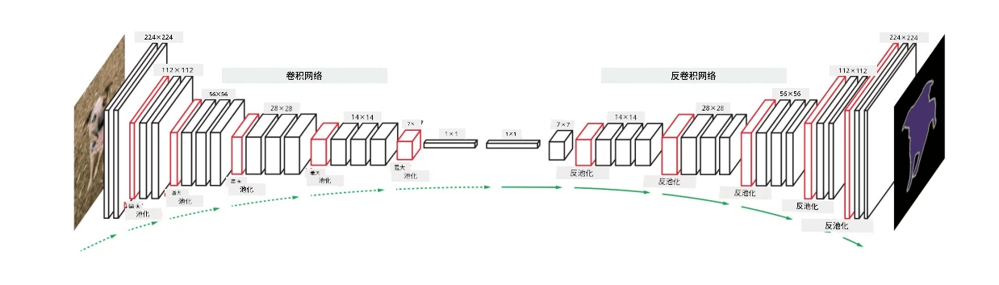
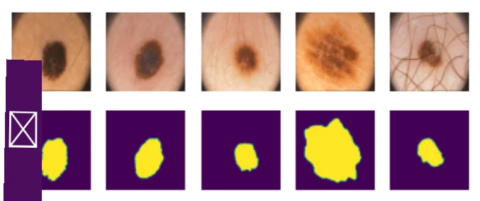

# 分割

我们之前学习了目标检测，它可以通过预测*边界框*来定位图像中的对象。然而，对于某些任务，我们不仅需要边界框，还需要更精确的对象定位。这项任务被称为**分割**。

## [课前测验](https://ff-quizzes.netlify.app/en/ai/quiz/23)

分割可以看作是**像素分类**，即对于图像中的**每个**像素，我们必须预测其类别（*背景*是其中一个类别）。主要有两种分割算法：

* **语义分割**只告诉像素的类别，不区分同一类别的不同对象。
* **实例分割**将类别划分为不同的实例。

例如，对于实例分割，这些羊是不同的对象；而对于语义分割，所有的羊都被表示为一个类别。

> 图片来源于[这篇博客文章](https://nirmalamurali.medium.com/image-classification-vs-semantic-segmentation-vs-instance-segmentation-625c33a08d50)

分割有不同的神经网络架构，但它们的结构都相同。从某种意义上说，它类似于你之前学习过的自动编码器，但不是解构原始图像，而是解构一个**掩码**。因此，分割网络包括以下部分：

* **编码器**从输入图像中提取特征
* **解码器**将这些特征转换为**掩码图像**，其大小与通道数对应于类别数量。

> 图片来源于[这篇论文](https://arxiv.org/pdf/2001.05566.pdf)

我们特别需要提到分割中使用的损失函数。在使用经典自动编码器时，我们需要测量两张图像之间的相似性，可以使用均方误差（MSE）来实现。在分割中，目标掩码图像中的每个像素表示类别编号（在第三维度上进行独热编码），因此我们需要使用特定于分类的损失函数——交叉熵损失，并对所有像素进行平均。如果掩码是二值的，则使用**二值交叉熵损失**（BCE）。

> ✅ 独热编码是一种将类别标签编码为长度等于类别数量的向量的方法。可以查看[这篇文章](https://datagy.io/sklearn-one-hot-encode/)了解这一技术。

## 医学影像中的分割

在本课中，我们将通过训练网络识别医学图像中的人类痣（也称为黑痣）来实际应用分割技术。我们将使用<a href="https://www.fc.up.pt/addi/ph2%20database.html">PH2数据库</a>的皮肤镜图像作为图像来源。该数据集包含200张图像，分为三类：典型痣、非典型痣和黑色素瘤。所有图像还包含一个对应的**掩码**，用于勾勒痣的轮廓。

> ✅ 这种技术特别适用于这种类型的医学影像，但你还能想到哪些其他的实际应用场景？

> 图片来源于PH2数据库

我们将训练一个模型，将任何痣从背景中分割出来。

## ✍️ 练习：语义分割

打开以下笔记本，了解不同的语义分割架构，练习使用它们，并观察它们的实际效果。

* [语义分割 Pytorch](SemanticSegmentationPytorch.ipynb)
* [语义分割 TensorFlow](SemanticSegmentationTF.ipynb)

## [课后测验](https://ff-quizzes.netlify.app/en/ai/quiz/24)

## 总结

分割是一种非常强大的图像分类技术，它超越了边界框，实现了像素级分类。这项技术在医学影像等领域有广泛应用。

## 🚀 挑战

人体分割只是我们可以对人物图像进行的常见任务之一。其他重要任务包括**骨架检测**和**姿态检测**。试试[OpenPose](https://github.com/CMU-Perceptual-Computing-Lab/openpose)库，看看姿态检测的实际应用。

## 复习与自学

这篇[维基百科文章](https://wikipedia.org/wiki/Image_segmentation)提供了关于该技术各种应用的良好概述。自行学习实例分割和全景分割领域的相关知识。

## [作业](lab/README.md)

在本实验中，尝试使用[Segmentation Full Body MADS Dataset](https://www.kaggle.com/datasets/tapakah68/segmentation-full-body-mads-dataset)数据集进行**人体分割**。

---

