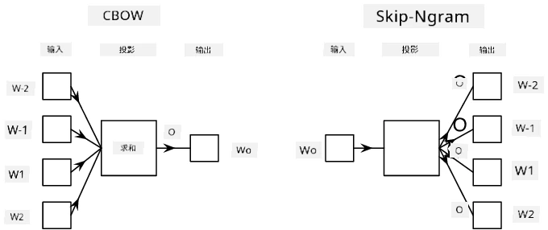

# 语言建模

语义嵌入（如 Word2Vec 和 GloVe）实际上是迈向**语言建模**的第一步——创建某种能够*理解*（或*表示*）语言本质的模型。

## [课前测验](https://ff-quizzes.netlify.app/en/ai/quiz/29)

语言建模的核心思想是通过无监督方式在未标注的数据集上进行训练。这非常重要，因为我们拥有大量未标注的文本，而标注文本的数量总是受到标注工作量的限制。通常，我们可以构建能够**预测文本中缺失单词**的语言模型，因为在文本中随机遮盖一个单词并将其作为训练样本是非常容易的。

## 嵌入训练

在之前的例子中，我们使用了预训练的语义嵌入，但了解这些嵌入是如何训练的也很有趣。有几种可能的思路可以用来训练嵌入：

* **N-Gram**语言建模，通过查看前 N 个标记（N-gram）来预测一个标记。
* **连续词袋模型** (CBoW)，通过预测标记序列 $W_{-N}$, ..., $W_N$ 中的中间标记 $W_0$。
* **Skip-gram**，通过中间标记 $W_0$ 来预测一组邻近标记 {$W_{-N},\dots, W_{-1}, W_1,\dots, W_N$}。

> 图片来源于[这篇论文](https://arxiv.org/pdf/1301.3781.pdf)

## ✍️ 示例笔记本：训练 CBoW 模型

通过以下笔记本继续学习：

* [使用 TensorFlow 训练 CBoW Word2Vec](CBoW-TF.ipynb)
* [使用 PyTorch 训练 CBoW Word2Vec](CBoW-PyTorch.ipynb)

## 总结

在上一节课中，我们看到单词嵌入的效果非常神奇！现在我们知道训练单词嵌入并不是一项非常复杂的任务，如果需要，我们应该能够为特定领域的文本训练自己的单词嵌入。

## [课后测验](https://ff-quizzes.netlify.app/en/ai/quiz/30)

## 复习与自学

* [PyTorch 官方语言建模教程](https://pytorch.org/tutorials/beginner/nlp/word_embeddings_tutorial.html)。
* [TensorFlow 官方 Word2Vec 模型训练教程](https://www.TensorFlow.org/tutorials/text/word2vec)。
* 使用 **gensim** 框架训练最常用嵌入的简便方法详见[此文档](https://pytorch.org/tutorials/beginner/nlp/word_embeddings_tutorial.html)。

## 🚀 [作业：训练 Skip-Gram 模型](lab/README.md)

在实验中，我们挑战你修改本课的代码以训练 Skip-Gram 模型而不是 CBoW。[阅读详情](lab/README.md)

---

