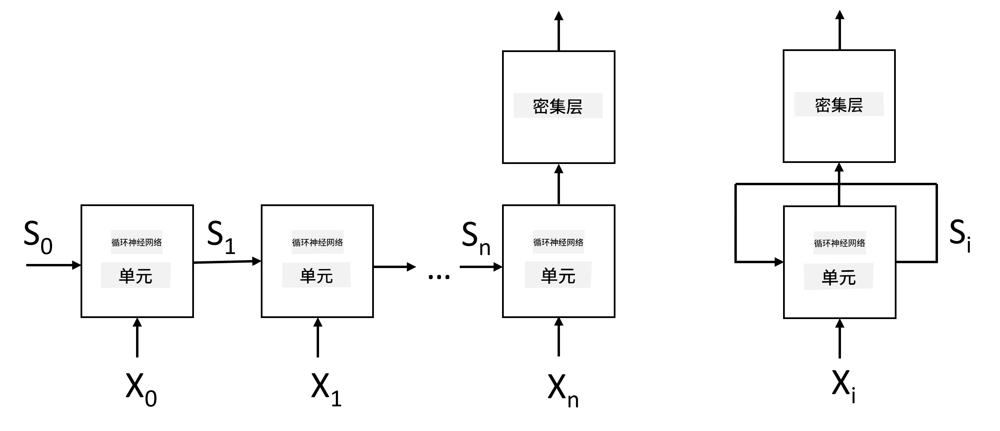
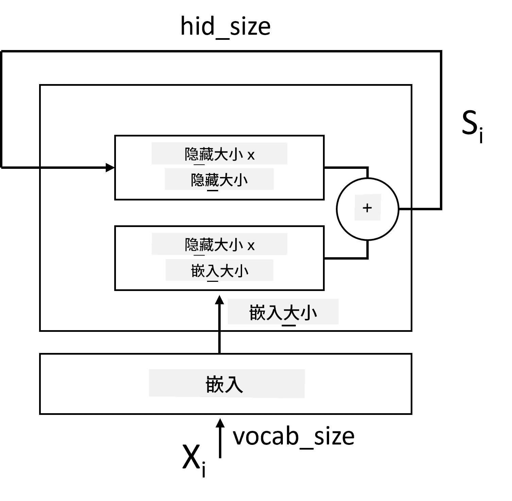
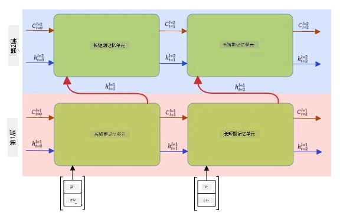

# 循环神经网络

## [课前测验](https://ff-quizzes.netlify.app/en/ai/quiz/31)

在之前的章节中，我们使用了丰富的文本语义表示，并在嵌入层之上使用了一个简单的线性分类器。这种架构能够捕捉句子中词语的整体意义，但它没有考虑到词语的**顺序**，因为嵌入层上的聚合操作会丢失原始文本中的顺序信息。由于这些模型无法建模词语的顺序，它们无法解决更复杂或更模糊的任务，例如文本生成或问答。

为了捕捉文本序列的意义，我们需要使用另一种神经网络架构，称为**循环神经网络**（Recurrent Neural Network，RNN）。在 RNN 中，我们将句子逐个符号输入网络，网络会生成某种**状态**，然后将该状态与下一个符号一起再次输入网络。

> 图片由作者提供

给定输入序列的标记 X0,...,Xn，RNN 会创建一个神经网络块的序列，并通过反向传播对该序列进行端到端训练。每个网络块以 (Xi,Si) 为输入，并生成 Si+1 作为结果。最终状态 Sn 或 (输出 Yn) 会进入线性分类器以生成结果。所有网络块共享相同的权重，并通过一次反向传播训练端到端。

由于状态向量 S0,...,Sn 会通过网络传递，RNN 能够学习词语之间的顺序依赖关系。例如，当单词 *not* 出现在序列中的某处时，它可以学习在状态向量中否定某些元素，从而实现否定。

> ✅ 由于上图中所有 RNN 块的权重是共享的，因此可以将整个图表示为一个带有循环反馈的单块（右侧），将网络的输出状态反馈到输入。

## RNN 单元的结构

让我们看看一个简单的 RNN 单元是如何组织的。它接受前一个状态 Si-1 和当前符号 Xi 作为输入，并生成输出状态 Si（有时我们也对其他输出 Yi 感兴趣，例如在生成网络中）。

一个简单的 RNN 单元内部有两个权重矩阵：一个用于转换输入符号（我们称之为 W），另一个用于转换输入状态（H）。在这种情况下，网络的输出计算公式为 &sigma;(W&times;Xi+H&times;Si-1+b)，其中 &sigma; 是激活函数，b 是额外的偏置。

> 图片由作者提供

在许多情况下，输入标记会在进入 RNN 之前通过嵌入层以降低维度。在这种情况下，如果输入向量的维度为 *emb_size*，状态向量的维度为 *hid_size*，那么 W 的大小为 *emb_size*&times;*hid_size*，H 的大小为 *hid_size*&times;*hid_size*。

## 长短时记忆网络（LSTM）

经典 RNN 的主要问题之一是所谓的**梯度消失**问题。由于 RNN 是通过一次反向传播端到端训练的，它很难将误差传播到网络的第一层，因此无法学习远距离标记之间的关系。解决这一问题的一种方法是通过使用所谓的**门控机制**引入**显式状态管理**。有两种著名的架构：**长短时记忆网络**（Long Short Term Memory，LSTM）和**门控循环单元**（Gated Relay Unit，GRU）。

> 图片来源待定

LSTM 网络的组织方式与 RNN 类似，但有两个状态会从层到层传递：实际状态 C 和隐藏向量 H。在每个单元中，隐藏向量 Hi 与输入 Xi 连接在一起，它们通过**门控机制**控制状态 C 的变化。每个门控机制都是一个带有 sigmoid 激活（输出范围为 [0,1]）的神经网络，可以通过与状态向量相乘来视为逐位掩码。以下是这些门控机制（从左到右）：

* **遗忘门**：接收隐藏向量并决定状态向量 C 的哪些部分需要遗忘，哪些需要保留。
* **输入门**：从输入和隐藏向量中提取信息并插入状态。
* **输出门**：通过带有 *tanh* 激活的线性层转换状态，然后使用隐藏向量 Hi 选择状态的某些部分以生成新状态 Ci+1。

状态 C 的各个组成部分可以被视为一些可以打开或关闭的标志。例如，当我们在序列中遇到名字 *Alice* 时，我们可能会假设它指代一个女性角色，并在状态中设置一个标志，表示句子中有一个女性名词。当我们进一步遇到短语 *and Tom* 时，我们会设置一个标志，表示句子中有复数名词。因此，通过操控状态，我们可以跟踪句子部分的语法属性。

> ✅ 理解 LSTM 内部机制的一个优秀资源是 Christopher Olah 的这篇文章 [Understanding LSTM Networks](https://colah.github.io/posts/2015-08-Understanding-LSTMs/)。

## 双向和多层 RNN

我们已经讨论了单向运行的循环网络，从序列的开头到结尾。这看起来很自然，因为它类似于我们阅读和听语音的方式。然而，由于在许多实际情况下我们可以随机访问输入序列，因此同时进行双向循环计算可能更有意义。这种网络称为**双向 RNN**。在处理双向网络时，我们需要两个隐藏状态向量，每个方向一个。

循环网络，无论是单向还是双向，都能捕捉序列中的某些模式，并将其存储到状态向量中或传递到输出中。与卷积网络类似，我们可以在第一层之上构建另一层循环网络，以捕捉更高级的模式，并从第一层提取的低级模式中构建。这引出了**多层 RNN** 的概念，它由两个或更多循环网络组成，其中前一层的输出作为输入传递到下一层。

*图片来自 Fernando López 的[这篇精彩文章](https://towardsdatascience.com/from-a-lstm-cell-to-a-multilayer-lstm-network-with-pytorch-2899eb5696f3)*

## ✍️ 练习：嵌入

通过以下笔记本继续学习：

* [使用 PyTorch 的 RNN](RNNPyTorch.ipynb)
* [使用 TensorFlow 的 RNN](RNNTF.ipynb)

## 总结

在本单元中，我们了解到 RNN 可用于序列分类，但实际上它们可以处理更多任务，例如文本生成、机器翻译等。我们将在下一单元中讨论这些任务。

## 🚀 挑战

阅读一些关于 LSTM 的文献并思考它们的应用：

- [网格长短时记忆](https://arxiv.org/pdf/1507.01526v1.pdf)
- [展示、关注和讲述：带视觉注意力的神经图像字幕生成](https://arxiv.org/pdf/1502.03044v2.pdf)

## [课后测验](https://ff-quizzes.netlify.app/en/ai/quiz/32)

## 复习与自学

- Christopher Olah 的 [Understanding LSTM Networks](https://colah.github.io/posts/2015-08-Understanding-LSTMs/)。

## [作业：笔记本](assignment.md)

---

