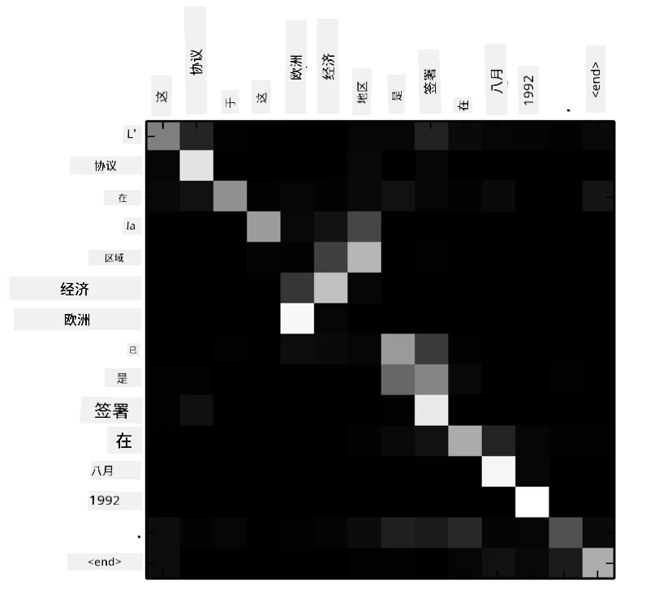
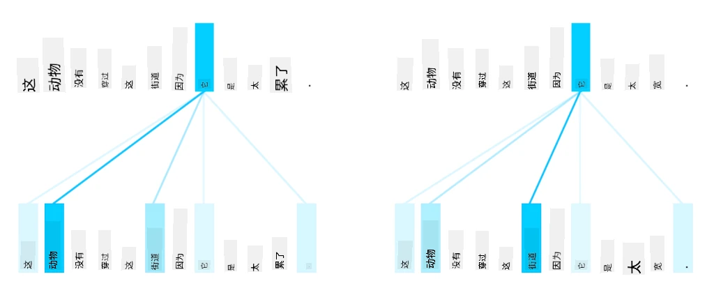
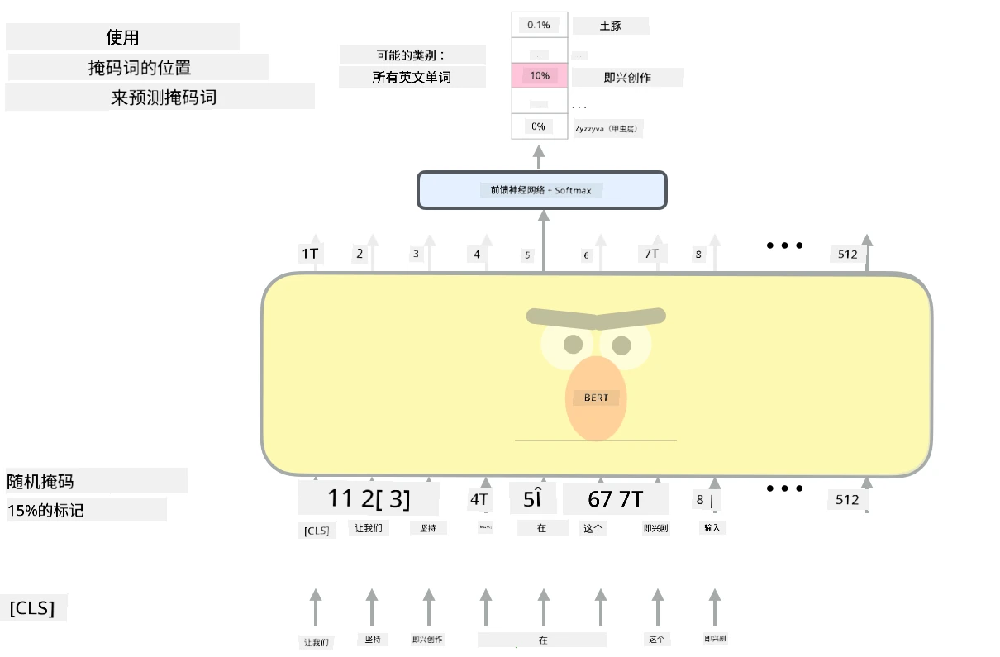

# 注意机制与Transformer

## [课前测验](https://ff-quizzes.netlify.app/en/ai/quiz/35)

在自然语言处理领域中，**机器翻译**是一个非常重要的问题，它是像谷歌翻译这样的工具的核心任务。在本节中，我们将重点讨论机器翻译，或者更广泛地说，任何*序列到序列*任务（也称为**句子转换**）。

使用RNN时，序列到序列任务通过两个循环网络实现，其中一个网络，即**编码器**，将输入序列压缩为一个隐藏状态，而另一个网络，即**解码器**，将隐藏状态展开为翻译结果。这种方法存在一些问题：

* 编码器网络的最终状态难以记住句子的开头，从而导致模型在处理长句子时质量较差。
* 序列中的所有词对结果的影响相同。然而在实际中，输入序列中的某些词对输出序列的影响往往比其他词更大。

**注意机制**提供了一种方法，可以对每个输入向量对RNN输出预测的上下文影响进行加权。其实现方式是创建输入RNN的中间状态与输出RNN之间的快捷路径。这样，在生成输出符号yt时，我们会考虑所有输入隐藏状态hi，并赋予不同的权重系数&alpha;t,i。

> [Bahdanau等人，2015](https://arxiv.org/pdf/1409.0473.pdf)中的加性注意机制编码器-解码器模型，图片来源于[这篇博客](https://lilianweng.github.io/lil-log/2018/06/24/attention-attention.html)

注意矩阵{&alpha;i,j}表示某些输入词在生成输出序列中某个词时的影响程度。下面是一个这样的矩阵示例：

> 图片来自[Bahdanau等人，2015](https://arxiv.org/pdf/1409.0473.pdf)（图3）

注意机制是当前或接近当前自然语言处理领域的最先进技术的关键所在。然而，添加注意机制会显著增加模型参数的数量，从而导致RNN的扩展问题。RNN扩展的一个关键限制是模型的循环性质使得训练难以批量化和并行化。在RNN中，序列的每个元素都需要按顺序处理，这意味着它无法轻松并行化。

> 图片来源于[谷歌博客](https://research.googleblog.com/2016/09/a-neural-network-for-machine.html)

注意机制的采用结合了这一限制，促成了如今我们所熟知和使用的最先进的Transformer模型的诞生，例如BERT和Open-GPT3。

## Transformer模型

Transformer的核心思想之一是避免RNN的顺序处理特性，并创建一个在训练过程中可并行化的模型。这通过以下两个想法实现：

* 位置编码
* 使用自注意机制捕捉模式，而不是使用RNN（或CNN）（这也是为什么介绍Transformer的论文被称为*[Attention is all you need](https://arxiv.org/abs/1706.03762)*）

### 位置编码/嵌入

位置编码的思想如下：
1. 使用RNN时，标记的相对位置由步数表示，因此不需要显式表示。
2. 然而，一旦我们切换到注意机制，我们需要知道序列中标记的相对位置。
3. 为了获得位置编码，我们将标记序列与序列中的标记位置序列（即数字序列0,1, ...）结合起来。
4. 然后我们将标记位置与标记嵌入向量混合。为了将位置（整数）转换为向量，我们可以使用不同的方法：

* 可训练嵌入，类似于标记嵌入。这是我们在这里考虑的方法。我们在标记和它们的位置上应用嵌入层，生成维度相同的嵌入向量，然后将它们相加。
* 固定位置编码函数，如原始论文中提出的。

> 图片由作者提供

通过位置嵌入，我们可以同时嵌入原始标记及其在序列中的位置。

### 多头自注意机制

接下来，我们需要捕捉序列中的一些模式。为此，Transformer使用了**自注意机制**，即将注意机制同时应用于输入和输出的同一序列。应用自注意机制使我们能够考虑句子中的**上下文**，并查看哪些词是相互关联的。例如，它可以帮助我们识别代词*it*所指代的词，并考虑上下文：

> 图片来源于[谷歌博客](https://research.googleblog.com/2017/08/transformer-novel-neural-network.html)

在Transformer中，我们使用**多头注意机制**，以赋予网络捕捉多种依赖关系的能力，例如长期与短期词关系、共指关系与其他关系等。

[TensorFlow Notebook](TransformersTF.ipynb)中包含有关Transformer层实现的更多细节。

### 编码器-解码器注意机制

在Transformer中，注意机制用于两个地方：

* 使用自注意机制捕捉输入文本中的模式
* 执行序列翻译——这是编码器和解码器之间的注意层。

编码器-解码器注意机制与RNN中使用的注意机制非常相似，如本节开头所述。以下动画图解释了编码器-解码器注意机制的作用。

由于每个输入位置独立映射到每个输出位置，Transformer比RNN更容易并行化，这使得能够构建更大、更具表现力的语言模型。每个注意头可以用于学习词之间的不同关系，从而改善下游自然语言处理任务。

## BERT

**BERT**（Bidirectional Encoder Representations from Transformers，双向编码器表示）是一个非常大的多层Transformer网络，*BERT-base*有12层，*BERT-large*有24层。模型首先在大规模文本数据（维基百科+书籍）上进行无监督训练（预测句子中的被遮蔽词）。在预训练过程中，模型吸收了大量的语言理解能力，这些能力可以通过微调其他数据集来利用。这一过程称为**迁移学习**。

> 图片[来源](http://jalammar.github.io/illustrated-bert/)

## ✍️ 练习：Transformer

通过以下笔记本继续学习：

* [PyTorch中的Transformer](TransformersPyTorch.ipynb)
* [TensorFlow中的Transformer](TransformersTF.ipynb)

## 总结

在本课中，你学习了Transformer和注意机制，它们是自然语言处理工具箱中的重要工具。Transformer架构有许多变体，包括BERT、DistilBERT、BigBird、OpenGPT3等，这些模型可以进行微调。[HuggingFace包](https://github.com/huggingface/)提供了一个库，可以使用PyTorch和TensorFlow训练许多这些架构。

## 🚀 挑战

## [课后测验](https://ff-quizzes.netlify.app/en/ai/quiz/36)

## 复习与自学

* [博客文章](https://mchromiak.github.io/articles/2017/Sep/12/Transformer-Attention-is-all-you-need/)，解释了经典的[Attention is all you need](https://arxiv.org/abs/1706.03762)论文。
* [一系列博客文章](https://towardsdatascience.com/transformers-explained-visually-part-1-overview-of-functionality-95a6dd460452)，详细解释了Transformer的架构。

## [作业](assignment.md)

---

