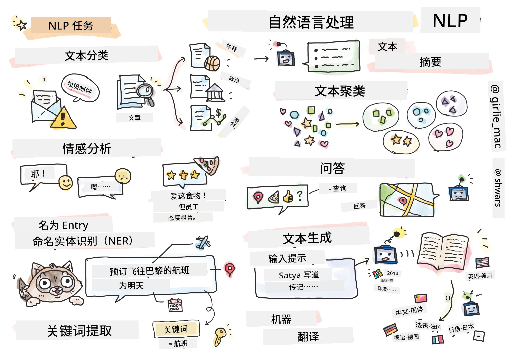

# 自然语言处理



在本节中，我们将重点使用神经网络处理与<strong>自然语言处理（NLP）</strong>相关的任务。我们希望计算机能够解决许多NLP问题：

* <strong>文本分类</strong>是一个典型的关于文本序列的分类问题。例子包括将电子邮件消息分类为垃圾邮件或非垃圾邮件，或将文章分类为体育、商业、政治等。同时，在开发聊天机器人时，我们常常需要理解用户的意图——这时我们处理的是<strong>意图分类</strong>。意图分类中通常需要处理很多类别。
<em> <strong>情感分析</strong>是一个典型的回归问题，我们需要给句子含义的正负程度赋予一个数值（情绪值）。情感分析的更高级版本是<strong>基于方面的情感分析</strong>（ABSA），我们不是对整个句子赋予情感，而是对句子的不同部分（方面）赋予情感，例如 </em>这家餐厅，我喜欢它的菜肴，但氛围很糟糕*。
<em> <strong>命名实体识别</strong>（NER）指的是从文本中提取特定实体的问题。例如，我们需要理解短语 </em>我明天需要飞往巴黎<em> 中，</em>明天<em> 指的是日期，</em>巴黎* 是位置。  
* <strong>关键词提取</strong>与NER类似，但我们需要自动提取对句子意义重要的词汇，而无需针对特定实体类型进行预训练。
* <strong>文本聚类</strong>在我们希望将相似句子归为一组时非常有用，例如，在技术支持对话中相似的请求。
* <strong>问答系统</strong>指模型回答具体问题的能力。模型输入一段文本和一个问题，需要在文本中找出包含问题答案的位置（或者有时直接生成答案文本）。
<em> <strong>文本生成</strong>是模型生成新文本的能力。它可以被视为一个基于某个</em>文本提示*预测下一个字母或单词的分类任务。先进的文本生成模型，如GPT-3，能够使用称为[提示编程](https://towardsdatascience.com/software-3-0-how-prompting-will-change-the-rules-of-the-game-a982fbfe1e0)或[提示工程](https://medium.com/swlh/openai-gpt-3-and-prompt-engineering-dcdc2c5fcd29)的技术解决其他NLP任务如分类。
* <strong>文本摘要</strong>是一种技术，我们希望计算机“阅读”长文本并将其总结成几句话。
* <strong>机器翻译</strong>可以视为一种在一种语言上理解文本，在另一种语言上生成文本的结合。

最初，大多数NLP任务是用传统方法如文法来解决的。例如，在机器翻译中，解析器用于将初始句子转换为语法树，然后提取更高层次的语义结构来表示句子的含义，基于这个含义和目标语言的文法生成结果。如今，许多NLP任务更有效的解决方法是使用神经网络。

> 许多经典的NLP方法在[自然语言处理工具包（NLTK）](https://www.nltk.org) Python库中实现。网上有一本很棒的[NLTK书籍](https://www.nltk.org/book/)，介绍了如何使用NLTK解决不同的NLP任务。

在我们的课程中，我们将主要关注使用神经网络处理NLP，并在需要时使用NLTK。

我们已经学习过如何使用神经网络处理表格数据和图像。这些数据与文本的主要区别在于，文本是可变长度的序列，而图像的输入大小是预先已知的。虽然卷积网络可从输入数据中提取模式，但文本中的模式更为复杂。例如，否定词与主语之间可以隔开任意多个词（如 <em>我不喜欢橙子</em>，和 <em>我不喜欢那些又大又好吃的彩色橙子</em>），但仍然应被视为一个模式。因此，为了处理语言，我们需要引入新的神经网络类型，如<em>循环网络</em>和<em>transformer</em>。

## 安装库

如果你在本地Python环境中运行本课程，可能需要使用以下命令安装所有NLP所需的库：

**对于PyTorch**
```bash
pip install -r requirements-pytorch.txt
```
**对于TensorFlow**
```bash
pip install -r requirements-tf.txt
```

> 你可以在[Microsoft Learn](https://docs.microsoft.com/learn/modules/intro-natural-language-processing-tensorflow/?WT.mc_id=academic-77998-cacaste)上尝试使用TensorFlow进行NLP

## GPU 注意事项

本节中，在一些示例里我们将训练相当大型的模型。
* **使用支持GPU的电脑**：建议在支持GPU的计算机上运行笔记本，以减少使用大型模型时等待的时间。
* **GPU内存限制**：使用GPU时，训练大型模型可能会导致GPU内存不足。
* **GPU内存消耗**：训练时消耗的GPU内存量取决于多个因素，包括小批量大小。
* <strong>尽可能减小小批量大小</strong>：遇到GPU内存问题时，可以尝试通过减小代码中的小批量大小来解决。
* **TensorFlow GPU内存释放**：较旧版本的TensorFlow在同一Python内核中训练多个模型时可能无法正确释放GPU内存。为有效管理GPU内存，你可以配置TensorFlow按需分配GPU内存。
* <strong>代码示例</strong>：要设置TensorFlow仅按需增长GPU内存分配，可在笔记本中加入以下代码：

```python
physical_devices = tf.config.list_physical_devices('GPU') 
if len(physical_devices)>0:
    tf.config.experimental.set_memory_growth(physical_devices[0], True) 
```

如果你对从经典机器学习的角度学习NLP感兴趣，请访问[这套课程](https://github.com/microsoft/ML-For-Beginners/tree/main/6-NLP)

## 本节内容
本节我们将学习：

* [将文本表示为张量](13-TextRep/README.md)
* [词嵌入](14-Embeddings/README.md)
* [语言模型](15-LanguageModeling/README.md)
* [循环神经网络](16-RNN/README.md)
* [生成网络](17-GenerativeNetworks/README.md)
* [Transformer](18-Transformers/README.md)

---

<!-- CO-OP TRANSLATOR DISCLAIMER START -->
**免责声明**：
本文件由 AI 翻译服务 [Co-op Translator](https://github.com/Azure/co-op-translator) 翻译完成。尽管我们力求准确，但请注意，自动翻译可能包含错误或不准确之处。原始语言版文件应视为权威来源。对于重要信息，建议使用专业人工翻译。我们对因使用本翻译而产生的任何误解或误释不承担责任。
<!-- CO-OP TRANSLATOR DISCLAIMER END -->