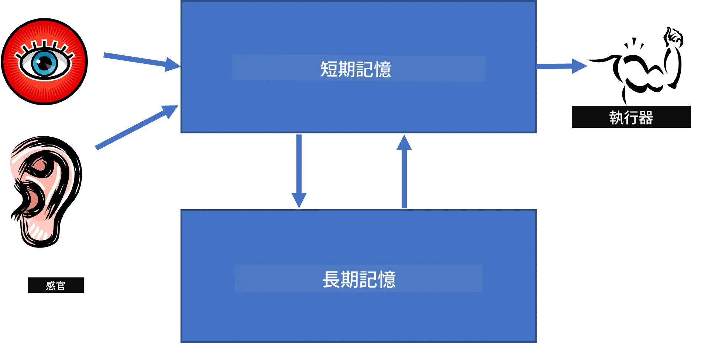
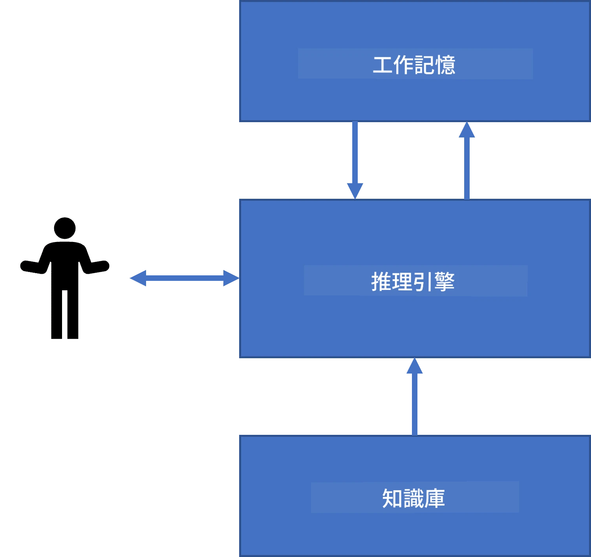
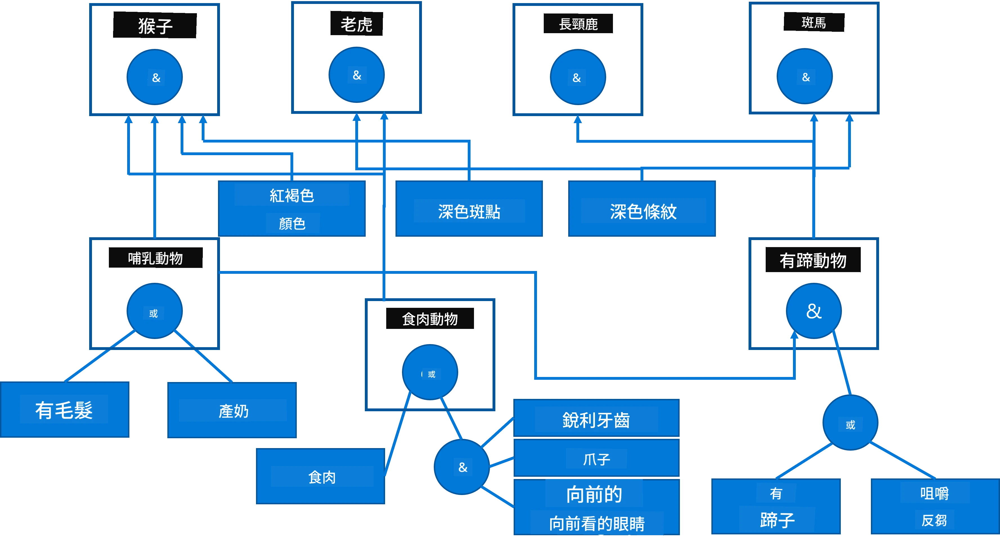
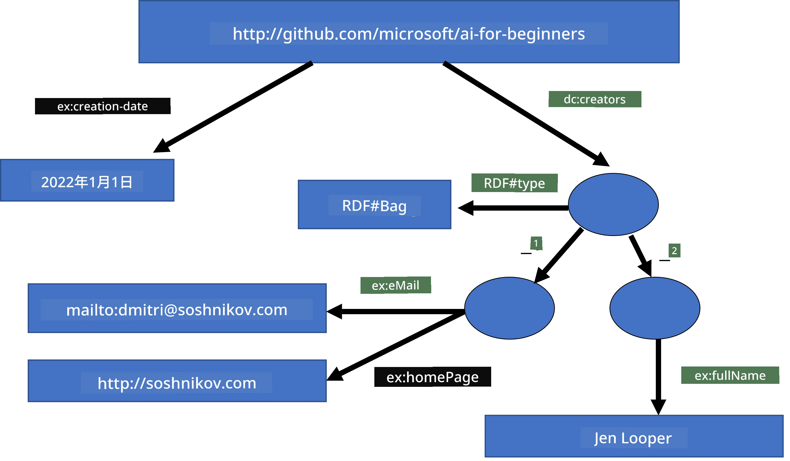

# 知識表徵與專家系統


> 速寫筆記作者：[Tomomi Imura](https://twitter.com/girlie_mac)

人工智能的追求基於對知識的探索，以類似人類的方式理解世界。但我們應該如何著手呢？

## [課前測驗](https://ff-quizzes.netlify.app/en/ai/quiz/3)

在 AI 早期，建立智能系統的自上而下方法（前一課提及）很受歡迎。這個理念是將人類知識轉換為機器可讀格式，然後用來自動解決問題。此方法基於兩個重要概念：

* 知識表徵
* 推理

## 知識表徵

符號 AI 中的一大重點是**知識**。需要區分知識和*信息*或*數據*。舉例來說，可以說書本包含知識，因為人可以通過研讀書本成為專家。然而，書中實則包含稱為*數據*的內容，通過閱讀書本並將這些數據整合進我們的世界模型，我們將數據轉化為知識。

> ✅ **知識**是儲存在我們腦中並代表我們對世界理解的東西。它是通過主動的**學習**過程獲得的，該過程將接收到的信息整合進我們對世界的主動模型中。

通常我們不會嚴格定義知識，而是通過[DIKW金字塔](https://en.wikipedia.org/wiki/DIKW_pyramid)將其與其他相關概念對齊。金字塔包含以下概念：

* **數據**是以物理媒介表達的，如書寫文字或口語。數據獨立於人類存在，且可以在人與人之間傳遞。
* **信息**是我們在頭腦中對數據的解讀。例如，當聽到「電腦」一詞，我們對其有一定的理解。
* **知識**是信息被整合進我們的世界模型。例如，一旦了解電腦的概念，我們開始知道它的運作方式、成本和用途。這一互相關聯的概念網形成了我們的知識。
* **智慧**則是對世界理解的更高層次，代表*元知識*，例如什麼時候以及如何使用該知識的概念。


*圖片來源：[維基百科](https://commons.wikimedia.org/w/index.php?curid=37705247)，作者 Longlivetheux，CC BY-SA 4.0*

因此，**知識表徵**問題就是尋找某種有效方式在計算機中以數據形式表示知識，讓它自動可用。這可以被視為一個光譜：


> 圖片作者：[Dmitry Soshnikov](http://soshnikov.com)

* 左側是計算機能高效使用的簡單知識表徵類型。最簡單的是算法式，即知識由計算機程序表達。但這並非最佳方法，因為不夠靈活。人腦中的知識往往不是算法式的。
* 右側是自然語言文本這類表徵。它最強大，但無法用於自動推理。

> ✅ 請花一分鐘思考你如何在腦中表徵知識並轉化為筆記？有沒有特定的格式幫助你記憶？

## 電腦知識表示的分類

我們可以將不同電腦知識表徵方法分為以下幾類：

* **網絡表示**基於人腦中存在一張互相關聯概念的網絡。我們可以嘗試在計算機中重建這種網絡，稱為**語義網絡**。

1. **物件-屬性-值三元組**或**屬性-值對**。因為圖形可以以節點和邊的列表實現，語義網絡可用三元組表示，包含物件、屬性和值。例如，我們構建以下關於程式語言的三元組：

物件 | 屬性 | 值
-------|-----------|------
Python | 是 | 未類型語言
Python | 發明者 | Guido van Rossum
Python | 區塊語法 | 縮排
未類型語言 | 沒有 | 型別定義

> ✅ 思考三元組如何被用來表示其它類型的知識。

2. **階層表示**強調我們在腦中常建構物件階層。例如，我們知道金絲雀是鳥，所有鳥都有翅膀。我們還知道金絲雀通常顏色與飛行速度。

   - **框架表示**將物件或物件類別表達為帶有**欄位**的**框架**。欄位有預設值、值限制，或可呼叫程序獲取欄位值。所有框架構成類似物件導向程式語言中的物件階層。
   - **情境**是特殊框架，代表可隨時間展開的複雜情境。

**Python**

欄位 | 值 | 預設值 | 範圍
-----|-------|---------------|----------
名稱 | Python | | |
種類 | 未類型語言 | | |
變數命名慣例 | | 駝峰式 | |
程式長度 | | | 5-5000 行 |
區塊語法 | 縮排 | | |

3. **程序表示**基於用可執行的動作列表表示知識，當某條件出現時可以執行。
   - 生產規則是 if-then 陳述，允許推斷結論。例如，醫生有規則說：**若**患者有高燒**或**血液C反應蛋白過高**則**患者有發炎反應**。當遇到條件成立，可做出發炎判斷，並用於後續推理。
   - 演算法可視為另一種程序表示，但幾乎不直接用於知識系統。

4. **邏輯**最初由亞里斯多德提出，作為表示普遍人類知識的方式。
   - 謂詞邏輯數學理論過於龐大難以計算，故使用其子集，如 Prolog 使用的Horn子句。
   - 描述邏輯是一系列邏輯系統，用於表示與推理物件階層及分散知識表示，如*語義網*。

## 專家系統

符號 AI 的早期成功之一是所謂的**專家系統**－設計用於有限問題領域做專家決策的計算機系統。基於從一位或多位專家手動提取的**知識庫**，並包含執行推理的**推理引擎**。

 | 
------------------------------|------------------------------
簡化的人類神經系統結構 | 知識系統架構

專家系統類似人類推理系統，具備**短期記憶**和**長期記憶**。同理，知識系統區分以下元件：

* **問題記憶**：包含目前正在解決問題的知識，如病人溫度、血壓、是否發炎等。此知識稱為**靜態知識**，因為它是當前問題情況的快照－所謂*問題狀態*。
* **知識庫**：表示問題領域的長期知識。由人類專家手動提取，於不同諮詢不變。因為它支持從一種問題狀態導航到另一種，也稱**動態知識**。
* **推理引擎**：協調整個問題狀態空間的搜索過程，必要時詢問使用者。也負責尋找適用規則於每種狀態。

舉例，考慮以下依據動物物理特徵判斷的專家系統：



> 圖片作者：[Dmitry Soshnikov](http://soshnikov.com)

此圖稱為**AND-OR樹**，是生產規則集的圖形表達。繪製樹形有助於知識提取初期。電腦內部表示知識時，更常用規則表示：

```
IF the animal eats meat
OR (animal has sharp teeth
    AND animal has claws
    AND animal has forward-looking eyes
) 
THEN the animal is a carnivore
```

你會注意到規則左側的每個條件和動作本質上都是物件-屬性-值（OAV）三元組。**工作記憶**包含當前解決問題相符的 OAV 三元組集合。**規則引擎**尋找條件符合的規則並執行，增添新的三元組到工作記憶。

> ✅ 在你喜歡的主題上寫寫自己的 AND-OR 樹吧！

### 正向推理與反向推理

上述過程稱為**正向推理**。從工作記憶中初始問題資料開始，然後進入下述推理循環：

1. 若目標屬性已在工作記憶中，停止並呈現結果
2. 查找所有條件符合的規則－得到**競爭集**（conflict set）
3. 執行**競爭解決**－選出當前步驟要執行的規則。可有不同策略：
   - 選擇知識庫中第一條可用規則
   - 隨機選擇規則
   - 選擇*更特定*的規則，滿足左側最多條件者
4. 執行選中規則，並將新知識插入問題狀態
5. 重複步驟 1

不過，有時可能想從空白問題知識開始，詢問使用者問題以導向結論。例如，醫療診斷時，通常不會在診斷開始前先做完整檢查，而是在決策需要時，再進行分析。

此過程可用**反向推理**建模。它以**目標**為驅動－尋找的屬性值：

1. 選擇所有可給出該目標值的規則（目標在右側）－形成競爭集
2. 若此屬性無規則，或規則指示應向使用者詢問，則提問，否則：
3. 依競爭解決策略選規則作為*假設*，試圖證明它
4. 對該規則左側所有屬性重複此過程，嘗試證明它們為目標
5. 若過程某處失敗，回第 3 步嘗試其它規則

> ✅ 哪些情況下正向推理較適合？反向推理又如何？

### 實作專家系統

專家系統可用不同工具實作：

* 直接用高階程式語言編寫。這不理想，因為知識系統的主優點是將知識和推理分離，專家可以不用理解推理細節就撰寫規則
* 使用**專家系統殼層**，即專為知識導入設計的系統，採用特定知識表示語言。

## ✍️ 練習：動物推理

查看 [Animals.ipynb](https://github.com/microsoft/AI-For-Beginners/blob/main/lessons/2-Symbolic/Animals.ipynb) 了解正向與反向推理專家系統實例。

> **注意**：本例較為簡單，只給出專家系統樣貌。一旦開始創建此類系統，需要累積約 200 條規則後才會出現某種*智能*行為。規則變得太複雜難以完全記憶時，你可能會開始想為何系統會做出某些決策。但知識系統重要特質是你總能*解釋*任何決策的來由。

## 本體與語義網

20 世紀末，有一項提案主張用知識表示註釋互聯網資源，使其可根據非常具體的查詢找到相應資源。這運動稱為**語義網**，依賴以下幾個概念：

- 基於**[描述邏輯](https://en.wikipedia.org/wiki/Description_logic)** (DL) 的特殊知識表示。它類似框架知識表示，建立有屬性的物件階層，但具邏輯語義與推理。描述邏輯有一整套子系統，於表達能力與推理算法複雜度間取捨平衡。
- 分散式知識表示，所有概念由全球 URI 識別符表示，使可建立跨 Internet 的知識階層。
- 一系列基於 XML 的知識描述語言：RDF（資源描述框架）、RDFS（RDF 架構）、OWL（本體網絡語言）。

語意網的一個核心概念是 **本體（Ontology）**。它指的是使用某種形式化知識表示對問題域的明確規範。最簡單的本體可以只是一個問題域中物件的層次結構，但較複雜的本體會包含可以用於推理的規則。

在語意網中，所有表示皆基於三元組。每個物件和每個關係都由 URI 唯一標識。例如，如果我們想表述這個 AI 課程是由 Dmitry Soshnikov 於 2022 年 1 月 1 日開發的——以下是我們可以使用的三元組：


```
http://github.com/microsoft/ai-for-beginners http://www.example.com/terms/creation-date “Jan 1, 2022”
http://github.com/microsoft/ai-for-beginners http://purl.org/dc/elements/1.1/creator http://soshnikov.com
```

> ✅ 這裡的 `http://www.example.com/terms/creation-date` 和 `http://purl.org/dc/elements/1.1/creator` 是一些眾所周知且被普遍接受的 URI，用以表達*創建者*和*創建日期*的概念。

在更加複雜的情況下，如果我們想定義一個創建者列表，可以使用 RDF 中定義的一些資料結構。



> 以上圖表由 [Dmitry Soshnikov](http://soshnikov.com) 提供

語意網的建設進度在某種程度上因搜尋引擎和自然語言處理技術的成功而放緩，這些技術允許從文本中提取結構化資料。然而，在某些領域仍有重大努力用於維護本體和知識庫。值得注意的幾個項目：

* [WikiData](https://wikidata.org/) 是與維基百科相關聯的機器可讀知識庫合集。大部分資料都從維基百科的 *資訊框（InfoBoxes）* 採集，即維基百科頁面內的結構化內容片段。你可以用 SPARQL —— 一種專門針對語意網的查詢語言 —— 來[查詢](https://query.wikidata.org/) wikidata。以下是一個顯示人類中最常見眼睛顏色的範例查詢：

```sparql
#defaultView:BubbleChart
SELECT ?eyeColorLabel (COUNT(?human) AS ?count)
WHERE
{
  ?human wdt:P31 wd:Q5.       # human instance-of homo sapiens
  ?human wdt:P1340 ?eyeColor. # human eye-color ?eyeColor
  SERVICE wikibase:label { bd:serviceParam wikibase:language "en". }
}
GROUP BY ?eyeColorLabel
```

* [DBpedia](https://www.dbpedia.org/) 是另一個類似於 WikiData 的努力。

> ✅ 如果你想嘗試建立自己的本體，或打開現有本體，有一個很棒的視覺本體編輯器叫做 [Protégé](https://protege.stanford.edu/)。下載它，或在線使用。


*Web Protégé 編輯器開啟羅曼諾夫家族本體。截圖由 Dmitry Soshnikov 提供*

## ✍️ 練習：家族本體

請參閱 [FamilyOntology.ipynb](https://github.com/Ezana135/AI-For-Beginners/blob/main/lessons/2-Symbolic/FamilyOntology.ipynb)，此範例使用語意網技術來推理家族關係。我們將採用以通用 GEDCOM 格式表示的家族系譜，以及家族關係的本體，構建指定個體集合中所有家族關係的圖譜。

## Microsoft 概念圖譜

大多數情況下，本體是由人手精心建立的。然而，也可以從非結構化資料中 **挖掘** 本體，例如從自然語言文本。

微軟研究院進行了這樣的嘗試，成果為 [Microsoft Concept Graph](https://blogs.microsoft.com/ai/microsoft-researchers-release-graph-that-helps-machines-conceptualize/?WT.mc_id=academic-77998-cacaste)。

這是個將實體依靠 `is-a` 繼承關係分組的大型集合。它允許回答「什麼是微軟？」這類問題——答案可能是「微軟是一家公司，概率 0.87，並且是一個品牌，概率 0.75」。

此圖譜可透過 REST API 存取，或以大型可下載純文字檔形式列出所有實體對。

## ✍️ 練習：概念圖譜

請嘗試 [MSConceptGraph.ipynb](https://github.com/microsoft/AI-For-Beginners/blob/main/lessons/2-Symbolic/MSConceptGraph.ipynb) 筆記本，了解如何利用 Microsoft 概念圖譜將新聞文章分組到若干類別。

## 結論

當今，人工智慧通常被視為 *機器學習* 或 *神經網絡* 的同義語。然而，人類也展現明確推理能力，這是神經網絡目前尚未處理的。在現實世界的專案中，仍會使用明確推理來完成需要說明或能以受控方式修改系統行為的任務。

## 🚀 挑戰

在本課程附帶的 Family Ontology 筆記本中，有機會嘗試探索其他家族關係。試著發現家譜中人物間的新連結。

## [課後測驗](https://ff-quizzes.netlify.app/en/ai/quiz/4)

## 複習與自學

上網搜尋人類嘗試量化和編纂知識的領域。看看布魯姆的分類法，回顧人類如何在歷史上嘗試理解世界。探索林奈（Linnaeus）創建生物分類學的工作，觀察德米特里·孟德列夫如何創造化學元素的描述與分組方法。你還能找到哪些其他有趣的例子？

**作業**: [建立一個本體](assignment.md)

---

<!-- CO-OP TRANSLATOR DISCLAIMER START -->
**免責聲明**：  
本文件由 AI 翻譯服務 [Co-op Translator](https://github.com/Azure/co-op-translator) 進行翻譯。雖然我們致力於確保翻譯的準確性，但自動翻譯可能存在錯誤或不準確之處。原文文件應被視為正式及權威的版本。如涉及重要資訊，建議尋求專業人士進行人工翻譯。我們不對因使用此翻譯而產生的任何誤解或誤釋負責。
<!-- CO-OP TRANSLATOR DISCLAIMER END -->