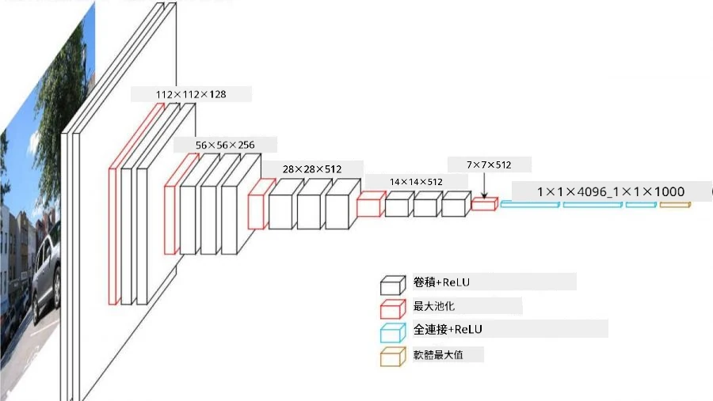
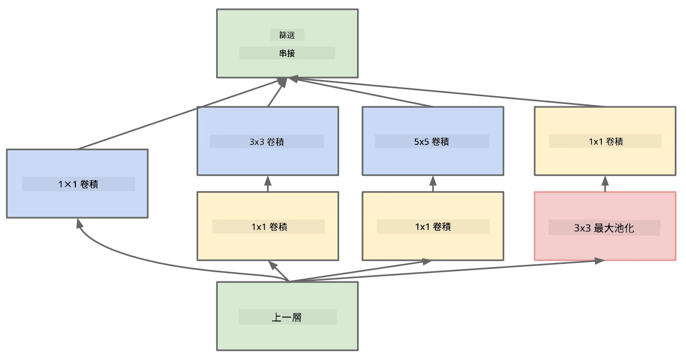

# 著名的 CNN 架構

### VGG-16

VGG-16 是一個在 2014 年 ImageNet top-5 分類中達到 92.7% 準確率的網絡。它的層結構如下：

如你所見，VGG 採用了傳統的金字塔架構，即一系列的卷積-池化層。

> 圖片來源：[Researchgate](https://www.researchgate.net/figure/Vgg16-model-structure-To-get-the-VGG-NIN-model-we-replace-the-2-nd-4-th-6-th-7-th_fig2_335194493)

### ResNet

ResNet 是由 Microsoft Research 在 2015 年提出的一系列模型。ResNet 的核心思想是使用 **殘差塊**：

> 圖片來源：[這篇論文](https://arxiv.org/pdf/1512.03385.pdf)

使用身份直通的原因是讓我們的層預測 **前一層結果與殘差塊輸出之間的差異**，因此得名 *殘差*。這些塊更容易訓練，並且可以構建包含數百個這樣的塊的網絡（最常見的變體包括 ResNet-52、ResNet-101 和 ResNet-152）。

你也可以將這個網絡理解為能根據數據集調整其複雜度。最初，在開始訓練網絡時，權重值較小，大部分信號通過身份直通層。隨著訓練的進展，權重變得更大，網絡參數的重要性增加，網絡會調整以適應所需的表達能力，從而正確分類訓練圖像。

### Google Inception

Google Inception 架構將這個想法更進一步，將每個網絡層構建為多條不同路徑的組合：

> 圖片來源：[Researchgate](https://www.researchgate.net/figure/Inception-module-with-dimension-reductions-left-and-schema-for-Inception-ResNet-v1_fig2_355547454)

在這裡，我們需要強調 1x1 卷積的作用，因為一開始它似乎沒有意義。為什麼需要用 1x1 的濾波器掃描圖像？然而，你需要記住，卷積濾波器也會處理多個深度通道（最初是 RGB 顏色，在後續層中是不同濾波器的通道），而 1x1 卷積用於通過不同的可訓練權重混合這些輸入通道。它也可以被視為在通道維度上的降采樣（池化）。

這裡有一篇[關於 1x1 卷積的好文章](https://medium.com/analytics-vidhya/talented-mr-1x1-comprehensive-look-at-1x1-convolution-in-deep-learning-f6b355825578)，以及[原始論文](https://arxiv.org/pdf/1312.4400.pdf)。

### MobileNet

MobileNet 是一系列適合移動設備的縮小版模型。如果你的資源有限，並且可以接受稍微降低的準確率，可以使用它們。其核心思想是所謂的 **深度可分離卷積**，它允許通過空間卷積和深度通道上的 1x1 卷積的組合來表示卷積濾波器。這大大減少了參數數量，使網絡尺寸更小，也更容易用較少的數據進行訓練。

這裡有一篇[關於 MobileNet 的好文章](https://medium.com/analytics-vidhya/image-classification-with-mobilenet-cc6fbb2cd470)。

## 結論

在這一單元中，你已經學習了計算機視覺神經網絡的主要概念——卷積網絡。用於圖像分類、物體檢測，甚至圖像生成的實際架構都基於 CNN，只是層數更多，並且加入了一些額外的訓練技巧。

## 🚀 挑戰

在附帶的筆記本中，底部有關於如何獲得更高準確率的筆記。進行一些實驗，看看你是否能達到更高的準確率。

## [課後測驗](https://ff-quizzes.netlify.app/en/ai/quiz/14)

## 回顧與自學

雖然 CNN 最常用於計算機視覺任務，但它們通常也適合提取固定大小的模式。例如，如果我們處理聲音，我們可能也希望使用 CNN 在音頻信號中尋找某些特定模式——在這種情況下，濾波器將是 1 維的（這種 CNN 被稱為 1D-CNN）。此外，有時也會使用 3D-CNN 來提取多維空間中的特徵，例如視頻中發生的某些事件——CNN 可以捕捉特徵隨時間變化的某些模式。進行一些回顧和自學，了解 CNN 還可以完成哪些其他任務。

## [作業](lab/README.md)

在這次實驗中，你的任務是分類不同的貓和狗品種。這些圖像比 MNIST 數據集更複雜，尺寸更高，並且有超過 10 個類別。

---

