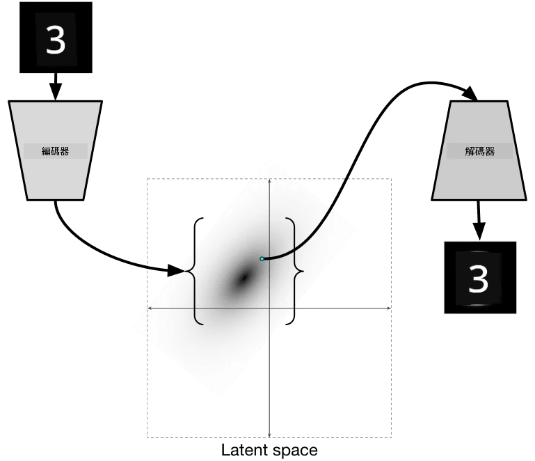

# 自動編碼器

在訓練 CNN 時，其中一個問題是需要大量標註的數據。在圖像分類的情況下，我們需要將圖像分成不同的類別，這是一項手動工作。

## [課前測驗](https://ff-quizzes.netlify.app/en/ai/quiz/17)

然而，我們可能希望使用原始（未標註）的數據來訓練 CNN 特徵提取器，這被稱為**自監督學習**。在這種情況下，我們使用訓練圖像作為網絡的輸入和輸出。**自動編碼器**的主要思想是，我們會有一個**編碼器網絡**，將輸入圖像轉換為某種**潛在空間**（通常是一個較小尺寸的向量），然後通過**解碼器網絡**來重建原始圖像。

> ✅ [自動編碼器](https://wikipedia.org/wiki/Autoencoder) 是“一種用於學習未標註數據的高效編碼的人工神經網絡。”

由於我們訓練自動編碼器以捕捉原始圖像中的盡可能多的信息以進行準確重建，網絡會嘗試找到最佳的**嵌入**方式來捕捉輸入圖像的含義。

> 圖片來源：[Keras 博客](https://blog.keras.io/building-autoencoders-in-keras.html)

## 使用自動編碼器的場景

雖然重建原始圖像本身似乎並不有用，但在某些場景下，自動編碼器非常有用：

* **降低圖像的維度以進行可視化**或**訓練圖像嵌入**。通常，自動編碼器比 PCA 效果更好，因為它考慮了圖像的空間特性和層次特徵。
* **去噪**，即去除圖像中的噪點。由於噪點包含大量無用信息，自動編碼器無法將所有噪點壓縮到相對較小的潛在空間，因此它只捕捉圖像的重要部分。在訓練去噪器時，我們以原始圖像為起點，並使用人工添加噪點的圖像作為自動編碼器的輸入。
* **超分辨率**，即提高圖像分辨率。我們以高分辨率圖像為起點，並使用低分辨率圖像作為自動編碼器的輸入。
* **生成模型**。一旦我們訓練了自動編碼器，解碼器部分可以用來從隨機潛在向量生成新物體。

## 變分自動編碼器 (VAE)

傳統的自動編碼器以某種方式降低輸入數據的維度，找出輸入圖像的重要特徵。然而，潛在向量通常沒有太多意義。換句話說，以 MNIST 數據集為例，找出哪些數字對應於不同的潛在向量並不容易，因為相近的潛在向量不一定對應於相同的數字。

另一方面，為了訓練*生成*模型，了解潛在空間會更好。這一想法引導我們走向**變分自動編碼器** (VAE)。

VAE 是一種自動編碼器，它學習預測潛在參數的*統計分佈*，即所謂的**潛在分佈**。例如，我們可能希望潛在向量呈正態分佈，具有某些均值 zmean 和標準差 zsigma（均值和標準差都是某個維度 d 的向量）。VAE 的編碼器學習預測這些參數，然後解碼器從該分佈中取隨機向量以重建物體。

總結如下：

 * 從輸入向量中，我們預測 `z_mean` 和 `z_log_sigma`（不是直接預測標準差，而是預測其對數）
 * 從分佈 N(zmean,exp(zlog\_sigma)) 中抽樣一個向量 `sample`
 * 解碼器嘗試使用 `sample` 作為輸入向量解碼原始圖像

 

> 圖片來源：[這篇博客文章](https://ijdykeman.github.io/ml/2016/12/21/cvae.html) 作者 Isaak Dykeman

變分自動編碼器使用一個由兩部分組成的複雜損失函數：

* **重建損失**是顯示重建圖像與目標圖像有多接近的損失函數（可以是均方誤差，或 MSE）。這與普通自動編碼器的損失函數相同。
* **KL 損失**，確保潛在變量分佈接近正態分佈。它基於 [Kullback-Leibler 散度](https://www.countbayesie.com/blog/2017/5/9/kullback-leibler-divergence-explained) 的概念——一種估算兩個統計分佈相似程度的度量。

VAE 的一個重要優勢是它使生成新圖像變得相對容易，因為我們知道從哪個分佈中抽樣潛在向量。例如，如果我們在 MNIST 上用 2D 潛在向量訓練 VAE，我們可以改變潛在向量的組件以獲得不同的數字：

> 圖片來源：[Dmitry Soshnikov](http://soshnikov.com)

觀察圖像如何相互融合，當我們開始從潛在參數空間的不同部分獲取潛在向量時。我們還可以在 2D 中可視化這個空間：

 

> 圖片來源：[Dmitry Soshnikov](http://soshnikov.com)

## ✍️ 練習：自動編碼器

在以下筆記本中了解更多關於自動編碼器的內容：

* [TensorFlow 中的自動編碼器](AutoencodersTF.ipynb)
* [PyTorch 中的自動編碼器](AutoEncodersPyTorch.ipynb)

## 自動編碼器的特性

* **數據特定** - 它們僅適用於訓練時使用的圖像類型。例如，如果我們在花卉上訓練超分辨率網絡，它在肖像上效果不佳。這是因為網絡可以通過從訓練數據集中學到的特徵中提取細節來生成高分辨率圖像。
* **有損** - 重建的圖像與原始圖像並不完全相同。損失的性質由訓練期間使用的*損失函數*定義。
* 適用於**未標註數據**

## [課後測驗](https://ff-quizzes.netlify.app/en/ai/quiz/18)

## 結論

在本課中，您學習了 AI 科學家可用的各種類型的自動編碼器。您學習了如何構建它們，以及如何使用它們重建圖像。您還學習了 VAE 以及如何使用它生成新圖像。

## 🚀 挑戰

在本課中，您學習了如何使用自動編碼器處理圖像。但它們也可以用於音樂！查看 Magenta 項目的 [MusicVAE](https://magenta.tensorflow.org/music-vae) 項目，它使用自動編碼器學習重建音樂。使用此庫進行一些[實驗](https://colab.research.google.com/github/magenta/magenta-demos/blob/master/colab-notebooks/Multitrack_MusicVAE.ipynb)，看看您能創造出什麼。

## [課後測驗](https://ff-quizzes.netlify.app/en/ai/quiz/16)

## 回顧與自學

作為參考，您可以在以下資源中閱讀更多關於自動編碼器的內容：

* [在 Keras 中構建自動編碼器](https://blog.keras.io/building-autoencoders-in-keras.html)
* [NeuroHive 博客文章](https://neurohive.io/ru/osnovy-data-science/variacionnyj-avtojenkoder-vae/)
* [變分自動編碼器解析](https://kvfrans.com/variational-autoencoders-explained/)
* [條件變分自動編碼器](https://ijdykeman.github.io/ml/2016/12/21/cvae.html)

## 作業

在 [使用 TensorFlow 的筆記本](AutoencodersTF.ipynb) 的末尾，您會找到一個“任務”——將其作為您的作業。

---

