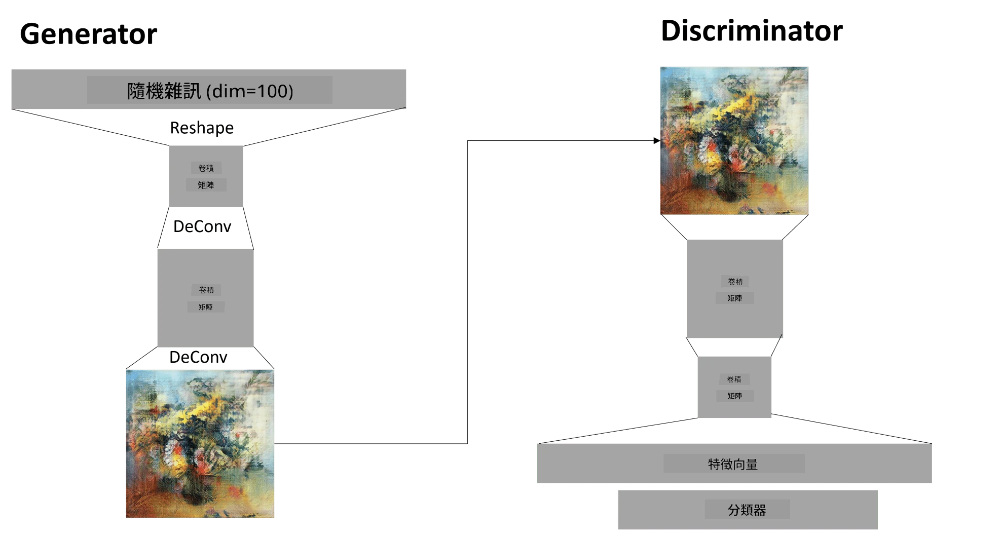

# 生成對抗網絡

在上一節中，我們學習了**生成模型**：能夠生成與訓練數據集中的圖像相似的新圖像的模型。VAE 是生成模型的一個好例子。

## [課前測驗](https://ff-quizzes.netlify.app/en/ai/quiz/19)

然而，如果我們嘗試生成一些真正有意義的東西，比如一幅合理分辨率的畫作，使用 VAE 可能會發現訓練效果不佳。針對這種需求，我們需要了解另一種專門針對生成模型的架構——**生成對抗網絡**，簡稱 GAN。

GAN 的核心思想是使用兩個神經網絡相互對抗進行訓練：

> 圖片來源：[Dmitry Soshnikov](http://soshnikov.com)

> ✅ 一些術語：
> * **生成器**是一個網絡，它接收一些隨機向量並生成圖像作為結果。
> * **判別器**是一個網絡，它接收一張圖像並判斷該圖像是真實圖像（來自訓練數據集）還是由生成器生成的。它本質上是一個圖像分類器。

### 判別器

判別器的架構與普通的圖像分類網絡並無不同。最簡單的情況下，它可以是一個全連接分類器，但更常見的是使用[卷積網絡](../07-ConvNets/README.md)。

> ✅ 基於卷積網絡的 GAN 被稱為 [DCGAN](https://arxiv.org/pdf/1511.06434.pdf)

CNN 判別器由以下層組成：幾個卷積+池化層（空間尺寸逐漸減小），以及一個或多個全連接層以獲得“特徵向量”，最後是一個二元分類器。

> ✅ 在這裡，“池化”是一種減少圖像尺寸的技術。“池化層通過將一層中神經元集群的輸出合併到下一層的一個神經元中來減少數據的維度。” - [來源](https://wikipedia.org/wiki/Convolutional_neural_network#Pooling_layers)

### 生成器

生成器稍微複雜一些。可以將其視為判別器的反向版本。從一個潛在向量（代替特徵向量）開始，它使用一個全連接層將其轉換為所需的尺寸/形狀，然後進行反卷積+上採樣。這類似於[自編碼器](../09-Autoencoders/README.md)的*解碼器*部分。

> ✅ 由於卷積層是通過線性濾波器遍歷圖像來實現的，反卷積本質上與卷積相似，可以使用相同的層邏輯來實現。

> 圖片來源：[Dmitry Soshnikov](http://soshnikov.com)

### 訓練 GAN

GAN 被稱為**對抗性**，因為生成器和判別器之間存在持續的競爭。在這種競爭中，生成器和判別器都會改進，從而使網絡學習生成越來越好的圖像。

訓練分為兩個階段：

* **訓練判別器**。這個任務相對簡單：我們生成一批由生成器生成的圖像，標記為 0（代表假圖像），並從輸入數據集中取一批圖像（標記為 1，真實圖像）。我們獲得一些*判別器損失*，然後進行反向傳播。
* **訓練生成器**。這稍微複雜一些，因為我們無法直接知道生成器的期望輸出。我們將整個 GAN 網絡（由生成器和判別器組成）輸入一些隨機向量，期望結果為 1（對應於真實圖像）。然後我們凍結判別器的參數（此步驟不希望判別器被訓練），並進行反向傳播。

在此過程中，生成器和判別器的損失通常不會顯著下降。在理想情況下，它們應該呈現振盪，表明兩個網絡都在改進其性能。

## ✍️ 練習：GANs

* [TensorFlow/Keras 的 GAN Notebook](GANTF.ipynb)
* [PyTorch 的 GAN Notebook](GANPyTorch.ipynb)

### GAN 訓練的問題

GAN 以訓練困難而聞名。以下是一些常見問題：

* **模式崩塌**。這指的是生成器學會生成一個成功欺騙判別器的圖像，而不是生成多樣化的圖像。
* **對超參數的敏感性**。有時 GAN 可能完全無法收斂，但突然降低學習率後可能會收斂。
* **保持生成器和判別器之間的平衡**。在許多情況下，判別器的損失可能會迅速降到零，導致生成器無法進一步訓練。為了解決這個問題，我們可以嘗試為生成器和判別器設置不同的學習率，或者在判別器損失已經很低時跳過判別器的訓練。
* **高分辨率訓練**。與自編碼器的問題類似，重建太多層的卷積網絡會導致伪影。通常通過所謂的**漸進式增長**來解決此問題，首先在低分辨率圖像上訓練幾層，然後“解鎖”或添加層。另一種解決方案是增加層之間的額外連接並同時訓練多個分辨率——詳情請參閱這篇[多尺度梯度 GANs 論文](https://arxiv.org/abs/1903.06048)。

## 風格遷移

GAN 是生成藝術圖像的絕佳方式。另一種有趣的技術是所謂的**風格遷移**，它將一張**內容圖像**重新繪製成不同的風格，應用來自**風格圖像**的濾鏡。

其工作原理如下：
* 我們從一張隨機噪聲圖像開始（或者從內容圖像開始，但為了便於理解，從隨機噪聲開始更容易）
* 我們的目標是創建一張既接近內容圖像又接近風格圖像的圖像。這由兩個損失函數決定：
   - **內容損失**基於 CNN 從當前圖像和內容圖像的某些層提取的特徵計算
   - **風格損失**通過使用 Gram 矩陣在當前圖像和風格圖像之間進行巧妙計算（更多細節請參閱[示例 Notebook](StyleTransfer.ipynb)）
* 為了使圖像更平滑並去除噪聲，我們還引入了**變異損失**，它計算相鄰像素之間的平均距離
* 主優化循環使用梯度下降（或其他優化算法）調整當前圖像以最小化總損失，總損失是所有三個損失的加權和。

## ✍️ 示例：[風格遷移](StyleTransfer.ipynb)

## [課後測驗](https://ff-quizzes.netlify.app/en/ai/quiz/20)

## 總結

在本課中，你學習了 GANs 及其訓練方法。你還了解了這類神經網絡可能面臨的特殊挑戰，以及一些解決這些挑戰的策略。

## 🚀 挑戰

使用你的圖像運行[風格遷移 Notebook](StyleTransfer.ipynb)。

## 回顧與自學

參考以下資源以了解更多關於 GANs 的信息：

* Marco Pasini，[我一年訓練 GANs 的 10 個教訓](https://towardsdatascience.com/10-lessons-i-learned-training-generative-adversarial-networks-gans-for-a-year-c9071159628)
* [StyleGAN](https://en.wikipedia.org/wiki/StyleGAN)，一個值得考慮的 GAN 架構
* [在 Azure ML 上使用 GANs 創建生成藝術](https://soshnikov.com/scienceart/creating-generative-art-using-gan-on-azureml/)

## 作業

重新訪問本課程相關的兩個 Notebook 中的一個，並使用自己的圖像重新訓練 GAN。你能創造出什麼？

---

