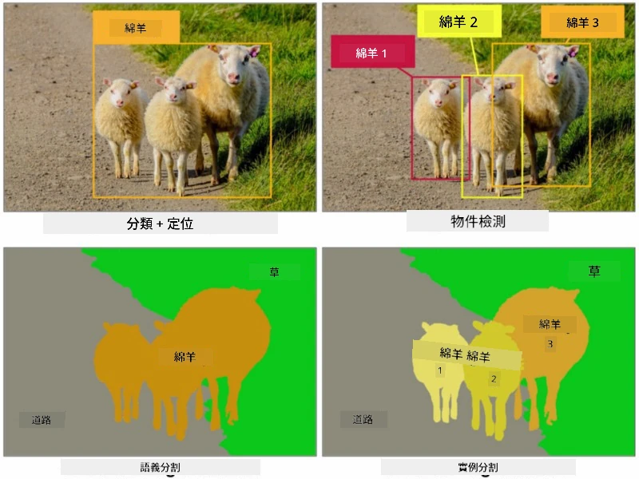

# 分割

我們之前學過物件偵測，它可以透過預測物件的*邊界框*來定位影像中的物件。然而，對於某些任務，我們不僅需要邊界框，還需要更精確的物件定位。這項任務稱為**分割**。

## [課前測驗](https://ff-quizzes.netlify.app/en/ai/quiz/23)

分割可以被視為**像素分類**，即對影像中的**每個**像素進行分類，並預測其類別（*背景*也是其中一個類別）。主要有兩種分割算法：

* **語義分割**僅告訴像素的類別，並不區分同一類別的不同物件。
* **實例分割**將類別分成不同的實例。

例如，在實例分割中，這些羊是不同的物件；但在語義分割中，所有的羊都被表示為同一類別。

> 圖片來源：[這篇部落格文章](https://nirmalamurali.medium.com/image-classification-vs-semantic-segmentation-vs-instance-segmentation-625c33a08d50)

有多種神經網絡架構可用於分割，但它們的結構都相似。某種程度上，它與你之前學過的自編碼器相似，但我們的目標不是解構原始影像，而是解構**遮罩**。因此，分割網絡包含以下部分：

* **編碼器**：從輸入影像中提取特徵。
* **解碼器**：將這些特徵轉換為**遮罩影像**，其大小與輸入影像相同，通道數對應於類別數。

> 圖片來源：[這篇出版物](https://arxiv.org/pdf/2001.05566.pdf)

特別需要提到的是分割中使用的損失函數。在使用傳統自編碼器時，我們需要測量兩個影像之間的相似性，可以使用均方誤差（MSE）來完成。在分割中，目標遮罩影像中的每個像素代表類別編號（在第三維度上進行獨熱編碼），因此我們需要使用特定於分類的損失函數——交叉熵損失，並對所有像素進行平均。如果遮罩是二元的，則使用**二元交叉熵損失**（BCE）。

> ✅ 獨熱編碼是一種將類別標籤編碼為向量的方法，其長度等於類別數。可以參考[這篇文章](https://datagy.io/sklearn-one-hot-encode/)了解這項技術。

## 醫學影像中的分割

在本課中，我們將通過訓練網絡來識別醫學影像中的人類痣（也稱為痣），以實現分割。我們將使用<a href="https://www.fc.up.pt/addi/ph2%20database.html">PH2資料庫</a>的皮膚鏡影像作為影像來源。該資料集包含200張影像，分為三類：典型痣、不典型痣和黑色素瘤。所有影像還包含相應的**遮罩**，用於勾勒痣的輪廓。

> ✅ 這項技術特別適合這類醫學影像，但你能想到其他現實世界中的應用嗎？

> 圖片來源：PH2資料庫

我們將訓練一個模型，將任何痣從背景中分割出來。

## ✍️ 練習：語義分割

打開以下筆記本，了解不同的語義分割架構，練習使用它們，並觀察它們的實際效果。

* [語義分割 Pytorch](SemanticSegmentationPytorch.ipynb)
* [語義分割 TensorFlow](SemanticSegmentationTF.ipynb)

## [課後測驗](https://ff-quizzes.netlify.app/en/ai/quiz/24)

## 結論

分割是一種非常強大的影像分類技術，超越了邊界框，實現了像素級分類。它在醫學影像等領域有著廣泛的應用。

## 🚀 挑戰

人體分割只是我們可以對人物影像進行的常見任務之一。其他重要任務包括**骨架偵測**和**姿態偵測**。試試[OpenPose](https://github.com/CMU-Perceptual-Computing-Lab/openpose)庫，看看姿態偵測的應用。

## 回顧與自學

這篇[維基百科文章](https://wikipedia.org/wiki/Image_segmentation)提供了該技術的各種應用概述。自行了解該領域中的實例分割和全景分割的子領域。

## [作業](lab/README.md)

在本次實驗中，使用 [Segmentation Full Body MADS Dataset](https://www.kaggle.com/datasets/tapakah68/segmentation-full-body-mads-dataset) 資料集，嘗試進行**人體分割**。

---

