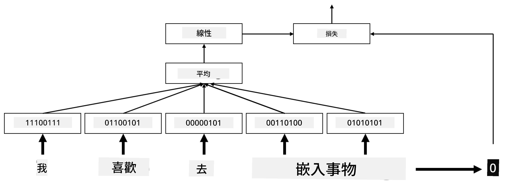
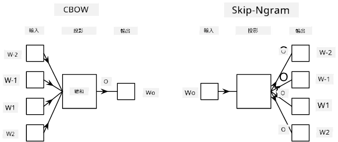

# 嵌入

## [課前測驗](https://ff-quizzes.netlify.app/en/ai/quiz/27)

在基於 BoW 或 TF/IDF 訓練分類器時，我們操作的是高維度的詞袋向量，其長度為 `vocab_size`，並且我們明確地將低維度的位置信息表示向量轉換為稀疏的單熱編碼表示。然而，這種單熱編碼表示並不具備記憶效率。此外，每個詞都被獨立對待，即單熱編碼向量無法表達詞與詞之間的語義相似性。

**嵌入**的概念是用低維度的密集向量來表示詞，這些向量能夠在某種程度上反映詞的語義。我們稍後會討論如何構建有意義的詞嵌入，但現在先將嵌入理解為一種降低詞向量維度的方法。

嵌入層會將一個詞作為輸入，並生成指定 `embedding_size` 的輸出向量。某種程度上，它與 `Linear` 層非常相似，但嵌入層不需要單熱編碼向量作為輸入，而是可以直接接受詞的編號作為輸入，從而避免創建大型的單熱編碼向量。

通過在分類器網絡中使用嵌入層作為第一層，我們可以從詞袋模型切換到 **嵌入袋** 模型。在嵌入袋模型中，我們首先將文本中的每個詞轉換為相應的嵌入，然後對所有嵌入計算某種聚合函數，例如 `sum`、`average` 或 `max`。

> 圖片由作者提供

## ✍️ 練習：嵌入

繼續學習以下筆記本：
* [使用 PyTorch 的嵌入](EmbeddingsPyTorch.ipynb)
* [使用 TensorFlow 的嵌入](EmbeddingsTF.ipynb)

## 語義嵌入：Word2Vec

雖然嵌入層學會了將詞映射到向量表示，但這種表示未必具有太多語義上的意義。我們希望學習一種向量表示，使得相似詞或同義詞在某種向量距離（例如歐幾里得距離）上彼此接近。

為了實現這一點，我們需要以特定方式在大量文本上預訓練嵌入模型。一種訓練語義嵌入的方法叫做 [Word2Vec](https://en.wikipedia.org/wiki/Word2vec)。它基於兩種主要架構來生成詞的分佈式表示：

 - **連續詞袋** (CBoW) —— 在這種架構中，我們訓練模型根據上下文預測詞。給定 ngram $(W_{-2},W_{-1},W_0,W_1,W_2)$，模型的目標是根據 $(W_{-2},W_{-1},W_1,W_2)$ 預測 $W_0$。
 - **連續跳詞模型** (Skip-Gram) 則與 CBoW 相反。模型使用上下文窗口中的詞來預測當前詞。

CBoW 的速度更快，而 Skip-Gram 雖然較慢，但在表示不常見詞方面效果更好。

> 圖片來源：[這篇論文](https://arxiv.org/pdf/1301.3781.pdf)

Word2Vec 預訓練嵌入（以及其他類似模型，例如 GloVe）也可以用於神經網絡中的嵌入層。然而，我們需要處理詞彙表，因為用於預訓練 Word2Vec/GloVe 的詞彙表可能與我們文本語料庫中的詞彙表不同。查看上述筆記本，了解如何解決這個問題。

## 上下文嵌入

傳統的預訓練嵌入表示（例如 Word2Vec）的一個主要限制是詞義消歧問題。雖然預訓練嵌入可以捕捉詞在上下文中的部分含義，但每個詞的所有可能含義都被編碼到同一嵌入中。這可能會在下游模型中引發問題，因為許多詞（例如 "play"）的含義會根據使用的上下文而有所不同。

例如，詞 "play" 在以下兩個句子中的含義完全不同：

- 我去劇院看了一場 **戲劇**。
- John 想和朋友一起 **玩**。

上述預訓練嵌入將 "play" 的這兩種含義表示為同一嵌入。為了解決這一限制，我們需要基於 **語言模型** 構建嵌入，該模型在大量文本語料庫上訓練，並且*了解*詞如何在不同上下文中組合。討論上下文嵌入超出了本教程的範圍，但我們會在課程後續討論語言模型時回到這個話題。

## 結論

在本課中，你學習了如何在 TensorFlow 和 PyTorch 中構建和使用嵌入層，以更好地反映詞的語義。

## 🚀 挑戰

Word2Vec 已被用於一些有趣的應用，包括生成歌曲歌詞和詩歌。查看 [這篇文章](https://www.politetype.com/blog/word2vec-color-poems)，了解作者如何使用 Word2Vec 生成詩歌。還可以觀看 [Dan Shiffmann 的這段視頻](https://www.youtube.com/watch?v=LSS_bos_TPI&ab_channel=TheCodingTrain)，了解該技術的另一種解釋。然後嘗試將這些技術應用到你自己的文本語料庫中，或許可以從 Kaggle 獲取數據。

## [課後測驗](https://ff-quizzes.netlify.app/en/ai/quiz/28)

## 回顧與自學

閱讀這篇關於 Word2Vec 的論文：[Efficient Estimation of Word Representations in Vector Space](https://arxiv.org/pdf/1301.3781.pdf)

## [作業：筆記本](assignment.md)

---

