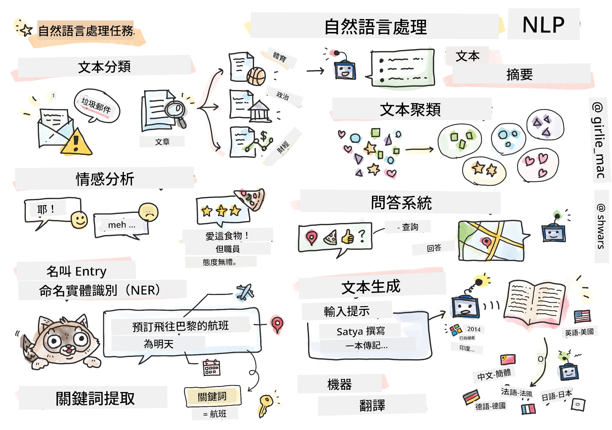

# 自然語言處理



在本節中，我們將專注於使用神經網絡來處理與<strong>自然語言處理（NLP）</strong>相關的任務。有許多NLP問題是我們希望計算機能夠解決的：

* <strong>文本分類</strong> 是一種典型的與文本序列相關的分類問題。例如將電子郵件訊息分類為垃圾郵件或非垃圾郵件，或將文章分類為體育、商業、政治等類別。此外，在開發聊天機器人時，我們經常需要理解用戶想表達的意圖——在這種情況下我們要處理的是<strong>意圖分類</strong>。通常，在意圖分類中我們需要處理多個類別。
<em> <strong>情感分析</strong> 是一種典型的回歸問題，我們需要賦予一個數字（情感分數），代表句子的意義是多麼正面或負面。更高階的情感分析版本是<strong>基於方面的情感分析</strong>（ABSA），我們不是將情感賦予整個句子，而是賦予句子的不同部分（方面），例如 </em>這間餐廳，我喜歡料理，但氣氛非常糟糕*。
<em> <strong>命名實體識別</strong>（NER）指的是從文本中提取特定實體的問題。例如，我們可能需要理解在短語 </em>我明天需要飛往巴黎<em> 中，</em>明天<em> 指的是日期，</em>巴黎* 是地點。  
* <strong>關鍵詞抽取</strong> 與NER相似，但我們需要自動抽取對句子意義重要的詞，且無需針對特定實體類型預先訓練。
* <strong>文本聚類</strong> 在我們想將相似句子歸類在一起時非常有用，例如技術支援對話中相似的請求。
* <strong>問答系統</strong> 指模型回應特定問題的能力。模型接收一段文本和一個問題作為輸入，並需要指出文本中包含該問題答案的位置（有時也可能直接生成答案文本）。
<em> <strong>文本生成</strong> 是模型生成新文本的能力。這可以被視為一種分類任務，根據某段</em>文本提示*預測下一個字母/詞。先進的文本生成模型，如GPT-3，能使用稱為 [prompt programming](https://towardsdatascience.com/software-3-0-how-prompting-will-change-the-rules-of-the-game-a982fbfe1e0) 或 [prompt engineering](https://medium.com/swlh/openai-gpt-3-and-prompt-engineering-dcdc2c5fcd29) 的技巧來解決其它NLP任務如分類。
* <strong>文本摘要</strong> 是一種技術，當我們希望電腦「閱讀」長文本並用幾句話來總結時使用。
* <strong>機器翻譯</strong> 可以被視為一種將一種語言的文本理解與另一種語言文本生成相結合的任務。

最初，大多數NLP任務是使用傳統方法如文法來解決的。例如，在機器翻譯中，使用解析器將初始句子轉換成語法樹，然後提取更高層次的語義結構以表達句子含義，並基於這個含義和目標語言的文法產生結果。現今，很多NLP任務都能更有效地使用神經網絡來解決。

> 許多經典的NLP方法都實現在 [Natural Language Processing Toolkit (NLTK)](https://www.nltk.org) Python庫中。線上有一本很棒的 [NLTK Book](https://www.nltk.org/book/)，介紹了如何使用NLTK解決不同的NLP任務。

在本課程中，我們將主要專注於使用神經網絡進行NLP，並在需要時使用NLTK。

我們已經學過用神經網絡處理表格數據和圖像。這些數據類型與文本的主要區別在於，文本是可變長度的序列，而圖像的輸入大小是預先已知的。雖然卷積網絡可以從輸入數據中提取模式，但文本中的模式更為複雜。例如，我們可能有否定詞與主語被許多詞隔開的情況（例如 <em>我不喜歡橙子</em> 與 <em>我不喜歡那些又大又鮮艷又好吃的橙子</em>），但這兩者仍應該解釋為一種模式。因此，為了處理語言，我們需要引入新型的神經網絡類型，如<em>循環網絡</em>和<em>變壓器</em>。

## 安裝函式庫

如果你使用本地Python安裝來練習本課程，可能需要透過以下指令安裝所有NLP所需的函式庫：

**PyTorch用戶**
```bash
pip install -r requirements-pytorch.txt
```
**TensorFlow用戶**
```bash
pip install -r requirements-tf.txt
```

> 你可以在 [Microsoft Learn](https://docs.microsoft.com/learn/modules/intro-natural-language-processing-tensorflow/?WT.mc_id=academic-77998-cacaste) 試用TensorFlow的NLP。

## GPU 警告

本節中某些範例將會訓練相當大型的模型。
* **使用支援GPU的電腦**：建議在支援GPU的電腦上運行你的筆記本，以減少處理大型模型時的等待時間。
* **GPU 記憶體限制**：在GPU上運行時可能會遇到GPU記憶體不足的情況，尤其是訓練大型模型時。
* **GPU 記憶體使用量**：訓練時的GPU記憶體消耗取決於多種因素，包括小批次的大小。
* <strong>盡量縮小小批次大小</strong>：若遇到GPU記憶體問題，考慮在程式碼中減少小批次大小作為解決辦法。
* **TensorFlow GPU 記憶體釋放**：舊版本TensorFlow在同一Python內核訓練多個模型時可能無法正確釋放GPU記憶體。為了有效管理GPU記憶體，可以設定TensorFlow只在需要時分配GPU記憶體。
* <strong>程式碼範例</strong>：在你的筆記本中加入以下程式碼即可設定TensorFlow按需動態增長GPU記憶體分配：

```python
physical_devices = tf.config.list_physical_devices('GPU') 
if len(physical_devices)>0:
    tf.config.experimental.set_memory_growth(physical_devices[0], True) 
```

如果你有興趣從經典機器學習角度學習NLP，請參考[這套課程](https://github.com/microsoft/ML-For-Beginners/tree/main/6-NLP)

## 本節內容
本節中我們將學習：

* [將文本表示為張量](13-TextRep/README.md)
* [詞嵌入](14-Embeddings/README.md)
* [語言模型](15-LanguageModeling/README.md)
* [循環神經網絡](16-RNN/README.md)
* [生成網絡](17-GenerativeNetworks/README.md)
* [變壓器](18-Transformers/README.md)

---

<!-- CO-OP TRANSLATOR DISCLAIMER START -->
**免責聲明**：
本文件由 AI 翻譯服務 [Co-op Translator](https://github.com/Azure/co-op-translator) 翻譯而成。雖然我們致力於確保準確性，但請注意，機器自動翻譯可能包含錯誤或不準確之處。原始文件的母語版本應被視為權威來源。對於重要資訊，建議進行專業人工翻譯。我們不對因使用本翻譯而產生的任何誤解或誤釋承擔責任。
<!-- CO-OP TRANSLATOR DISCLAIMER END -->