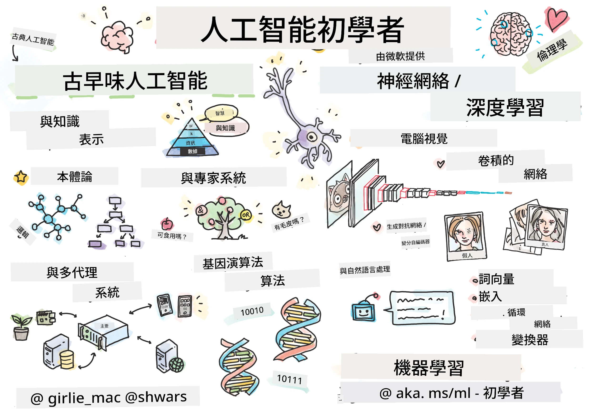

[](https://github.com/microsoft/AI-For-Beginners/blob/main/LICENSE)
[](https://GitHub.com/microsoft/AI-For-Beginners/graphs/contributors/)
[](https://GitHub.com/microsoft/AI-For-Beginners/issues/)
[](https://GitHub.com/microsoft/AI-For-Beginners/pulls/)
[](http://makeapullrequest.com)

[](https://GitHub.com/microsoft/AI-For-Beginners/watchers/)
[](https://GitHub.com/microsoft/AI-For-Beginners/network/)
[](https://GitHub.com/microsoft/AI-For-Beginners/stargazers/)
[](https://mybinder.org/v2/gh/microsoft/ai-for-beginners/HEAD)
[](https://gitter.im/Microsoft/ai-for-beginners?utm_source=badge&utm_medium=badge&utm_campaign=pr-badge)

[](https://discord.gg/nTYy5BXMWG)

# 初學者人工智能課程

||
|:---:|
| AI For Beginners - _草圖筆記由 [@girlie_mac](https://twitter.com/girlie_mac) 製作_ |

透過我們為期12週、共24課的課程，探索**人工智能**（AI）的世界！課程包括實作課程、小測驗和實驗室單元。此課程對初學者友善，涵蓋了TensorFlow和PyTorch等工具，並探討AI倫理。

### 🌐 多語言支援

#### 透過 GitHub Action 支援（自動化且持續更新）

<!-- CO-OP TRANSLATOR LANGUAGES TABLE START -->
[Arabic](../ar/README.md) | [Bengali](../bn/README.md) | [Bulgarian](../bg/README.md) | [Burmese (Myanmar)](../my/README.md) | [Chinese (Simplified)](../zh-CN/README.md) | [Chinese (Traditional, Hong Kong)](../zh-HK/README.md) | [Chinese (Traditional, Macau)](./README.md) | [Chinese (Traditional, Taiwan)](../zh-TW/README.md) | [Croatian](../hr/README.md) | [Czech](../cs/README.md) | [Danish](../da/README.md) | [Dutch](../nl/README.md) | [Estonian](../et/README.md) | [Finnish](../fi/README.md) | [French](../fr/README.md) | [German](../de/README.md) | [Greek](../el/README.md) | [Hebrew](../he/README.md) | [Hindi](../hi/README.md) | [Hungarian](../hu/README.md) | [Indonesian](../id/README.md) | [Italian](../it/README.md) | [Japanese](../ja/README.md) | [Kannada](../kn/README.md) | [Korean](../ko/README.md) | [Lithuanian](../lt/README.md) | [Malay](../ms/README.md) | [Malayalam](../ml/README.md) | [Marathi](../mr/README.md) | [Nepali](../ne/README.md) | [Nigerian Pidgin](../pcm/README.md) | [Norwegian](../no/README.md) | [Persian (Farsi)](../fa/README.md) | [Polish](../pl/README.md) | [Portuguese (Brazil)](../pt-BR/README.md) | [Portuguese (Portugal)](../pt-PT/README.md) | [Punjabi (Gurmukhi)](../pa/README.md) | [Romanian](../ro/README.md) | [Russian](../ru/README.md) | [Serbian (Cyrillic)](../sr/README.md) | [Slovak](../sk/README.md) | [Slovenian](../sl/README.md) | [Spanish](../es/README.md) | [Swahili](../sw/README.md) | [Swedish](../sv/README.md) | [Tagalog (Filipino)](../tl/README.md) | [Tamil](../ta/README.md) | [Telugu](../te/README.md) | [Thai](../th/README.md) | [Turkish](../tr/README.md) | [Ukrainian](../uk/README.md) | [Urdu](../ur/README.md) | [Vietnamese](../vi/README.md)

> **偏好本地複製？**

> 此存儲庫包含50多種語言的翻譯，會顯著增加下載大小。如需不包含翻譯的複製，請使用稀疏檢出：
> ```bash
> git clone --filter=blob:none --sparse https://github.com/microsoft/AI-For-Beginners.git
> cd AI-For-Beginners
> git sparse-checkout set --no-cone '/*' '!translations' '!translated_images'
> ```
> 這樣您便能以更快的速度下載並擁有完成課程所需的所有資源。
<!-- CO-OP TRANSLATOR LANGUAGES TABLE END -->

**如需新增翻譯語言支援，請參考[這裡](https://github.com/Azure/co-op-translator/blob/main/getting_started/supported-languages.md)**

## 加入社群
[](https://discord.gg/nTYy5BXMWG)

## 您將學到什麼

**[課程心智圖](http://soshnikov.com/courses/ai-for-beginners/mindmap.html)**

在此課程中，您將學習：

* 各種人工智能方法，包括「經典的」符號方法，涵蓋**知識表示**與推理（[GOFAI](https://en.wikipedia.org/wiki/Symbolic_artificial_intelligence)）。
* **神經網絡**與**深度學習**，這是現代AI的核心。我們將利用目前最流行的兩個框架—[TensorFlow](http://Tensorflow.org) 和 [PyTorch](http://pytorch.org) 的程式碼說明這些重要主題背後的概念。
* 運用於影像和文本的**神經架構**。我們會涵蓋一些近期的模型，但可能在最先進技術方面有所不足。
* 較不普及的AI方法，如**遺傳演算法**與**多智能體系統**。

本課程不涵蓋的內容：

> [在我們的 Microsoft Learn 集合中找到此課程所有額外資源](https://learn.microsoft.com/en-us/collections/7w28iy2xrqzdj0?WT.mc_id=academic-77998-bethanycheum)

* **商業中的AI案例**。建議您可參加 Microsoft Learn 上的 [面向商業用戶的AI入門](https://docs.microsoft.com/learn/paths/introduction-ai-for-business-users/?WT.mc_id=academic-77998-bethanycheum) 學習路徑，或與 [INSEAD](https://www.insead.edu/) 合作開發的 [AI 商業學院](https://www.microsoft.com/ai/ai-business-school/?WT.mc_id=academic-77998-bethanycheum)。
* **經典機器學習**，詳見我們的 [初學者機器學習課程](http://github.com/Microsoft/ML-for-Beginners)。
* 利用 **[認知服務](https://azure.microsoft.com/services/cognitive-services/?WT.mc_id=academic-77998-bethanycheum)** 建構的實務AI應用。我們推薦您先從 Microsoft Learn 中的 [視覺](https://docs.microsoft.com/learn/paths/create-computer-vision-solutions-azure-cognitive-services/?WT.mc_id=academic-77998-bethanycheum) 和 [自然語言處理](https://docs.microsoft.com/learn/paths/explore-natural-language-processing/?WT.mc_id=academic-77998-bethanycheum)、**[Azure OpenAI 服務的生成式AI](https://learn.microsoft.com/en-us/training/paths/develop-ai-solutions-azure-openai/?WT.mc_id=academic-77998-bethanycheum)** 相關課程開始。
* 特定的機器學習**雲端框架**，例如 [Azure 機器學習](https://azure.microsoft.com/services/machine-learning/?WT.mc_id=academic-77998-bethanycheum)、[Microsoft Fabric](https://learn.microsoft.com/en-us/training/paths/get-started-fabric/?WT.mc_id=academic-77998-bethanycheum) 或 [Azure Databricks](https://docs.microsoft.com/learn/paths/data-engineer-azure-databricks?WT.mc_id=academic-77998-bethanycheum)。建議參閱 "使用 Azure 機器學習建立與管理機器學習解決方案" 與 "使用 Azure Databricks 建立與管理機器學習解決方案" 學習路徑。
* **對話式AI**與**聊天機器人**。另外有獨立的 [建立對話式AI解決方案](https://docs.microsoft.com/learn/paths/create-conversational-ai-solutions/?WT.mc_id=academic-77998-bethanycheum) 學習路徑，亦可參考 [此博客文章](https://soshnikov.com/azure/hello-bot-conversational-ai-on-microsoft-platform/) 獲取更多詳情。
* 深度學習背後的**深度數學**。對此我們推薦 Ian Goodfellow、Yoshua Bengio 與 Aaron Courville 的著作 [Deep Learning](https://www.amazon.com/Deep-Learning-Adaptive-Computation-Machine/dp/0262035618)，該書也可於線上免費取得 [https://www.deeplearningbook.org/](https://www.deeplearningbook.org/)。

若想輕鬆入門「雲端AI」主題，您可以考慮修讀 [Azure上的人工智能入門](https://docs.microsoft.com/learn/paths/get-started-with-artificial-intelligence-on-azure/?WT.mc_id=academic-77998-bethanycheum) 學習路徑。

# 內容

|     |                                                                 課程連結                                                                  |                                           PyTorch/Keras/TensorFlow                                          | 實驗室                                                            |
| :-: | :------------------------------------------------------------------------------------------------------------------------------------------: | :---------------------------------------------------------------------------------------------: | ------------------------------------------------------------------------------ |
| 0  |                                 [課程設定](./lessons/0-course-setup/setup.md)                                 |                      [設定您的開發環境](./lessons/0-course-setup/how-to-run.md)                       |   |
| I  |               [**AI 簡介**](./lessons/1-Intro/README.md)      | | |
| 01  |       [人工智能簡介與歷史](./lessons/1-Intro/README.md)       |           -                            | -  |
| II |              **符號式AI**              |
| 02  |       [知識表示與專家系統](./lessons/2-Symbolic/README.md)       |            [專家系統](./lessons/2-Symbolic/Animals.ipynb) /  [本體論](./lessons/2-Symbolic/FamilyOntology.ipynb) /[概念圖](./lessons/2-Symbolic/MSConceptGraph.ipynb)                             |  |
| III |                        [**神經網絡簡介**](./lessons/3-NeuralNetworks/README.md) |||
| 03  |                [感知機](./lessons/3-NeuralNetworks/03-Perceptron/README.md)                 |                       [筆記本](./lessons/3-NeuralNetworks/03-Perceptron/Perceptron.ipynb)                      | [實驗室](./lessons/3-NeuralNetworks/03-Perceptron/lab/README.md) |
| 04  |                   [多層感知機及自建框架](./lessons/3-NeuralNetworks/04-OwnFramework/README.md)                   |        [筆記本](./lessons/3-NeuralNetworks/04-OwnFramework/OwnFramework.ipynb)        | [實驗室](./lessons/3-NeuralNetworks/04-OwnFramework/lab/README.md) |
| 05  |            [框架介紹（PyTorch/TensorFlow）與過擬合](./lessons/3-NeuralNetworks/05-Frameworks/README.md)             |           [PyTorch](./lessons/3-NeuralNetworks/05-Frameworks/IntroPyTorch.ipynb) / [Keras](./lessons/3-NeuralNetworks/05-Frameworks/IntroKeras.ipynb) / [TensorFlow](./lessons/3-NeuralNetworks/05-Frameworks/IntroKerasTF.ipynb)             | [實驗室](./lessons/3-NeuralNetworks/05-Frameworks/lab/README.md) |
| IV  |            [**電腦視覺**](./lessons/4-ComputerVision/README.md)             | [PyTorch](https://docs.microsoft.com/learn/modules/intro-computer-vision-pytorch/?WT.mc_id=academic-77998-cacaste) / [TensorFlow](https://docs.microsoft.com/learn/modules/intro-computer-vision-TensorFlow/?WT.mc_id=academic-77998-cacaste)| [在 Microsoft Azure 探索電腦視覺](https://learn.microsoft.com/en-us/collections/7w28iy2xrqzdj0?WT.mc_id=academic-77998-bethanycheum) |
| 06  |            [電腦視覺入門。OpenCV](./lessons/4-ComputerVision/06-IntroCV/README.md)             |           [筆記本](./lessons/4-ComputerVision/06-IntroCV/OpenCV.ipynb)         | [實驗室](./lessons/4-ComputerVision/06-IntroCV/lab/README.md) |
| 07  |            [卷積神經網絡](./lessons/4-ComputerVision/07-ConvNets/README.md) &  [CNN 架構](./lessons/4-ComputerVision/07-ConvNets/CNN_Architectures.md)             |           [PyTorch](./lessons/4-ComputerVision/07-ConvNets/ConvNetsPyTorch.ipynb) /[TensorFlow](./lessons/4-ComputerVision/07-ConvNets/ConvNetsTF.ipynb)             | [實驗室](./lessons/4-ComputerVision/07-ConvNets/lab/README.md) |
| 08  |            [預訓練網絡與遷移學習](./lessons/4-ComputerVision/08-TransferLearning/README.md) 和 [訓練技巧](./lessons/4-ComputerVision/08-TransferLearning/TrainingTricks.md)             |           [PyTorch](./lessons/4-ComputerVision/08-TransferLearning/TransferLearningPyTorch.ipynb) / [TensorFlow](./lessons/3-NeuralNetworks/05-Frameworks/IntroKerasTF.ipynb)             | [實驗室](./lessons/4-ComputerVision/08-TransferLearning/lab/README.md) |
| 09  |            [自編碼器與變分自編碼器](./lessons/4-ComputerVision/09-Autoencoders/README.md)             |           [PyTorch](./lessons/4-ComputerVision/09-Autoencoders/AutoEncodersPyTorch.ipynb) / [TensorFlow](./lessons/4-ComputerVision/09-Autoencoders/AutoencodersTF.ipynb)             |  |
| 10  |            [生成對抗網絡與藝術風格轉換](./lessons/4-ComputerVision/10-GANs/README.md)             |           [PyTorch](./lessons/4-ComputerVision/10-GANs/GANPyTorch.ipynb) / [TensorFlow](./lessons/4-ComputerVision/10-GANs/GANTF.ipynb)             |  |
| 11  |            [物件偵測](./lessons/4-ComputerVision/11-ObjectDetection/README.md)             |         [TensorFlow](./lessons/4-ComputerVision/11-ObjectDetection/ObjectDetection.ipynb)             | [實驗室](./lessons/4-ComputerVision/11-ObjectDetection/lab/README.md) |
| 12  |            [語義分割。U-Net](./lessons/4-ComputerVision/12-Segmentation/README.md)             |           [PyTorch](./lessons/4-ComputerVision/12-Segmentation/SemanticSegmentationPytorch.ipynb) / [TensorFlow](./lessons/4-ComputerVision/12-Segmentation/SemanticSegmentationTF.ipynb)             |  |
| V  |            [**自然語言處理**](./lessons/5-NLP/README.md)             | [PyTorch](https://docs.microsoft.com/learn/modules/intro-natural-language-processing-pytorch/?WT.mc_id=academic-77998-cacaste) /[TensorFlow](https://docs.microsoft.com/learn/modules/intro-natural-language-processing-TensorFlow/?WT.mc_id=academic-77998-cacaste) | [在 Microsoft Azure 探索自然語言處理](https://learn.microsoft.com/en-us/collections/7w28iy2xrqzdj0?WT.mc_id=academic-77998-bethanycheum)|
| 13  |            [文本表示。詞袋模型/TF-IDF](./lessons/5-NLP/13-TextRep/README.md)             |           [PyTorch](https://github.com/microsoft/AI-For-Beginners/blob/main/lessons/5-NLP/13-TextRep/TextRepresentationPyTorch.ipynb) / [TensorFlow](https://github.com/microsoft/AI-For-Beginners/blob/main/lessons/5-NLP/13-TextRep/TextRepresentationTF.ipynb)             | |
| 14  |            [語義詞嵌入。Word2Vec 與 GloVe](./lessons/5-NLP/14-Embeddings/README.md)             |           [PyTorch](https://github.com/microsoft/AI-For-Beginners/blob/main/lessons/5-NLP/14-Embeddings/EmbeddingsPyTorch.ipynb) / [TensorFlow](https://github.com/microsoft/AI-For-Beginners/blob/main/lessons/5-NLP/14-Embeddings/EmbeddingsTF.ipynb)             |  |
| 15  |            [語言模型。訓練你自己的詞嵌入](./lessons/5-NLP/15-LanguageModeling/README.md)             |           [PyTorch](https://github.com/microsoft/AI-For-Beginners/blob/main/lessons/5-NLP/15-LanguageModeling/CBoW-PyTorch.ipynb) / [TensorFlow](https://github.com/microsoft/AI-For-Beginners/blob/main/lessons/5-NLP/15-LanguageModeling/CBoW-TF.ipynb)             | [實驗室](./lessons/5-NLP/15-LanguageModeling/lab/README.md) |
| 16  |            [循環神經網絡](./lessons/5-NLP/16-RNN/README.md)             |           [PyTorch](https://github.com/microsoft/AI-For-Beginners/blob/main/lessons/5-NLP/16-RNN/RNNPyTorch.ipynb) / [TensorFlow](https://github.com/microsoft/AI-For-Beginners/blob/main/lessons/5-NLP/16-RNN/RNNTF.ipynb)             |  |
| 17  |            [生成循環網絡](./lessons/5-NLP/17-GenerativeNetworks/README.md)             |           [PyTorch](https://github.com/microsoft/AI-For-Beginners/blob/main/lessons/5-NLP/17-GenerativeNetworks/GenerativePyTorch.ipynb) / [TensorFlow](https://github.com/microsoft/AI-For-Beginners/blob/main/lessons/5-NLP/17-GenerativeNetworks/GenerativeTF.ipynb)             | [實驗室](./lessons/5-NLP/17-GenerativeNetworks/lab/README.md) |
| 18  |            [變壓器模型。BERT。](./lessons/5-NLP/18-Transformers/README.md)             |           [PyTorch](https://github.com/microsoft/AI-For-Beginners/blob/main/lessons/5-NLP/18-Transformers/TransformersPyTorch.ipynb) /[TensorFlow](https://github.com/microsoft/AI-For-Beginners/blob/main/lessons/5-NLP/18-Transformers/TransformersTF.ipynb)             |  |
| 19  |            [命名實體識別](./lessons/5-NLP/19-NER/README.md)             |           [TensorFlow](https://microsoft.github.io/AI-For-Beginners/lessons/5-NLP/19-NER/NER-TF.ipynb)             | [實驗室](./lessons/5-NLP/19-NER/lab/README.md) |
| 20  |            [大型語言模型、提示編程與少量樣本任務](./lessons/5-NLP/20-LangModels/README.md)             |           [PyTorch](https://microsoft.github.io/AI-For-Beginners/lessons/5-NLP/20-LangModels/GPT-PyTorch.ipynb) | |
| VI |            **其他 AI 技術** || |
| 21  |            [基因演算法](./lessons/6-Other/21-GeneticAlgorithms/README.md)             |           [筆記本](./lessons/6-Other/21-GeneticAlgorithms/Genetic.ipynb) | |
| 22  |            [深度強化學習](./lessons/6-Other/22-DeepRL/README.md)             |           [PyTorch](./lessons/6-Other/22-DeepRL/CartPole-RL-PyTorch.ipynb) /[TensorFlow](./lessons/6-Other/22-DeepRL/CartPole-RL-TF.ipynb)             | [實驗室](./lessons/6-Other/22-DeepRL/lab/README.md) |
| 23  |            [多智能體系統](./lessons/6-Other/23-MultiagentSystems/README.md)             |  | |
| VII |            **人工智能倫理** | | |
| 24  |            [人工智能倫理與負責任的 AI](./lessons/7-Ethics/README.md)             |           [Microsoft Learn：負責任的 AI 原則](https://docs.microsoft.com/learn/paths/responsible-ai-business-principles/?WT.mc_id=academic-77998-cacaste) | |
| IX  |            **附加內容** | | |
| 25  |            [多模態網絡、CLIP 與 VQGAN](./lessons/X-Extras/X1-MultiModal/README.md)             |           [筆記本](./lessons/X-Extras/X1-MultiModal/Clip.ipynb)    | |

## 每課包含

* 預習資料
* 可執行的 Jupyter 筆記本，通常針對特定框架（**PyTorch** 或 **TensorFlow**）。這些可執行筆記本也包含大量理論內容，因此要理解主題，你至少需要完成其中一種框架的筆記本（PyTorch 或 TensorFlow）。
* 部分主題提供 **實驗室**，讓你有機會將所學運用於特定問題。
* 部分章節包含指向涵蓋相關主題的 [**MS Learn**](https://learn.microsoft.com/en-us/collections/7w28iy2xrqzdj0?WT.mc_id=academic-77998-bethanycheum) 模組連結。

## 入門指南

### 🎯 AI 新手？從這裡開始！

如果你是 AI 完全新手，想要快速、動手的範例，請查看我們的 [**新手友好範例**](./examples/README.md)！這些包括：

- 🌟 **Hello AI World** — 你的第一個 AI 程式（模式識別）
- 🧠 **簡單神經網絡** — 從零開始構建神經網絡  

- 🖼️ **影像分類器** - 以詳細註解分類影像
- 💬 **文字情感分析** - 分析正面/負面文字

這些範例旨在幫助你在深入完整課程前理解 AI 概念。

### 📚 完整課程設定

- 我們已建立一個[設定課程](./lessons/0-course-setup/setup.md)協助你設定開發環境。 - 對教育工作者，我們也製作了一個[課程設定課程](./lessons/0-course-setup/for-teachers.md)！
- 如何在 VSCode 或 Codespace 中[運行程式碼](./lessons/0-course-setup/how-to-run.md)

請依照以下步驟：

派生此儲存庫：點擊本頁右上角的「Fork」按鈕。

克隆此儲存庫：`git clone https://github.com/microsoft/AI-For-Beginners.git`

別忘了收藏（🌟）此儲存庫，以便日後更容易找到。

## 與其他學習者見面

加入我們的[官方 AI Discord 伺服器](https://aka.ms/genai-discord?WT.mc_id=academic-105485-bethanycheum)，與正在修讀此課程的學習者交流並獲得支援。

如果你在製作過程中有產品反饋或問題，請造訪我們的[Azure AI Foundry 開發者論壇](https://aka.ms/foundry/forum)

## 測驗

> **關於測驗的說明**：所有測驗均存放於 etc\quiz-app 的 Quiz-app 資料夾，或可在[此處線上使用](https://ff-quizzes.netlify.app/)。測驗由課程內頁連結調用，測驗應用程式可在本機端執行或部署到 Azure；請遵循`quiz-app`資料夾內的說明。測驗正在逐步本地化。

## 求助

你有建議或發現拼寫或程式碼錯誤嗎？請提出問題單或建立拉取請求。

## 特別感謝

* **✍️ 主要作者:** [Dmitry Soshnikov](http://soshnikov.com), 博士
* **🔥 編輯:** [Jen Looper](https://twitter.com/jenlooper), 博士
* **🎨 速寫插畫:** [Tomomi Imura](https://twitter.com/girlie_mac)
* **✅ 測驗創作者:** [Lateefah Bello](https://github.com/CinnamonXI), [MLSA](https://studentambassadors.microsoft.com/)
* **🙏 核心貢獻者:** [Evgenii Pishchik](https://github.com/Pe4enIks)

## 其他課程

我們團隊還製作了其他課程！歡迎查看：

<!-- CO-OP TRANSLATOR OTHER COURSES START -->
### LangChain
[](https://aka.ms/langchain4j-for-beginners)
[](https://aka.ms/langchainjs-for-beginners?WT.mc_id=m365-94501-dwahlin)

---

### Azure / Edge / MCP / Agents
[](https://github.com/microsoft/AZD-for-beginners?WT.mc_id=academic-105485-koreyst)
[](https://github.com/microsoft/edgeai-for-beginners?WT.mc_id=academic-105485-koreyst)
[](https://github.com/microsoft/mcp-for-beginners?WT.mc_id=academic-105485-koreyst)
[](https://github.com/microsoft/ai-agents-for-beginners?WT.mc_id=academic-105485-koreyst)

---
 
### 生成式 AI 系列
[](https://github.com/microsoft/generative-ai-for-beginners?WT.mc_id=academic-105485-koreyst)
[-9333EA?style=for-the-badge&labelColor=E5E7EB&color=9333EA)](https://github.com/microsoft/Generative-AI-for-beginners-dotnet?WT.mc_id=academic-105485-koreyst)
[-C084FC?style=for-the-badge&labelColor=E5E7EB&color=C084FC)](https://github.com/microsoft/generative-ai-for-beginners-java?WT.mc_id=academic-105485-koreyst)
[-E879F9?style=for-the-badge&labelColor=E5E7EB&color=E879F9)](https://github.com/microsoft/generative-ai-with-javascript?WT.mc_id=academic-105485-koreyst)

---
 
### 核心學習
[](https://aka.ms/ml-beginners?WT.mc_id=academic-105485-koreyst)
[](https://aka.ms/datascience-beginners?WT.mc_id=academic-105485-koreyst)
[](https://aka.ms/ai-beginners?WT.mc_id=academic-105485-koreyst)
[](https://github.com/microsoft/Security-101?WT.mc_id=academic-96948-sayoung)
[](https://aka.ms/webdev-beginners?WT.mc_id=academic-105485-koreyst)
[](https://aka.ms/iot-beginners?WT.mc_id=academic-105485-koreyst)
[](https://github.com/microsoft/xr-development-for-beginners?WT.mc_id=academic-105485-koreyst)

---
 
### Copilot 系列
[](https://aka.ms/GitHubCopilotAI?WT.mc_id=academic-105485-koreyst)
[](https://github.com/microsoft/mastering-github-copilot-for-dotnet-csharp-developers?WT.mc_id=academic-105485-koreyst)
[](https://github.com/microsoft/CopilotAdventures?WT.mc_id=academic-105485-koreyst)
<!-- CO-OP TRANSLATOR OTHER COURSES END -->

## 尋求協助

如果你在開發 AI 應用時遇到困難或有任何疑問，歡迎加入學習者和經驗豐富開發者的討論區，一同探討 MCP。這是一個支持性強的社群，歡迎提問並自由分享知識。

[](https://discord.gg/nTYy5BXMWG)

若你在開發過程中有產品反饋或遇到錯誤，歡迎造訪：

[](https://aka.ms/foundry/forum)

---

<!-- CO-OP TRANSLATOR DISCLAIMER START -->
**免責聲明**：
本文件是使用人工智能翻譯服務 [Co-op Translator](https://github.com/Azure/co-op-translator) 進行翻譯。儘管我們力求準確，但請注意自動翻譯可能包含錯誤或不準確之處。原始文件的母語版本應被視為權威來源。對於重要信息，建議使用專業人工翻譯。因使用本翻譯所引起的任何誤解或誤釋，我們概不負責。
<!-- CO-OP TRANSLATOR DISCLAIMER END -->