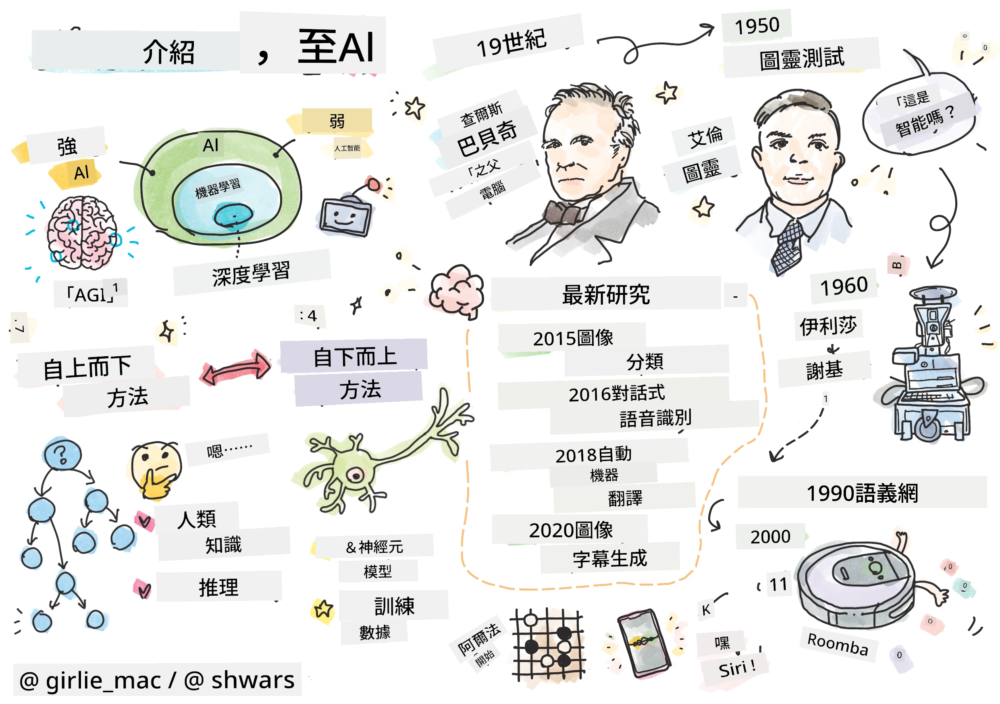
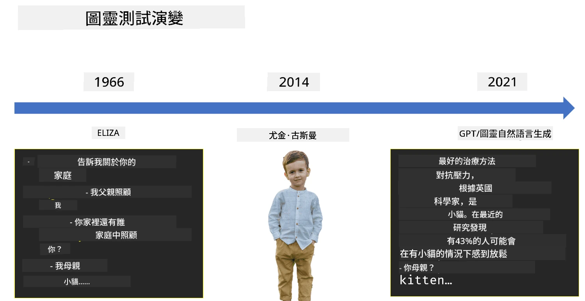

# 人工智能簡介

> 手繪筆記由 [Tomomi Imura](https://twitter.com/girlie_mac) 提供

## [課前測驗](https://ff-quizzes.netlify.app/en/ai/quiz/1)

**人工智能** 是一門令人興奮的科學學科，研究如何讓電腦表現出智能行為，例如執行人類擅長的事情。

最初，電腦是由 [查爾斯·巴貝奇](https://en.wikipedia.org/wiki/Charles_Babbage) 發明的，用於按照明確定義的程序（算法）處理數字。現代電腦雖然比19世紀提出的原始模型先進得多，但仍然遵循受控計算的理念。因此，如果我們知道實現目標所需的精確步驟序列，就可以編程讓電腦完成某些事情。

> 照片由 [Vickie Soshnikova](http://twitter.com/vickievalerie) 提供

> ✅ 從一張照片中判斷一個人的年齡是一項無法明確編程的任務，因為我們無法解釋當我們在腦海中得出一個數字時是如何做到的。

---

然而，有些任務我們並不知道如何明確解決。例如，從一張照片中判斷一個人的年齡。我們能夠做到這一點，是因為我們看過許多年齡不同的人的例子，但我們無法明確解釋我們是如何做到的，也無法編程讓電腦完成這項任務。這正是 **人工智能**（簡稱 AI）感興趣的任務類型。

✅ 想一想有哪些任務可以交給電腦處理，並且能從人工智能中受益。考慮金融、醫療和藝術領域——這些領域今天如何從人工智能中受益？

## 弱人工智能與強人工智能

弱人工智能 | 強人工智能
---------------------------------------|-------------------------------------
弱人工智能指的是為特定任務或一組狹窄任務設計和訓練的人工智能系統。|強人工智能，或稱人工通用智能（AGI），指的是具有與人類相當的智能和理解能力的人工智能系統。
這些人工智能系統並不具備普遍的智能；它們在執行預定義的任務方面表現出色，但缺乏真正的理解或意識。|這些人工智能系統能夠執行人類可以完成的任何智力任務，適應不同的領域，並擁有某種形式的意識或自我認知。
弱人工智能的例子包括像 Siri 或 Alexa 這樣的虛擬助手、流媒體服務使用的推薦算法，以及為特定客戶服務任務設計的聊天機器人。|實現強人工智能是人工智能研究的長期目標，這需要開發能夠在廣泛任務和情境中進行推理、學習、理解和適應的人工智能系統。
弱人工智能高度專業化，並不具備人類般的認知能力或超出其狹窄領域的通用問題解決能力。|強人工智能目前仍是一個理論概念，尚無人工智能系統達到這種通用智能的水平。

更多資訊請參考 **[人工通用智能](https://en.wikipedia.org/wiki/Artificial_general_intelligence)** (AGI)。

## 智能的定義與圖靈測試

處理 **[智能](https://en.wikipedia.org/wiki/Intelligence)** 這個術語時的一個問題是，對於這個術語並沒有明確的定義。有人認為智能與 **抽象思維** 或 **自我意識** 有關，但我們無法準確定義它。

> [照片](https://unsplash.com/photos/75715CVEJhI) 由 [Amber Kipp](https://unsplash.com/@sadmax) 提供，來自 Unsplash

為了看出“智能”這個術語的模糊性，試著回答這個問題：“貓是智能的嗎？”不同的人往往會給出不同的答案，因為沒有普遍接受的測試來證明這一說法是真實的。如果你認為有——試著讓你的貓參加智商測試……

✅ 花點時間想一想你如何定義智能。一隻能解迷宮並獲得食物的烏鴉是智能的嗎？一個小孩是智能的嗎？

---

談到 AGI 時，我們需要某種方法來判斷我們是否創造了一個真正智能的系統。[艾倫·圖靈](https://en.wikipedia.org/wiki/Alan_Turing) 提出了一種方法，稱為 **[圖靈測試](https://en.wikipedia.org/wiki/Turing_test)**，這也可以作為智能的定義。該測試將給定系統與某些本質上智能的東西——一個真人進行比較，並且因為任何自動比較都可能被電腦程序繞過，我們使用一個人類審問者。因此，如果一個人無法在基於文本的對話中區分真人和電腦系統——該系統就被認為是智能的。

> 一個名為 [Eugene Goostman](https://en.wikipedia.org/wiki/Eugene_Goostman) 的聊天機器人於 2014 年在聖彼得堡接近通過圖靈測試，使用了一個巧妙的個性技巧。它一開始就聲明自己是一個 13 歲的烏克蘭男孩，這可以解釋知識的缺乏和文本中的一些不一致之處。該機器人在 5 分鐘的對話後說服了 30% 的評委相信它是人類，這是一個圖靈認為機器到 2000 年能夠通過的指標。然而，我們應該明白，這並不意味著我們已經創造了一個智能系統，或者電腦系統欺騙了人類審問者——實際上是機器人的創造者欺騙了人類！

✅ 你是否曾經被聊天機器人欺騙，認為你在與真人交談？它是如何說服你的？

## 人工智能的不同方法

如果我們希望電腦像人類一樣行事，我們需要以某種方式在電腦內部模擬我們的思維方式。因此，我們需要嘗試理解是什麼讓人類變得智能。

> 為了能夠將智能編程到機器中，我們需要了解我們自己做決策的過程是如何運作的。如果你進行一些自我反思，你會意識到有些過程是潛意識發生的——例如，我們可以在不思考的情況下區分貓和狗——而另一些則涉及推理。

解決這個問題有兩種可能的方法：

自上而下方法（符號推理） | 自下而上方法（神經網絡）
---------------------------------------|-------------------------------------
自上而下的方法模擬人類解決問題的推理方式。它涉及從人類中提取 **知識**，並以計算機可讀的形式表示。我們還需要開發一種方法來在計算機內部模擬 **推理**。|自下而上的方法模擬人腦的結構，由大量簡單的單元組成，稱為 **神經元**。每個神經元的作用類似於其輸入的加權平均值，我們可以通過提供 **訓練數據** 來訓練神經元網絡解決有用的問題。

此外，還有一些其他可能的智能方法：

* **湧現式**、**協同式** 或 **多代理方法** 基於這樣一個事實，即通過大量簡單代理的交互可以獲得複雜的智能行為。根據 [進化控制論](https://en.wikipedia.org/wiki/Global_brain#Evolutionary_cybernetics)，智能可以在 *元系統轉變* 的過程中從更簡單的反應行為中 *湧現*。

* **進化方法** 或 **遺傳算法** 是基於進化原則的優化過程。

我們將在課程後續部分考慮這些方法，但現在我們將重點放在兩個主要方向：自上而下和自下而上。

### 自上而下方法

在 **自上而下方法** 中，我們嘗試模擬我們的推理過程。由於我們在推理時可以跟隨自己的思路，我們可以嘗試將這一過程形式化並編程到計算機中。這被稱為 **符號推理**。

人們往往在頭腦中有一些指導其決策過程的規則。例如，當醫生診斷病人時，他或她可能意識到病人發燒，因此可能身體內部有某種炎症。通過將大量規則應用於特定問題，醫生可能最終得出診斷結論。

這種方法高度依賴於 **知識表示** 和 **推理**。從人類專家那裡提取知識可能是最困難的部分，因為醫生在許多情況下可能並不確切知道為什麼他或她會得出特定的診斷。有時解決方案只是自然而然地出現在他的腦海中，而沒有明確的思考。有些任務，例如從照片中判斷一個人的年齡，根本無法簡化為知識的操作。

### 自下而上方法

或者，我們可以嘗試模擬我們大腦中最簡單的元素——神經元。我們可以在計算機內部構建一個所謂的 **人工神經網絡**，然後通過提供例子來教它解決問題。這個過程類似於新生兒通過觀察學習周圍環境的方式。

✅ 做一些關於嬰兒如何學習的研究。嬰兒大腦的基本元素是什麼？

> | 那麼機器學習呢？         |      |
> |--------------|-----------|
> | 基於計算機學習如何根據某些數據解決問題的人工智能部分稱為 **機器學習**。我們不會在本課程中考慮經典的機器學習——我們建議參考單獨的 [機器學習初學者課程](http://aka.ms/ml-beginners)。 |       |

## 人工智能的簡史

人工智能作為一個領域始於20世紀中葉。最初，符號推理是一種流行的方法，並且它帶來了一些重要的成功，例如專家系統——能夠在某些有限問題領域中充當專家的計算機程序。然而，很快就發現這種方法並不適用於大規模應用。從專家那裡提取知識、將其表示在計算機中並保持知識庫的準確性，事實證明這是一項非常複雜且在許多情況下成本過高的任務。這導致了20世紀70年代所謂的 [人工智能寒冬](https://en.wikipedia.org/wiki/AI_winter)。

> 圖片由 [Dmitry Soshnikov](http://soshnikov.com) 提供

隨著時間的推移，計算資源變得更便宜，並且有更多數據可用，因此神經網絡方法在許多領域（如計算機視覺或語音理解）中開始表現出色。在過去十年中，“人工智能”這個術語大多被用作神經網絡的同義詞，因為我們聽到的大多數人工智能成功案例都基於它們。

我們可以觀察到方法的變化，例如在創建下棋計算機程序時：

* 早期的下棋程序基於搜索——程序明確嘗試估計對手在給定的幾步棋中的可能走法，並根據幾步棋後可以達到的最佳位置選擇最佳走法。這導致了所謂的 [alpha-beta 剪枝](https://en.wikipedia.org/wiki/Alpha%E2%80%93beta_pruning) 搜索算法的發展。
* 搜索策略在遊戲結束時效果很好，因為搜索空間受到少量可能走法的限制。然而，在遊戲開始時，搜索空間非常大，算法可以通過學習人類玩家之間的現有比賽來改進。隨後的實驗採用了所謂的 [基於案例的推理](https://en.wikipedia.org/wiki/Case-based_reasoning)，程序在知識庫中尋找與當前遊戲位置非常相似的案例。
* 現代能夠擊敗人類玩家的程序基於神經網絡和 [強化學習](https://en.wikipedia.org/wiki/Reinforcement_learning)，程序通過長時間與自己對弈並從自己的錯誤中學習來學會下棋——這與人類學習下棋的方式非常相似。然而，計算機程序可以在更短的時間內進行更多的比賽，因此可以學得更快。

✅ 做一些研究，了解其他由人工智能參與的遊戲。

同樣，我們可以看到創建“會說話的程序”（可能通過圖靈測試）的方法如何改變：

* 這類早期程序（如 [Eliza](https://en.wikipedia.org/wiki/ELIZA)）基於非常簡單的語法規則和將輸入句子重新表述為問題。
* 現代助手（如 Cortana、Siri 或 Google Assistant）都是混合系統，使用神經網絡將語音轉換為文本並識別我們的意圖，然後使用一些推理或明確的算法執行所需的操作。
* 未來，我們可能會期待一個完全基於神經網絡的模型能夠自行處理對話。最近的 GPT 和 [Turing-NLG](https://www.microsoft.com/research/blog/turing-nlg-a-17-billion-parameter-language-model-by-microsoft) 神經網絡家族在這方面表現出色。

> 圖片由 Dmitry Soshnikov 提供，[照片](https://unsplash.com/photos/r8LmVbUKgns) 由 [Marina Abrosimova](https://unsplash.com/@abrosimova_marina_foto) 提供，Unsplash

## 最近的人工智能研究

神經網絡研究的巨大增長始於 2010 年左右，當時大型公共數據集開始變得可用。一個名為 [ImageNet](https://en.wikipedia.org/wiki/ImageNet) 的龐大圖像集合，包含約 1400 萬張帶註解的圖像，催生了 [ImageNet 大規模視覺識別挑戰賽](https://image-net.org/challenges/LSVRC/)。

> 圖片由 [Dmitry Soshnikov](http://soshnikov.com) 提供

2012 年，[卷積神經網絡](../4-ComputerVision/07-ConvNets/README.md) 首次被用於圖像分類，這導致分類錯誤率顯著下降（從接近 30% 降至 16.4%）。2015 年，微軟研究院的 ResNet 架構[達到了人類水平的準確率](https://doi.org/10.1109/ICCV.2015.123)。

自此以來，神經網絡在許多任務中展現了非常成功的表現：

---

年份 | 達到人類水平的任務
-----|--------
2015 | [圖像分類](https://doi.org/10.1109/ICCV.2015.123)
2016 | [對話語音識別](https://arxiv.org/abs/1610.05256)
2018 | [自動機器翻譯](https://arxiv.org/abs/1803.05567)（中譯英）
2020 | [圖像標註](https://arxiv.org/abs/2009.13682)

在過去幾年中，我們見證了大型語言模型的巨大成功，例如 BERT 和 GPT-3。這主要是因為有大量的通用文本數據可用，這使我們能夠訓練模型來捕捉文本的結構和意義，先在通用文本集合上進行預訓練，然後再將這些模型專門化用於更具體的任務。我們將在本課程稍後學習更多關於[自然語言處理](../5-NLP/README.md)的內容。

## 🚀 挑戰

在互聯網上進行探索，判斷您認為人工智能在哪些領域最有效地被使用。是地圖應用程式、語音轉文字服務還是電子遊戲？研究該系統是如何構建的。

## [課後測驗](https://ff-quizzes.netlify.app/en/ai/quiz/2)

## 回顧與自學

通過閱讀[這一課程](https://github.com/microsoft/ML-For-Beginners/tree/main/1-Introduction/2-history-of-ML)來回顧人工智能和機器學習的歷史。從該課程或本課程頂部的手繪筆記中選取一個元素，深入研究以了解其演變的文化背景。

**作業**：[遊戲創作比賽](assignment.md)

---

<!-- CO-OP TRANSLATOR DISCLAIMER START -->
**免責聲明**：  
此文件已使用人工智能翻譯服務 [Co-op Translator](https://github.com/Azure/co-op-translator) 進行翻譯。儘管我們致力於提供準確的翻譯，請注意自動翻譯可能包含錯誤或不準確之處。原始文件的母語版本應被視為權威來源。對於重要信息，建議使用專業人工翻譯。我們對因使用此翻譯而引起的任何誤解或誤釋不承擔責任。
<!-- CO-OP TRANSLATOR DISCLAIMER END -->