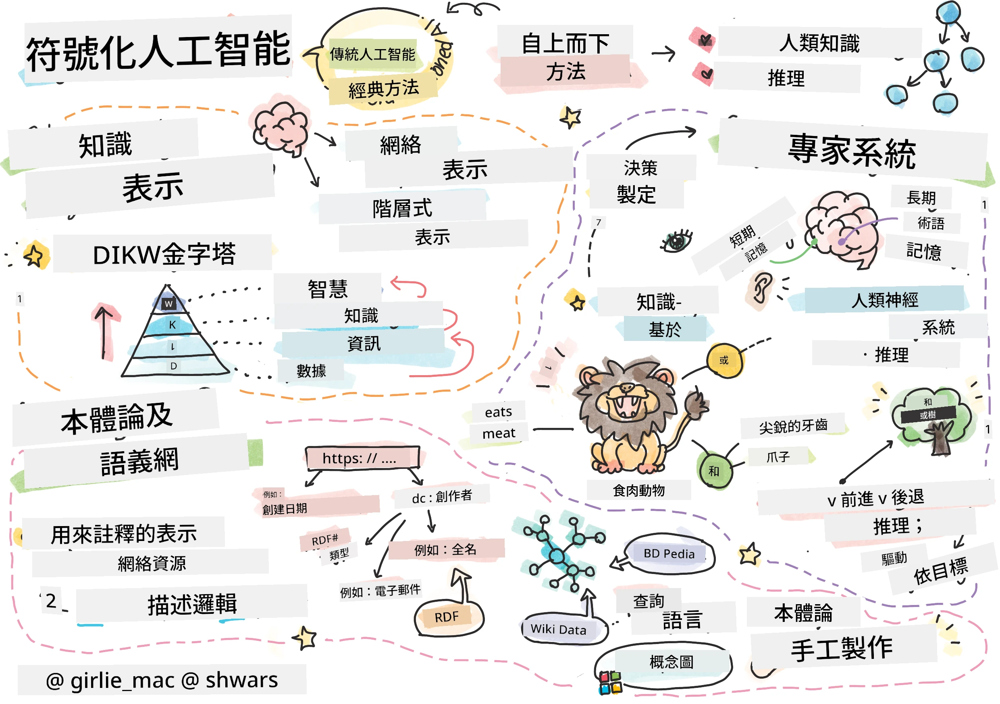
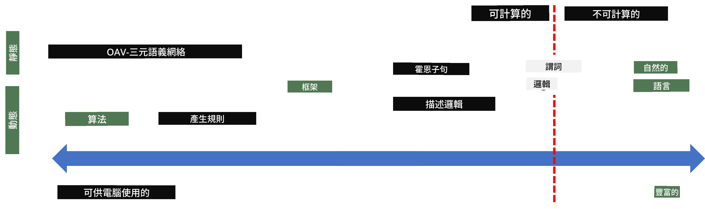
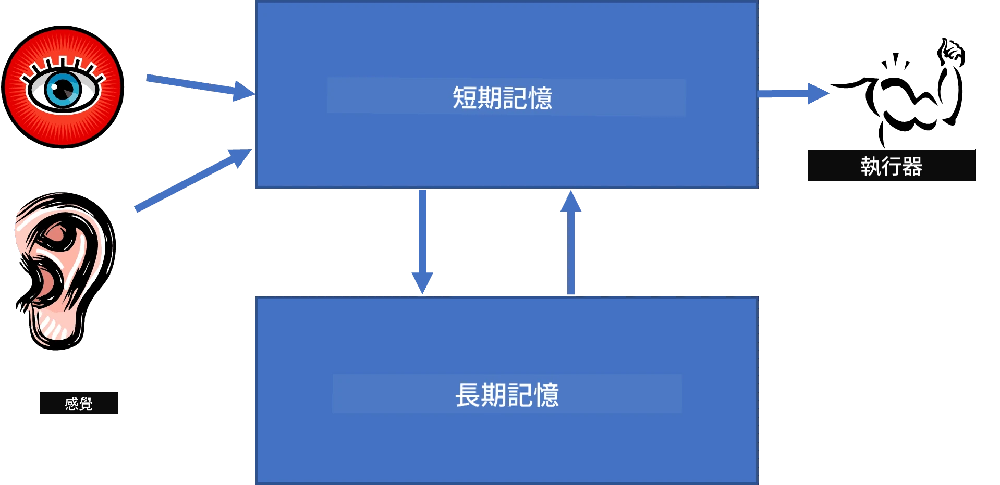

# 知識表示與專家系統



> 手繪筆記由 [Tomomi Imura](https://twitter.com/girlie_mac) 製作

人工智能的追求基於對知識的探索，旨在像人類一樣理解世界。但你該如何著手呢？

## [課前測驗](https://ff-quizzes.netlify.app/en/ai/quiz/3)

在AI的早期階段，自上而下的創建智能系統方法（前一課討論過）很受歡迎。這個想法是從人們身上提取知識，轉換成機器可讀的形式，然後用以自動解決問題。這種方法基於兩個重要的理念：

* 知識表示
* 推理

## 知識表示

符號AI中的一個重要概念是**知識**。區分知識與*資訊*或*資料*很重要。例如，人們常說書本包含知識，因為閱讀書本可成為專家。然而，書本裡實際包含的是稱為*資料*的東西，通過閱讀書本並整合這些資料進入我們的世界模型，我們將資料轉變成知識。

> ✅ **知識**是存在於我們腦海中，代表我們對世界理解的東西。它是透過一個積極的**學習**過程獲得，將我們接收到的資訊片段整合進我們對世界的主動模型中。

我們通常不會嚴格定義知識，而是通過[DIKW金字塔](https://en.wikipedia.org/wiki/DIKW_pyramid)將它與其他相關概念對應，其包含以下概念：

* **資料**是以物理媒介表示的東西，如書寫文本或口語詞彙。資料獨立於人類存在，且可在人與人之間傳遞。
* **資訊**是在我們腦中如何解讀資料。例如，當聽到「電腦」一詞時，我們對它有一定理解。
* **知識**是被整合到我們的世界模型中的資訊。例如，當我們知道電腦是什麼，我們開始對它如何運作、價格多少、用途等有想法。這些相互關聯的概念網絡形成了我們的知識。
* **智慧**是我們對世界理解的更高一層，代表*元知識*，例如關於何時及如何使用知識的一些觀念。


*圖片來自 [維基百科](https://commons.wikimedia.org/w/index.php?curid=37705247)，作者 Longlivetheux - 自作，CC BY-SA 4.0*

因此，**知識表示**問題是找到有效的方式，將知識以資料形式表示在電腦內，讓其可自動使用。這可看作是一個光譜：



> 圖片由 [Dmitry Soshnikov](http://soshnikov.com) 提供

* 左側是電腦可有效使用的非常簡單的知識表示類型。最簡單的是算法表示，知識由電腦程式代表。但這不是呈現知識的最佳方式，因為它不夠靈活。存在於我們腦中的知識常常是非算法性的。
* 右側是自然文字表示。它最強大，但無法用於自動推理。

> ✅ 想一下你如何在腦中表示知識並轉換成筆記？有沒有特定的格式能幫助你記憶？

## 電腦知識表示的分類

我們可將不同的電腦知識表示方法分類如下：

* **網路表示**基於我們腦中存在的相互關聯概念網絡。我們可嘗試在電腦中重現這些網絡，作為圖形表示——所謂的**語義網絡**。

1. **物件-屬性-值三元組**或**屬性-值對**。由於圖形可在電腦中表示為節點與邊列表，我們可用三元組列表表示語義網絡，其中包含物件、屬性、值。例如，我們構建以下關於程式語言的三元組：

物件 | 屬性 | 值
-------|-----------|------
Python | 是 | 非型別語言
Python | 發明者 | Guido van Rossum
Python | 區塊語法 | 縮排
非型別語言 | 沒有 | 型別定義

> ✅ 想想三元組如何用於表示其他類型的知識。

2. **層次式表示**強調我們經常在腦中建立物件層次結構。例如，我們知道金絲雀是鳥，所有鳥都有翅膀，我們也知道金絲雀通常的顏色及飛行速度。

   - **框架表示**基於將每個物件或物件類別表示為包含**槽位**的**框架**。槽位可有預設值、值限制或可調用的程序以獲得槽位值。所有框架形成的層次結構類似物件導向程式語言中的物件層次結構。
   - **劇本**是特殊類型的框架，用於表示可隨時間展開的複雜情境。

**Python**

槽位 | 值 | 預設值 | 範圍 |
-----|-------|---------------|----------|
名稱 | Python | | |
是-一個 | 非型別語言 | | |
變數寫法 | | 駝峰式 | |
程式長度 | | | 5-5000 行 |
區塊語法 | 縮排 | | |

3. **程序式表示**基於以可在條件觸發時執行的一系列動作表示知識。
   - 生產規則是if-then語句，允許我們推斷結論。例如，一位醫生可能有規則：**如果**患者有高燒**或**血液檢驗中C反應蛋白偏高，**那麼**他有發炎情況。一旦符合條件之一，就能推論發炎，並用於後續推理。
   - 算法可視為另一種程序式表示，儘管它們幾乎不直接用於基於知識的系統。

4. **邏輯**最初由亞里斯多德提出，作為代表普遍人類知識的方法。
   - 謂詞邏輯作為數學理論過於豐富而難以計算，因此通常使用其子集，如Prolog中使用的Horn子句。
   - 描述邏輯屬於一組邏輯系統，用於表示與推理物件層次結構的分散式知識表示，如*語義網路*。

## 專家系統

符號AI的早期成功之一是所謂的**專家系統**——設計用於充當有限問題領域專家的計算機系統。它基於從一個或多個人類專家提取的**知識庫**，並包含執行推理的**推理引擎**。

 | 
---------------------------------------------|------------------------------------------------
簡化的人類神經系統結構 | 基於知識系統的架構

專家系統是按照人類推理系統建造的，該系統包含**短期記憶**與**長期記憶**。類似地，在基於知識的系統中，我們區分以下組件：

* **問題記憶**：包含當前解決問題的知識，例如果病人體溫或血壓，是否有發炎等。這類知識又稱為**靜態知識**，因為它是表示我們目前對問題了解的快照——即所謂的*問題狀態*。
* **知識庫**：代表有關問題領域的長期知識。它是從人類專家手動提取的，且在諮詢期間不會改變。由於可引導我們從一個問題狀態轉移到另一狀態，故亦稱為**動態知識**。
* **推理引擎**：調度整個搜索問題狀態空間的過程，在必要時向用戶提問。並負責找出應用於每個狀態的正確規則。

舉例來說，考慮以下透過動物的物理特徵判定動物的專家系統：


> 圖片由 [Dmitry Soshnikov](http://soshnikov.com) 提供

此圖被稱為**AND-OR樹**，是生產規則集合的圖形表述。繪製樹狀圖在從專家處提取知識時非常有用。在電腦中表示知識，則更方便使用規則：

```
IF the animal eats meat
OR (animal has sharp teeth
    AND animal has claws
    AND animal has forward-looking eyes
) 
THEN the animal is a carnivore
```

你會看到，每個規則的左側條件與動作本質上是物件-屬性-值（OAV）三元組。**工作記憶**包含與當前解決問題相關的OAV三元組集合。**規則引擎**尋找條件符合的規則並執行它們，將新的三元組加入工作記憶。

> ✅ 自己擬定一棵你感興趣主題的AND-OR樹吧！

### 正向與反向推理

上述過程稱為**正向推理**。它從工作記憶中可用的初始問題數據開始，然後執行以下推理循環：

1. 若工作記憶中有目標屬性，停止並輸出結果
2. 搜尋條件當前被滿足的所有規則——獲得**衝突集**規則
3. 執行**衝突解決**——從衝突集選擇一條執行規則。可能的衝突解決策略：
   - 選擇知識庫中第一個合適規則
   - 隨機選擇一條規則
   - 選擇*較特定*的規則，即「左側」條件最多條件被滿足的規則
4. 應用所選規則並將新知識插入問題狀態
5. 從第1步重複

然而，有時我們想從問題的空白知識開始，通過提問推理以得出結論。例如醫學診斷時，我們通常不會在診斷前事先做所有醫學檢查，而是根據需要決定做哪些檢查。

這個流程可以用**反向推理**建模。它由**目標**驅動——我們想找到的屬性值：

1. 選擇所有可給定目標值的規則（即目標在「右側」）——形成衝突集
2. 若該屬性無規則或規則要求向使用者提問該值，則詢問使用者，否則：
3. 使用衝突解決策略選擇一條規則作為*假設*，將嘗試證明它
4. 遞迴地重複此過程，嘗試證明該規則左側（條件）的所有屬性目標
5. 若過程中任一步失敗，返回步驟3選用另一規則

> ✅ 正向推理在何種情況較適合？反向推理又如何？

### 實作專家系統

專家系統可使用不同工具實現：

* 直接用高階程式語言編程。但這不是理想方法，因為基於知識系統的最大優點是知識和推理分離，而理想上問題領域專家應能不懂推理細節便撰寫規則。
* 使用**專家系統殼層**，即專門設計用知識表示語言填充知識的系統。

## ✍️ 練習：動物推理

見[Animals.ipynb](https://github.com/microsoft/AI-For-Beginners/blob/main/lessons/2-Symbolic/Animals.ipynb)，範例展示如何實作正向與反向推理專家系統。

> **注意**：此範例較簡單，僅展示專家系統的基本樣貌。當你開始打造此系統時，只有達到一定數量的規則（約200條以上）時，才會看到一些*智能*行為。某階段規則過於複雜，難以全盤掌握，你會開始質疑系統為何做出某些決策。然而，基於知識系統的重要特性是，你總能*解釋*任何決定是如何做出的。

## 本體論與語義網路

20世紀末期曾有一項倡議，利用知識表示為網際網路資源加註解，使其可以找到符合非常具體查詢的資源。此倡議稱為**語義網路**，並依賴以下幾個概念：

- 基於**[描述邏輯](https://en.wikipedia.org/wiki/Description_logic)**(DL)的特殊知識表示。它類似框架知識表示，因為建立了帶屬性的物件層次結構，但擁有正式的邏輯語義與推理。描述邏輯有整個家族，平衡了表達力與推理算法複雜度。
- 分散式知識表示，所有概念以全球URI識別，使得可建立跨網路的知識層次結構。
- 一組基於 XML 的知識描述語言家族：RDF（資源描述框架）、RDFS（RDF 架構）、OWL（本體網路語言）。

語意網的一個核心概念是**本體**。它指的是使用某種形式化知識表示對問題域的明確規範。最簡單的本體可以只是問題域中物件的階層結構，但更複雜的本體將包括可用於推理的規則。

在語意網中，所有表示都是基於三元組。每個物件和每個關係都由 URI 唯一標識。例如，如果我們想表示這個 AI 課程是由 Dmitry Soshnikov 於 2022 年 1 月 1 日開發的——這裡是我們可以使用的三元組：


```
http://github.com/microsoft/ai-for-beginners http://www.example.com/terms/creation-date “Jan 1, 2022”
http://github.com/microsoft/ai-for-beginners http://purl.org/dc/elements/1.1/creator http://soshnikov.com
```

> ✅ 這裡 `http://www.example.com/terms/creation-date` 和 `http://purl.org/dc/elements/1.1/creator` 是一些眾所周知且被普遍接受的 URI，用於表達*創建者*和*創建日期*的概念。

在更複雜的情況下，如果我們想定義一個創建者列表，可以使用 RDF 定義的一些資料結構。


> 上方圖示由 [Dmitry Soshnikov](http://soshnikov.com) 製作

語意網的建設進展在某種程度上因搜尋引擎和自然語言處理技術的成功而放緩，這些技術可以從文本中提取結構化數據。然而，在某些領域仍有大量努力來維護本體和知識庫。值得注意的幾個項目：

* [WikiData](https://wikidata.org/) 是一個與維基百科關聯的機器可讀知識庫集合。大部分數據來自維基百科的 *資訊框*，即維基百科頁面中的結構化內容片段。你可以使用 SPARQL，一種語意網專用查詢語言，來[查詢](https://query.wikidata.org/) wikidata。這裡有一個示例查詢，顯示人類中最流行的眼睛顏色：

```sparql
#defaultView:BubbleChart
SELECT ?eyeColorLabel (COUNT(?human) AS ?count)
WHERE
{
  ?human wdt:P31 wd:Q5.       # human instance-of homo sapiens
  ?human wdt:P1340 ?eyeColor. # human eye-color ?eyeColor
  SERVICE wikibase:label { bd:serviceParam wikibase:language "en". }
}
GROUP BY ?eyeColorLabel
```

* [DBpedia](https://www.dbpedia.org/) 是另一個類似 WikiData 的項目。

> ✅ 如果你想嘗試自己建立本體，或打開現有的本體，有一個很棒的視覺本體編輯器叫做 [Protégé](https://protege.stanford.edu/)。你可以下載使用，也可以線上使用。


*Web Protégé 編輯器開啟了羅曼諾夫家族本體。截圖由 Dmitry Soshnikov 提供*

## ✍️ 練習：家族本體

參考 [FamilyOntology.ipynb](https://github.com/Ezana135/AI-For-Beginners/blob/main/lessons/2-Symbolic/FamilyOntology.ipynb) 了解如何使用語意網技術來推理家族關係。我們將採用以常見的 GEDCOM 格式表示的家譜和家族關係本體，構建給定個人集的所有家族關係圖譜。

## 微軟概念圖

在大多數情況下，本體是由人工精心創建的。然而，也可以從非結構化資料中**挖掘**本體，例如從自然語言文本中挖掘。

微軟研究院進行過這樣的嘗試，並產生了[微軟概念圖](https://blogs.microsoft.com/ai/microsoft-researchers-release-graph-that-helps-machines-conceptualize/?WT.mc_id=academic-77998-cacaste)。

這是一個使用「is-a」繼承關係將實體分組的大型集合。它允許回答「什麼是微軟？」這樣的問題——答案會是「以 0.87 的概率是一家公司，以 0.75 的概率是一個品牌」等。

該圖可通過 REST API 獲取，或下載一個列出所有實體對的大型文本文件。

## ✍️ 練習：概念圖

嘗試使用 [MSConceptGraph.ipynb](https://github.com/microsoft/AI-For-Beginners/blob/main/lessons/2-Symbolic/MSConceptGraph.ipynb) 筆記本，看看如何使用微軟概念圖將新聞文章分組到幾個類別中。

## 結論

現在，AI 常被認為是*機器學習*或*神經網絡*的同義詞。然而，人類也表現出明確的推理能力，這是目前神經網絡尚未處理的。在現實世界的專案中，明確推理仍用於執行需要解釋或能以可控方式修改系統行為的任務。

## 🚀 挑戰

在本課程相關的家族本體筆記本中，有機會嘗試其他家族關係。嘗試發掘家譜中人物之間的新連結。

## [課後測驗](https://ff-quizzes.netlify.app/en/ai/quiz/4)

## 複習與自學

在網路上做些調查，發掘人類嘗試量化和編碼知識的領域。看看布魯姆的分類法，回顧歷史，了解人類如何試圖理解世界。探索林奈創建生物分類法的工作，觀察德米特里·門捷列夫如何創造化學元素的描述和分組方式。你還可以找到哪些有趣的例子？

**作業**: [建立一個本體](assignment.md)

---

<!-- CO-OP TRANSLATOR DISCLAIMER START -->
**免責聲明**：  
本文件係使用 AI 翻譯服務 [Co-op Translator](https://github.com/Azure/co-op-translator) 進行翻譯。儘管我們力求準確，但請注意，自動翻譯可能包含錯誤或不準確之處。原始文件的母語版本應被視為權威資料。對於重要資訊，建議採用專業人工翻譯。本公司對因使用此翻譯所產生的任何誤解或誤釋不承擔任何責任。
<!-- CO-OP TRANSLATOR DISCLAIMER END -->