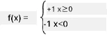

# 神經網絡入門：感知器

## [課前測驗](https://ff-quizzes.netlify.app/en/ai/quiz/5)

1957年，康奈爾航空實驗室的Frank Rosenblatt首次嘗試實現類似現代神經網絡的模型。他設計了一個名為「Mark-1」的硬件系統，用於識別基本幾何圖形，例如三角形、正方形和圓形。

|      |      |
|--------------|-----------|
| | |

> 圖片來源：[維基百科](https://en.wikipedia.org/wiki/Perceptron)

輸入圖像由20x20的光電陣列表示，因此神經網絡有400個輸入和一個二進制輸出。簡單的網絡包含一個神經元，也稱為**閾值邏輯單元**。神經網絡的權重類似於電位器，在訓練階段需要手動調整。

> ✅ 電位器是一種可以調節電路電阻的設備。

> 《紐約時報》當時對感知器的描述是：*一種電子計算機的胚胎，[海軍]期望它能夠行走、說話、看見、書寫、自我複製並意識到自己的存在。*

## 感知器模型

假設我們的模型有N個特徵，那麼輸入向量將是一個大小為N的向量。感知器是一種**二元分類**模型，即它可以區分兩類輸入數據。我們假設對於每個輸入向量x，感知器的輸出將是+1或-1，取決於其所屬的類別。輸出通過以下公式計算：

y(x) = f(w<sup>T</sup>x)

其中f是一個階梯激活函數

<!-- img src="http://www.sciweavers.org/tex2img.php?eq=f%28x%29%20%3D%20%5Cbegin%7Bcases%7D%0A%20%20%20%20%20%20%20%20%20%2B1%20%26%20x%20%5Cgeq%200%20%5C%5C%0A%20%20%20%20%20%20%20%20%20-1%20%26%20x%20%3C%200%0A%20%20%20%20%20%20%20%5Cend%7Bcases%7D%20%5C%5C%0A&bc=White&fc=Black&im=jpg&fs=12&ff=arev&edit=0" align="center" border="0" alt="f(x) = \begin{cases} +1 & x \geq 0 \\ -1 & x < 0 \end{cases} \\" width="154" height="50" / -->


## 訓練感知器

為了訓練感知器，我們需要找到一個權重向量w，使得大多數值能夠正確分類，即使**誤差**最小化。這個誤差E由**感知器準則**定義如下：

E(w) = -&sum;w<sup>T</sup>x<sub>i</sub>t<sub>i</sub>

其中：

* 求和僅針對那些分類錯誤的訓練數據點i
* x<sub>i</sub>是輸入數據，t<sub>i</sub>對應於負例和正例分別為-1或+1。

這個準則被視為權重w的函數，我們需要對其進行最小化。通常使用一種稱為**梯度下降**的方法，我們從某個初始權重w<sup>(0)</sup>開始，然後在每一步根據以下公式更新權重：

w<sup>(t+1)</sup> = w<sup>(t)</sup> - &eta;&nabla;E(w)

其中&eta;是所謂的**學習率**，&nabla;E(w)表示E的**梯度**。計算梯度後，我們得到：

w<sup>(t+1)</sup> = w<sup>(t)</sup> + &sum;&eta;x<sub>i</sub>t<sub>i</sub>

Python中的算法如下：

```python
def train(positive_examples, negative_examples, num_iterations = 100, eta = 1):

    weights = [0,0,0] # Initialize weights (almost randomly :)
        
    for i in range(num_iterations):
        pos = random.choice(positive_examples)
        neg = random.choice(negative_examples)

        z = np.dot(pos, weights) # compute perceptron output
        if z < 0: # positive example classified as negative
            weights = weights + eta*weights.shape

        z  = np.dot(neg, weights)
        if z >= 0: # negative example classified as positive
            weights = weights - eta*weights.shape

    return weights
```

## 結論

在本課中，你學習了感知器，它是一種二元分類模型，以及如何通過使用權重向量來訓練它。

## 🚀 挑戰

如果你想嘗試自己構建感知器，可以試試[Microsoft Learn上的這個實驗](https://docs.microsoft.com/en-us/azure/machine-learning/component-reference/two-class-averaged-perceptron?WT.mc_id=academic-77998-cacaste)，它使用了[Azure ML設計器](https://docs.microsoft.com/en-us/azure/machine-learning/concept-designer?WT.mc_id=academic-77998-cacaste)。

## [課後測驗](https://ff-quizzes.netlify.app/en/ai/quiz/6)

## 回顧與自學

要了解如何使用感知器解決玩具問題以及實際問題，並繼續學習，請查看[感知器](Perceptron.ipynb)筆記本。

這裡還有一篇有趣的[關於感知器的文章](https://towardsdatascience.com/what-is-a-perceptron-basics-of-neural-networks-c4cfea20c590)。

## [作業](lab/README.md)

在本課中，我們實現了一個用於二元分類任務的感知器，並使用它來區分兩個手寫數字。在本實驗中，你需要完全解決數字分類問題，即確定給定圖像最可能對應的數字。

* [指導說明](lab/README.md)
* [筆記本](lab/PerceptronMultiClass.ipynb)

---

