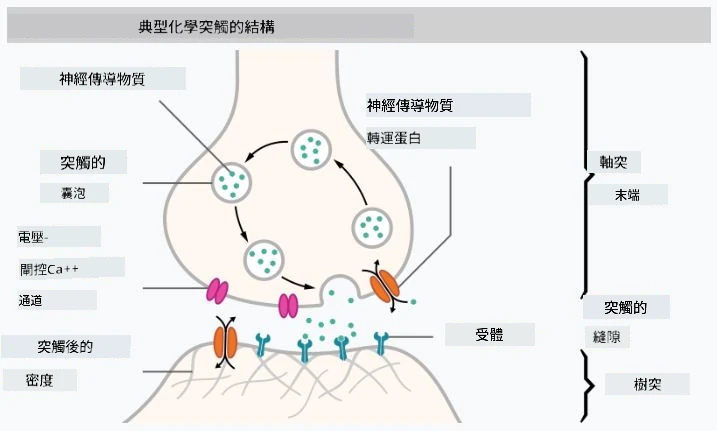

# 神經網絡簡介

如我們在介紹中所討論的，實現智能的一種方法是訓練一個**計算機模型**或**人工大腦**。自20世紀中期以來，研究人員嘗試了不同的數學模型，直到最近這一方向取得了巨大成功。這些模仿大腦的數學模型被稱為**神經網絡**。

> 有時神經網絡被稱為*人工神經網絡*（Artificial Neural Networks，ANNs），以表明我們討論的是模型，而不是實際的神經元網絡。

## 機器學習

神經網絡屬於一個更大的學科，稱為**機器學習**，其目標是利用數據訓練計算機模型以解決問題。機器學習是人工智能的重要組成部分，但我們在本課程中不涉及傳統的機器學習。

> 請訪問我們的獨立課程 **[機器學習入門](http://github.com/microsoft/ml-for-beginners)**，了解更多關於傳統機器學習的內容。

在機器學習中，我們假設有一些示例數據集 **X** 和相應的輸出值 **Y**。示例通常是由**特徵**組成的N維向量，而輸出被稱為**標籤**。

我們將探討兩種最常見的機器學習問題：

* **分類**，即需要將輸入對象分類到兩個或多個類別中。
* **回歸**，即需要為每個輸入樣本預測一個數值。

> 當以張量表示輸入和輸出時，輸入數據集是一個大小為 M&times;N 的矩陣，其中 M 是樣本數量，N 是特徵數量。輸出標籤 Y 是大小為 M 的向量。

在本課程中，我們將僅專注於神經網絡模型。

## 神經元的模型

從生物學中，我們知道大腦由神經細胞（神經元）組成，每個神經元都有多個“輸入”（樹突）和一個“輸出”（軸突）。樹突和軸突都可以傳導電信號，而它們之間的連接——稱為突觸——可以表現出不同程度的導電性，這些導電性由神經遞質調節。

 | 
----|----
真實神經元 *（[圖片](https://en.wikipedia.org/wiki/Synapse#/media/File:SynapseSchematic_lines.svg) 來自維基百科）* | 人工神經元 *（作者提供圖片）*

因此，神經元的最簡單數學模型包含幾個輸入 X1, ..., XN 和一個輸出 Y，以及一系列權重 W1, ..., WN。輸出計算公式為：

其中 f 是某種非線性的**激活函數**。

> 早期的神經元模型在1943年由 Warren McCullock 和 Walter Pitts 在經典論文 [A logical calculus of the ideas immanent in nervous activity](https://www.cs.cmu.edu/~./epxing/Class/10715/reading/McCulloch.and.Pitts.pdf) 中描述。Donald Hebb 在他的書 "[The Organization of Behavior: A Neuropsychological Theory](https://books.google.com/books?id=VNetYrB8EBoC)" 中提出了這些網絡的訓練方法。

## 本章節內容

在本章節中，我們將學習以下內容：
* [感知器](03-Perceptron/README.md)，一種最早的用於二類分類的神經網絡模型
* [多層網絡](04-OwnFramework/README.md)，以及配套筆記本 [如何構建我們自己的框架](04-OwnFramework/OwnFramework.ipynb)
* [神經網絡框架](05-Frameworks/README.md)，包括以下筆記本：[PyTorch](05-Frameworks/IntroPyTorch.ipynb) 和 [Keras/Tensorflow](05-Frameworks/IntroKerasTF.ipynb)
* [過擬合](../../../../lessons/3-NeuralNetworks/05-Frameworks)

---

**免責聲明**：  
本文件已使用 AI 翻譯服務 [Co-op Translator](https://github.com/Azure/co-op-translator) 進行翻譯。儘管我們努力確保翻譯的準確性，但請注意，自動翻譯可能包含錯誤或不準確之處。原始文件的母語版本應被視為權威來源。對於關鍵資訊，建議使用專業人工翻譯。我們對因使用此翻譯而引起的任何誤解或誤釋不承擔責任。