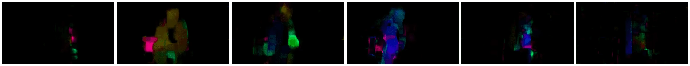

# 電腦視覺簡介

[電腦視覺](https://wikipedia.org/wiki/Computer_vision)是一個旨在讓電腦能夠高層次理解數位影像的學科。這是一個相當廣泛的定義，因為*理解*可以有許多不同的含義，包括在圖片中找到物件（**物件檢測**）、理解正在發生的事情（**事件檢測**）、用文字描述圖片，或重建三維場景。此外，還有一些與人類影像相關的特殊任務，例如年齡和情感估算、人臉檢測與識別，以及三維姿態估算等。

## [課前測驗](https://ff-quizzes.netlify.app/en/ai/quiz/11)

電腦視覺最簡單的任務之一是**影像分類**。

電腦視覺通常被認為是人工智慧的一個分支。如今，大多數電腦視覺任務都是使用神經網路來解決的。我們將在本章節中學習更多用於電腦視覺的特殊神經網路類型，[卷積神經網路](../07-ConvNets/README.md)。

然而，在將影像傳遞給神經網路之前，許多情況下使用一些演算法技術來增強影像是有意義的。

以下是幾個可用於影像處理的 Python 庫：

* **[imageio](https://imageio.readthedocs.io/en/stable/)** 可用於讀取/寫入不同的影像格式。它還支持 ffmpeg，一個將影片幀轉換為影像的有用工具。
* **[Pillow](https://pillow.readthedocs.io/en/stable/index.html)**（也稱為 PIL）功能更強大，還支持一些影像操作，例如形態變化、調整調色板等。
* **[OpenCV](https://opencv.org/)** 是一個用 C++ 編寫的強大影像處理庫，已成為影像處理的*事實標準*。它有一個方便的 Python 介面。
* **[dlib](http://dlib.net/)** 是一個 C++ 庫，實現了許多機器學習演算法，包括一些電腦視覺演算法。它也有 Python 介面，可用於挑戰性任務，例如人臉和面部特徵檢測。

## OpenCV

[OpenCV](https://opencv.org/) 被認為是影像處理的*事實標準*。它包含許多有用的演算法，使用 C++ 實現。你也可以從 Python 調用 OpenCV。

學習 OpenCV 的好地方是[這個 Learn OpenCV 課程](https://learnopencv.com/getting-started-with-opencv/)。在我們的課程中，我們的目標不是學習 OpenCV，而是向你展示一些使用它的例子以及如何使用。

### 加載影像

在 Python 中，影像可以方便地表示為 NumPy 陣列。例如，大小為 320x200 像素的灰度影像將存儲在一個 200x320 的陣列中，而相同尺寸的彩色影像將具有 200x320x3 的形狀（代表 3 個色彩通道）。要加載影像，可以使用以下程式碼：

```python
import cv2
import matplotlib.pyplot as plt

im = cv2.imread('image.jpeg')
plt.imshow(im)
```
  
傳統上，OpenCV 使用 BGR（藍-綠-紅）編碼來表示彩色影像，而其他 Python 工具則使用更傳統的 RGB（紅-綠-藍）。為了使影像顯示正確，你需要將其轉換為 RGB 色彩空間，可以通過在 NumPy 陣列中交換維度，或者調用 OpenCV 函數來完成：

```python
im = cv2.cvtColor(im,cv2.COLOR_BGR2RGB)
```
  
同樣的 `cvtColor` 函數也可以用於執行其他色彩空間轉換，例如將影像轉換為灰度或 HSV（色相-飽和度-亮度）色彩空間。

你還可以使用 OpenCV 逐幀加載影片——在練習 [OpenCV Notebook](OpenCV.ipynb) 中提供了一個例子。

### 影像處理

在將影像傳遞給神經網路之前，你可能需要應用幾個預處理步驟。OpenCV 可以執行許多操作，包括：

* 使用 `im = cv2.resize(im, (320,200),interpolation=cv2.INTER_LANCZOS)` **調整影像大小**  
* 使用 `im = cv2.medianBlur(im,3)` 或 `im = cv2.GaussianBlur(im, (3,3), 0)` **模糊影像**  
* 改變影像的**亮度和對比度**可以通過 NumPy 陣列操作完成，如[這篇 Stackoverflow 筆記](https://stackoverflow.com/questions/39308030/how-do-i-increase-the-contrast-of-an-image-in-python-opencv)所述。  
* 使用[閾值處理](https://docs.opencv.org/4.x/d7/d4d/tutorial_py_thresholding.html)，通過調用 `cv2.threshold`/`cv2.adaptiveThreshold` 函數，這通常比調整亮度或對比度更可取。  
* 對影像應用不同的[變換](https://docs.opencv.org/4.5.5/da/d6e/tutorial_py_geometric_transformations.html)：  
    - **[仿射變換](https://docs.opencv.org/4.5.5/d4/d61/tutorial_warp_affine.html)** 如果你需要結合旋轉、調整大小和傾斜影像，並且知道影像中三個點的來源和目標位置，仿射變換會很有用。仿射變換保持平行線平行。  
    - **[透視變換](https://medium.com/analytics-vidhya/opencv-perspective-transformation-9edffefb2143)** 當你知道影像中四個點的來源和目標位置時，透視變換會很有用。例如，如果你用智能手機相機從某個角度拍攝矩形文件的照片，並希望生成該文件本身的矩形影像。  
* 使用 **[光流](https://docs.opencv.org/4.5.5/d4/dee/tutorial_optical_flow.html)** 來理解影像中的運動。

## 使用電腦視覺的例子

在我們的 [OpenCV Notebook](OpenCV.ipynb) 中，我們提供了一些使用電腦視覺執行特定任務的例子：

* **預處理盲文書的照片**。我們專注於如何使用閾值處理、特徵檢測、透視變換和 NumPy 操作來分離單個盲文符號，以便進一步由神經網路進行分類。

 |  |   
----|-----|-----  

> 圖片來自 [OpenCV.ipynb](OpenCV.ipynb)

* **使用幀差檢測影片中的運動**。如果相機固定，則來自相機的幀應該彼此非常相似。由於幀表示為陣列，只需對兩個連續幀的陣列進行相減，我們就能得到像素差異，靜態幀的差異應該很低，而當影像中有顯著運動時，差異會變高。

  

> 圖片來自 [OpenCV.ipynb](OpenCV.ipynb)

* **使用光流檢測運動**。[光流](https://docs.opencv.org/3.4/d4/dee/tutorial_optical_flow.html) 使我們能夠理解影片幀中每個像素的移動方式。有兩種類型的光流：  
   - **密集光流** 計算顯示每個像素移動方向的向量場  
   - **稀疏光流** 基於提取影像中的一些顯著特徵（例如邊緣），並從幀到幀構建它們的軌跡。  

  

> 圖片來自 [OpenCV.ipynb](OpenCV.ipynb)

## ✍️ 範例筆記本: OpenCV [嘗試 OpenCV 實作](OpenCV.ipynb)

讓我們通過探索 [OpenCV Notebook](OpenCV.ipynb) 來進行一些 OpenCV 的實驗。

## 結論

有時，像運動檢測或指尖檢測這樣相對複雜的任務可以純粹通過電腦視覺來解決。因此，了解電腦視覺的基本技術以及像 OpenCV 這樣的庫能做什麼是非常有幫助的。

## 🚀 挑戰

觀看 [這段影片](https://docs.microsoft.com/shows/ai-show/ai-show--2021-opencv-ai-competition--grand-prize-winners--cortic-tigers--episode-32?WT.mc_id=academic-77998-cacaste)，了解 Cortic Tigers 項目以及他們如何通過機器人構建基於模塊的解決方案來普及電腦視覺任務。研究其他類似項目，了解它們如何幫助新學習者進入這個領域。

## [課後測驗](https://ff-quizzes.netlify.app/en/ai/quiz/12)

## 回顧與自學

閱讀更多關於光流的內容，[這篇精彩的教程](https://learnopencv.com/optical-flow-in-opencv/)。

## [作業](lab/README.md)

在這次實驗中，你將拍攝一段包含簡單手勢的影片，你的目標是使用光流提取上下左右的移動。

  

---

