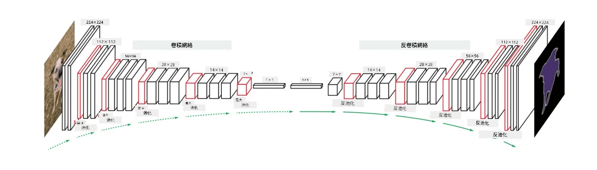

# 分割

我們之前學習了物件偵測，它可以通過預測物件的*邊界框*來定位影像中的物件。然而，對於某些任務，我們不僅需要邊界框，還需要更精確的物件定位。這項任務被稱為**分割**。

## [課前測驗](https://ff-quizzes.netlify.app/en/ai/quiz/23)

分割可以被視為**像素分類**，即對影像中的**每個**像素進行分類（*背景*是其中一個類別）。主要有兩種分割演算法：

* **語義分割**僅告訴像素的類別，並不區分同一類別中的不同物件。
* **實例分割**將類別劃分為不同的實例。

例如，對於實例分割，這些羊是不同的物件；但對於語義分割，所有的羊都被表示為一個類別。

> 圖片來源：[這篇部落格文章](https://nirmalamurali.medium.com/image-classification-vs-semantic-segmentation-vs-instance-segmentation-625c33a08d50)

雖然分割有不同的神經網路架構，但它們的結構都是相似的。在某種程度上，它類似於你之前學習的自編碼器，但我們的目標不是解構原始影像，而是解構一個**遮罩**。因此，分割網路包含以下部分：

* **編碼器**：從輸入影像中提取特徵。
* **解碼器**：將這些特徵轉換為**遮罩影像**，其大小與通道數與類別數相同。

> 圖片來源：[這篇論文](https://arxiv.org/pdf/2001.05566.pdf)

我們特別需要提到分割中使用的損失函數。在使用傳統自編碼器時，我們需要測量兩張影像之間的相似性，可以使用均方誤差（MSE）來完成這項工作。而在分割中，目標遮罩影像中的每個像素代表類別編號（在第三維度上進行獨熱編碼），因此我們需要使用特定於分類的損失函數——交叉熵損失，並對所有像素取平均。如果遮罩是二元的，則使用**二元交叉熵損失**（BCE）。

> ✅ 獨熱編碼是一種將類別標籤編碼為向量的方法，其長度等於類別數量。可以參考[這篇文章](https://datagy.io/sklearn-one-hot-encode/)了解這項技術。

## 醫學影像中的分割

在本課中，我們將通過訓練網路來識別醫學影像中的人類痣（也稱為痣）來實際應用分割。我們將使用<a href="https://www.fc.up.pt/addi/ph2%20database.html">PH2資料庫</a>作為影像來源。該資料集包含200張影像，分為三類：典型痣、不典型痣和黑色素瘤。所有影像還包含對應的**遮罩**，用於勾勒痣的輪廓。

> ✅ 這項技術特別適合這種類型的醫學影像，但你還能想到哪些其他的現實應用場景？

> 圖片來源：PH2資料庫

我們將訓練一個模型，將任何痣從背景中分割出來。

## ✍️ 練習：語義分割

打開以下筆記本，了解更多關於不同語義分割架構的內容，練習使用它們，並觀察它們的實際效果。

* [語義分割 Pytorch](SemanticSegmentationPytorch.ipynb)
* [語義分割 TensorFlow](SemanticSegmentationTF.ipynb)

## [課後測驗](https://ff-quizzes.netlify.app/en/ai/quiz/24)

## 總結

分割是一種非常強大的影像分類技術，它超越了邊界框，實現了像素級別的分類。這項技術被廣泛應用於醫學影像等領域。

## 🚀 挑戰

人體分割只是我們可以對人物影像執行的常見任務之一。其他重要的任務還包括**骨架檢測**和**姿態檢測**。試試[OpenPose](https://github.com/CMU-Perceptual-Computing-Lab/openpose)庫，看看姿態檢測如何應用。

## 複習與自學

這篇[維基百科文章](https://wikipedia.org/wiki/Image_segmentation)提供了該技術各種應用的良好概述。自行深入了解實例分割和全景分割這些子領域。

## [作業](lab/README.md)

在本次實驗中，嘗試使用來自Kaggle的[Segmentation Full Body MADS Dataset](https://www.kaggle.com/datasets/tapakah68/segmentation-full-body-mads-dataset)進行**人體分割**。

---

