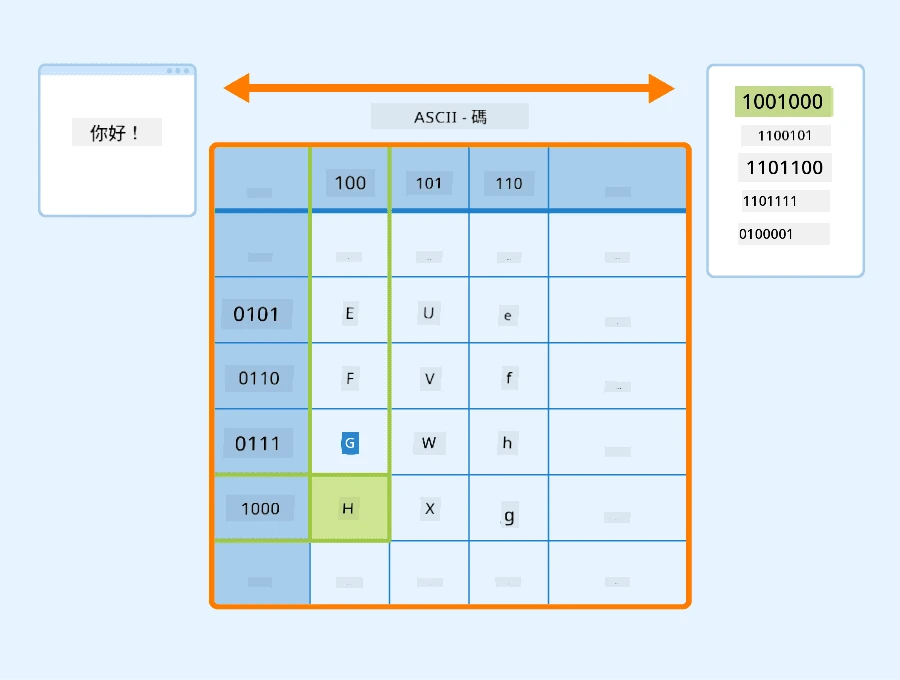
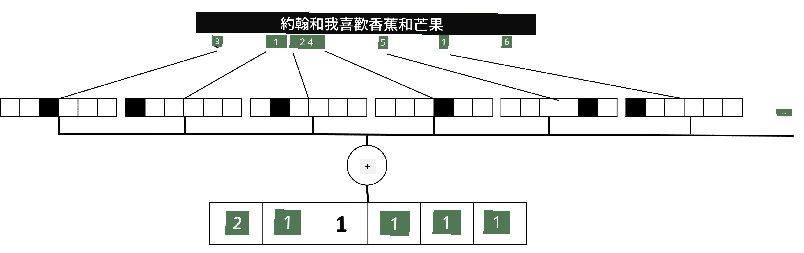

# 將文字表示為張量

## [課前測驗](https://ff-quizzes.netlify.app/en/ai/quiz/25)

## 文字分類

在本部分的第一部分中，我們將專注於**文字分類**任務。我們將使用 [AG News](https://www.kaggle.com/amananandrai/ag-news-classification-dataset) 數據集，該數據集包含如下的新聞文章：

* 類別：科學/技術
* 標題：Ky. 公司獲得研究肽的資助 (AP)
* 內容：AP - 一家由路易斯維爾大學化學研究員創立的公司獲得了一項資助，用於開發...

我們的目標是根據文本將新聞項目分類到其中一個類別中。

## 表示文字

如果我們希望使用神經網絡解決自然語言處理 (NLP) 任務，我們需要某種方式將文字表示為張量。電腦已經使用像 ASCII 或 UTF-8 這樣的編碼將文字字符表示為數字，這些數字映射到屏幕上的字體。

> [圖片來源](https://www.seobility.net/en/wiki/ASCII)

作為人類，我們理解每個字母**代表**什麼，以及所有字符如何組合形成句子的單詞。然而，電腦本身並不具備這種理解能力，神經網絡需要在訓練過程中學習其含義。

因此，我們可以使用不同的方法來表示文字：

* **字符級表示**，即將每個字符視為一個數字來表示文字。假設我們的文本語料庫中有 *C* 個不同的字符，單詞 *Hello* 將被表示為 5x*C* 的張量。每個字母將對應於一個使用獨熱編碼的張量列。
* **單詞級表示**，即我們創建一個包含文本中所有單詞的**詞彙表**，然後使用獨熱編碼來表示單詞。這種方法相對更好，因為單個字母本身並沒有太多意義，因此通過使用更高層次的語義概念——單詞——我們簡化了神經網絡的任務。然而，由於詞彙表的尺寸較大，我們需要處理高維稀疏張量。

無論使用哪種表示方法，我們首先需要將文字轉換為**標記**序列，每個標記可以是字符、單詞，甚至是單詞的一部分。接著，我們使用**詞彙表**將標記轉換為數字，通常使用獨熱編碼，然後將這些數字輸入到神經網絡中。

## N-Grams

在自然語言中，單詞的精確含義只能在上下文中確定。例如，*神經網絡* 和 *捕魚網絡* 的含義完全不同。一種考慮上下文的方法是基於單詞對來構建模型，並將單詞對視為獨立的詞彙標記。這樣，句子 *I like to go fishing* 將被表示為以下標記序列：*I like*、*like to*、*to go*、*go fishing*。這種方法的問題在於詞彙表的尺寸會顯著增大，並且像 *go fishing* 和 *go shopping* 這樣的組合會被表示為不同的標記，儘管它們使用了相同的動詞，但並不共享任何語義相似性。

在某些情況下，我們可能會考慮使用三元組（tri-grams）——三個單詞的組合。因此，這種方法通常被稱為**n-grams**。此外，使用字符級表示時，n-grams 大致對應於不同的音節。

## Bag-of-Words 和 TF/IDF

在解決像文字分類這樣的任務時，我們需要能夠用一個固定大小的向量來表示文字，該向量將作為最終密集分類器的輸入。一種最簡單的方法是將所有單詞的個別表示結合起來，例如通過相加。如果我們將每個單詞的獨熱編碼相加，我們將得到一個頻率向量，顯示每個單詞在文本中出現的次數。這種文字表示方法被稱為**詞袋** (BoW)。

> 圖片由作者提供

詞袋基本上表示了哪些單詞出現在文本中以及它們的數量，這確實可以很好地指示文本的主題。例如，關於政治的新聞文章可能包含像 *president* 和 *country* 這樣的單詞，而科學出版物可能包含像 *collider*、*discovered* 等單詞。因此，單詞頻率在許多情況下可以很好地指示文本內容。

詞袋的問題在於某些常見單詞，例如 *and*、*is* 等，出現在大多數文本中，並且它們的頻率最高，掩蓋了真正重要的單詞。我們可以通過考慮單詞在整個文檔集合中出現的頻率來降低這些單詞的重要性。這就是 TF/IDF 方法的主要思想，該方法在本課程附帶的筆記本中有更詳細的介紹。

然而，這些方法都無法完全考慮文字的**語義**。我們需要更強大的神經網絡模型來做到這一點，我們將在本部分後續內容中討論。

## ✍️ 練習：文字表示

在以下筆記本中繼續學習：

* [使用 PyTorch 表示文字](TextRepresentationPyTorch.ipynb)
* [使用 TensorFlow 表示文字](TextRepresentationTF.ipynb)

## 結論

到目前為止，我們已經研究了可以為不同單詞添加頻率權重的技術。然而，它們無法表示含義或順序。正如著名語言學家 J. R. Firth 在1935年所說，“單詞的完整含義總是與上下文相關，任何脫離上下文的含義研究都不能被認真對待。”我們將在課程後續內容中學習如何通過語言建模從文本中捕捉上下文信息。

## 🚀 挑戰

嘗試使用詞袋和不同的數據模型進行其他練習。你可能會從這個 [Kaggle 比賽](https://www.kaggle.com/competitions/word2vec-nlp-tutorial/overview/part-1-for-beginners-bag-of-words) 中獲得靈感。

## [課後測驗](https://ff-quizzes.netlify.app/en/ai/quiz/26)

## 回顧與自學

在 [Microsoft Learn](https://docs.microsoft.com/learn/modules/intro-natural-language-processing-pytorch/?WT.mc_id=academic-77998-cacaste) 上練習你的文字嵌入和詞袋技術技能。

## [作業：筆記本](assignment.md)

---

