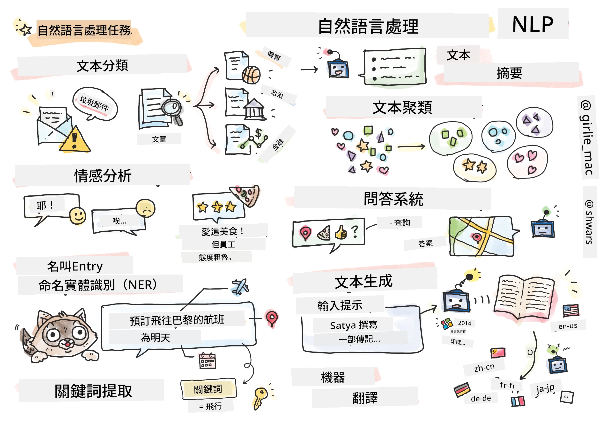

# 自然語言處理



在本節中，我們將專注於使用神經網絡來處理與 **自然語言處理（NLP）** 相關的任務。有很多NLP問題是我們希望電腦能夠解決的：

* <strong>文本分類</strong> 是一個典型的分類問題，涉及文本序列。例如，將電子郵件分類為垃圾郵件或非垃圾郵件，或將文章分類為體育、商業、政治等。此外，在開發聊天機器人時，我們通常需要理解用戶想表達的意圖——這種情況下我們處理的是 <strong>意圖分類</strong>。通常在意圖分類中，我們需要處理許多類別。
<em> <strong>情感分析</strong> 是一個典型的迴歸問題，我們需要為一句話的正面/負面意義屬性一個數字（情感分數）。情感分析的更進階版本是 <strong>基於方面的情感分析</strong>（ABSA），我們不是為整句話給出情感，而是給不同部分（方面）賦予情感，例如：</em>在這家餐廳，我喜歡它的菜式，但氣氛很糟糕*。
<em> <strong>命名實體識別</strong>（NER）指的是從文本中提取特定實體的問題。例如，我們需要理解短語 </em>我明天要飛到巴黎<em> 中的 </em>明天<em> 指的是日期，</em>巴黎* 是一個地點。  
* <strong>關鍵詞提取</strong> 與命名實體識別類似，但我們需要自動提取對句子意義重要的詞，而無需針對特定實體類型進行預訓練。
* <strong>文本聚類</strong> 在我們想將相似的句子分組時非常有用，例如，技術支持對話中的類似請求。
* <strong>問答系統</strong> 指模型回答特定問題的能力。模型接收文本段落和問題作為輸入，並需要提供文本中包含問題答案的地方（或者有時生成答案文本）。
<em> <strong>文本生成</strong> 是模型生成新文本的能力。可以將其視為一個分類任務，通過某些</em>文本提示*來預測下一個字母/詞。先進的文本生成模型如GPT-3能使用稱為 [prompt programming](https://towardsdatascience.com/software-3-0-how-prompting-will-change-the-rules-of-the-game-a982fbfe1e0) 或 [prompt engineering](https://medium.com/swlh/openai-gpt-3-and-prompt-engineering-dcdc2c5fcd29) 的技術來解決其他NLP任務，例如分類。
* <strong>文本摘要</strong> 是一種技術，讓電腦「閱讀」長文本並用幾句話來總結。
* <strong>機器翻譯</strong> 可以被看作是將一種語言的文本理解與另一種語言的文本生成結合起來。

最初，大多數NLP任務是使用傳統方法如語法規則來解決。例如，在機器翻譯中使用解析器將初始句子轉換為語法樹，然後提取高層次的語義結構來表徵句子的意義，並根據這個意義和目標語言的語法生成結果。如今，許多NLP任務使用神經網絡能更有效地解決。

> 許多經典的NLP方法已實現在Python函式庫 [Natural Language Processing Toolkit (NLTK)](https://www.nltk.org) 中。網上有一本很棒的 [NLTK書籍](https://www.nltk.org/book/) 介紹如何使用NLTK解決不同的NLP任務。

在本課程中，我們大部分時間會專注於使用神經網絡來處理NLP，並且會在需要時使用NLTK。

我們已經學習過用神經網絡處理表格數據和影像。這些數據類型和文本的主要區別在於，文本是可變長序列，而影像的輸入尺寸是事先已知的。雖然卷積網絡能從輸入數據中提取模式，但文本中的模式更為複雜。例如，否定詞與主語可能被多個詞語任意分開（如 <em>我不喜歡橙子</em> 與 <em>我不喜歡那些大顏色鮮豔且美味的橙子</em>），這應該被解釋為同一種模式。因此，為了處理語言，我們需要引入新的神經網絡類型，如<em>循環網絡</em>和<em>變壓器</em>。

## 安裝函式庫

如果你使用本地的Python安裝來運行本課程，可能需要使用以下命令安裝所有NLP所需的函式庫：

**針對PyTorch**
```bash
pip install -r requirements-pytorch.txt
```
**針對TensorFlow**
```bash
pip install -r requirements-tf.txt
```

> 你可以在 [Microsoft Learn](https://docs.microsoft.com/learn/modules/intro-natural-language-processing-tensorflow/?WT.mc_id=academic-77998-cacaste) 試用TensorFlow的NLP

## GPU 警告

在本節中，我們的一些範例將訓練相當大型的模型。
* **使用支援GPU的電腦**：建議在支援GPU的電腦上運行筆記本，以減少處理大型模型時的等待時間。
* **GPU 記憶體限制**：在GPU上運行可能會造成GPU記憶體不足的情況，特別是訓練大型模型時。
* **GPU 記憶體使用量**：訓練時GPU記憶體的消耗取決於多種因素，包括小批量大小（minibatch size）。
* <strong>減小小批量大小</strong>：如果遇到GPU記憶體問題，可以嘗試減小程式碼中的小批量大小作為解決方案。
* **TensorFlow GPU 記憶體釋放**：較舊版本的TensorFlow在一個Python內核中訓練多個模型時可能無法正確釋放GPU記憶體。為了有效管理GPU記憶體使用，可以設置TensorFlow僅在需要時分配GPU記憶體。
* <strong>代碼示範</strong>：要讓TensorFlow在需要時才增加GPU記憶體分配，在你的筆記本中加入以下代碼：

```python
physical_devices = tf.config.list_physical_devices('GPU') 
if len(physical_devices)>0:
    tf.config.experimental.set_memory_growth(physical_devices[0], True) 
```

如果你有興趣從經典機器學習視角學習NLP，請參閱 [這套課程](https://github.com/microsoft/ML-For-Beginners/tree/main/6-NLP)

## 本節內容
在本節中，我們將學習：

* [將文本表示為張量](13-TextRep/README.md)
* [詞嵌入](14-Embeddings/README.md)
* [語言建模](15-LanguageModeling/README.md)
* [循環神經網絡](16-RNN/README.md)
* [生成網絡](17-GenerativeNetworks/README.md)
* [變壓器](18-Transformers/README.md)

---

<!-- CO-OP TRANSLATOR DISCLAIMER START -->
**免責聲明**：
本文件使用 AI 翻譯服務 [Co-op Translator](https://github.com/Azure/co-op-translator) 進行翻譯。雖然我們力求準確，但請注意，自動翻譯可能包含錯誤或不準確之處。原始文件的母語版本應被視為權威來源。對於重要資訊，建議尋求專業人工翻譯。我們不對因使用本翻譯而引起的任何誤解或曲解承擔責任。
<!-- CO-OP TRANSLATOR DISCLAIMER END -->