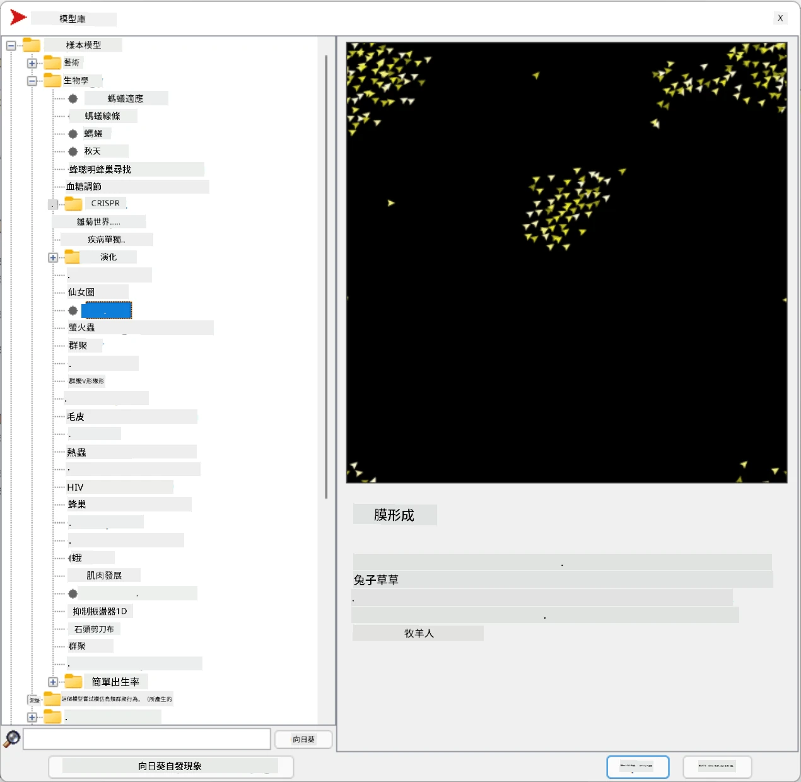

# 多代理系統

實現智慧的一種可能方式是所謂的**湧現式**（或**協同式**）方法，這種方法基於一個事實，即許多相對簡單的代理的組合行為可以導致整個系統表現出更複雜（或更智能）的行為。理論上，這基於[集體智慧](https://en.wikipedia.org/wiki/Collective_intelligence)、[湧現主義](https://en.wikipedia.org/wiki/Global_brain)和[進化控制論](https://en.wikipedia.org/wiki/Global_brain)的原則，這些原則認為，高層系統在適當地由低層系統組合時，能夠獲得某種附加價值（即所謂的*元系統轉換原則*）。

## [課前測驗](https://ff-quizzes.netlify.app/en/ai/quiz/45)

**多代理系統**的方向在1990年代隨著互聯網和分散式系統的發展而在人工智慧領域中興起。經典的人工智慧教科書[《人工智慧：現代方法》](https://en.wikipedia.org/wiki/Artificial_Intelligence:_A_Modern_Approach)從多代理系統的角度探討了經典人工智慧的觀點。

多代理方法的核心是**代理**的概念——一個生活在某個**環境**中的實體，它能感知環境並對其進行操作。這是一個非常廣泛的定義，因此代理可以有許多不同的類型和分類：

* 根據推理能力：
   - **反應型**代理通常具有簡單的請求-響應行為
   - **推理型**代理使用某種邏輯推理和/或規劃能力
* 根據代理執行代碼的位置：
   - **靜態**代理在專用的網路節點上運行
   - **移動**代理可以在網路節點之間移動其代碼
* 根據行為：
   - **被動代理**沒有特定的目標。這類代理可以對外部刺激作出反應，但不會主動採取行動
   - **主動代理**有一些目標需要追求
   - **認知代理**涉及複雜的規劃和推理

多代理系統如今被應用於許多領域：

* 在遊戲中，許多非玩家角色（NPC）使用某種人工智慧，並可被視為智能代理
* 在視頻製作中，渲染涉及人群的複雜3D場景通常使用多代理模擬
* 在系統建模中，多代理方法被用於模擬複雜模型的行為。例如，多代理方法已成功用於預測COVID-19疾病在全球的傳播。類似的方法也可用於模擬城市交通，並觀察其對交通規則變化的反應
* 在複雜的自動化系統中，每個設備可以作為一個獨立的代理，這使得整個系統不那麼單一化且更具韌性

我們不會深入探討多代理系統，但會考慮一個**多代理建模**的例子。

## NetLogo

[NetLogo](https://ccl.northwestern.edu/netlogo/)是一個基於[Logo](https://en.wikipedia.org/wiki/Logo_(programming_language))編程語言修改版本的多代理建模環境。這種語言最初是為了教孩子們編程概念而開發的，它允許你控制一個名為**烏龜**的代理，該代理可以移動並留下痕跡。這使得創建複雜的幾何圖形成為可能，這是一種非常直觀的方式來理解代理的行為。

在NetLogo中，我們可以使用`create-turtles`命令創建許多烏龜。然後我們可以命令所有烏龜執行一些動作（例如以下例子中向前移動10個單位）：

```
create-turtles 10
ask turtles [
  forward 10
]
```

當然，如果所有烏龜都做相同的事情，那就沒什麼趣味了，因此我們可以`ask`某些烏龜群體執行動作，例如那些位於某個點附近的烏龜。我們還可以使用`breed [cats cat]`命令創建不同*品種*的烏龜。這裡`cat`是品種的名稱，我們需要指定單數和複數形式，因為不同的命令為了清晰性會使用不同的形式。

> ✅ 我們不會深入學習NetLogo語言本身——如果你有興趣，可以訪問出色的[NetLogo互動式初學者詞典](https://ccl.northwestern.edu/netlogo/bind/)資源。

你可以[下載](https://ccl.northwestern.edu/netlogo/download.shtml)並安裝NetLogo來試用。

### 模型庫

NetLogo的一大優勢是它包含一個可供試用的工作模型庫。進入**File &rightarrow; Models Library**，你可以選擇許多類別的模型。



> Dmitry Soshnikov提供的模型庫截圖

你可以打開其中一個模型，例如**Biology &rightarrow; Flocking**。

### 主要原則

打開模型後，你會進入NetLogo的主界面。以下是一個描述狼和羊在有限資源（草地）條件下的種群模型示例。


> Dmitry Soshnikov提供的截圖

在這個界面上，你可以看到：

* **界面**部分包含：
  - 所有代理生活的主要場地
  - 不同的控制項：按鈕、滑塊等
  - 用於顯示模擬參數的圖表
* **代碼**標籤包含編輯器，你可以在其中輸入NetLogo程序

在大多數情況下，界面會有一個**Setup**按鈕，用於初始化模擬狀態，以及一個**Go**按鈕，用於開始執行。這些按鈕由代碼中的相應處理程序處理，如下所示：

```
to go [
...
]
```

NetLogo的世界由以下對象組成：

* **代理**（烏龜）可以在場地上移動並執行操作。你可以使用`ask turtles [...]`語法命令代理，括號內的代碼由所有代理以*烏龜模式*執行。
* **補丁**是場地上的方形區域，代理生活在其上。你可以引用同一補丁上的所有代理，或者更改補丁的顏色和其他屬性。你也可以`ask patches`執行操作。
* **觀察者**是一個控制世界的唯一代理。所有按鈕處理程序都在*觀察者模式*下執行。

> ✅ 多代理環境的美妙之處在於，烏龜模式或補丁模式下運行的代碼由所有代理同時並行執行。因此，通過編寫少量代碼並編程個體代理的行為，你可以創建整個模擬系統的複雜行為。

### 群聚行為

作為多代理行為的例子，我們來看看**[群聚行為](https://en.wikipedia.org/wiki/Flocking_(behavior))**。群聚是一種複雜的模式，非常類似於鳥群的飛行方式。觀察它們飛行時，你可能會認為它們遵循某種集體算法，或者擁有某種*集體智慧*。然而，這種複雜行為的產生是因為每個個體代理（在這裡是一隻*鳥*）僅觀察距離自己較近的其他代理，並遵循三個簡單的規則：

* **對齊** - 朝著鄰近代理的平均方向移動
* **凝聚** - 朝著鄰居的平均位置移動（*長距離吸引*）
* **分離** - 當與其他鳥靠得太近時，試圖遠離（*短距離排斥*）

你可以運行群聚行為的例子並觀察其行為。你還可以調整參數，例如*分離程度*或*視距範圍*，這定義了每隻鳥能看到的距離。注意，如果你將視距範圍減少到0，所有鳥都變得盲目，群聚行為就會停止。如果你將分離減少到0，所有鳥會聚集成一條直線。

> ✅ 切換到**代碼**標籤，查看群聚行為的三個規則（對齊、凝聚和分離）如何在代碼中實現。注意我們如何僅引用視線範圍內的代理。

### 其他可觀察的模型

還有一些有趣的模型可以供你實驗：

* **Art &rightarrow; Fireworks**展示了如何將煙火視為個體火流的集體行為
* **Social Science &rightarrow; Traffic Basic**和**Social Science &rightarrow; Traffic Grid**展示了城市交通在1D和2D網格中有無交通信號燈的模型。模擬中的每輛車遵循以下規則：
   - 如果前方空間是空的——加速（直到某個最大速度）
   - 如果看到前方有障礙物——剎車（你可以調整駕駛員的視距）
* **Social Science &rightarrow; Party**展示了人們在雞尾酒會上如何聚集在一起。你可以找到能最快提升群體幸福感的參數組合。

從這些例子中可以看出，多代理模擬是一種非常有用的方法，可以幫助理解由遵循相同或相似邏輯的個體組成的複雜系統的行為。它還可以用於控制虛擬代理，例如電腦遊戲中的[非玩家角色（NPC）](https://en.wikipedia.org/wiki/NPC)或3D動畫世界中的代理。

## 推理型代理

上述代理非常簡單，通過某種算法對環境變化作出反應。因此，它們是**反應型代理**。然而，有時代理可以進行推理並規劃其行動，這種情況下它們被稱為**推理型代理**。

一個典型的例子是個人代理接收到人類的指令去預訂一個度假行程。假設網路上有許多代理可以幫助它。它需要聯繫其他代理查看有哪些航班可用，不同日期的酒店價格是多少，並嘗試談判出最優惠的價格。當度假計劃完成並得到主人確認後，它可以進行預訂。

為了做到這一點，代理需要**通信**。為了成功通信，它們需要：

* 一些用於交換知識的**標準語言**，例如[知識交換格式（KIF）](https://en.wikipedia.org/wiki/Knowledge_Interchange_Format)和[知識查詢與操作語言（KQML）](https://en.wikipedia.org/wiki/Knowledge_Query_and_Manipulation_Language)。這些語言基於[言語行為理論](https://en.wikipedia.org/wiki/Speech_act)設計。
* 這些語言還應包括一些基於不同**拍賣類型**的**談判協議**。
* 一個**通用本體**，以便它們能夠參考相同的概念並理解其語義
* 一種**發現**不同代理功能的方法，也基於某種本體

推理型代理比反應型代理複雜得多，因為它們不僅需要對環境變化作出反應，還需要能夠*主動*採取行動。一種被提出的推理型代理架構是所謂的信念-願望-意圖（BDI）代理：

* **信念**構成了代理對其環境的知識集合。它可以被結構化為知識庫或一組代理可以應用於環境中特定情況的規則。
* **願望**定義了代理想要做什麼，即它的目標。例如，上述個人助理代理的目標是預訂行程，而酒店代理的目標是最大化利潤。
* **意圖**是代理為實現其目標而計劃的具體行動。行動通常會改變環境並導致與其他代理的通信。

目前有一些可用於構建多代理系統的平台，例如[JADE](https://jade.tilab.com/)。[這篇論文](https://arxiv.org/ftp/arxiv/papers/2007/2007.08961.pdf)包含了多代理平台的回顧，以及多代理系統的簡史及其不同的使用場景。

## 結論

多代理系統可以採用非常不同的形式，並應用於許多不同的領域。它們通常專注於個體代理的簡單行為，並通過**協同效應**實現整個系統的更複雜行為。

## 🚀 挑戰

將這節課的內容應用到現實世界，試著構思一個可以解決問題的多代理系統。例如，多代理系統需要做什麼來優化校車路線？它如何在麵包店中運作？

## [課後測驗](https://ff-quizzes.netlify.app/en/ai/quiz/46)

## 回顧與自學

回顧這種類型系統在工業中的應用。選擇一個領域，例如製造業或視頻遊戲行業，探索多代理系統如何用於解決獨特的問題。

## [NetLogo作業](assignment.md)

---

