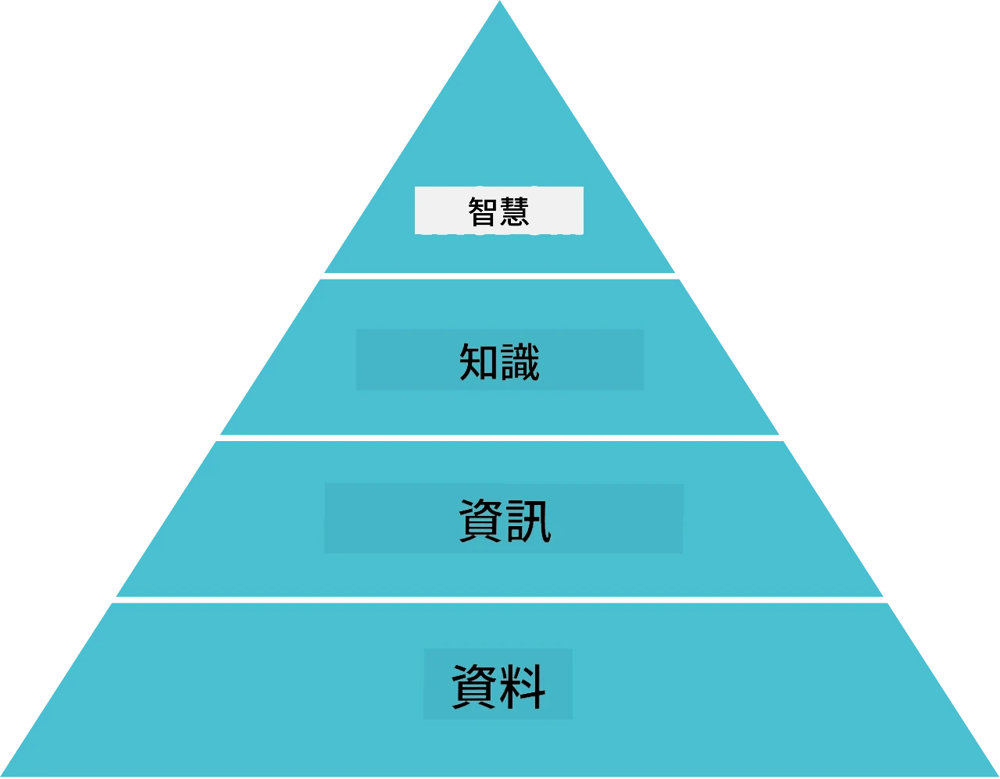

# 知識表示與專家系統


> 筆記作者：[Tomomi Imura](https://twitter.com/girlie_mac)

人工智慧的追求是基於對知識的探索，以類似人類理解世界的方式來解釋世界。但你該如何達成這個目標呢？

## [課前測驗](https://ff-quizzes.netlify.app/en/ai/quiz/3)

在 AI 的早期階段，自頂向下創建智能系統的方法（在前一課討論過）非常受歡迎。這個想法是將人類的知識提取成機器可讀的形式，然後用它來自動解決問題。這種方法基於兩大核心理念：

* 知識表示
* 推理

## 知識表示

符號 AI 中一個重要的概念是**知識**。區分知識和*資訊*或*數據*非常重要。例如，可以說書籍包含知識，因為我們通過學習書籍可以成為專家。然而，書中實際包含的是所謂的*數據*，透過閱讀書籍並將這些數據整合到我們的世界模型中，我們將數據轉變為知識。

> ✅ **知識** 是指存在於我們腦海中，代表我們對世界理解的東西。它是透過一個主動的**學習**過程獲得，將我們收到的資訊片段整合進我們的活躍世界模型中。

通常，我們不會嚴格定義知識，而是透過[DIKW 金字塔](https://en.wikipedia.org/wiki/DIKW_pyramid)將其與其他相關概念對齊。包含以下概念：

* **數據（Data）** 是指表現在物理媒介上的東西，如書面文字或口語。數據獨立於人類存在，且可在不同人間傳遞。
* **資訊（Information）** 是我們對數據的解讀。例如，當我們聽到「電腦」這個字時，就會對它有所理解。
* **知識（Knowledge）** 是將資訊整合到我們的世界模型中。例如，一旦學習到電腦是什麼，我們就開始瞭解它如何運作、價格多少、用途為何。這種相互關聯的概念網絡形成了我們的知識。
* **智慧（Wisdom）** 是我們對世界理解的更高層次，代表*元知識*，例如有關知識應用的時機與方式的概念。



*圖片來源 [維基百科](https://commons.wikimedia.org/w/index.php?curid=37705247)，作者 Longlivetheux 自作，CC BY-SA 4.0*

因此，**知識表示** 問題是尋找一些有效的方法來以資料形式在電腦內代表知識，使其可被自動使用。這可視為一個光譜：


> 圖片來源 [Dmitry Soshnikov](http://soshnikov.com)

* 左邊是電腦可有效使用的非常簡單的知識表示類型。最簡單的是算法式表示，當知識以電腦程式形式存在。然而，這並非最佳的知識表示方式，因為它不具彈性。腦中知識通常是非算法的。
* 右邊則是自然文字等表示，它功能最強大，但無法用於自動推理。

> ✅ 花一分鐘想想你如何在腦海中表達知識，並將它轉換成筆記。是否有特定格式有助於記憶保留？

## 電腦知識表示的分類

我們可以將不同的電腦知識表示方法分為以下類別：

* **網絡表示** 基於我們腦中存在互相關聯的概念網絡。可嘗試在電腦中以圖形方式重現這些網絡，也就是所謂的**語意網絡**。

1. **物件-屬性-值三元組** 或 **屬性-值對**。由於電腦中圖形可用節點與邊的列表來表示，於是可用物件、屬性和值組成的三元組來表現語意網絡。例如關於程式語言，可建立以下三元組：

物件 | 屬性 | 值
-------|-----------|------
Python | 是 | 無型別程式語言
Python | 發明者 | Guido van Rossum
Python | 區塊語法 | 縮排
無型別程式語言 | 不具備 | 型別定義

> ✅ 想想三元組如何用來表示其他類型的知識。

2. **階層表示** 強調我們常在腦中建立物件階層。例如，我們知道金絲雀是鳥類，鳥類都有翅膀，且了解金絲雀通常的顏色和飛行速度。

   - **框架表示（Frame representation）** 以每個物件或物件類別表示為一個**框架**，內含**插槽（slots）**。插槽可能有預設值、值限制，或可呼叫的程序來獲取插槽值。所有框架形成類似物件導向程式語言中的物件階層。
   - **場景（Scenarios）** 是一種特殊的框架，用來表示可能隨時間展開的複雜情境。

**Python**

插槽 | 值 | 預設值 | 範圍 |
-----|-------|---------------|----------|
名稱 | Python | | |
是屬於 | 無型別程式語言 | | |
變數命名格式 | | CamelCase | |
程式長度 | | | 5-5000 行 |
區塊語法 | 縮排 | | |

3. **程序式表示** 基於以一組動作表示知識，於特定條件下執行這些動作。
   - 生產規則是 if-then 陳述句，可用來推理結論。例如，醫生可能有規則：**如果** 病人體溫高 **或** 血液檢查中的 C 反應蛋白指數高 **那麼** 他有發炎。一旦遇到條件，即可推論發炎，並用於後續推理。
   - 演算法也可視為另一種程序式表示，儘管在基於知識的系統中幾乎不直接使用。

4. **邏輯** 起始於亞里斯多德提出作為表達普遍人類知識的方法。
   - 謂詞邏輯作為數學理論過於豐富，無法完全計算，因此通常使用某些子集，如 Prolog 中的 Horn 子句。
   - 描述邏輯是一系列用於表示與推論階層物件及分散式知識表示（如*語意網*）的邏輯系統。

## 專家系統

符號 AI 的早期成功之一是所謂的**專家系統** — 設計成在有限問題領域中，充當專家的電腦系統。它們基於由一人或多位專家提取的**知識庫**，並含有執行推理的**推理引擎**。

 | 
---------------------------------------------|------------------------------------------------
人類神經系統簡化結構 | 知識基礎系統架構

專家系統的構造類似人類推理系統，包含**短期記憶**和**長期記憶**。類似地，知識基礎系統區分以下元件：

* **問題記憶**：包含當前正解決問題的知識，如患者的體溫或血壓，是否有發炎等。此知識稱為**靜態知識**，因為它記錄目前問題的快照，也稱為*問題狀態*。
* **知識庫**：代表問題領域的長期知識。手動從人類專家提取，不會因諮詢而變動。它讓我們能從一個問題狀態轉到另一個，也稱為**動態知識**。
* **推理引擎**：協調整個問題狀態空間中的搜尋過程，必要時向使用者提問，也負責找出適用於每個問題狀態的規則。

以下為根據動物物理特徵判斷動物的專家系統示例：


> 圖片來源 [Dmitry Soshnikov](http://soshnikov.com)

此圖稱為**AND-OR 樹**，是生產規則集的圖形表示。繪製樹狀圖有助於初期從專家處提取知識。在電腦中表示知識則較方便用規則表示：

```
IF the animal eats meat
OR (animal has sharp teeth
    AND animal has claws
    AND animal has forward-looking eyes
) 
THEN the animal is a carnivore
```

你可以發現，規則左側條件與動作本質上是物件-屬性-值 (OAV) 三元組。**工作記憶** 包含當前正解決問題的 OAV 三元組集合。**規則引擎** 尋找符合條件的規則並執行，向工作記憶新增三元組。

> ✅ 嘗試寫一個你喜歡主題的 AND-OR 樹！

### 前向推理 vs. 後向推理

上述過程稱為**前向推理**。它從工作記憶中已知的初始資料開始，然後執行以下推理循環：

1. 若目標屬性已存在於工作記憶中，停止並返回結果。
2. 找出所有條件當前成立的規則，得到**衝突集**。
3. 執行**衝突解決** — 選擇本步執行的規則。衝突解決策略包括：
   - 選擇知識庫中第一個適用的規則
   - 隨機選擇一條規則
   - 選擇*更具體*的規則，即符合條件（左側）最多的規則
4. 執行選中規則，將新知識插入問題狀態中。
5. 從步驟 1 重複。

但有些情況下，我們希望從空白知識開始，透過提問來導致結論。例如醫療診斷通常不會事先做完所有檢驗，而是根據診斷需要才決定檢驗項目。

該過程可用**後向推理** 模型。它是由**目標**驅動 — 我們想找到的屬性值：

1. 選擇所有能得出目標值的規則 (目標在右側) — 衝突集
2. 若找不到相關規則，或有規則指示需直接詢問使用者，則詢問；否則：
3. 透過衝突解決策略選一條作為*假設*，嘗試證實它
4. 遞迴處理規則左側所有屬性，嘗試證明它們為目標
5. 若任何時刻失敗，返回步驟 3 換用其他規則。

> ✅ 何種情況適合使用前向推理？又何時適合後向推理？

### 專家系統的實作

專家系統可以用不同工具實作：

* 使用高階程式語言直接編寫。這並非最佳選擇，因為知識基礎系統的主要優勢是知識與推理分離，並且理想狀況下，問題領域專家應能不必瞭解推理細節而撰寫規則。
* 使用**專家系統外殼**，即專為輸入知識而設計，並以某種知識表示語言編寫的系統。

## ✍️ 練習：動物推理

請參見 [Animals.ipynb](https://github.com/microsoft/AI-For-Beginners/blob/main/lessons/2-Symbolic/Animals.ipynb) 了解前向與後向推理專家系統的範例實作。

> **註**：此範例相當簡單，只是展示專家系統的概念。當你開始建立這類系統，至少達到約 200 條規則以上時，系統才會展現某種*智能*行為。某個階段，規則變得過於複雜而難以完全記憶，屆時你可能會想知道系統為什麼做出特定決策。不過，知識基礎系統重要特點是可以隨時*解釋*決策的產生過程。

## 本體論與語意網

20 世紀末，出現一個倡議，使用知識表示為網際網路資源做標註，以便能找到非常具體查詢對應的資源。這個運動稱為**語意網**，涵蓋以下概念：

- 一種基於**[描述邏輯](https://en.wikipedia.org/wiki/Description_logic)**（DL）的特殊知識表示。它類似框架知識表示，建構具有屬性的物件階層，但具備形式邏輯語義及推理功能。描述邏輯有整個系列，用以權衡表達力與推理演算法的複雜度。
- 分散式知識表示，所有概念都用全球唯一的 URI 識別符號表示，使得可以建立跨網際網路的知識階層。
- 一族基於 XML 的知識描述語言：RDF（資源描述框架）、RDFS（RDF 架構）、OWL（本體網路語言）。

語義網的一個核心概念是**本體（Ontology）**。指的是使用某種形式化知識表示對問題領域進行明確規範。最簡單的本體只是一個問題領域中的物件階層，但更複雜的本體會包含可用於推理的規則。

在語義網中，所有表示均基於三元組。每個物件和每個關係均由 URI 唯一標識。例如，如果我們想要陳述這個 AI 課程是由 Dmitry Soshnikov 於 2022 年 1 月 1 日開發的事實——我們可以使用以下三元組：


```
http://github.com/microsoft/ai-for-beginners http://www.example.com/terms/creation-date “Jan 1, 2022”
http://github.com/microsoft/ai-for-beginners http://purl.org/dc/elements/1.1/creator http://soshnikov.com
```

> ✅ 此處的 `http://www.example.com/terms/creation-date` 和 `http://purl.org/dc/elements/1.1/creator` 是表達*創建者*和*創建日期*概念的一些知名且被普遍接受的 URI。

在較複雜的情況下，如果我們想定義一個創建者列表，可以使用 RDF 中定義的一些資料結構。


> 上述圖由 [Dmitry Soshnikov](http://soshnikov.com) 製作

語義網的建設進展在某種程度上被搜尋引擎和自然語言處理技術的成功所放慢，這些技術允許從文本中抽取結構化資料。然而，在某些領域中，仍有大量努力用於維護本體和知識庫。值得注意的幾個專案：

* [WikiData](https://wikidata.org/) 是一個機器可讀的知識庫集合，與維基百科相關聯。大多數資料來源於維基百科的 *InfoBoxes*，即維基百科頁面內的結構化內容片段。你可以用 SPARQL（一種語義網專用查詢語言）[查詢](https://query.wikidata.org/) wikidata。這裡是一個顯示人類最常見眼睛顏色的範例查詢：

```sparql
#defaultView:BubbleChart
SELECT ?eyeColorLabel (COUNT(?human) AS ?count)
WHERE
{
  ?human wdt:P31 wd:Q5.       # human instance-of homo sapiens
  ?human wdt:P1340 ?eyeColor. # human eye-color ?eyeColor
  SERVICE wikibase:label { bd:serviceParam wikibase:language "en". }
}
GROUP BY ?eyeColorLabel
```

* [DBpedia](https://www.dbpedia.org/) 是另一個類似 WikiData 的努力。

> ✅ 如果你想嘗試建立自己的本體，或者開啟現有的本體，可以使用一個很棒的視覺化本體編輯器 [Protégé](https://protege.stanford.edu/)。下載它或線上使用。


*Web Protégé 編輯器開啟羅曼諾夫家族本體。截圖由 Dmitry Soshnikov 提供*

## ✍️ 練習：家族本體


請參閱 [FamilyOntology.ipynb](https://github.com/Ezana135/AI-For-Beginners/blob/main/lessons/2-Symbolic/FamilyOntology.ipynb) 範例，演示如何使用語義網技術推理家庭關係。我們將採用以常見 GEDCOM 格式表示的家譜和一個家庭關係本體，為給定成員集建立所有家庭關係的圖譜。

## Microsoft 概念圖譜

在大多數情況下，本體是透過人工仔細建立的。然而，也可以從非結構化資料中**挖掘**本體，例如從自然語言文本中。

其中一次嘗試由微軟研究院進行，結果是 [Microsoft Concept Graph](https://blogs.microsoft.com/ai/microsoft-researchers-release-graph-that-helps-machines-conceptualize/?WT.mc_id=academic-77998-cacaste)。

它是使用 `is-a` 繼承關係聚合在一起的大量實體集合。允許回答「微軟是什麼？」這樣的問題——答案可能是「87% 機率是一家公司，75% 機率是一個品牌」。

該圖譜可透過 REST API 使用，或作為一個大型可下載的文本檔列出所有實體對。

## ✍️ 練習：概念圖譜

試試 [MSConceptGraph.ipynb](https://github.com/microsoft/AI-For-Beginners/blob/main/lessons/2-Symbolic/MSConceptGraph.ipynb) 筆記本，看看如何使用 Microsoft 概念圖譜將新聞文章分組為幾個類別。

## 結論

當前，AI 常被視為*機器學習*或*神經網路*的代名詞。然而，人類也展示出顯式推理，這是當前神經網絡尚未處理的東西。在實際專案中，顯式推理仍用於執行需要解釋或能以受控方式調整系統行為的任務。

## 🚀 挑戰

在本課程相關的家族本體筆記本中，提供了嘗試其他家庭關係的機會。試著發現家譜中人物之間的新連結。

## [課後小測驗](https://ff-quizzes.netlify.app/en/ai/quiz/4)

## 複習與自學

在網路上搜尋人類試圖量化與編碼知識的領域。查看布魯姆分類法，並回顧歷史，瞭解人類如何嘗試理解世界。探索林奈製作生物分類法的工作，並觀察德米特里·孟德爾葉夫如何創造化學元素的描述與分組方式。還能找到什麼其他有趣的例子？

**作業**: [建立本體](assignment.md)

---

<!-- CO-OP TRANSLATOR DISCLAIMER START -->
**免責聲明**：  
本文件係使用 AI 翻譯服務 [Co-op Translator](https://github.com/Azure/co-op-translator) 翻譯而成。雖然我們致力於確保準確性，但請注意，自動翻譯可能包含錯誤或不準確之處。原始文件之母語版本應視為權威來源。對於重要資訊，建議尋求專業人工翻譯。我們不對因使用本翻譯而產生之任何誤解或誤釋負責。
<!-- CO-OP TRANSLATOR DISCLAIMER END -->