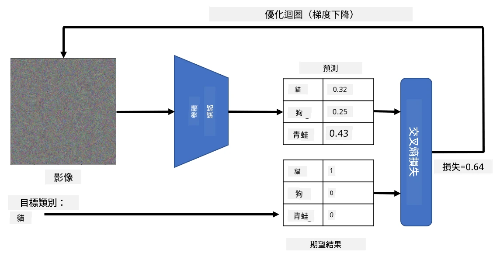

# 預訓練網路與遷移學習

訓練卷積神經網路（CNN）可能需要大量時間，並且需要大量數據。然而，大部分時間其實是花在學習網路用來從圖像中提取模式的最佳低層濾波器上。一個自然的問題是：我們是否可以使用在一個數據集上訓練好的神經網路，並將其適應於分類不同的圖像，而不需要完整的訓練過程？

## [課前測驗](https://ff-quizzes.netlify.app/en/ai/quiz/15)

這種方法被稱為**遷移學習**，因為我們將一個神經網路模型中的部分知識遷移到另一個模型中。在遷移學習中，我們通常從一個預訓練模型開始，該模型已經在一些大型圖像數據集（例如 **ImageNet**）上進行了訓練。這些模型已經能夠很好地從通用圖像中提取不同的特徵，在許多情況下，只需在這些提取的特徵之上構建一個分類器，就能獲得不錯的結果。

> ✅ 遷移學習這個術語在其他學術領域（例如教育學）中也有出現，它指的是將一個領域的知識應用到另一個領域的過程。

## 預訓練模型作為特徵提取器

我們在上一節中討論的卷積網路包含多個層，每一層都旨在從圖像中提取一些特徵，從低層次的像素組合（例如水平/垂直線條或筆劃）開始，到更高層次的特徵組合，對應於像火焰的眼睛這樣的東西。如果我們在一個足夠大的通用且多樣化的圖像數據集上訓練 CNN，網路應該能夠學會提取這些常見特徵。

Keras 和 PyTorch 都包含了方便的函數，可以輕鬆加載一些常見架構的預訓練神經網路權重，其中大多數是在 ImageNet 圖像上訓練的。最常用的模型在之前課程的 [CNN 架構](../07-ConvNets/CNN_Architectures.md) 頁面中有描述。特別是，你可能會考慮使用以下模型之一：

* **VGG-16/VGG-19**：這些是相對簡單的模型，但仍然能提供不錯的準確率。通常，使用 VGG 作為第一次嘗試是一個不錯的選擇，可以看看遷移學習的效果如何。
* **ResNet**：這是微軟研究院在 2015 年提出的一系列模型。它們有更多的層，因此需要更多的資源。
* **MobileNet**：這是一系列尺寸較小的模型，適合移動設備。如果你的資源有限，並且可以接受稍微降低的準確率，可以考慮使用它們。

以下是 VGG-16 網路從一張貓的圖片中提取的特徵示例：

## 貓與狗數據集

在這個例子中，我們將使用 [貓與狗](https://www.microsoft.com/download/details.aspx?id=54765&WT.mc_id=academic-77998-cacaste) 數據集，這非常接近於真實場景中的圖像分類任務。

## ✍️ 練習：遷移學習

讓我們在相應的筆記本中看看遷移學習的實際應用：

* [遷移學習 - PyTorch](TransferLearningPyTorch.ipynb)
* [遷移學習 - TensorFlow](TransferLearningTF.ipynb)

## 可視化對抗性貓

預訓練的神經網路在其「大腦」中包含了不同的模式，包括對**理想貓**（以及理想狗、理想斑馬等）的概念。能夠以某種方式**可視化這些圖像**會很有趣。然而，這並不簡單，因為這些模式分佈在網路權重的各個部分，並且以層次結構組織。

我們可以採取的一種方法是從一張隨機圖像開始，然後嘗試使用**梯度下降優化**技術調整該圖像，使得網路認為它是一隻貓。

然而，如果我們這樣做，我們會得到一些非常接近隨機噪聲的東西。這是因為*有很多方法可以讓網路認為輸入圖像是一隻貓*，其中一些方法在視覺上並不合理。雖然這些圖像包含了許多典型於貓的模式，但並沒有任何約束使它們在視覺上具有辨識度。

為了改善結果，我們可以在損失函數中添加另一個項，稱為**變異損失**。這是一種衡量圖像中相鄰像素相似程度的指標。最小化變異損失可以使圖像更平滑，並消除噪聲——從而揭示出更具視覺吸引力的模式。以下是一些這樣的「理想」圖像的例子，它們被高概率地分類為貓和斑馬：

 | 
-----|-----
*理想貓* | *理想斑馬*

類似的方法可以用來對神經網路進行所謂的**對抗性攻擊**。假設我們想要欺騙神經網路，讓一隻狗看起來像一隻貓。如果我們拿一張狗的圖片，該圖片被網路識別為狗，然後稍微調整它，使用梯度下降優化，直到網路開始將其分類為貓：

 | 
-----|-----
*原始狗圖片* | *被分類為貓的狗圖片*

查看以下筆記本中的代碼以重現上述結果：

* [理想與對抗性貓 - TensorFlow](AdversarialCat_TF.ipynb)

## 結論

通過遷移學習，你可以快速構建一個自定義對象分類任務的分類器，並獲得高準確率。你可以看到，我們現在解決的更複雜的任務需要更高的計算能力，並且無法輕易在 CPU 上完成。在下一單元中，我們將嘗試使用更輕量級的實現來訓練相同的模型，使用較低的計算資源，僅稍微降低準確率。

## 🚀 挑戰

在配套的筆記本中，底部有關於遷移知識如何在某些程度上與相似的訓練數據（例如新類型的動物）效果最佳的說明。嘗試使用完全不同類型的圖像進行實驗，看看你的遷移知識模型表現得如何。

## [課後測驗](https://ff-quizzes.netlify.app/en/ai/quiz/16)

## 回顧與自學

閱讀 [TrainingTricks.md](TrainingTricks.md) 以加深對其他模型訓練方法的了解。

## [作業](lab/README.md)

在這個實驗中，我們將使用真實的 [Oxford-IIIT](https://www.robots.ox.ac.uk/~vgg/data/pets/) 寵物數據集，其中包含 35 種貓和狗的品種，並構建一個遷移學習分類器。

---

