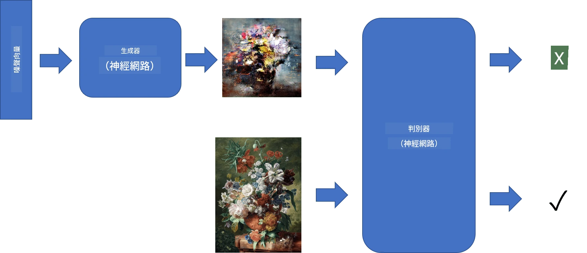

# 生成對抗網路

在上一節中，我們學習了**生成模型**：這些模型可以生成與訓練數據集中的圖像相似的新圖像。VAE 是生成模型的一個很好的例子。

## [課前測驗](https://ff-quizzes.netlify.app/en/ai/quiz/19)

然而，如果我們嘗試生成一些真正有意義的東西，比如一幅具有合理解析度的畫作，使用 VAE 進行訓練時可能無法很好地收斂。針對這種需求，我們需要學習另一種專門用於生成模型的架構——**生成對抗網路**，簡稱 GAN。

GAN 的主要思想是使用兩個神經網路，並讓它們相互對抗進行訓練：

> 圖片來源：[Dmitry Soshnikov](http://soshnikov.com)

> ✅ 一些術語：
> * **生成器（Generator）** 是一個網路，它接收一個隨機向量，並生成一張圖像作為輸出。
> * **判別器（Discriminator）** 是一個網路，它接收一張圖像，並判斷該圖像是真實圖像（來自訓練數據集）還是由生成器生成的圖像。本質上，它是一個圖像分類器。

### 判別器

判別器的架構與普通的圖像分類網路沒有太大區別。在最簡單的情況下，它可以是一個全連接分類器，但更常見的是一個[卷積網路](../07-ConvNets/README.md)。

> ✅ 基於卷積網路的 GAN 被稱為 [DCGAN](https://arxiv.org/pdf/1511.06434.pdf)

一個 CNN 判別器由以下層組成：多個卷積+池化層（空間尺寸逐漸減小），以及一個或多個全連接層以獲得“特徵向量”，最後是一個二元分類器。

> ✅ 在這裡，“池化”是一種減小圖像尺寸的技術。“池化層通過將一層中神經元集群的輸出合併為下一層中的單個神經元來減少數據的維度。” - [來源](https://wikipedia.org/wiki/Convolutional_neural_network#Pooling_layers)

### 生成器

生成器稍微複雜一些。你可以將其視為一個反向的判別器。從一個潛在向量（類似於特徵向量）開始，它通過一個全連接層轉換為所需的尺寸/形狀，然後是反卷積+上採樣。這與[自編碼器](../09-Autoencoders/README.md)的*解碼器*部分類似。

> ✅ 由於卷積層是通過線性濾波器遍歷圖像來實現的，反卷積本質上與卷積類似，可以使用相同的層邏輯來實現。

> 圖片來源：[Dmitry Soshnikov](http://soshnikov.com)

### 訓練 GAN

GAN 被稱為**對抗性**網路，因為生成器和判別器之間存在持續的競爭。在這種競爭中，生成器和判別器都會不斷改進，從而使網路學會生成越來越好的圖像。

訓練過程分為兩個階段：

* **訓練判別器**。這個任務相對簡單：我們生成一批由生成器生成的圖像，標記為 0（代表假圖像），並從輸入數據集中取一批圖像（標記為 1，真實圖像）。我們計算出一些*判別器損失*，然後進行反向傳播。
* **訓練生成器**。這稍微複雜一些，因為我們無法直接知道生成器的期望輸出。我們將整個 GAN 網路（由生成器和判別器組成）輸入一些隨機向量，並期望結果為 1（對應於真實圖像）。接著，我們凍結判別器的參數（不希望在這一步對其進行訓練），然後進行反向傳播。

在這個過程中，生成器和判別器的損失不會顯著下降。在理想情況下，它們應該呈現振盪，這表明兩個網路的性能都在提高。

## ✍️ 練習：GANs

* [TensorFlow/Keras 的 GAN 筆記本](GANTF.ipynb)
* [PyTorch 的 GAN 筆記本](GANPyTorch.ipynb)

### GAN 訓練的問題

GAN 的訓練特別困難，以下是一些常見問題：

* **模式崩潰（Mode Collapse）**。這指的是生成器學會生成一個成功欺騙判別器的圖像，而不是生成多樣化的圖像。
* **對超參數的敏感性**。經常會看到 GAN 完全無法收斂，然後突然因學習率的調整而收斂。
* **生成器與判別器之間的平衡**。在許多情況下，判別器的損失可能會迅速降為零，導致生成器無法進一步訓練。為了解決這個問題，我們可以嘗試為生成器和判別器設置不同的學習率，或者在判別器損失已經很低時跳過其訓練。
* **高解析度訓練**。與自編碼器的問題類似，這個問題是由於重建過多層的卷積網路導致的偽影。通常通過所謂的**漸進式增長**來解決這個問題，先用低解析度圖像訓練幾層，然後逐步“解鎖”或添加層。另一種解決方案是增加層之間的額外連接，並同時訓練多個解析度——詳情請參考這篇[多尺度梯度 GAN 論文](https://arxiv.org/abs/1903.06048)。

## 風格遷移

GAN 是生成藝術圖像的一種絕佳方式。另一種有趣的技術是所謂的**風格遷移**，它將一張**內容圖像**重新繪製成另一種風格，應用來自**風格圖像**的濾鏡。

其工作原理如下：
* 我們從一張隨機噪聲圖像開始（或者從內容圖像開始，但為了便於理解，從隨機噪聲開始更簡單）。
* 我們的目標是創建一張圖像，使其同時接近內容圖像和風格圖像。這由兩個損失函數決定：
   - **內容損失**：基於 CNN 在某些層提取的當前圖像與內容圖像的特徵計算。
   - **風格損失**：通過當前圖像與風格圖像之間的 Gram 矩陣以巧妙的方式計算（更多細節請參考[示例筆記本](StyleTransfer.ipynb)）。
* 為了使圖像更平滑並去除噪聲，我們還引入了**變異損失**，該損失計算相鄰像素之間的平均距離。
* 主優化循環使用梯度下降（或其他優化算法）調整當前圖像，以最小化總損失，該損失是所有三個損失的加權和。

## ✍️ 示例：[風格遷移](StyleTransfer.ipynb)

## [課後測驗](https://ff-quizzes.netlify.app/en/ai/quiz/20)

## 總結

在本課中，你學習了 GAN 的基本概念以及如何訓練它們。你還了解了這種類型的神經網路可能面臨的特殊挑戰，以及一些解決這些挑戰的策略。

## 🚀 挑戰

使用你自己的圖像運行[風格遷移筆記本](StyleTransfer.ipynb)。

## 複習與自學

參考以下資源，進一步了解 GAN：

* Marco Pasini, [我在訓練 GAN 一年中學到的 10 個教訓](https://towardsdatascience.com/10-lessons-i-learned-training-generative-adversarial-networks-gans-for-a-year-c9071159628)
* [StyleGAN](https://en.wikipedia.org/wiki/StyleGAN)，一個值得考慮的*事實標準* GAN 架構
* [在 Azure ML 上使用 GAN 創建生成藝術](https://soshnikov.com/scienceart/creating-generative-art-using-gan-on-azureml/)

## 作業

重新訪問與本課相關的兩個筆記本之一，並使用你自己的圖像重新訓練 GAN。你能創造出什麼？

---

